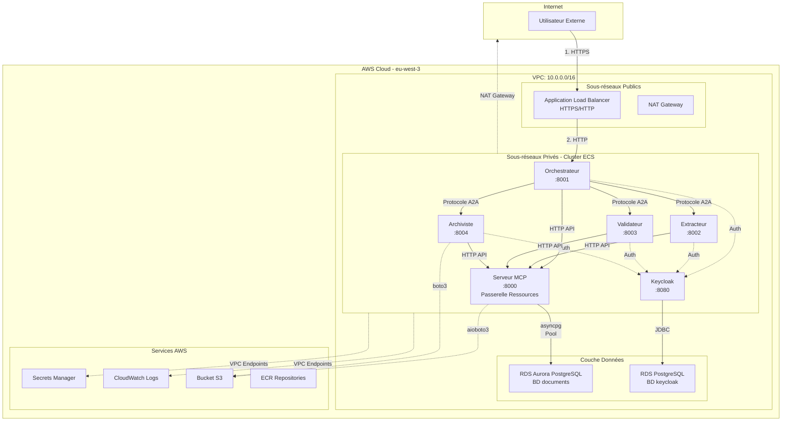
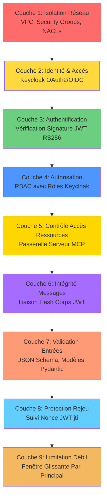
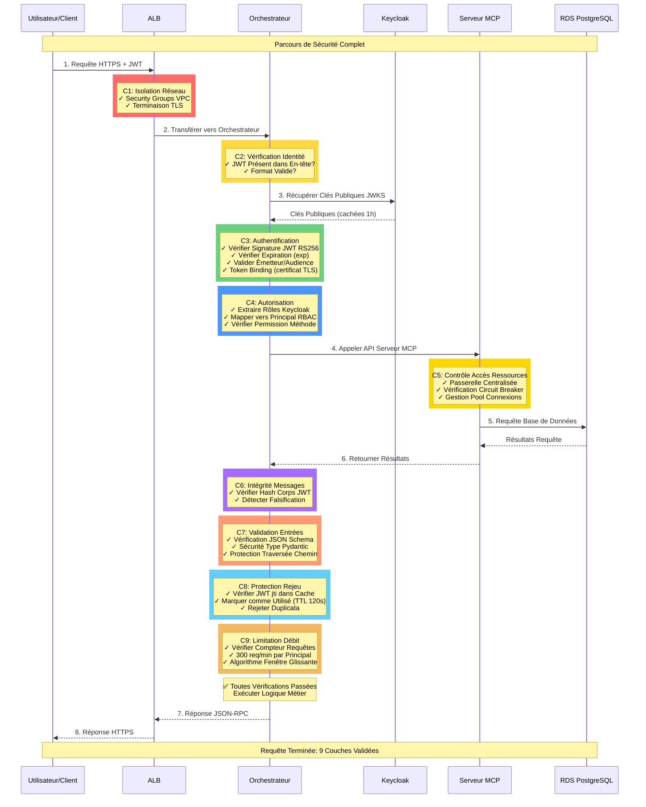
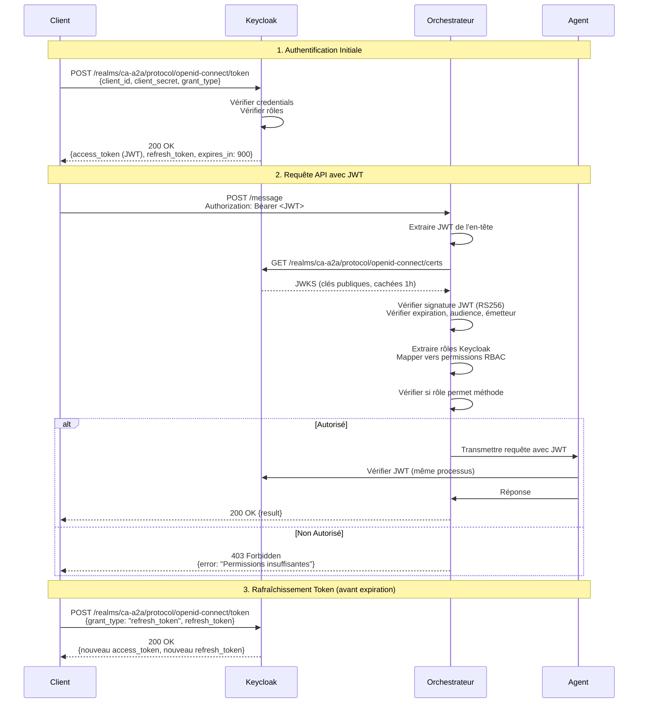
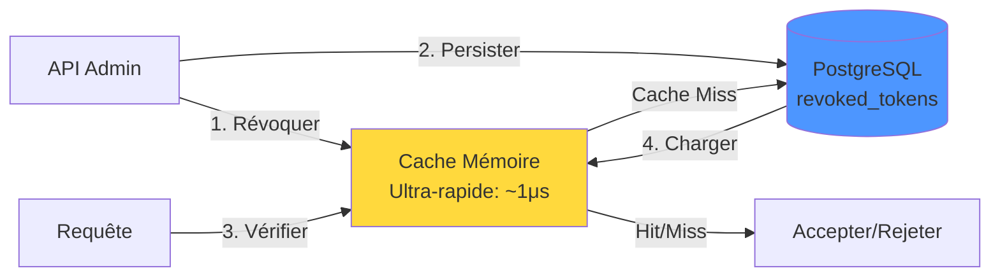

# Architecture de Sécurité CA-A2A

**Version :** 6.0  
**Dernière mise à jour :** 17 janvier 2026  
**Statut :** Déployé en Production  
**Région :** eu-west-3 (Paris)  
**Environnement :** AWS ECS Fargate

---

## Résumé Exécutif

Le système CA-A2A (Crédit Agricole Agent-to-Agent) implémente une sécurité de niveau entreprise à travers une architecture de défense en profondeur avec **10 couches de sécurité indépendantes**. Le système est déployé sur AWS ECS Fargate dans un VPC privé avec authentification centralisée Keycloak OAuth2/OIDC, contrôle d'accès aux ressources via Serveur MCP, et contrôle d'accès basé sur les rôles (RBAC).

### Fonctionnalités Clés de Sécurité

| Catégorie | Fonctionnalité | Technologie |
|-----------|----------------|-------------|
| **Authentification** | OAuth2/OIDC centralisé | Keycloak RS256 JWT |
| **Protection Anti-Vol** | Liaison cryptographique de token | Token Binding (RFC 8473) |
| **Accès Ressources** | Passerelle centralisée S3/RDS | Serveur MCP |
| **Autorisation** | Permissions granulaires | RBAC (rôles Keycloak) |
| **Révocation** | Invalidation d'urgence tokens | PostgreSQL + Cache mémoire |
| **Anti-Rejeu** | Suivi JWT jti | Cache TTL 120s |
| **Anti-Abus** | 300 req/min par principal | Limitation débit (fenêtre glissante) |
| **Isolation Réseau** | Sous-réseaux privés, Security Groups | VPC AWS |
| **Chiffrement** | Au repos & en transit | TLS 1.2+, AES-256 (KMS) |
| **Audit** | Journalisation complète | CloudWatch Logs |
| **Anti-Timing** | Prévention attaques temporelles | Comparaison temps constant |

---

## Table des Matières

1. [Architecture Système](#1-architecture-système)
2. [Couches de Sécurité (Défense en Profondeur)](#2-couches-de-sécurité-défense-en-profondeur)
3. [Authentification & Autorisation](#3-authentification--autorisation)
4. [Couche d'Accès aux Ressources (Serveur MCP)](#4-couche-daccès-aux-ressources-serveur-mcp)
5. [Sécurité Réseau](#5-sécurité-réseau)
6. [Sécurité des Données](#6-sécurité-des-données)
7. [Sécurité du Protocole (A2A)](#7-sécurité-du-protocole-a2a)
8. [Surveillance & Audit](#8-surveillance--audit)
9. [Modèle de Menaces & Défenses](#9-modèle-de-menaces--défenses)
10. [Opérations de Sécurité](#10-opérations-de-sécurité)
11. [Référence d'Implémentation](#11-référence-dimplémentation)

---

## 1. Architecture Système

> **📖 Documentation détaillée :** [Architecture Système (FR)](docs/fr/ARCHITECTURE_SYSTEME.md)

### 1.1 Déploiement Production



### 1.2 Vue d'Ensemble des Composants


| Composant | Type | Port | Objectif | Instances |
|-----------|------|------|----------|-----------|
| **Orchestrateur** | ECS Fargate | 8001 | Coordination requêtes, orchestration workflow | 2 |
| **Extracteur** | ECS Fargate | 8002 | Extraction texte documents (OCR, parsing) | 2 |
| **Validateur** | ECS Fargate | 8003 | Validation contenu, contrôles qualité | 2 |
| **Archiviste** | ECS Fargate | 8004 | Archivage documents, récupération | 2 |
| **Keycloak** | ECS Fargate | 8080 | Fournisseur identité (OAuth2/OIDC) | 1 |
| **ALB** | Service AWS | 80/443 | Répartition charge, terminaison TLS | Multi-AZ |
| **RDS Aurora** | BD gérée | 5432 | Métadonnées documents, journaux audit | Multi-AZ |
| **RDS Postgres** | BD gérée | 5432 | Données Keycloak (utilisateurs, rôles) | Multi-AZ |

---

## 2. Couches de Sécurité (Défense en Profondeur)

> **📖 Documentation détaillée :** [Couches de Sécurité (FR)](docs/fr/COUCHES_SECURITE_DEFENSE_EN_PROFONDEUR.md)

### 2.1 Architecture Défense en Profondeur



### 2.2 Responsabilités des Couches


| Couche | Objectif | Technologie | Menace Atténuée |
|--------|----------|-------------|-----------------|
| **C1: Réseau** | Isolation, segmentation | VPC, SG, NACL | Attaques réseau, DDoS |
| **C2: Identité** | Authentification centralisée | Keycloak | Accès non autorisé |
| **C3: Authentification** | Vérification token | JWT RS256 + Token Binding | Usurpation, tokens forgés, vol |
| **C4: Autorisation** | Application permissions | RBAC (rôles Keycloak) | Élévation privilèges |
| **C5: Accès Ressources** | Passerelle S3/RDS centralisée | Serveur MCP | Accès AWS direct, prolifération credentials |
| **C6: Intégrité** | Détection falsification messages | Hash corps JWT | MITM, falsification messages |
| **C7: Validation** | Rejet entrées malformées | JSON Schema, Pydantic | Attaques injection, DoS |
| **C8: Rejeu** | Détection requêtes dupliquées | JWT jti + Cache TTL | Attaques par rejeu |
| **C9: Limitation Débit** | Prévention abus | Fenêtre glissante | Épuisement ressources, DoS |

### 2.3 Flux de Sécurité Complet d'une Requête

**Parcours d'une Requête à Travers les 9 Couches :**



**Points de Contrôle Couche par Couche :**

| Couche | Point de Contrôle | Critère de Réussite | Réponse en Cas d'Échec |
|--------|-------------------|---------------------|------------------------|
| **C1** | Entrée Réseau | Requête depuis IP/VPC autorisée | Connexion refusée |
| **C2** | Présence Identité | JWT dans `Authorization: Bearer` | 401 Non Autorisé |
| **C3** | Authentification | Signature JWT valide, non expiré | 401 Token Invalide |
| **C4** | Autorisation | Principal a permission pour méthode | 403 Interdit |
| **C5** | Accès Ressources | Circuit breaker Serveur MCP fermé | 503 Service Indisponible |
| **C6** | Intégrité Messages | Hash corps JWT correspond requête | 403 Falsification Détectée |
| **C7** | Validation Entrées | Schéma valide, pas tentative injection | 400 Paramètres Invalides (-32602) |
| **C8** | Protection Rejeu | JWT jti jamais vu auparavant | 403 Rejeu Détecté |
| **C9** | Limitation Débit | Moins de 300 requêtes/minute | 429 Limite Débit Dépassée |
| **✅** | **Logique Métier** | Validation spécifique application | 200 OK ou erreur |

**Garanties de Sécurité :**

- 🛡️ **Défense en Profondeur** : Chaque couche fournit une protection indépendante
- 🔒 **Échec Sécurisé** : Toutes les vérifications doivent passer ; tout échec rejette la requête
- 📊 **Observable** : Chaque couche enregistre les décisions dans CloudWatch
- ⚡ **Performance** : Surcharge sécurité totale ~20-40ms (< 20% temps requête total)
- 🔄 **Aucun Point Unique de Défaillance** : Compromettre une couche ne contourne pas les autres

---

## 3. Authentification & Autorisation

> **📖 Documentation détaillée :** [Authentification & Autorisation (FR)](docs/fr/AUTHENTIFICATION_AUTORISATION.md)

### 3.1 Flux OAuth2/OIDC Keycloak




### 3.2 Structure Token JWT

**Token d'Accès (signé RS256 par Keycloak) :**


```json
{
  "header": {
    "alg": "RS256",
    "typ": "JWT",
    "kid": "keycloak-key-id"
  },
  "payload": {
    "exp": 1737845500,
    "iat": 1737845200,
    "jti": "abc123-token-id",
    "iss": "http://keycloak.ca-a2a.local:8080/realms/ca-a2a",
    "aud": "ca-a2a-agents",
    "sub": "user-uuid-1234",
    "typ": "Bearer",
    "azp": "ca-a2a-agents",
    "realm_access": {
      "roles": ["admin", "orchestrator", "document-processor"]
    },
    "resource_access": {
      "ca-a2a-agents": {
        "roles": ["admin"]
      }
    },
    "preferred_username": "john.doe@example.com",
    "email": "john.doe@example.com",
    "cnf": {
      "x5t#S256": "bDlkZGM4YTEyZGM..."
    }
  },
  "signature": "..."
}
```

**Claims Importants :**
- `exp` : Date d'expiration (15 minutes)
- `jti` : ID unique du token (pour protection rejeu)
- `iss` : Émetteur (URL Keycloak)
- `aud` : Audience (ca-a2a-agents)
- `realm_access.roles` : Rôles Keycloak
- `cnf.x5t#S256` : Empreinte certificat (Token Binding)

### 3.2 Hiérarchie RBAC

**Mapping Rôles Keycloak → Principal RBAC A2A :**

| Rôle Keycloak | Principal A2A | Méthodes Autorisées | Cas d'Usage |
|---------------|---------------|---------------------|-------------|
| `admin` | `admin` | `*` (toutes les méthodes) | Accès système complet |
| `lambda` | `lambda` | `upload_document`, `process_document` | Déclencheurs externes (événements S3) |
| `orchestrator` | `orchestrator` | `extract_document`, `validate_document`, `archive_document` | Coordination agent-à-agent |
| `document-processor` | `document-processor` | `process_document`, `list_pending_documents`, `check_status` | Workflows de traitement de documents |
| `viewer` | `viewer` | `list_documents`, `get_document`, `check_status` (lecture seule) | Accès lecture seule |

**Implémentation (`keycloak_auth.py`) :**
```python
class KeycloakRBACMapper:
    def map_roles_to_principal(self, keycloak_roles: List[str]) -> Tuple[str, List[str]]:
        # Priorité: admin > lambda > orchestrator > document-processor > viewer
        if "admin" in keycloak_roles:
            return "admin", ["*"]
        elif "lambda" in keycloak_roles:
            return "lambda", ["upload_document", "process_document"]
        elif "orchestrator" in keycloak_roles:
            return "orchestrator", ["extract_document", "validate_document", "archive_document"]
        elif "document-processor" in keycloak_roles:
            return "document-processor", ["process_document", "list_pending_documents", "check_status"]
        elif "viewer" in keycloak_roles:
            return "viewer", ["list_documents", "get_document", "check_status"]
        else:
            return "anonymous", []
```

### 3.3 Liaison de Token (RFC 8473)

**Objectif :** Lier cryptographiquement le JWT au certificat TLS client pour empêcher le vol de token

**Claim JWT avec Liaison de Token :**
```json
{
  "cnf": {
    "x5t#S256": "bDlkZGM4YTEyZGM..."
  }
}
```

**Vérification (comparaison temps constant) :**
```python
import secrets

presented_thumbprint = compute_cert_thumbprint(client_cert_pem)
expected_thumbprint = jwt_claims["cnf"]["x5t#S256"]

if not secrets.compare_digest(expected_thumbprint, presented_thumbprint):
    raise ValueError("Token volé - certificat incompatible")
```

### 3.4 Révocation de Token

**Architecture Hybride de Stockage :**



**Schéma Table Révocation :**
```sql
CREATE TABLE revoked_tokens (
    jti VARCHAR(255) PRIMARY KEY,
    revoked_at TIMESTAMP DEFAULT CURRENT_TIMESTAMP,
    revoked_by VARCHAR(100) NOT NULL,
    reason TEXT,
    expires_at TIMESTAMP NOT NULL
);

CREATE INDEX idx_revoked_expires ON revoked_tokens(expires_at);
CREATE INDEX idx_revoked_by ON revoked_tokens(revoked_by);
```

**Points de Terminaison API Admin :**
- `POST /admin/revoke-token` - Révoquer JWT par jti
- `GET /admin/revoked-tokens` - Lister tokens révoqués
- `GET /admin/security-stats` - Métriques de sécurité
- `DELETE /admin/cleanup-expired-tokens` - Nettoyage manuel

**Performance :**
- Opération révocation : ~10ms (écriture BD + stockage cache)
- Vérification (cachée) : ~1μs
- Vérification (cache miss) : ~10ms (requête BD + chargement cache)
- Nettoyage automatique : Toutes les 5 minutes

**Pourquoi Pas Keycloak pour la Révocation ?**

| Approche | Latence | Scalabilité | Point Unique Défaillance |
|----------|---------|-------------|--------------------------|
| **Vérification Session Keycloak** | 50-100ms | Médiocre (goulot Keycloak) | Oui |
| **Notre Révocation Hybride** | 1μs (caché) | Excellente (distribuée) | Non |

**Notre Solution :**
- ✅ Cache mémoire : vérification 1μs (99,9% requêtes)
- ✅ PostgreSQL : persistance, survit redémarrages
- ✅ Nettoyage auto : tokens expirés supprimés toutes les 5 min

---

## 4. Couche d'Accès aux Ressources (Serveur MCP)

> **📖 Documentation détaillée :** [Serveur MCP (FR)](docs/fr/ACCES_RESSOURCES_SERVEUR_MCP.md)

### 4.1 Pattern Passerelle Centralisée

**Avantages Clés :**
- ✅ **Zéro Credential AWS dans Agents** : Seul le Serveur MCP a les credentials
- ✅ **Pooling Connexions** : Réutilisation connexions BD (10x plus rapide)
- ✅ **Circuit Breaker** : Empêche défaillances en cascade
- ✅ **Réessais Automatiques** : Gestion erreurs transitoires avec backoff
- ✅ **Audit Centralisé** : Point unique pour journalisation accès ressources

### 4.2 Métriques Performance

| Opération | Sans MCP | Avec MCP | Amélioration |
|-----------|----------|----------|--------------|
| Requête PostgreSQL | 50-100ms (nouvelle connexion) | 5-10ms (pool) | **10x plus rapide** |
| S3 Get Object | 100-200ms | 100-200ms | Identique (limité réseau) |
| Circuit Breaker | Défaillances en cascade | Échec rapide | **Stabilité système** |

---

## 5. Sécurité Réseau

> **📖 Documentation détaillée :** [Sécurité Réseau (FR)](docs/fr/SECURITE_RESEAU.md)

### 5.1 Configuration VPC

- **CIDR :** 10.0.0.0/16
- **Sous-réseaux Publics :** 10.0.1.0/24, 10.0.2.0/24 (ALB, NAT Gateway)
- **Sous-réseaux Privés :** 10.0.11.0/24, 10.0.12.0/24 (Agents ECS)
- **Isolation :** Aucune IP publique pour les agents
- **Internet :** NAT Gateway (sortant uniquement)
- **Services AWS :** VPC Endpoints (pas de routage internet)

### 5.2 Security Groups (Règles Clés)

| Composant | Entrant | Sortant |
|-----------|---------|---------|
| **ALB** | 0.0.0.0/0:443, 0.0.0.0/0:80 | Orchestrateur:8001 |
| **Orchestrateur** | ALB SG:8001 | Extracteur:8002, Keycloak:8080, MCP:8000 |
| **Agents** | Orchestrateur SG:(8002/8003/8004) | Keycloak:8080, MCP:8000 |
| **Keycloak** | Tous SG agents:8080 | RDS:5432 |
| **Serveur MCP** | Tous SG agents:8000 | RDS:5432, 0.0.0.0/0:443 (S3) |
| **RDS** | Keycloak SG:5432, MCP SG:5432 | DENY (pas de sortie) |

---

## 6. Sécurité des Données

> **📖 Documentation détaillée :** [Sécurité Données (FR)](docs/fr/SECURITE_DONNEES.md)

### 6.1 Chiffrement

**Au Repos (AES-256 via AWS KMS) :**
- RDS Aurora PostgreSQL, RDS PostgreSQL (Keycloak), Bucket S3
- Volumes EBS (ECS), Secrets Manager, CloudWatch Logs

**En Transit :**
- Utilisateur → ALB : **HTTPS (TLS 1.2+)**
- Agent → RDS : **PostgreSQL SSL/TLS**
- Agent → S3 : **HTTPS (TLS 1.2+)**
- Interne VPC : HTTP (réseau privé, performance)

### 6.2 Gestion des Secrets

**AWS Secrets Manager :**
- Mots de passe BD, admin Keycloak, client secret, clés API
- ✅ Rotation automatique (tous les 90 jours)
- ✅ Contrôle accès IAM
- ✅ Audit CloudTrail
- ✅ Aucun secret en dur

---

## 7. Sécurité du Protocole (A2A)

> **📖 Documentation détaillée :** [Sécurité Protocole (FR)](docs/fr/SECURITE_PROTOCOLE.md)

### 7.1 Pourquoi JSON-RPC 2.0 ?

✅ **Standardisé** : Spécification bien définie, comportement prévisible  
✅ **Simple** : Surcharge minimale (~100-200 octets)  
✅ **Sécurisé** : Validation déterministe, pas d'ambiguïté  
✅ **Comparaison temps Constant** : `hmac.compare_digest()`, `secrets.compare_digest()`

**Comparaison avec REST :**

| Caractéristique | JSON-RPC 2.0 | REST |
|-----------------|--------------|------|
| **Standardisation** | Spécification stricte | Conventions variables |
| **Sémantique HTTP** | POST uniquement | GET/POST/PUT/DELETE |
| **Gestion Erreurs** | Codes erreur standardisés | Codes HTTP personnalisés |
| **Surcharge** | Minimale (~100 octets) | Headers supplémentaires |
| **Batch Requests** | Supporté nativement | Nécessite extension |
| **Validation** | Déterministe | Dépend de l'implémentation |

### 7.2 Encapsulation Protocole


**Couches d'Encapsulation :**

```
┌─────────────────────────────────────────────────────────┐
│  Couche 1: Transport HTTPS (TLS 1.2+)                   │
│  ├─ Chiffrement bout-en-bout                            │
│  └─ Authentification serveur via certificat             │
└─────────────────────────────────────────────────────────┘
           ↓
┌─────────────────────────────────────────────────────────┐
│  Couche 2: En-têtes HTTP                                │
│  ├─ Authorization: Bearer <JWT>                         │
│  ├─ Content-Type: application/json                      │
│  └─ X-Request-ID: <correlation-id>                      │
└─────────────────────────────────────────────────────────┘
           ↓
┌─────────────────────────────────────────────────────────┐
│  Couche 3: Message JSON-RPC 2.0                         │
│  ├─ jsonrpc: "2.0"                                      │
│  ├─ method: "process_document"                          │
│  ├─ params: {...}                                       │
│  └─ id: "req-123"                                       │
└─────────────────────────────────────────────────────────┘
           ↓
┌─────────────────────────────────────────────────────────┐
│  Couche 4: Validation & Sécurité                        │
│  ├─ JSON Schema validation                              │
│  ├─ Vérification JWT (signature, expiration, RBAC)      │
│  ├─ Protection rejeu (jti tracking)                     │
│  ├─ Limitation débit (300 req/min)                      │
│  └─ Intégrité message (body hash binding)               │
└─────────────────────────────────────────────────────────┘
```

### 7.3 Structure & Format des Messages


**Anatomie Requête JSON-RPC 2.0 :**

```json
{
  "jsonrpc": "2.0",           // Version protocole (OBLIGATOIRE)
  "id": "req-abc123",         // ID corrélation (OBLIGATOIRE)
  "method": "process_document", // Nom méthode (OBLIGATOIRE)
  "params": {                 // Paramètres (OPTIONNEL)
    "s3_key": "uploads/facture.pdf",
    "priority": "high",
    "metadata": {
      "customer_id": "CUST-001",
      "invoice_date": "2026-01-17"
    }
  }
}
```

**Anatomie Réponse Succès :**

```json
{
  "jsonrpc": "2.0",
  "id": "req-abc123",
  "result": {
    "status": "success",
    "document_id": "doc-789",
    "processing_time_ms": 245
  }
}
```

**Anatomie Réponse Erreur :**

```json
{
  "jsonrpc": "2.0",
  "id": "req-abc123",
  "error": {
    "code": -32602,
    "message": "Paramètres invalides",
    "data": {
      "detail": "Champ 's3_key' requis",
      "field": "s3_key"
    }
  }
}
```

### 7.4 Codes d'Erreur

**Codes Standard JSON-RPC 2.0 :**

| Code | Signification | Cas d'Usage | Exemple |
|------|---------------|-------------|---------|
| `-32700` | Erreur analyse | JSON invalide | `{invalid json}` |
| `-32600` | Requête invalide | Champs requis manquants | `{"method": null}` |
| `-32601` | Méthode introuvable | Méthode inconnue | `{"method": "unknown"}` |
| `-32602` | Paramètres invalides | Validation schema échouée | `{"params": {"key": null}}` |
| `-32603` | Erreur interne | Erreur serveur | Exception non gérée |

**Codes Personnalisés A2A :**

| Code | Signification | Cas d'Usage | Action Recommandée |
|------|---------------|-------------|--------------------|
| `-32001` | Non autorisé | JWT invalide/expiré | Renouveler token |
| `-32002` | Interdit | Permissions insuffisantes | Vérifier rôles |
| `-32003` | Limite débit dépassée | Trop de requêtes | Attendre + retry |
| `-32004` | Rejeu détecté | jti dupliqué | Générer nouveau jti |
| `-32005` | Token révoqué | Token révoqué utilisé | Obtenir nouveau token |

**Exemple Réponse Erreur Détaillée :**

```json
{
  "jsonrpc": "2.0",
  "id": "req-123",
  "error": {
    "code": -32602,
    "message": "Validation des paramètres échouée",
    "data": {
      "field": "s3_key",
      "constraint": "required",
      "provided": null,
      "hint": "Le champ 's3_key' est obligatoire et ne peut pas être nul"
    }
  }
}
```

---

## 8. Surveillance & Audit

> **📖 Documentation détaillée :** [Surveillance & Audit (FR)](docs/fr/SURVEILLANCE_AUDIT.md)

### 8.1 Journaux CloudWatch

| Groupe | Rétention | Alertes |
|--------|-----------|---------|
| `/ecs/ca-a2a-*` | 7 jours | Échecs auth > 10/min, Erreurs 5xx > 1% |
| Exports S3 | 90 jours | Audit compliance |

### 8.2 Métriques Clés

- CPU > 70% → Scale up ECS
- Échecs authentification > 10/min → Alerte sécurité
- Latence p99 > 2s → Investigation performance

---

## 9. Modèle de Menaces & Défenses

> **📖 Documentation détaillée :** [Modèle de Menaces (FR)](docs/fr/MODELE_MENACES_DEFENSES.md)

### 9.1 Analyse STRIDE

| Menace | Atténuation |
|--------|-------------|
| **Usurpation** | Signature RS256 + Token Binding |
| **Falsification** | Liaison hash corps |
| **Répudiation** | Journaux audit CloudWatch |
| **Divulgation Information** | TLS + AES-256 |
| **Déni Service** | Limitation débit + Circuit breaker |
| **Élévation Privilège** | Application RBAC |

### 9.2 Scénarios d'Attaque

**Scénario : Token JWT Volé**

| Étape | Défense | Résultat |
|-------|---------|----------|
| Attaquant intercepte JWT | ✅ Token volé | Token obtenu |
| Utiliser depuis machine différente | ❌ Token Binding (certificat incompatible) | **Bloqué C3** |

---

## 10. Opérations de Sécurité

> **📖 Documentation détaillée :** [Opérations Sécurité (FR)](docs/fr/OPERATIONS_SECURITE.md)

### 10.1 Maintenance

**Hebdomadaire :** Réviser journaux échecs auth, violations limite débit  
**Mensuelle :** Rotation secrets, réviser permissions IAM  
**Trimestrielle :** Audit sécurité externe, exercice reprise sinistre

### 10.2 Réponse Incidents

**Révocation Token (< 15 min) :**
```bash
curl -X POST https://orchestrator.ca-a2a.local:8001/admin/revoke-token \
  -H "Authorization: Bearer $ADMIN_TOKEN" \
  -d '{"jti": "abc123", "reason": "Faille sécurité"}'
```

---

## 11. Référence d'Implémentation

### 11.1 Fichiers Clés

| Fichier | Objectif |
|---------|----------|
| `keycloak_auth.py` | Validation JWT, RBAC, Token Binding |
| `token_binding.py` | Implémentation RFC 8473 |
| `a2a_security.py` | Gestionnaire sécurité principal |
| `mcp_server.py` | Passerelle ressources centralisée |
| `mtls_manager.py` | Gestion certificats mTLS |

### 11.2 Configuration

```bash
# Keycloak
A2A_USE_KEYCLOAK=true
KEYCLOAK_URL=http://keycloak.ca-a2a.local:8080
KEYCLOAK_REALM=ca-a2a

# Sécurité
A2A_REQUIRE_AUTH=true
A2A_ENABLE_RATE_LIMIT=true
A2A_RATE_LIMIT_PER_MINUTE=300
A2A_ENABLE_REPLAY_PROTECTION=true
A2A_REPLAY_TTL_SECONDS=120
```

---

## Documentation Modulaire

Pour plus de détails, consultez les documents spécialisés :

1. 📘 [Architecture Système](docs/fr/ARCHITECTURE_SYSTEME.md)
2. 🛡️ [Couches de Sécurité](docs/fr/COUCHES_SECURITE_DEFENSE_EN_PROFONDEUR.md)
3. 🔐 [Authentification & Autorisation](docs/fr/AUTHENTIFICATION_AUTORISATION.md)
4. 🔌 [Serveur MCP](docs/fr/ACCES_RESSOURCES_SERVEUR_MCP.md)
5. 🌐 [Sécurité Réseau](docs/fr/SECURITE_RESEAU.md)
6. 💾 [Sécurité Données](docs/fr/SECURITE_DONNEES.md)
7. 📡 [Sécurité Protocole](docs/fr/SECURITE_PROTOCOLE.md)
8. 📊 [Surveillance & Audit](docs/fr/SURVEILLANCE_AUDIT.md)
9. ⚠️ [Modèle de Menaces](docs/fr/MODELE_MENACES_DEFENSES.md)
10. 🔧 [Opérations Sécurité](docs/fr/OPERATIONS_SECURITE.md)

---

**Fin du Document**
