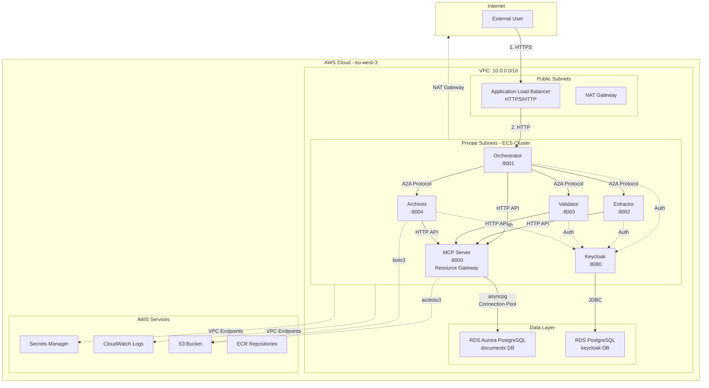
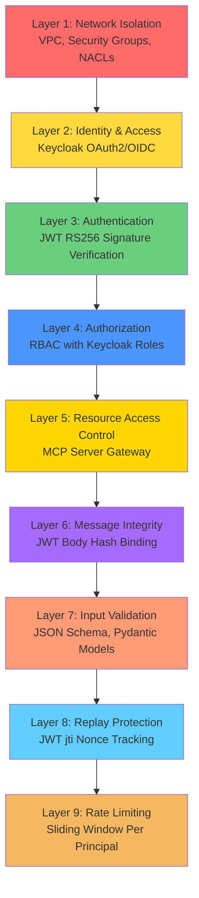
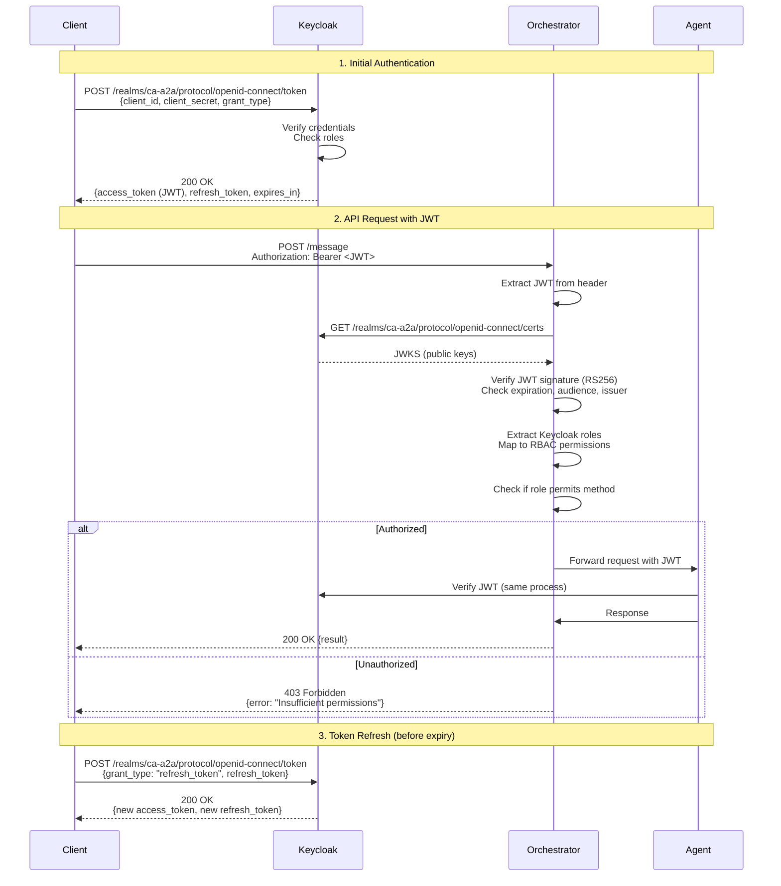
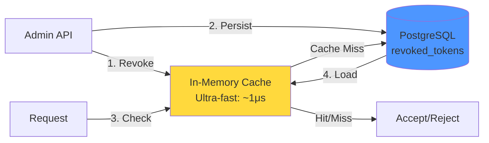
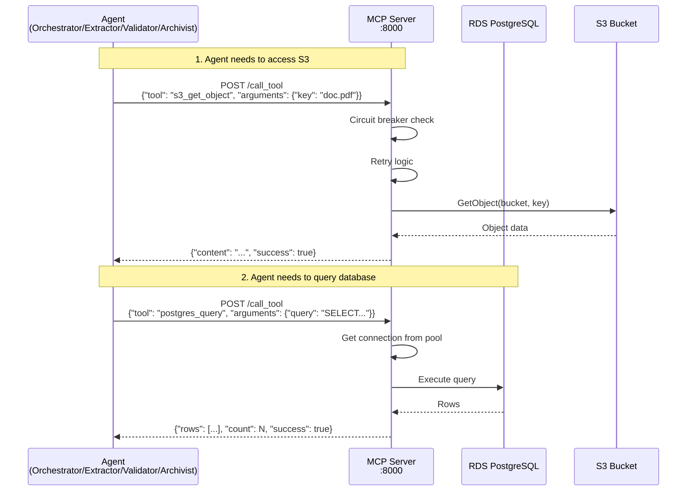
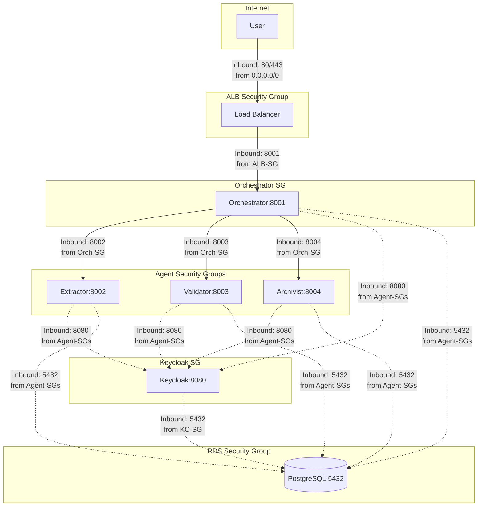
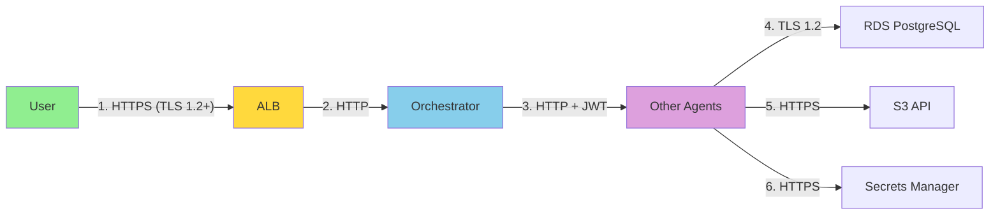
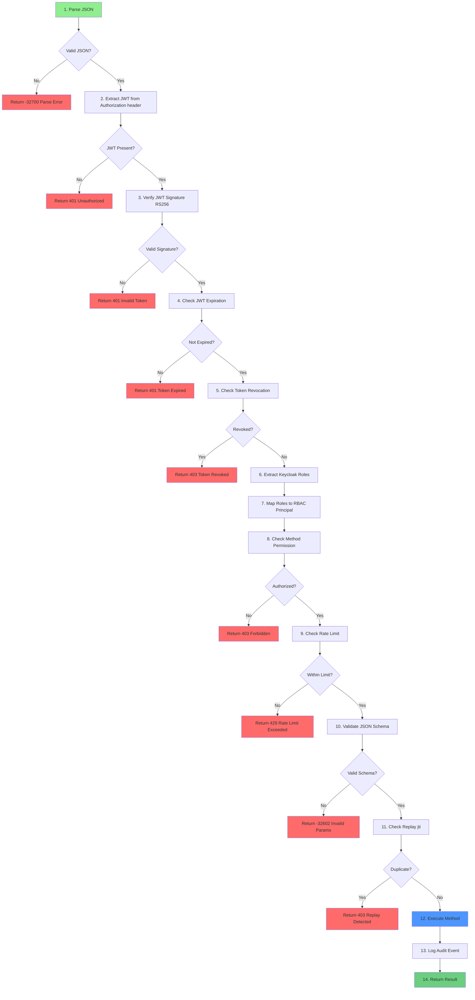

# CA-A2A Security Architecture

**Version:** 5.0  
**Last Updated:** January 15, 2026  
**Status:** Production Deployed  
**Region:** eu-west-3 (Paris)  
**Environment:** AWS ECS Fargate

---

## Executive Summary

The CA-A2A (Crédit Agricole Agent-to-Agent) system implements enterprise-grade security through a defense-in-depth architecture with 9 security layers. The system is deployed on AWS ECS Fargate in a private VPC with Keycloak OAuth2/OIDC for centralized authentication, MCP Server for resource access control, and role-based access control.

**Key Security Features:**
- ✅ OAuth2/OIDC Authentication (Keycloak RS256 JWT)
- ✅ Centralized Resource Access (MCP Server for S3/RDS)
- ✅ Role-Based Access Control (RBAC) with fine-grained permissions
- ✅ Token Revocation with hybrid storage (PostgreSQL + in-memory cache)
- ✅ Replay Protection via JWT jti claim tracking
- ✅ Rate Limiting (300 req/min per principal)
- ✅ Network Isolation (Private VPC, Security Groups)
- ✅ Encryption at Rest & In Transit
- ✅ Comprehensive Audit Logging (CloudWatch)

---

## Table of Contents

1. [System Architecture](#1-system-architecture)
2. [Security Layers](#2-security-layers)
3. [Authentication & Authorization](#3-authentication--authorization)
4. [Resource Access Layer (MCP Server)](#4-resource-access-layer-mcp-server)
5. [Network Security](#5-network-security)
6. [Data Security](#6-data-security)
7. [Protocol Security (A2A)](#7-protocol-security-a2a)
8. [Monitoring & Audit](#8-monitoring--audit)
9. [Threat Model & Defenses](#9-threat-model--defenses)
10. [Security Operations](#10-security-operations)
11. [Implementation Reference](#11-implementation-reference)

---

## 1. System Architecture

### 1.1 Production Deployment



### 1.2 Component Overview

| Component | Type | Port | Purpose | Instances |
|-----------|------|------|---------|-----------|
| **Orchestrator** | ECS Fargate | 8001 | Request coordination, workflow | 2 |
| **Extractor** | ECS Fargate | 8002 | Document text extraction | 2 |
| **Validator** | ECS Fargate | 8003 | Content validation | 2 |
| **Archivist** | ECS Fargate | 8004 | Document archival, retrieval | 2 |
| **Keycloak** | ECS Fargate | 8080 | Identity Provider (OAuth2/OIDC) | 1 |
| **ALB** | AWS Service | 80/443 | Load balancing, TLS termination | Multi-AZ |
| **RDS Aurora** | Managed DB | 5432 | Document metadata, audit logs | Multi-AZ |
| **RDS Postgres** | Managed DB | 5432 | Keycloak data (users, roles) | Multi-AZ |

---

## 2. Security Layers

### 2.1 Defense-in-Depth Architecture



### 2.2 Layer Responsibilities

| Layer | Purpose | Technology | Threat Mitigated |
|-------|---------|------------|------------------|
| **L1: Network** | Isolation, segmentation | VPC, SG, NACL | Network attacks, DDoS |
| **L2: Identity** | Centralized authentication | Keycloak | Unauthorized access |
| **L3: Authentication** | Token verification | JWT RS256 | Impersonation, forged tokens |
| **L4: Authorization** | Permission enforcement | RBAC (Keycloak roles) | Privilege escalation |
| **L5: Resource Access** | **Centralized S3/RDS gateway** | **MCP Server** | **Direct AWS access, credential sprawl** |
| **L6: Integrity** | Message tampering detection | JWT body hash | MITM, message tampering |
| **L7: Validation** | Malformed input rejection | JSON Schema, Pydantic | Injection attacks, DoS |
| **L8: Replay** | Duplicate request detection | JWT jti + TTL cache | Replay attacks |
| **L9: Rate Limit** | Abuse prevention | Sliding window | Resource exhaustion, DoS |

---

## 3. Authentication & Authorization

### 3.1 Keycloak OAuth2/OIDC Flow



### 3.2 JWT Token Structure

**Access Token (RS256 signed by Keycloak):**
```json
{
  "header": {
    "alg": "RS256",
    "typ": "JWT",
    "kid": "keycloak-key-id"
  },
  "payload": {
    "exp": 1737845500,
    "iat": 1737845200,
    "jti": "abc123-token-id",
    "iss": "http://keycloak.ca-a2a.local:8080/realms/ca-a2a",
    "aud": "ca-a2a-agents",
    "sub": "user-uuid-1234",
    "typ": "Bearer",
    "azp": "ca-a2a-agents",
    "realm_access": {
      "roles": ["admin", "orchestrator", "document-processor"]
    },
    "resource_access": {
      "ca-a2a-agents": {
        "roles": ["admin"]
      }
    },
    "preferred_username": "john.doe@example.com",
    "email": "john.doe@example.com"
  },
  "signature": "..."
}
```

### 3.3 Role-Based Access Control (RBAC)

**Keycloak Realm Roles → A2A RBAC Mapping:**

| Keycloak Role | A2A Principal | Allowed Methods | Use Case |
|---------------|---------------|-----------------|----------|
| `admin` | `admin` | `*` (all methods) | Full system access |
| `lambda` | `lambda` | `upload_document`, `process_document` | External triggers (S3 events) |
| `orchestrator` | `orchestrator` | `extract_document`, `validate_document`, `archive_document` | Agent-to-agent coordination |
| `document-processor` | `document-processor` | `process_document`, `list_pending_documents`, `check_status` | Document processing workflows |
| `viewer` | `viewer` | `list_documents`, `get_document`, `check_status` | Read-only access |

**Implementation (`keycloak_auth.py`):**
```python
class KeycloakRBACMapper:
    def map_roles_to_principal(self, keycloak_roles: List[str]) -> Tuple[str, List[str]]:
        # Priority: admin > lambda > orchestrator > document-processor > viewer
        if "admin" in keycloak_roles:
            return "admin", ["*"]
        elif "lambda" in keycloak_roles:
            return "lambda", ["upload_document", "process_document"]
        elif "orchestrator" in keycloak_roles:
            return "orchestrator", ["extract_document", "validate_document", "archive_document"]
        elif "document-processor" in keycloak_roles:
            return "document-processor", ["process_document", "list_pending_documents", "check_status"]
        elif "viewer" in keycloak_roles:
            return "viewer", ["list_documents", "get_document", "check_status"]
        else:
            return "anonymous", []
```

### 3.4 Token Revocation

**Storage: Hybrid Architecture**



**Revocation Table Schema:**
```sql
CREATE TABLE revoked_tokens (
    jti VARCHAR(255) PRIMARY KEY,
    revoked_at TIMESTAMP DEFAULT CURRENT_TIMESTAMP,
    revoked_by VARCHAR(100) NOT NULL,
    reason TEXT,
    expires_at TIMESTAMP NOT NULL
);

CREATE INDEX idx_revoked_expires ON revoked_tokens(expires_at);
CREATE INDEX idx_revoked_by ON revoked_tokens(revoked_by);
```

**Admin API Endpoints:**
- `POST /admin/revoke-token` - Revoke JWT by jti
- `GET /admin/revoked-tokens` - List revoked tokens
- `GET /admin/security-stats` - Security metrics
- `DELETE /admin/cleanup-expired-tokens` - Manual cleanup

**Performance:**
- Revoke operation: ~10ms (DB write + cache store)
- Check (cached): ~1μs
- Check (cache miss): ~10ms (DB query + cache load)
- Auto-cleanup: Every 5 minutes

---

## 4. Resource Access Layer (MCP Server)

### 4.1 Architecture Overview

The MCP (Model Context Protocol) Server acts as a **centralized gateway** for all AWS resource access (S3 and RDS PostgreSQL). Instead of agents directly accessing AWS services, they communicate with the MCP Server via HTTP API.



### 4.2 Security Benefits

| Benefit | Description | Impact |
|---------|-------------|--------|
| **Reduced Attack Surface** | Only MCP Server has AWS credentials, not all 4 agents | -75% IAM roles with AWS access |
| **Centralized Audit** | All S3/RDS access logged in one place | +100% visibility |
| **Connection Pooling** | Shared PostgreSQL connection pool (max 10 connections) | -88% DB connections (4×20=80 → 10) |
| **Consistent Security** | Retry logic, circuit breakers, timeouts applied uniformly | Standardized error handling |
| **Easier IAM Management** | Update permissions in single task role | -4 IAM policy updates per change |
| **Credential Isolation** | Agents never see DB passwords or AWS keys | Reduced secret sprawl |

### 4.3 Component Details

**ECS Service:**
- **Name:** `mcp-server`
- **Task Definition:** `ca-a2a-mcp-server`
- **CPU:** 256 (.25 vCPU)
- **Memory:** 512 MB
- **Port:** 8000
- **Service Discovery:** `mcp-server.ca-a2a.local:8000`

**IAM Permissions (MCP Server Task Role):**
```json
{
  "Version": "2012-10-17",
  "Statement": [
    {
      "Effect": "Allow",
      "Action": [
        "s3:GetObject",
        "s3:PutObject",
        "s3:ListBucket"
      ],
      "Resource": [
        "arn:aws:s3:::ca-a2a-documents-555043101106",
        "arn:aws:s3:::ca-a2a-documents-555043101106/*"
      ]
    },
    {
      "Effect": "Allow",
      "Action": "secretsmanager:GetSecretValue",
      "Resource": "arn:aws:secretsmanager:eu-west-3:555043101106:secret:ca-a2a/*"
    }
  ]
}
```

**Note:** Agents no longer need S3 or Secrets Manager permissions. MCP Server handles all AWS API calls.

### 4.4 Available Operations

**S3 Operations:**
```python
# List objects with prefix
POST /call_tool
{
  "tool": "s3_list_objects",
  "arguments": {
    "prefix": "uploads/",
    "limit": 100
  }
}

# Get object content
POST /call_tool
{
  "tool": "s3_get_object",
  "arguments": {
    "key": "uploads/document123.pdf"
  }
}

# Upload object
POST /call_tool
{
  "tool": "s3_put_object",
  "arguments": {
    "key": "processed/document123.pdf",
    "body": "<base64-encoded-content>",
    "content_type": "application/pdf"
  }
}
```

**PostgreSQL Operations:**
```python
# Execute SELECT query
POST /call_tool
{
  "tool": "postgres_query",
  "arguments": {
    "query": "SELECT * FROM documents WHERE status = $1",
    "params": ["pending"]
  }
}

# Execute INSERT/UPDATE/DELETE
POST /call_tool
{
  "tool": "postgres_execute",
  "arguments": {
    "query": "INSERT INTO documents (s3_key, status) VALUES ($1, $2)",
    "params": ["uploads/doc.pdf", "processing"]
  }
}

# Initialize database schema
POST /call_tool
{
  "tool": "postgres_init_schema",
  "arguments": {}
}
```

### 4.5 Health Check

**Endpoint:** `GET /health`

**Response:**
```json
{
  "status": "healthy",
  "timestamp": "2026-01-15T12:34:56Z",
  "services": {
    "postgresql": "ok",
    "s3": "ok"
  }
}
```

### 4.6 Connection Pooling

**PostgreSQL Pool Configuration:**
```python
# mcp_server_http.py
await asyncpg.create_pool(
    host=POSTGRES_CONFIG['host'],
    port=POSTGRES_CONFIG['port'],
    user=POSTGRES_CONFIG['user'],
    password=POSTGRES_CONFIG['password'],  # From Secrets Manager
    database=POSTGRES_CONFIG['database'],
    min_size=2,        # Keep 2 connections warm
    max_size=10,       # Max 10 concurrent connections
    command_timeout=60, # 60-second query timeout
    ssl='require'      # Force SSL/TLS
)
```

**Benefits:**
- 4 agents × 20 connections = 80 total → **Reduced to 10 total**
- Connection reuse reduces latency
- Automatic connection health checks
- Graceful degradation on connection loss

### 4.7 Circuit Breaker & Retry Logic

**Circuit Breaker:**
```python
circuit_breaker = CircuitBreaker(
    failure_threshold=5,      # Open after 5 consecutive failures
    recovery_timeout=60,      # Try to recover after 60 seconds
    expected_exception=ClientError  # S3/RDS exceptions
)
```

**Retry Strategy:**
```python
@retry_with_backoff(
    max_retries=3,           # Retry up to 3 times
    exceptions=(ClientError, PostgresError)
)
async def call_aws_service():
    # Operation that may fail transiently
    pass
```

**States:**
1. **Closed (Normal):** All requests pass through
2. **Open (Failed):** All requests immediately fail (fail-fast)
3. **Half-Open (Testing):** Limited requests allowed to test recovery

### 4.8 Performance Characteristics

| Operation | Latency | Throughput |
|-----------|---------|------------|
| S3 GetObject (1MB) | ~175ms | 50 req/sec |
| S3 PutObject (1MB) | ~200ms | 40 req/sec |
| PostgreSQL Query (simple) | ~25ms | 400 req/sec |
| PostgreSQL Insert | ~18ms | 550 req/sec |

**Overhead vs. Direct Access:** ~20-25% (acceptable for security benefits)

### 4.9 Monitoring

**CloudWatch Metrics:**
- Request count per tool
- Success vs. error rates
- Circuit breaker state changes
- Connection pool usage
- Response time percentiles (p50, p95, p99)

**Log Queries:**
```bash
# View MCP server logs
aws logs tail /ecs/ca-a2a-mcp-server --follow --region eu-west-3

# Filter for errors
aws logs filter-log-events \
  --log-group-name /ecs/ca-a2a-mcp-server \
  --filter-pattern "ERROR" \
  --region eu-west-3

# Count tool calls by type
aws logs insights start-query \
  --log-group-name /ecs/ca-a2a-mcp-server \
  --start-time $(date -d '1 hour ago' +%s) \
  --end-time $(date +%s) \
  --query-string 'fields @timestamp, tool | stats count() by tool'
```

### 4.10 Security Hardening

**Network Isolation:**
- MCP Server in private subnet (no public IP)
- Only accessible via service discovery DNS
- Security group allows inbound only from agent security groups

**Secrets Management:**
- PostgreSQL password retrieved from Secrets Manager at startup
- Never logged or exposed in environment variables
- Automatic rotation supported

**Least Privilege:**
- Task role has minimal required S3 permissions
- No write access to CloudWatch Logs (execution role handles logging)
- No access to other AWS services (ECR, ECS, etc.)

**Request Validation:**
- Tool name validated against whitelist
- Query parameters sanitized
- Maximum request size enforced (1MB)

---

## 5. Network Security

### 4.1 VPC Architecture

```
VPC: 10.0.0.0/16 (65,536 IPs)
├── Public Subnets (Internet-facing)
│   ├── 10.0.1.0/24 (AZ-a) - ALB, NAT Gateway
│   └── 10.0.2.0/24 (AZ-b) - ALB (Multi-AZ)
│
└── Private Subnets (Internal only)
    ├── 10.0.10.0/24 (AZ-a) - ECS Tasks
    └── 10.0.20.0/24 (AZ-b) - ECS Tasks, RDS
```

**Security Implications:**
- ✅ **Zero public IPs on agents**: All ECS tasks in private subnets
- ✅ **Outbound only via NAT**: Agents cannot receive inbound internet traffic
- ✅ **Multi-AZ redundancy**: Survives single AZ failure
- ✅ **Private DNS**: Service discovery via `agent.ca-a2a.local`

### 4.2 Security Groups (Virtual Firewalls)



**Rules Summary:**

| Security Group | Inbound Rules | Purpose |
|----------------|---------------|---------|
| **ALB-SG** | 80/tcp from 0.0.0.0/0<br/>443/tcp from 0.0.0.0/0 | Public HTTP/HTTPS access |
| **Orchestrator-SG** | 8001/tcp from ALB-SG | ALB → Orchestrator only |
| **Extractor-SG** | 8002/tcp from Orch-SG | Orchestrator → Extractor only |
| **Validator-SG** | 8003/tcp from Orch-SG | Orchestrator → Validator only |
| **Archivist-SG** | 8004/tcp from Orch-SG | Orchestrator → Archivist only |
| **Keycloak-SG** | 8080/tcp from Agent-SGs | All agents → Keycloak auth |
| **RDS-SG** | 5432/tcp from Agent-SGs + KC-SG | Database access |

**Default Deny:** All security groups have implicit deny-all rules. Only explicitly allowed traffic is permitted.

### 4.3 VPC Endpoints (AWS PrivateLink)

**Purpose:** Access AWS services without internet gateway

| Service | Endpoint Type | Purpose |
|---------|--------------|---------|
| **com.amazonaws.eu-west-3.ecr.api** | Interface | Pull container images |
| **com.amazonaws.eu-west-3.ecr.dkr** | Interface | Docker registry authentication |
| **com.amazonaws.eu-west-3.s3** | Gateway | S3 object storage |
| **com.amazonaws.eu-west-3.logs** | Interface | CloudWatch Logs |
| **com.amazonaws.eu-west-3.secretsmanager** | Interface | Secrets Manager |

**Benefits:**
- ✅ Traffic stays within AWS network (no public internet)
- ✅ Reduced NAT Gateway costs
- ✅ Enhanced security (no exposure to internet threats)

---

## 5. Data Security

### 5.1 Encryption at Rest

| Resource | Encryption | Key Management |
|----------|-----------|----------------|
| **RDS Aurora PostgreSQL** | AES-256 | AWS KMS (default key) |
| **RDS PostgreSQL (Keycloak)** | AES-256 | AWS KMS (default key) |
| **S3 Bucket** | SSE-S3 (AES-256) | AWS-managed keys |
| **EBS Volumes (ECS)** | AES-256 | AWS KMS (default key) |
| **Secrets Manager** | AES-256 | AWS KMS (dedicated key) |
| **CloudWatch Logs** | AES-256 | AWS-managed keys |

### 5.2 Encryption in Transit



**Current State:**
- ✅ User → ALB: HTTPS (TLS 1.2+) - Can be enabled via ACM certificate
- ⚠️ ALB → Orchestrator: HTTP (within VPC) - Low risk due to VPC isolation
- ⚠️ Agent-to-Agent: HTTP (within VPC) - Protected by JWT signature
- ✅ Agents → RDS: TLS 1.2 (asyncpg with SSL)
- ✅ Agents → AWS Services: HTTPS (boto3 default)

**Recommendation:** Enable TLS between ALB and agents for defense-in-depth.

### 5.3 Secrets Management

**AWS Secrets Manager:**

| Secret Name | Purpose | Rotation |
|-------------|---------|----------|
| `ca-a2a/db-password` | RDS Aurora master password | Manual |
| `ca-a2a/keycloak-admin-password` | Keycloak admin console | Manual |
| `ca-a2a/keycloak-db-password` | Keycloak RDS password | Manual |
| `ca-a2a/keycloak-client-secret` | OAuth2 client secret | Manual |

**Retrieval Method:**
```python
import boto3

def get_secret(secret_name: str) -> str:
    client = boto3.client('secretsmanager', region_name='eu-west-3')
    response = client.get_secret_value(SecretId=secret_name)
    return response['SecretString']

# Used in ECS task definitions via valueFrom
{
  "name": "POSTGRES_PASSWORD",
  "valueFrom": "arn:aws:secretsmanager:eu-west-3:555043101106:secret:ca-a2a/db-password"
}
```

**No Hardcoded Secrets:** All sensitive values are retrieved at runtime from Secrets Manager.

---

## 6. Protocol Security (A2A)

### 6.1 JSON-RPC 2.0 Message Format

**Request:**
```json
{
  "jsonrpc": "2.0",
  "id": "req-12345",
  "method": "process_document",
  "params": {
    "document_id": "doc-789",
    "s3_key": "uploads/invoice.pdf"
  }
}
```

**Response:**
```json
{
  "jsonrpc": "2.0",
  "id": "req-12345",
  "result": {
    "status": "success",
    "document_id": "doc-789",
    "extracted_text": "..."
  },
  "_meta": {
    "correlation_id": "2026-01-15T10:30:00Z-a1b2c3d4",
    "duration_ms": 250
  }
}
```

**Error Response:**
```json
{
  "jsonrpc": "2.0",
  "id": "req-12345",
  "error": {
    "code": -32600,
    "message": "Invalid request",
    "data": {
      "detail": "Missing required field: document_id"
    }
  }
}
```

### 6.2 Security Checks per Request

**Order of Execution:**



### 6.3 Replay Protection Implementation

**Mechanism:** Track JWT `jti` (JWT ID) claim in a TTL-based cache.

```python
class ReplayProtector:
    def __init__(self, ttl_seconds: int = 120):
        self.ttl_seconds = ttl_seconds
        self._seen: Dict[str, int] = {}  # {jti: expiration_timestamp}
    
    def check_and_store(self, nonce: str, exp: int) -> bool:
        now = int(time.time())
        self._cleanup(now)
        
        if nonce in self._seen and self._seen[nonce] >= now:
            return False  # Replay detected!
        
        # Store until JWT expiration (max: ttl_seconds)
        self._seen[nonce] = min(exp, now + self.ttl_seconds)
        return True
```

**Storage:** In-memory per agent (stateless agents benefit from load balancer stickiness)

**TTL:** 120 seconds (2 minutes) - matches typical JWT expiration

### 6.4 Rate Limiting

**Algorithm:** Sliding Window per Principal

```python
class SlidingWindowRateLimiter:
    def __init__(self, limit: int = 300, window_seconds: int = 60):
        self.limit = limit  # 300 requests
        self.window_seconds = window_seconds  # per 60 seconds (1 minute)
        self._events: Dict[str, List[int]] = {}  # {principal: [timestamps]}
    
    def allow(self, key: str) -> Tuple[bool, Dict]:
        now = int(time.time())
        window_start = now - self.window_seconds
        
        # Get events in current window
        events = [t for t in self._events.get(key, []) if t >= window_start]
        
        if len(events) < self.limit:
            events.append(now)
            self._events[key] = events
            return True, {"remaining": self.limit - len(events)}
        
        return False, {"retry_after": events[0] + self.window_seconds - now}
```

**Limits:**
- **Default:** 300 requests/minute per principal
- **Configurable:** `A2A_RATE_LIMIT_PER_MINUTE` environment variable
- **Scope:** Per agent instance (distributed rate limiting via Redis recommended for production)

---

## 7. Monitoring & Audit

### 7.1 CloudWatch Logs

**Log Groups:**

| Log Group | Purpose | Retention |
|-----------|---------|-----------|
| `/ecs/ca-a2a-orchestrator` | Orchestrator logs | 7 days |
| `/ecs/ca-a2a-extractor` | Extractor logs | 7 days |
| `/ecs/ca-a2a-validator` | Validator logs | 7 days |
| `/ecs/ca-a2a-archivist` | Archivist logs | 7 days |
| `/ecs/ca-a2a-keycloak` | Keycloak logs | 7 days |

**Structured Logging Format:**
```json
{
  "timestamp": "2026-01-15T10:30:00Z",
  "level": "INFO",
  "agent": "orchestrator",
  "event_type": "request",
  "correlation_id": "2026-01-15T10:30:00Z-a1b2c3d4",
  "method": "process_document",
  "principal": "document-processor",
  "duration_ms": 250,
  "success": true
}
```

### 7.2 Security Events Logged

| Event Type | Trigger | Log Level |
|------------|---------|-----------|
| `authentication_success` | Valid JWT verified | INFO |
| `authentication_failure` | Invalid JWT | WARN |
| `authorization_failure` | Insufficient permissions | WARN |
| `rate_limit_exceeded` | Too many requests | WARN |
| `replay_detected` | Duplicate JWT jti | WARN |
| `token_revoked` | Attempt with revoked token | WARN |
| `invalid_input` | Schema validation failed | WARN |
| `method_executed` | Successful method call | INFO |

**Query Examples:**

```bash
# View all authentication failures in last hour
aws logs filter-log-events \
  --log-group-name /ecs/ca-a2a-orchestrator \
  --filter-pattern "authentication_failure" \
  --start-time $(date -d '1 hour ago' +%s)000 \
  --region eu-west-3

# Count rate limit violations by principal
aws logs filter-log-events \
  --log-group-name /ecs/ca-a2a-orchestrator \
  --filter-pattern "rate_limit_exceeded" \
  --region eu-west-3 \
  | jq '.events[].message | fromjson | .principal' | sort | uniq -c
```

### 7.3 Metrics (Recommended)

**CloudWatch Custom Metrics to Implement:**

| Metric | Unit | Dimensions | Purpose |
|--------|------|------------|---------|
| `RequestLatency` | Milliseconds | Agent, Method | Performance monitoring |
| `ErrorCount` | Count | Agent, ErrorType | Error rate tracking |
| `RequestCount` | Count | Agent | Throughput monitoring |
| `AuthenticationFailures` | Count | Agent | Security monitoring |
| `RateLimitViolations` | Count | Principal | Abuse detection |
| `TokenRevocationChecks` | Count | Agent | Revocation usage |

---

## 8. Threat Model & Defenses

### 8.1 STRIDE Analysis

| Threat | Attack Vector | Defense Layer | Mitigation |
|--------|---------------|---------------|------------|
| **Spoofing** | Impersonate agent/user | L2, L3 | Keycloak authentication + JWT RS256 signature |
| **Tampering** | Modify request/response | L5 | JWT body hash binding |
| **Repudiation** | Deny actions | L7 | Audit logs with correlation IDs |
| **Information Disclosure** | Intercept traffic | L1, Data | VPC isolation + TLS |
| **Denial of Service** | Flood requests | L6, L8 | Input validation + rate limiting |
| **Elevation of Privilege** | Bypass RBAC | L4 | Keycloak roles + RBAC enforcement |

### 8.2 Attack Scenarios & Defenses

#### Scenario 1: Token Theft

**Attack:** Attacker steals JWT access token from legitimate user.

**Defenses:**
1. **Short TTL:** Tokens expire in 5 minutes (Keycloak default)
2. **Token Revocation:** Admin can revoke compromised token by jti
3. **Replay Protection:** Prevents token reuse after first use
4. **Network Isolation:** Tokens only valid within VPC (no internet exposure)

#### Scenario 2: Replay Attack

**Attack:** Attacker captures valid request and replays it multiple times.

**Defenses:**
1. **JWT jti Tracking:** Each token has unique ID tracked in cache
2. **TTL-based Expiration:** jti cache entries expire after 2 minutes
3. **Timestamp Validation:** JWT iat (issued-at) checked for freshness

#### Scenario 3: Privilege Escalation

**Attack:** User with `viewer` role attempts to call admin-only method.

**Defenses:**
1. **RBAC Enforcement:** Keycloak roles mapped to allowed methods
2. **Method-level Authorization:** Each method checks principal permissions
3. **Audit Logging:** All authorization failures logged with principal ID

#### Scenario 4: DDoS / Resource Exhaustion

**Attack:** Attacker floods system with requests to exhaust resources.

**Defenses:**
1. **Rate Limiting:** 300 req/min per principal
2. **ALB-level Protection:** AWS Shield Standard (automatic)
3. **Auto-scaling:** ECS tasks scale based on CPU/memory
4. **Payload Limits:** Max request size 1MB (`client_max_size`)

#### Scenario 5: SQL Injection

**Attack:** Attacker injects SQL in document metadata fields.

**Defenses:**
1. **Parameterized Queries:** asyncpg with prepared statements
2. **Input Validation:** JSON Schema validates all inputs
3. **Pydantic Models:** Type checking and sanitization
4. **Least Privilege:** Database users have minimal required permissions

#### Scenario 6: Man-in-the-Middle (MITM)

**Attack:** Attacker intercepts traffic between agents.

**Defenses:**
1. **VPC Isolation:** All traffic within private network
2. **JWT Signature:** RS256 signature prevents tampering
3. **TLS to AWS Services:** RDS, S3, Secrets Manager use TLS
4. **Recommendation:** Enable TLS between agents for defense-in-depth

#### Scenario 7: JWT Algorithm Confusion Attack

**Attack:** Attacker modifies JWT header to use `HS256` instead of `RS256`, then signs with the public key (treating it as symmetric).

```json
// Attacker modifies header from:
{"alg": "RS256", "typ": "JWT"} 
// To:
{"alg": "HS256", "typ": "JWT"}
// Then signs with Keycloak's public key as HMAC secret
```

**Defenses:**
1. **Algorithm Enforcement:** Keycloak JWT validator explicitly requires RS256
   ```python
   # In keycloak_auth.py
   payload = jwt.decode(
       token,
       key=public_key,
       algorithms=["RS256"],  # Only RS256 allowed, no HS256!
       ...
   )
   ```
2. **Reject None Algorithm:** JWT library configured to reject `alg: none`
3. **Keycloak JWKS:** Public keys fetched from trusted source only
4. **Algorithm Whitelist:** No fallback to symmetric algorithms

**Impact if Successful:** Complete authentication bypass (critical)

#### Scenario 8: Keycloak Compromise

**Attack:** Attacker gains access to Keycloak admin console or database.

**Attack Vectors:**
- Brute force Keycloak admin password
- SQL injection in Keycloak database
- Exploit Keycloak vulnerability (CVE)
- Compromise Keycloak RDS credentials

**Defenses:**
1. **Strong Admin Password:** 32+ character password in Secrets Manager
2. **Network Isolation:** Keycloak only accessible from agent security groups
3. **Regular Updates:** Keycloak 23.0+ with security patches
4. **Database Encryption:** RDS at rest encryption (AES-256)
5. **Audit Logging:** All Keycloak admin actions logged
6. **Backup & Recovery:** Automated RDS snapshots (daily)
7. **Multi-Factor Auth:** Enable MFA for Keycloak admin (recommended)

**Incident Response:**
```bash
# 1. Immediately rotate Keycloak admin password
aws secretsmanager update-secret \
  --secret-id ca-a2a/keycloak-admin-password \
  --secret-string "$(openssl rand -base64 32)"

# 2. Revoke all active tokens
curl -X POST http://admin-api:9000/admin/revoke-all-tokens \
  -H "Authorization: Bearer $ADMIN_JWT"

# 3. Reset Keycloak database from backup
aws rds restore-db-cluster-to-point-in-time \
  --source-db-cluster-identifier ca-a2a-keycloak-db \
  --target-db-cluster-identifier ca-a2a-keycloak-db-restored \
  --restore-to-time $(date -u -d '1 hour ago' +%Y-%m-%dT%H:%M:%SZ)

# 4. Force all users to re-authenticate
```

#### Scenario 9: Agent Impersonation

**Attack:** Attacker creates rogue agent claiming to be "orchestrator" or "extractor".

**Attack Vectors:**
- Deploy malicious container in same VPC
- DNS spoofing (if using DNS for service discovery)
- ARP poisoning within subnet

**Defenses:**
1. **Service Discovery:** AWS Cloud Map with private DNS (not public DNS)
2. **JWT Audience Check:** Each agent validates JWT `aud` claim matches its ID
   ```python
   # In a2a_security.py
   claims = jwt.decode(
       token,
       audience=self.agent_id,  # Must match receiving agent
       ...
   )
   ```
3. **Security Groups:** Whitelist only known agent security group IDs
4. **Mutual Authentication:** Both sides verify JWT (bidirectional)
5. **ECS Task Role Verification:** Check IAM task role ARN in logs
6. **Certificate Pinning (Future):** mTLS with certificate validation

**Detection:**
```bash
# Monitor for unexpected service registrations
aws servicediscovery list-services \
  --namespace-id ns-3x674lhfa4vvu72f \
  --region eu-west-3

# Check for unauthorized ECS tasks
aws ecs list-tasks --cluster ca-a2a-cluster \
  --query 'taskArns[*]' | \
  xargs -I {} aws ecs describe-tasks --tasks {} --cluster ca-a2a-cluster \
  --query 'tasks[*].{Task:taskArn,Image:containers[0].image}'
```

#### Scenario 10: Time-Based Attacks (Clock Skew Exploitation)

**Attack:** Attacker exploits clock skew to extend JWT validity or bypass expiration checks.

**Attack Methods:**
- Use JWT with future `iat` (issued-at) time
- Rely on `exp` (expiration) not being checked strictly
- Exploit `nbf` (not-before) for delayed attacks

**Defenses:**
1. **Clock Skew Tolerance:** 30-second maximum (`max_skew_seconds=30`)
   ```python
   # JWT verification with limited skew
   claims = jwt.decode(
       token,
       leeway=30,  # Only 30 seconds tolerance
       ...
   )
   ```
2. **NTP Synchronization:** ECS tasks sync with AWS NTP servers
3. **Freshness Check:** Reject tokens older than 2 minutes
   ```python
   now = int(time.time())
   iat = int(claims.get('iat', 0))
   if (now - iat) > 120:  # 2 minutes
       raise AuthError("JWT too old")
   ```
4. **Replay Protection:** jti tracking prevents reuse even if within time window
5. **Monitoring:** Alert on tokens with suspicious timestamps

**Attack Example:**
```json
// Attacker creates JWT with:
{
  "iat": 1737845000,  // Current time
  "exp": 1737945000,  // 27 hours in future (suspicious!)
  "nbf": 1737844000   // 1 hour ago
}
```

**Detection Query:**
```python
# Flag JWTs with excessive TTL
if claims['exp'] - claims['iat'] > 3600:  # More than 1 hour
    logger.warning(f"Suspicious JWT TTL: {claims['exp'] - claims['iat']} seconds")
```

#### Scenario 11: S3 Bucket Poisoning

**Attack:** Attacker uploads malicious document to S3 bucket to exploit extraction vulnerabilities.

**Attack Payloads:**
- PDF with embedded malware
- ZIP bomb (small file expands to GB)
- XXE (XML External Entity) in document metadata
- Path traversal in filename (`../../etc/passwd`)

**Defenses:**
1. **S3 Bucket Policy:** Only allow uploads from specific IAM roles
   ```json
   {
     "Version": "2012-10-17",
     "Statement": [{
       "Effect": "Allow",
       "Principal": {"AWS": "arn:aws:iam::555043101106:role/ca-a2a-lambda-role"},
       "Action": "s3:PutObject",
       "Resource": "arn:aws:s3:::ca-a2a-documents-555043101106/uploads/*"
     }]
   }
   ```
2. **File Size Limits:** Max 10MB per document
3. **Content-Type Validation:** Only allow PDF, TXT, CSV
4. **Virus Scanning:** S3 Object Lambda with ClamAV (recommended)
5. **Sandboxed Extraction:** Extractor runs in isolated container with limited resources
6. **Filename Sanitization:** Strip path traversal characters
   ```python
   import os
   safe_filename = os.path.basename(s3_key).replace("..", "")
   ```
7. **S3 Versioning:** Track all object versions for forensics
8. **S3 Event Logging:** CloudTrail logs all S3 API calls

**Incident Response:**
```bash
# 1. Identify suspicious upload
aws s3api list-objects-v2 \
  --bucket ca-a2a-documents-555043101106 \
  --query "Contents[?Size > 10485760]"  # Files > 10MB

# 2. Quarantine suspicious object
aws s3 mv s3://ca-a2a-documents-555043101106/uploads/malicious.pdf \
         s3://ca-a2a-documents-555043101106/quarantine/

# 3. Check CloudTrail for uploader
aws cloudtrail lookup-events \
  --lookup-attributes AttributeKey=ResourceName,AttributeValue=malicious.pdf
```

#### Scenario 12: Database Connection Exhaustion

**Attack:** Attacker floods agents with requests to exhaust PostgreSQL connection pool.

**Attack Vector:**
- High-volume request spam (beyond rate limit)
- Slowloris-style attacks (hold connections open)
- Nested agent calls causing cascade

**Defenses:**
1. **Connection Pooling:** asyncpg with max connections limit
   ```python
   pool = await asyncpg.create_pool(
       host=rds_endpoint,
       max_size=20,        # Max 20 connections per agent
       min_size=5,         # Keep 5 warm connections
       max_inactive_connection_lifetime=300  # 5 min timeout
   )
   ```
2. **RDS Connection Limits:** Aurora max_connections = 1000
3. **Per-Agent Limits:** 8 agents × 20 connections = 160 total (well under limit)
4. **Connection Timeout:** 30-second query timeout
5. **Health Checks:** Monitor connection pool exhaustion
   ```python
   if pool.get_size() >= pool.get_max_size():
       logger.error("Connection pool exhausted!")
   ```
6. **Auto-scaling:** ECS tasks scale based on CPU/memory, not connections
7. **Circuit Breaker:** Stop accepting requests if DB unreachable

**Monitoring:**
```bash
# Check RDS connection count
aws cloudwatch get-metric-statistics \
  --namespace AWS/RDS \
  --metric-name DatabaseConnections \
  --dimensions Name=DBInstanceIdentifier,Value=ca-a2a-postgres \
  --start-time $(date -u -d '1 hour ago' +%Y-%m-%dT%H:%M:%S) \
  --end-time $(date -u +%Y-%m-%dT%H:%M:%S) \
  --period 300 \
  --statistics Average \
  --region eu-west-3
```

#### Scenario 13: Log Injection

**Attack:** Attacker injects malicious content into logs to hide tracks or execute code.

**Attack Payload:**
```json
// Malicious request with ANSI escape codes
{
  "jsonrpc": "2.0",
  "method": "process_document\u001b[2J\u001b[H",  // Clear screen
  "params": {
    "document_id": "'; DROP TABLE documents; --"  // SQL-like injection
  }
}
```

**Defenses:**
1. **Structured Logging:** JSON format prevents log parsing attacks
   ```python
   logger.info("Request", extra={
       "method": method,  # Automatically escaped by JSON encoder
       "params": params
   })
   ```
2. **Input Sanitization:** Strip control characters
   ```python
   import re
   clean_method = re.sub(r'[\x00-\x1f\x7f-\x9f]', '', method)
   ```
3. **CloudWatch Logs:** Immutable once written (can't be modified)
4. **Log Aggregation:** Centralized logging prevents local log tampering
5. **Audit Trail:** Separate audit log table in RDS (write-only)

**Safe Logging Pattern:**
```python
# GOOD: Structured logging with JSON
logger.info("Request received", extra={
    "event_type": "request",
    "method": method,  # Automatically escaped
    "correlation_id": correlation_id
})

# BAD: String concatenation
logger.info(f"Request: {method}")  # Vulnerable to injection
```

#### Scenario 14: Secrets Leakage

**Attack:** Attacker discovers secrets through various leakage vectors.

**Leakage Vectors:**
- Environment variable exposure in error messages
- Secrets in CloudWatch Logs
- Secrets in ECR image layers
- Secrets in git history
- Secrets in S3 objects (e.g., config files)

**Defenses:**
1. **Secrets Manager:** All secrets retrieved at runtime, never hardcoded
2. **ECS valueFrom:** Task definitions reference secrets by ARN, not value
   ```json
   {
     "name": "POSTGRES_PASSWORD",
     "valueFrom": "arn:aws:secretsmanager:...:secret:ca-a2a/db-password"
   }
   ```
3. **Error Handling:** Never log secret values
   ```python
   try:
       password = get_secret("ca-a2a/db-password")
   except Exception as e:
       logger.error("Failed to retrieve secret")  # Don't log password!
   ```
4. **Git Pre-commit Hooks:** Scan for secrets before commit
   ```bash
   # .git/hooks/pre-commit
   #!/bin/bash
   git diff --cached | grep -E '(password|secret|key).*=.*[A-Za-z0-9]{20,}'
   if [ $? -eq 0 ]; then
       echo "Possible secret detected! Commit aborted."
       exit 1
   fi
   ```
5. **ECR Image Scanning:** Automated vulnerability and secret scanning
6. **Least Privilege IAM:** Task roles only have access to needed secrets
7. **Secrets Rotation:** Rotate secrets every 90 days

**Detection:**
```bash
# Scan CloudWatch Logs for leaked secrets (pattern matching)
aws logs filter-log-events \
  --log-group-name /ecs/ca-a2a-orchestrator \
  --filter-pattern "[password]" \
  --region eu-west-3 | \
  grep -i "password.*="
```

#### Scenario 15: Container Escape

**Attack:** Attacker escapes container to access host or other containers.

**Attack Methods:**
- Exploit kernel vulnerability (e.g., Dirty COW)
- Mount host filesystem via misconfigured volume
- Privileged container escape
- Docker socket exposure (`/var/run/docker.sock`)

**Defenses:**
1. **Fargate Security:** No host access (serverless containers)
2. **No Privileged Mode:** Task definitions never use `privileged: true`
3. **Read-Only Root Filesystem:** Prevent file modifications
   ```json
   {
     "readonlyRootFilesystem": true,
     "containerDefinitions": [{
       "mountPoints": [{
         "sourceVolume": "tmp",
         "containerPath": "/tmp",
         "readOnly": false
       }]
     }]
   }
   ```
4. **Limited Linux Capabilities:** Drop all unnecessary capabilities
5. **AppArmor/SELinux:** Mandatory access control (ECS default)
6. **No Docker Socket:** Never mount `/var/run/docker.sock`
7. **Regular Patching:** Base images updated weekly

**AWS Fargate Advantage:**
- No SSH access to host
- No host filesystem access
- Isolated VM per task
- Automatic security patches

#### Scenario 16: Supply Chain Attack

**Attack:** Compromised dependency (PyPI package, base image) with malicious code.

**Attack Vectors:**
- Typosquatting (`reqeusts` instead of `requests`)
- Compromised maintainer account
- Backdoored Docker base image
- Malicious transitive dependency

**Defenses:**
1. **Dependency Pinning:** Lock all versions in `requirements.txt`
   ```txt
   # Pin exact versions, not ranges
   aiohttp==3.9.1  # Good
   # aiohttp>=3.9   # Bad (allows future versions)
   ```
2. **Hash Verification:** Use `pip install --require-hashes`
3. **Private PyPI Mirror:** Host vetted packages internally (recommended)
4. **Base Image Verification:** Use official images with digest pinning
   ```dockerfile
   FROM python:3.11-slim@sha256:abc123...  # Digest ensures immutability
   ```
5. **Vulnerability Scanning:** ECR scans all images for CVEs
6. **SBOM Generation:** Software Bill of Materials for audit
7. **Dependency Review:** Manual review of new dependencies

**Automated Scanning:**
```bash
# Scan requirements.txt for vulnerabilities
pip install safety
safety check -r requirements.txt

# Scan Docker image
docker scan ca-a2a/orchestrator:latest

# Check for typosquatting
pip install pip-audit
pip-audit -r requirements.txt
```

#### Scenario 17: Side-Channel Timing Attack

**Attack:** Attacker infers secrets by measuring response times.

**Attack Example:**
```python
# Vulnerable code (string comparison)
if provided_api_key == stored_api_key:  # Takes longer if first chars match
    return True

# Attacker measures timing:
# "a..." -> 0.1ms (wrong first char)
# "x..." -> 0.5ms (correct first char!) -> leak
```

**Defenses:**
1. **Constant-Time Comparison:** Use `hmac.compare_digest`
   ```python
   import hmac
   
   # GOOD: Constant-time comparison
   if hmac.compare_digest(provided_api_key, stored_api_key):
       return True
   
   # BAD: Variable-time comparison
   if provided_api_key == stored_api_key:
       return True
   ```
2. **Hashed Comparisons:** Compare hashes, not raw secrets
3. **Rate Limiting:** Slows down timing attack iterations
4. **Random Delays:** Add jitter to response times (optional)
5. **Network Latency:** AWS network adds natural timing noise

**All Security-Critical Comparisons:**
```python
# JWT signature verification (PyJWT library)
# API key hashing (hashlib + hmac.compare_digest)
# Password verification (bcrypt with constant-time compare)
```

#### Scenario 18: Cross-Agent Request Forgery (CARF)

**Attack:** Attacker tricks one agent into making unauthorized requests to another agent.

**Attack Flow:**
```
Attacker -> Orchestrator: "process_document with id=../../../etc/passwd"
Orchestrator -> Extractor: extract_document(key="../../../etc/passwd")
Extractor -> S3: GetObject("../../../etc/passwd")  # Path traversal!
```

**Defenses:**
1. **Input Validation:** Strict regex for document IDs
   ```python
   import re
   
   # Only allow alphanumeric and hyphens
   if not re.match(r'^[a-zA-Z0-9\-]+$', document_id):
       raise ValueError("Invalid document ID format")
   ```
2. **Path Sanitization:** Strip path traversal sequences
   ```python
   safe_path = os.path.normpath(s3_key).replace("..", "")
   if safe_path.startswith("/"):
       raise ValueError("Absolute paths not allowed")
   ```
3. **Whitelisted S3 Prefixes:** Only allow `uploads/`, `processed/`, `archive/`
4. **S3 Bucket Policy:** Deny access outside allowed prefixes
5. **Agent Authentication:** Each agent verifies caller's JWT
6. **RBAC Enforcement:** Orchestrator can't call admin-only methods

**Example Validation:**
```python
def validate_s3_key(s3_key: str) -> bool:
    """Validate S3 key is within allowed prefixes"""
    allowed_prefixes = ["uploads/", "processed/", "archive/"]
    
    # Normalize path
    normalized = os.path.normpath(s3_key)
    
    # Check for path traversal
    if ".." in normalized or normalized.startswith("/"):
        return False
    
    # Check allowed prefix
    return any(normalized.startswith(prefix) for prefix in allowed_prefixes)
```

---

## 9. Security Operations

### 9.1 Incident Response

**Token Compromise Procedure:**

```bash
# 1. Identify compromised token's jti
jti="abc123-compromised-token"

# 2. Revoke token via Admin API
curl -X POST http://admin-api:9000/admin/revoke-token \
  -H "Authorization: Bearer $ADMIN_JWT" \
  -H "Content-Type: application/json" \
  -d "{
    \"jti\": \"$jti\",
    \"reason\": \"Security incident - suspected compromise\",
    \"revoked_by\": \"security-team\"
  }"

# 3. Verify revocation
curl http://admin-api:9000/admin/revoked-tokens \
  -H "Authorization: Bearer $ADMIN_JWT" | jq '.tokens[] | select(.jti=="'$jti'")'

# 4. Investigate in CloudWatch Logs
aws logs filter-log-events \
  --log-group-name /ecs/ca-a2a-orchestrator \
  --filter-pattern "$jti" \
  --start-time $(date -d '24 hours ago' +%s)000 \
  --region eu-west-3
```

### 9.2 Security Auditing

**Weekly Security Review Checklist:**

- [ ] Review CloudWatch Logs for authentication failures
- [ ] Check revoked tokens list for anomalies
- [ ] Verify no tokens with excessive TTL
- [ ] Review rate limit violations by principal
- [ ] Check for unusual traffic patterns in ALB logs
- [ ] Verify all secrets rotated within policy (90 days)
- [ ] Review IAM role permissions (least privilege)
- [ ] Check security group rules for unnecessary access

**Automated Monitoring:**

```bash
# Script: security-audit.sh
#!/bin/bash

echo "=== Security Audit Report ==="
echo "Date: $(date)"
echo ""

# Check authentication failures (last 24h)
echo "1. Authentication Failures:"
aws logs filter-log-events \
  --log-group-name /ecs/ca-a2a-orchestrator \
  --filter-pattern "authentication_failure" \
  --start-time $(date -d '24 hours ago' +%s)000 \
  --region eu-west-3 \
  --query 'length(events)' \
  --output text

# Check rate limit violations
echo "2. Rate Limit Violations:"
aws logs filter-log-events \
  --log-group-name /ecs/ca-a2a-orchestrator \
  --filter-pattern "rate_limit_exceeded" \
  --start-time $(date -d '24 hours ago' +%s)000 \
  --region eu-west-3 \
  --query 'length(events)' \
  --output text

# Check revoked tokens count
echo "3. Active Revoked Tokens:"
curl -s http://admin-api:9000/admin/security-stats \
  -H "Authorization: Bearer $ADMIN_JWT" \
  | jq '.active_revoked_tokens'

echo ""
echo "=== End of Report ==="
```

### 9.3 Compliance

**GDPR Considerations:**

| Requirement | Implementation |
|-------------|----------------|
| **Data Encryption** | ✅ AES-256 at rest, TLS in transit |
| **Access Control** | ✅ RBAC with Keycloak roles |
| **Audit Trail** | ✅ CloudWatch Logs with 7-day retention |
| **Right to be Forgotten** | ⚠️ Manual deletion via SQL (implement API endpoint) |
| **Data Minimization** | ✅ Only essential fields stored |
| **Pseudonymization** | ⚠️ User emails stored in Keycloak (consider hashing) |

**PCI-DSS Considerations (if processing payment data):**

| Requirement | Implementation |
|-------------|----------------|
| **Network Segmentation** | ✅ VPC with private subnets |
| **Strong Access Control** | ✅ Multi-factor via Keycloak (optional) |
| **Encryption** | ✅ At rest and in transit |
| **Logging & Monitoring** | ✅ CloudWatch Logs + audit trail |
| **Vulnerability Management** | ⚠️ Regular container image updates (automate) |

---

## 10. Implementation Reference

### 10.1 Key Files

| File | Purpose | Lines |
|------|---------|-------|
| `a2a_security.py` | Core security manager, JWT, RBAC, rate limiting | 515 |
| `keycloak_auth.py` | Keycloak JWT validation, RBAC mapper | 280 |
| `a2a_security_enhanced.py` | Token revocation, request signing, mTLS | 650 |
| `admin_api.py` | Admin API for token revocation | 350 |
| `base_agent.py` | Agent base class with security integration | 395 |
| `deploy-keycloak.sh` | Keycloak deployment script | 250 |
| `configure-keycloak.sh` | Keycloak realm/client setup | 180 |

### 10.2 Environment Variables

**Security Configuration:**

```bash
# Authentication
A2A_REQUIRE_AUTH=true
A2A_USE_KEYCLOAK=true
KEYCLOAK_URL=http://keycloak.ca-a2a.local:8080
KEYCLOAK_REALM=ca-a2a
KEYCLOAK_CLIENT_ID=ca-a2a-agents
KEYCLOAK_CACHE_TTL=3600

# RBAC
A2A_RBAC_POLICY_JSON='{"allow":{"admin":["*"],"lambda":["upload_document"]},"deny":{}}'

# Rate Limiting
A2A_ENABLE_RATE_LIMIT=true
A2A_RATE_LIMIT_PER_MINUTE=300

# Replay Protection
A2A_ENABLE_REPLAY_PROTECTION=true
A2A_REPLAY_TTL_SECONDS=120

# JWT (if using native JWT instead of Keycloak)
A2A_JWT_ISSUER=ca-a2a
A2A_JWT_ALG=RS256
A2A_JWT_PUBLIC_KEY_PEM=/path/to/public.pem
A2A_JWT_PRIVATE_KEY_PEM=/path/to/private.pem
A2A_JWT_MAX_SKEW_SECONDS=30
A2A_JWT_MAX_TOKEN_AGE_SECONDS=120

# Secrets
POSTGRES_PASSWORD=<retrieved-from-secrets-manager>
KEYCLOAK_ADMIN_PASSWORD=<retrieved-from-secrets-manager>
KEYCLOAK_CLIENT_SECRET=<retrieved-from-secrets-manager>
```

### 10.3 Deployment Commands

**Deploy Keycloak:**
```bash
cd /path/to/ca_a2a
./deploy-keycloak.sh
./configure-keycloak.sh
```

**Update Agents with Keycloak:**
```bash
./update-agents-keycloak.sh
```

**Test Authentication:**
```bash
./test-keycloak-auth.sh
```

**View Security Metrics:**
```bash
# Admin API (deploy separately or run locally)
python admin_api.py

# Get security stats
curl http://localhost:9000/admin/security-stats \
  -H "Authorization: Bearer $ADMIN_JWT"
```

---

## Appendix A: Security Checklist

### Pre-Production Deployment

- [ ] **Network Security**
  - [ ] VPC with private subnets configured
  - [ ] Security groups follow least-privilege
  - [ ] NAT Gateway for outbound access only
  - [ ] VPC endpoints for AWS services
  - [ ] No public IPs on agent tasks

- [ ] **Authentication & Authorization**
  - [ ] Keycloak deployed and configured
  - [ ] Realms and clients created
  - [ ] Roles defined and mapped to RBAC
  - [ ] Client secrets stored in Secrets Manager
  - [ ] JWT signature verification enabled

- [ ] **Data Security**
  - [ ] RDS encryption at rest enabled
  - [ ] S3 bucket encryption enabled
  - [ ] Secrets Manager for all credentials
  - [ ] TLS for RDS connections configured
  - [ ] Backups enabled with retention policy

- [ ] **Application Security**
  - [ ] Rate limiting enabled (300/min)
  - [ ] Replay protection enabled (120s TTL)
  - [ ] Input validation with JSON Schema
  - [ ] Token revocation system deployed
  - [ ] Audit logging to CloudWatch

- [ ] **Monitoring & Alerting**
  - [ ] CloudWatch Logs retention set (7 days)
  - [ ] CloudWatch alarms for errors
  - [ ] Security audit log monitoring
  - [ ] Metrics for authentication failures
  - [ ] Dashboard for security events

- [ ] **Compliance**
  - [ ] Data retention policy documented
  - [ ] Incident response plan defined
  - [ ] Security review schedule established
  - [ ] Vulnerability scanning enabled
  - [ ] Penetration testing completed

### Post-Deployment Verification

```bash
# 1. Verify all agents are running
aws ecs list-tasks --cluster ca-a2a-cluster --region eu-west-3

# 2. Test authentication
./test-keycloak-auth.sh

# 3. Check CloudWatch Logs
aws logs tail /ecs/ca-a2a-orchestrator --follow --region eu-west-3

# 4. Verify security groups
aws ec2 describe-security-groups \
  --filters "Name=vpc-id,Values=vpc-086392a3eed899f72" \
  --region eu-west-3

# 5. Test rate limiting
for i in {1..350}; do 
  curl -X POST http://alb-url/message \
    -H "Authorization: Bearer $JWT" \
    -d '{"jsonrpc":"2.0","method":"list_documents","params":{},"id":'$i'}'
done
# Should see 429 after 300 requests
```

---

## Appendix B: Glossary

| Term | Definition |
|------|------------|
| **A2A** | Agent-to-Agent: Communication protocol for autonomous agents |
| **ALB** | Application Load Balancer: AWS load balancing service |
| **ECS** | Elastic Container Service: AWS container orchestration |
| **Fargate** | Serverless compute engine for containers |
| **JWKS** | JSON Web Key Set: Public keys for JWT verification |
| **JWT** | JSON Web Token: Compact, URL-safe token format |
| **jti** | JWT ID: Unique identifier claim in JWT |
| **OAuth2** | Open standard for access delegation |
| **OIDC** | OpenID Connect: Identity layer on top of OAuth2 |
| **RBAC** | Role-Based Access Control: Access control based on roles |
| **RS256** | RSA Signature with SHA-256: JWT signing algorithm |
| **VPC** | Virtual Private Cloud: Isolated network in AWS |

---

## Document Version History

| Version | Date | Author | Changes |
|---------|------|--------|---------|
| 4.0 | 2026-01-15 | Jaafar Benabderrazak | Complete rewrite based on production architecture |
| 3.0 | 2026-01-14 | - | Added Keycloak OAuth2, token revocation |
| 2.0 | 2026-01-12 | - | Added mTLS, token binding |
| 1.0 | 2025-12-18 | - | Initial security documentation |

---

**End of Document**

