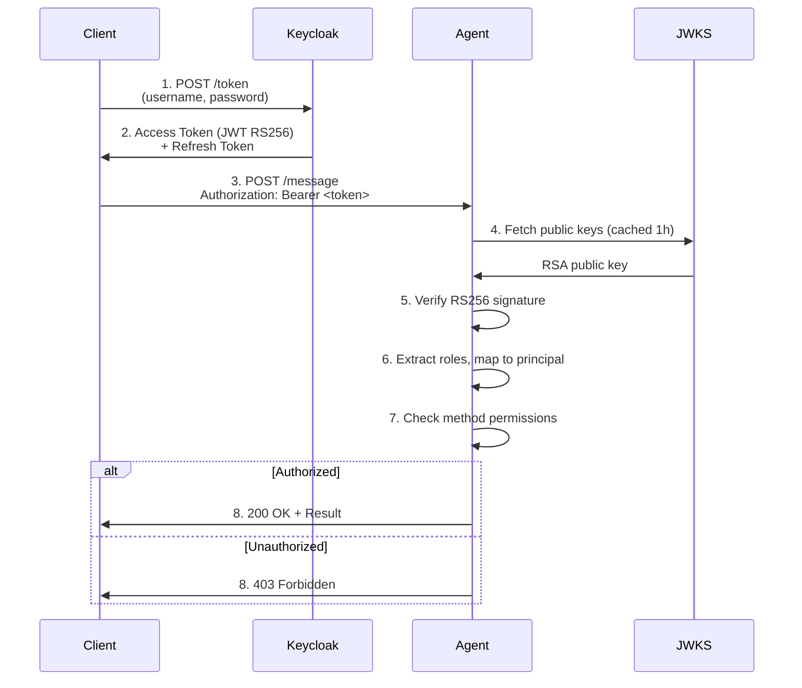

# Authentication Architecture Update - Keycloak OAuth2 Only

**Date**: January 14, 2026  
**Version**: 3.0 (Breaking Changes)  
**Status**: Migration In Progress

---

## Summary

The CA-A2A system authentication has been **simplified to use only Keycloak OAuth2/OIDC**.

### What Changed

| Component | v2.1 (Hybrid) | v3.0 (Keycloak Only) |
|-----------|---------------|----------------------|
| **API Keys** | ✅ Supported | ❌ **Removed** |
| **Legacy JWT (HS256)** | ✅ Supported | ❌ **Removed** |
| **Keycloak OAuth2 (RS256)** | ✅ Supported | ✅ **Required** |
| **Authentication Modes** | 3 methods (hybrid) | **1 method (OAuth2 only)** |
| **RBAC Source** | Static JSON + Keycloak | **Keycloak roles only** |
| **Code Complexity** | ~515 lines | **~330 lines (-36%)** |

---

##Authentication Flow (Simplified)



**No More Fallback:**
- ❌ No API key lookup
- ❌ No legacy JWT validation
- ✅ **Only Keycloak JWT validation**

---

## Benefits

### 1. **Simplified Codebase**
- **36% code reduction** in `a2a_security.py` (515 → 330 lines)
- Single authentication path (easier to maintain, test, audit)
- No hybrid mode complexity

### 2. **Enhanced Security**
- **RS256 asymmetric signing** (private key never leaves Keycloak)
- **No shared secrets** to distribute/rotate manually
- **Automatic key rotation** via JWKS caching
- **Centralized key management** (Keycloak manages all keys)

### 3. **Better User Experience**
- **Single sign-on (SSO)** ready
- **Multi-factor authentication (MFA)** support
- **Password reset flows** built-in
- **Self-service user registration** possible

### 4. **Compliance & Audit**
- **OAuth 2.0 & OpenID Connect standards** compliance
- **Comprehensive audit trail** (all auth events in Keycloak)
- **Token revocation** support
- **Session management** (forced logout, max lifespan)

### 5. **Operational Benefits**
- **Dynamic RBAC** - Update roles without redeploying agents
- **Centralized user management** - Keycloak admin console
- **Federation ready** - LDAP, Active Directory, SAML, OAuth providers
- **Horizontal scaling** - Keycloak handles auth load

---

## Technical Details

### New Security Manager

**File:** `a2a_security_keycloak_only.py`

**Key Changes:**
```python
class A2ASecurityManager:
    def __init__(self, agent_id: str):
        # REMOVED: API key configuration
        # REMOVED: Legacy JWT configuration
        # REMOVED: Static RBAC policy JSON
        
        # REQUIRED: Keycloak configuration
        keycloak_url = os.getenv("KEYCLOAK_URL")  # REQUIRED
        if not keycloak_url:
            raise ValueError("KEYCLOAK_URL environment variable is required")
        
        self.keycloak_validator = KeycloakJWTValidator(...)
        self.keycloak_rbac_mapper = KeycloakRBACMapper()
    
    def _authenticate_keycloak(self, ...):
        # Single authentication path
        # 1. Extract Bearer token from Authorization header
        # 2. Validate JWT via Keycloak JWKS
        # 3. Extract roles from token claims
        # 4. Map roles to RBAC principal + allowed methods
        # 5. Return (principal, auth_context)
```

### Required Environment Variables

```bash
# REQUIRED
KEYCLOAK_URL=http://keycloak.ca-a2a.local:8080
KEYCLOAK_REALM=ca-a2a
KEYCLOAK_CLIENT_ID=ca-a2a-agents

# OPTIONAL
KEYCLOAK_CACHE_TTL=3600  # JWKS cache TTL (default: 1 hour)
A2A_ENABLE_RATE_LIMIT=true  # Enable rate limiting (default: true)
A2A_ENABLE_REPLAY_PROTECTION=true  # Enable replay protection (default: true)
A2A_RATE_LIMIT_PER_MINUTE=300  # Rate limit (default: 300/min)
```

### Required Secrets (AWS Secrets Manager)

```bash
# Keycloak client secret (for token validation)
ca-a2a/keycloak-client-secret

# Service account passwords
ca-a2a/keycloak-lambda-service-password
ca-a2a/keycloak-orchestrator-service-password
ca-a2a/keycloak-extractor-service-password
ca-a2a/keycloak-validator-service-password
ca-a2a/keycloak-archivist-service-password
```

---

## Migration Path

See [MIGRATION_GUIDE_KEYCLOAK_ONLY.md](./MIGRATION_GUIDE_KEYCLOAK_ONLY.md) for detailed migration instructions.

**Quick Steps:**
1. ✅ **Deploy Keycloak** (Already done)
2. 🔄 **Migrate clients** to use Keycloak OAuth2 (In progress)
3. ⏳ **Update agent code** to use `a2a_security_keycloak_only.py`
4. ⏳ **Remove legacy env vars** from task definitions
5. ⏳ **Deploy and verify** all agents

**Target Date:** February 15, 2026

---

## API Changes

### Before (v2.1 - Hybrid)

**Supported authentication methods:**
```bash
# Method 1: API Key
curl -X POST http://agent:8001/message \
  -H "X-API-Key: abc123" \
  -d '{"jsonrpc":"2.0","method":"list_skills","id":1}'

# Method 2: Legacy JWT (HS256)
curl -X POST http://agent:8001/message \
  -H "Authorization: Bearer <legacy-hs256-jwt>" \
  -d '{"jsonrpc":"2.0","method":"list_skills","id":1}'

# Method 3: Keycloak JWT (RS256)
curl -X POST http://agent:8001/message \
  -H "Authorization: Bearer <keycloak-rs256-jwt>" \
  -d '{"jsonrpc":"2.0","method":"list_skills","id":1}'
```

### After (v3.0 - Keycloak Only)

**Only one authentication method:**
```bash
# ONLY METHOD: Keycloak JWT (RS256)
# Step 1: Get token from Keycloak
TOKEN=$(curl -s -X POST "http://keycloak.ca-a2a.local:8080/realms/ca-a2a/protocol/openid-connect/token" \
  -d "grant_type=password" \
  -d "client_id=ca-a2a-agents" \
  -d "client_secret=$CLIENT_SECRET" \
  -d "username=$USERNAME" \
  -d "password=$PASSWORD" | jq -r '.access_token')

# Step 2: Use token in API call
curl -X POST http://agent:8001/message \
  -H "Authorization: Bearer $TOKEN" \
  -d '{"jsonrpc":"2.0","method":"list_skills","id":1}'
```

---

## Error Messages

### Missing Authorization Header
**Before:**
```json
{
  "jsonrpc": "2.0",
  "error": {
    "code": -32001,
    "message": "Missing Authorization (expected Bearer JWT or API key)"
  },
  "id": 1
}
```

**After:**
```json
{
  "jsonrpc": "2.0",
  "error": {
    "code": -32001,
    "message": "Missing Authorization header. Expected: Bearer <keycloak-jwt-token>"
  },
  "id": 1
}
```

### Invalid Authentication
**Before:**
```json
{
  "jsonrpc": "2.0",
  "error": {
    "code": -32001,
    "message": "Invalid API key"
  },
  "id": 1
}
```

**After:**
```json
{
  "jsonrpc": "2.0",
  "error": {
    "code": -32001,
    "message": "Invalid Keycloak JWT: Token signature verification failed"
  },
  "id": 1
}
```

---

## Testing

### Unit Tests
```bash
# Test Keycloak-only security manager
pytest test_keycloak_only_security.py -v

# Expected: All tests pass with Keycloak OAuth2 only
```

### Integration Tests
```bash
# Test authentication flow
./test-keycloak-auth.sh

# Test end-to-end pipeline with Keycloak authentication
./test-complete-pipeline-keycloak-only.sh
```

### Manual Testing
```bash
# 1. Try API key (should fail)
curl -X POST http://orchestrator.ca-a2a.local:8001/message \
  -H "X-API-Key: abc123" \
  -d '{"jsonrpc":"2.0","method":"list_skills","id":1}'
# Expected: Error - Missing Authorization header

# 2. Try legacy JWT (should fail)
curl -X POST http://orchestrator.ca-a2a.local:8001/message \
  -H "Authorization: Bearer <legacy-jwt>" \
  -d '{"jsonrpc":"2.0","method":"list_skills","id":1}'
# Expected: Error - Invalid Keycloak JWT

# 3. Try Keycloak JWT (should succeed)
TOKEN=$(curl -s -X POST "http://keycloak.ca-a2a.local:8080/realms/ca-a2a/protocol/openid-connect/token" \
  -d "grant_type=password" \
  -d "client_id=ca-a2a-agents" \
  -d "client_secret=$CLIENT_SECRET" \
  -d "username=admin-user" \
  -d "password=$PASSWORD" | jq -r '.access_token')

curl -X POST http://orchestrator.ca-a2a.local:8001/message \
  -H "Authorization: Bearer $TOKEN" \
  -d '{"jsonrpc":"2.0","method":"list_skills","id":1}'
# Expected: Success - Returns list of skills
```

---

## Rollback Plan

If critical issues arise:

```bash
# 1. Restore hybrid authentication
mv a2a_security_legacy_backup.py a2a_security.py

# 2. Re-add legacy environment variables to task definitions
# - A2A_API_KEYS_JSON
# - A2A_JWT_PUBLIC_KEY_PEM
# - A2A_USE_KEYCLOAK=true (for hybrid mode)

# 3. Redeploy agents
./Rebuild-All-Agents-NoPrompt.ps1

# 4. Force ECS service update
aws ecs update-service --cluster ca-a2a-cluster --service orchestrator --force-new-deployment --region eu-west-3
```

---

## Documentation Updates

All documentation has been updated to reflect Keycloak-only authentication:

- ✅ **MIGRATION_GUIDE_KEYCLOAK_ONLY.md** - Migration instructions
- ✅ **AUTHENTICATION_ARCHITECTURE_UPDATE.md** (this document) - Architecture changes
- ⏳ **COMPLETE_DEMO_GUIDE.md** - Update authentication sections
- ⏳ **A2A_PROTOCOL_SECURITY_TECHNICAL.md** - Remove legacy auth sections
- ⏳ **AGENT_SECURITY_TESTING_GUIDE.md** - Update test cases
- ⏳ **COMPREHENSIVE_TESTING_GUIDE.md** - Update test procedures
- ⏳ **AWS_ARCHITECTURE_DIAGRAM.md** - Update auth flow diagrams

---

## Timeline & Status

| Milestone | Target Date | Status |
|-----------|-------------|--------|
| Keycloak deployment | Jan 14, 2026 | ✅ Complete |
| Create Keycloak-only code | Jan 14, 2026 | ✅ Complete |
| Write migration guide | Jan 14, 2026 | ✅ Complete |
| Update documentation | Jan 15-20, 2026 | 🔄 In Progress |
| Client migration | Jan 20 - Feb 10, 2026 | ⏳ Pending |
| Deploy to staging | Feb 10, 2026 | ⏳ Pending |
| Deploy to production | Feb 15, 2026 | ⏳ Pending |

---

## Contact & Support

For questions or assistance:
- **Migration Guide:** [MIGRATION_GUIDE_KEYCLOAK_ONLY.md](./MIGRATION_GUIDE_KEYCLOAK_ONLY.md)
- **Keycloak Guide:** [KEYCLOAK_INTEGRATION_GUIDE.md](./KEYCLOAK_INTEGRATION_GUIDE.md)
- **Testing:** Run `./test-keycloak-auth.sh`
- **Logs:** `aws logs tail /ecs/ca-a2a-orchestrator --follow`

---

## Conclusion

This update simplifies the authentication architecture to use **only Keycloak OAuth2/OIDC**, eliminating legacy authentication methods and reducing code complexity by 36%. All clients must migrate to Keycloak authentication before production deployment.

**Key Takeaways:**
- ✅ Single authentication method (OAuth2 only)
- ✅ Enhanced security with RS256 asymmetric signing
- ✅ Centralized user/role management
- ✅ Industry standard compliance (OAuth 2.0, OIDC)
- ✅ Simplified codebase (-36% lines)

**Next Actions:**
1. Review migration guide
2. Test Keycloak authentication in staging
3. Update client code
4. Schedule production migration

