# AWS Architecture - Mermaid Diagrams

**Project:** CA-A2A Multi-Agent Document Processing System  
**AWS Account:** 555043101106  
**Region:** eu-west-3 (Paris)  
**Generated:** January 2, 2026

---

## 1. High-Level System Architecture


---

## 2. Document Processing Flow (Manual Upload)


---

## 3. Automated S3 Event Processing Flow

```mermaid
sequenceDiagram
    participant User
    participant S3 as Amazon S3
    participant SQS as Amazon SQS
    participant Lambda as Lambda Function
    participant Orch as Orchestrator Service
    participant Pipeline as Processing Pipeline
    participant RDS as PostgreSQL

    User->>S3: aws s3 cp invoice.pdf s3://.../invoices/
    S3->>S3: Trigger: s3:ObjectCreated:*
    
    S3->>SQS: Send event notification
    Note over SQS: Message contains:<br/>bucket, key, timestamp
    
    SQS->>Lambda: Trigger (Event Source Mapping)
    Lambda->>Lambda: Parse S3 event
    Lambda->>Lambda: Extract bucket & key
    
    Lambda->>Orch: POST /a2a<br/>process_document
    Note over Lambda,Orch: JSON-RPC 2.0 request<br/>with JWT authentication
    
    Orch->>Pipeline: Start processing pipeline
    activate Pipeline
    Pipeline->>RDS: Create document record
    Pipeline->>Pipeline: Extract → Validate → Archive
    Pipeline->>RDS: Update status
    Pipeline-->>Orch: Processing results
    deactivate Pipeline
    
    Orch-->>Lambda: 200 OK with task_id
    Lambda->>SQS: Delete message
    Lambda->>Lambda: Log success
```



---

## 4. Network Architecture & Security Groups


---

## 5. A2A Protocol Communication Flow


---

## 6. ECS Service Deployment & Scaling

```mermaid
graph LR
    subgraph "Container Registry"
        ECR[Amazon ECR<br/>555043101106.dkr.ecr.eu-west-3]
        
        subgraph "Images"
            IMG_O[orchestrator:latest<br/>Python 3.11]
            IMG_E[extractor:latest<br/>Python 3.11]
            IMG_V[validator:latest<br/>Python 3.11]
            IMG_A[archivist:latest<br/>Python 3.11]
        end
    end
    
    subgraph "ECS Cluster: ca-a2a-cluster"
        subgraph "Task Definitions"
            TD_O[ca-a2a-orchestrator:6<br/>512 CPU / 1024 MB]
            TD_E[ca-a2a-extractor:latest<br/>512 CPU / 1024 MB]
            TD_V[ca-a2a-validator:latest<br/>512 CPU / 1024 MB]
            TD_A[ca-a2a-archivist:latest<br/>512 CPU / 1024 MB]
        end
        
        subgraph "Services (Fargate)"
            SVC_O[orchestrator<br/>Desired: 2<br/>Running: 2<br/>Status: ACTIVE]
            SVC_E[extractor<br/>Desired: 2<br/>Running: 2<br/>Status: ACTIVE]
            SVC_V[validator<br/>Desired: 2<br/>Running: 2<br/>Status: ACTIVE]
            SVC_A[archivist<br/>Desired: 2<br/>Running: 2<br/>Status: ACTIVE]
        end
        
        subgraph "Running Tasks"
            T_O1[Task: Orch-1<br/>IP: 10.0.10.x<br/>Health: HEALTHY]
            T_O2[Task: Orch-2<br/>IP: 10.0.20.x<br/>Health: HEALTHY]
            T_E1[Task: Ext-1<br/>IP: 10.0.10.x]
            T_E2[Task: Ext-2<br/>IP: 10.0.20.x]
            T_V1[Task: Val-1<br/>IP: 10.0.10.x]
            T_V2[Task: Val-2<br/>IP: 10.0.20.x]
            T_A1[Task: Arch-1<br/>IP: 10.0.10.x]
            T_A2[Task: Arch-2<br/>IP: 10.0.20.x]
        end
    end
    
    subgraph "Load Balancing"
        TG[Target Group<br/>ca-a2a-orch-tg<br/>Health: /health<br/>Interval: 30s]
        ALB_LB[Application Load Balancer]
    end
    
    IMG_O --> TD_O
    IMG_E --> TD_E
    IMG_V --> TD_V
    IMG_A --> TD_A
    
    TD_O --> SVC_O
    TD_E --> SVC_E
    TD_V --> SVC_V
    TD_A --> SVC_A
    
    SVC_O --> T_O1
    SVC_O --> T_O2
    SVC_E --> T_E1
    SVC_E --> T_E2
    SVC_V --> T_V1
    SVC_V --> T_V2
    SVC_A --> T_A1
    SVC_A --> T_A2
    
    T_O1 --> TG
    T_O2 --> TG
    TG --> ALB_LB
    
    style SVC_O fill:#00C853
    style SVC_E fill:#00C853
    style SVC_V fill:#00C853
    style SVC_A fill:#00C853
    style T_O1 fill:#00E676
    style T_O2 fill:#00E676
```



---

## 7. Data Storage Architecture


---

## 8. Monitoring & Observability Stack

```mermaid
graph TB
    subgraph "Data Sources"
        Orch[Orchestrator Logs]
        Ext[Extractor Logs]
        Val[Validator Logs]
        Arch[Archivist Logs]
        Lambda[Lambda Logs]
        ALB_M[ALB Metrics]
        ECS_M[ECS Metrics]
        RDS_M[RDS Metrics]
        S3_M[S3 Metrics]
    end
    
    subgraph "CloudWatch"
        subgraph "Log Groups"
            LG1[/ecs/ca-a2a-orchestrator<br/>Retention: 7 days]
            LG2[/ecs/ca-a2a-extractor<br/>Retention: 7 days]
            LG3[/ecs/ca-a2a-validator<br/>Retention: 7 days]
            LG4[/ecs/ca-a2a-archivist<br/>Retention: 7 days]
            LG5[/aws/lambda/ca-a2a-s3-processor]
        end
        
        subgraph "Metrics"
            M1[ECS CPU/Memory Utilization]
            M2[ALB Request Count & Latency]
            M3[RDS Connections & Storage]
            M4[Lambda Invocations & Errors]
            M5[S3 Bucket Size & Requests]
        end
        
        subgraph "Alarms"
            A1[🔔 High CPU Alert<br/>Threshold: 80%]
            A2[🔔 High Error Rate<br/>Threshold: 10/5min]
            A3[🔔 RDS Connections<br/>Threshold: 80%]
            A4[🔔 Lambda Errors<br/>Threshold: 5%]
        end
        
        subgraph "Dashboards"
            D1[📊 Service Health Dashboard]
            D2[📊 Performance Dashboard]
            D3[📊 Cost Dashboard]
        end
    end
    
    subgraph "CloudTrail"
        CT[API Call Auditing<br/>Compliance Logging<br/>Security Analysis]
    end
    
    subgraph "VPC Flow Logs"
        VFL[Network Traffic Monitoring<br/>Security Analysis<br/>Troubleshooting]
    end
    
    subgraph "Container Insights"
        CI[ECS Container Metrics<br/>Task-level Performance<br/>Resource Utilization]
    end
    
    subgraph "Alerting"
        SNS[Amazon SNS<br/>Email/SMS Notifications]
    end
    
    Orch --> LG1
    Ext --> LG2
    Val --> LG3
    Arch --> LG4
    Lambda --> LG5
    
    ALB_M --> M2
    ECS_M --> M1
    RDS_M --> M3
    Lambda --> M4
    S3_M --> M5
    
    M1 --> A1
    M2 --> A2
    M3 --> A3
    M4 --> A4
    
    M1 & M2 & M3 & M4 & M5 --> D1
    M1 & M2 & M3 & M4 & M5 --> D2
    M1 & M2 & M3 & M4 & M5 --> D3
    
    ECS_M --> CI
    
    A1 & A2 & A3 & A4 --> SNS
    
    style A1 fill:#FF9800
    style A2 fill:#FF5722
    style A3 fill:#FF9800
    style A4 fill:#FF5722
    style D1 fill:#2196F3
    style D2 fill:#2196F3
    style D3 fill:#4CAF50
    style SNS fill:#FF4081
```

---

## 9. IAM Roles & Permissions

```mermaid
graph TB
    subgraph "IAM Roles"
        subgraph "ECS Task Execution Role"
            EXEC[ca-a2a-ecs-execution-role<br/>────────────<br/>Trust: ecs-tasks.amazonaws.com]
            
            EXEC_P1[📋 AmazonECSTaskExecutionRolePolicy<br/>• ECR: Pull images<br/>• Logs: Create/write streams]
            EXEC_P2[📋 Custom: Secrets Access<br/>• SecretsManager: GetSecretValue<br/>• KMS: Decrypt]
        end
        
        subgraph "ECS Task Role"
            TASK[ca-a2a-ecs-task-role<br/>────────────<br/>Trust: ecs-tasks.amazonaws.com]
            
            TASK_P1[📋 S3 Access Policy<br/>• s3:GetObject<br/>• s3:PutObject<br/>• s3:ListBucket<br/>Resource: ca-a2a-documents-*]
            TASK_P2[📋 RDS Access<br/>Via Security Groups<br/>Not IAM-based]
        end
        
        subgraph "Lambda Execution Role"
            LAMBDA_R[ca-a2a-lambda-s3-processor-role<br/>────────────<br/>Trust: lambda.amazonaws.com]
            
            LAMBDA_P1[📋 Lambda Basic Execution<br/>• Logs: CreateLogStream/PutLogEvents]
            LAMBDA_P2[📋 VPC Access<br/>• ec2:CreateNetworkInterface<br/>• ec2:DescribeNetworkInterfaces<br/>• ec2:DeleteNetworkInterface]
            LAMBDA_P3[📋 SQS Access<br/>• sqs:ReceiveMessage<br/>• sqs:DeleteMessage<br/>• sqs:GetQueueAttributes]
            LAMBDA_P4[📋 S3 Read Access<br/>• s3:GetObject<br/>Resource: ca-a2a-documents-*]
        end
    end
    
    subgraph "AWS Services"
        ECR[Amazon ECR<br/>Container Images]
        SM[Secrets Manager<br/>Credentials]
        CW[CloudWatch Logs]
        S3[Amazon S3<br/>Documents]
        SQS[Amazon SQS<br/>Events]
        VPC[VPC<br/>Network]
    end
    
    subgraph "ECS Tasks"
        T_ORCH[Orchestrator Tasks]
        T_EXT[Extractor Tasks]
        T_VAL[Validator Tasks]
        T_ARCH[Archivist Tasks]
    end
    
    subgraph "Lambda Functions"
        L_FUNC[ca-a2a-s3-processor]
    end
    
    EXEC --> EXEC_P1
    EXEC --> EXEC_P2
    TASK --> TASK_P1
    TASK --> TASK_P2
    LAMBDA_R --> LAMBDA_P1
    LAMBDA_R --> LAMBDA_P2
    LAMBDA_R --> LAMBDA_P3
    LAMBDA_R --> LAMBDA_P4
    
    EXEC_P1 -.->|Allow| ECR
    EXEC_P1 -.->|Allow| CW
    EXEC_P2 -.->|Allow| SM
    
    TASK_P1 -.->|Allow| S3
    
    LAMBDA_P1 -.->|Allow| CW
    LAMBDA_P2 -.->|Allow| VPC
    LAMBDA_P3 -.->|Allow| SQS
    LAMBDA_P4 -.->|Allow| S3
    
    T_ORCH -.->|Assumes| EXEC
    T_ORCH -.->|Assumes| TASK
    T_EXT -.->|Assumes| EXEC
    T_EXT -.->|Assumes| TASK
    T_VAL -.->|Assumes| EXEC
    T_VAL -.->|Assumes| TASK
    T_ARCH -.->|Assumes| EXEC
    T_ARCH -.->|Assumes| TASK
    
    L_FUNC -.->|Assumes| LAMBDA_R
    
    style EXEC fill:#DD344C
    style TASK fill:#DD344C
    style LAMBDA_R fill:#DD344C
    style EXEC_P1 fill:#FF9800
    style EXEC_P2 fill:#FF9800
    style TASK_P1 fill:#FF9800
    style LAMBDA_P1 fill:#FF9800
    style LAMBDA_P2 fill:#FF9800
    style LAMBDA_P3 fill:#FF9800
    style LAMBDA_P4 fill:#FF9800
```



---

## 10. Cost Analysis & Optimization

```mermaid
graph TB
    subgraph "Monthly AWS Costs - eu-west-3"
        subgraph "Compute Layer - $40.20"
            ECS[ECS Fargate<br/>8 tasks × 0.5 vCPU × 1GB<br/>24/7 running<br/>$40.00/month]
            Lambda[Lambda<br/>~10K invocations<br/>512MB × 60s avg<br/>$0.20/month]
        end
        
        subgraph "Storage Layer - $15.50"
            RDS[RDS PostgreSQL<br/>db.t3.micro<br/>20 GB gp2<br/>$15.00/month]
            S3[S3 Storage<br/><1 GB + requests<br/>$0.50/month]
        end
        
        subgraph "Networking Layer - $23.50"
            ALB[Application Load Balancer<br/>1 ALB + ~1M LCU-hours<br/>$16.00/month]
            VPCE[VPC Endpoints<br/>5 interface endpoints<br/>$7.50/month]
        end
        
        subgraph "Monitoring Layer - $0.60"
            CWL[CloudWatch Logs<br/>1 GB/month ingestion<br/>$0.50/month]
            SQS_C[SQS Queue<br/>~10K messages<br/>$0.10/month]
        end
        
        subgraph "Security Layer - $0.40"
            SM_C[Secrets Manager<br/>1 secret + requests<br/>$0.40/month]
        end
        
        subgraph "Data Transfer - $0.45"
            DT[Data Transfer Out<br/>~5 GB/month<br/>$0.45/month]
        end
        
        Total[💰 Total Monthly Cost<br/>$80.65/month<br/>≈ $968/year]
        
        ECS --> Total
        Lambda --> Total
        RDS --> Total
        S3 --> Total
        ALB --> Total
        VPCE --> Total
        CWL --> Total
        SQS_C --> Total
        SM_C --> Total
        DT --> Total
    end
    
    subgraph "Cost Optimization Options"
        OPT1[💡 Reduce to 1 task/service<br/>Save: $20/month<br/>New total: $60.65]
        
        OPT2[💡 Use Fargate Spot<br/>Save: 40% on compute<br/>New total: $64.65]
        
        OPT3[💡 RDS Reserved Instance<br/>1-year commitment<br/>Save: 40%<br/>New total: $74.65]
        
        OPT4[💡 S3 Intelligent-Tiering<br/>Auto-optimize storage<br/>Save: Variable]
        
        OPT5[💡 Reduce Log Retention<br/>7 days → 3 days<br/>Save: $0.25/month]
        
        OPT6[💡 Combine All Optimizations<br/>Best case scenario<br/>New total: ~$45/month<br/>Save: 44%]
    end
    
    subgraph "Scaling Cost Impact"
        SCALE1[📈 Double capacity<br/>16 tasks total<br/>Cost: ~$120/month]
        
        SCALE2[📈 10x capacity<br/>Auto-scaling to max<br/>Cost: ~$200/month]
        
        SCALE3[📈 Production-grade<br/>Multi-region + HA<br/>Cost: ~$300/month]
    end
    
    Total -.->|Consider| OPT1
    Total -.->|Consider| OPT2
    Total -.->|Consider| OPT3
    Total -.->|Consider| OPT4
    Total -.->|Consider| OPT5
    Total -.->|Best| OPT6
    
    Total -.->|Scale| SCALE1
    Total -.->|Scale| SCALE2
    Total -.->|Scale| SCALE3
    
    style Total fill:#4CAF50,color:#fff
    style ECS fill:#FF9900
    style RDS fill:#527FFF
    style ALB fill:#FF6B6B
    style OPT6 fill:#00E676
    style SCALE3 fill:#FF9800
```



---

## How to Use These Diagrams

### Viewing in GitHub/GitLab
These Mermaid diagrams will render automatically when viewing this file on GitHub or GitLab.

### Viewing in VS Code/Cursor
Install the "Markdown Preview Mermaid Support" extension to see rendered diagrams.

### Exporting to Images
Use [Mermaid Live Editor](https://mermaid.live) to export diagrams as PNG/SVG:
1. Copy the diagram code
2. Paste into mermaid.live
3. Click "Actions" → "Export as PNG/SVG"

### Embedding in Documentation
These diagrams can be embedded in any markdown documentation that supports Mermaid syntax.

---

## Related Documentation

- [AWS_ARCHITECTURE.md](./AWS_ARCHITECTURE.md) - Detailed specifications
- [AWS_ARCHITECTURE_DIAGRAM.md](./AWS_ARCHITECTURE_DIAGRAM.md) - ASCII diagrams
- [AWS_DEPLOYMENT.md](./AWS_DEPLOYMENT.md) - Deployment guide
- [SECURITY_GUIDE.md](./SECURITY_GUIDE.md) - Security details

---

**Generated:** January 2, 2026  
**Project:** CA-A2A Multi-Agent Document Processing System  
**Status:** ✅ All services operational

