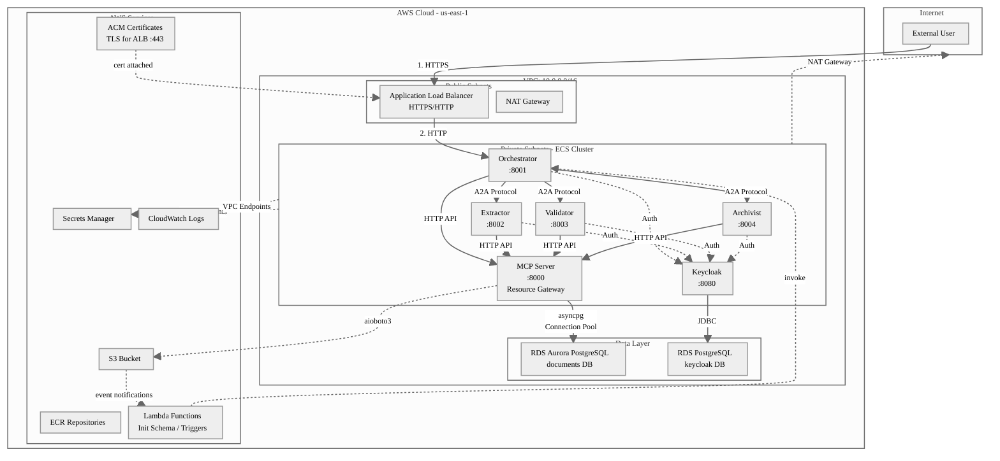
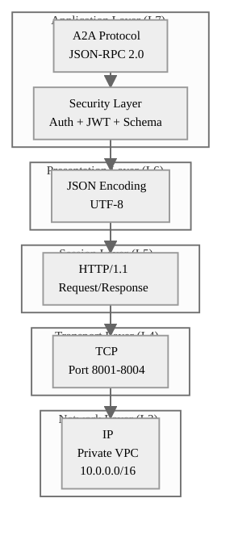
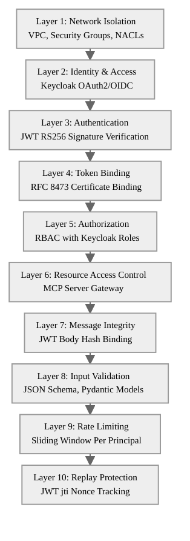
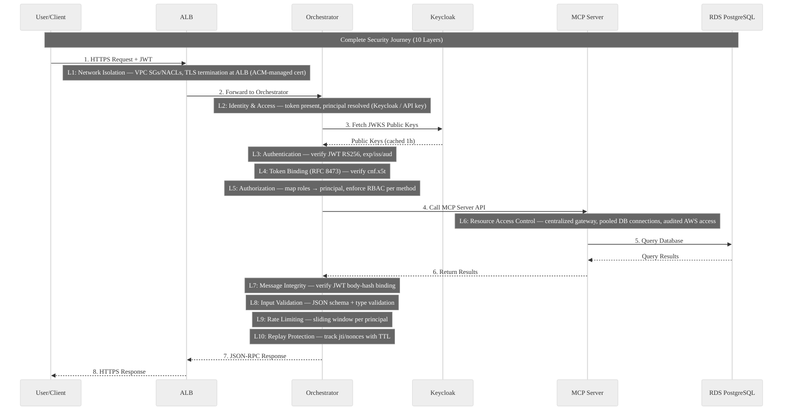
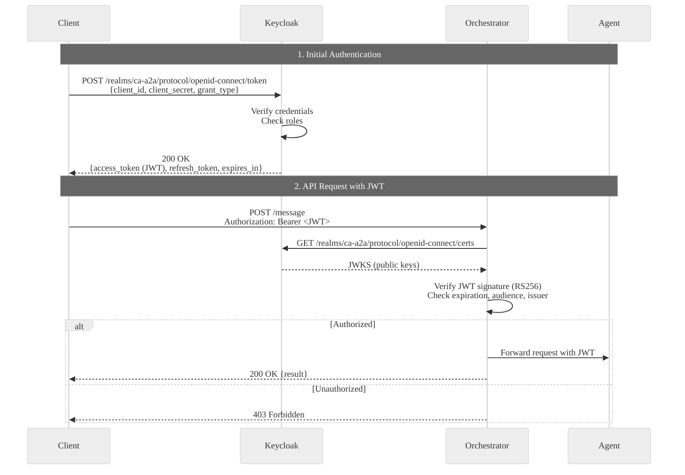
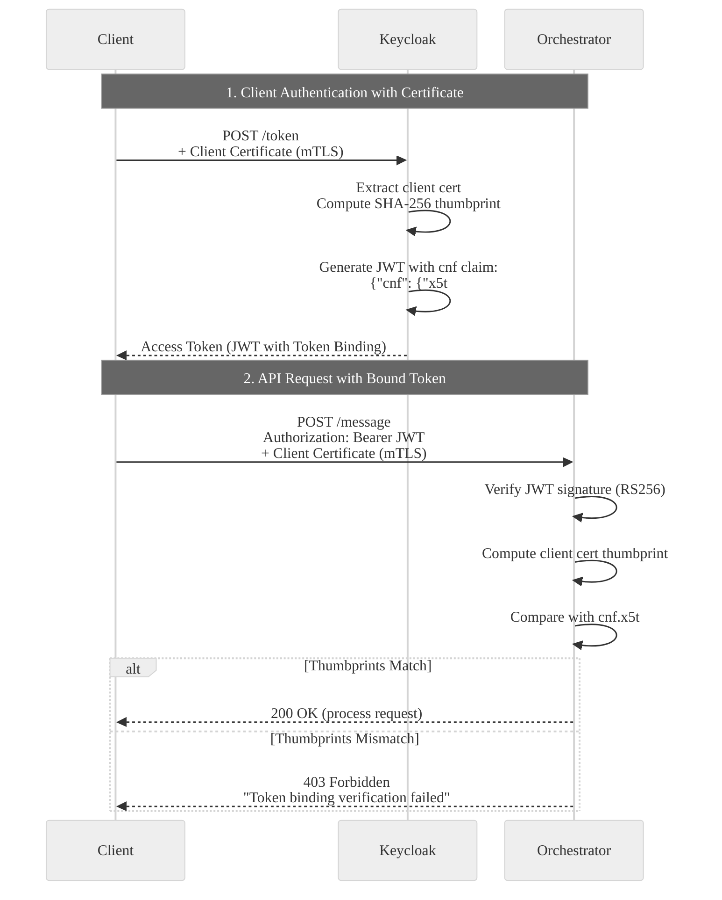
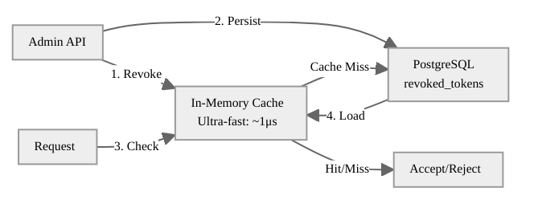
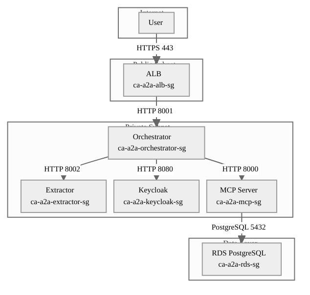
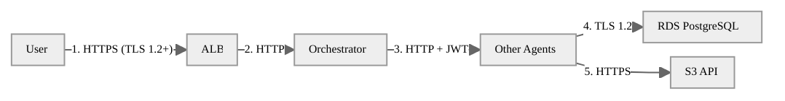
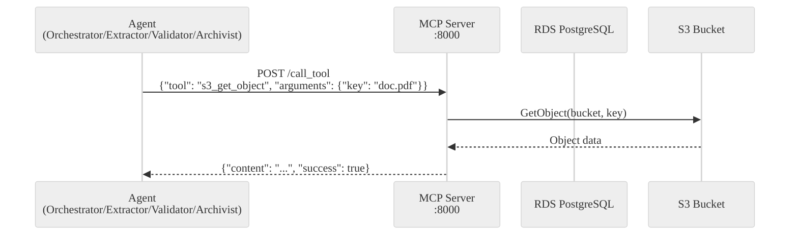

# A2A Security Documentation

**Comprehensive Technical Documentation on Agent-to-Agent Security Architecture**

**Last Updated:** January 28, 2026  
**Author:** Jaafar BENABDERRAZAK

<center>

![[Pasted image 20260128224524.png]]

</center>

---

## Document Structure

This document is organized into logical parts for easy navigation:

| Part | Sections | Purpose |
|------|----------|---------|
| **I. Overview** | 1-2 | System architecture and protocol basics |
| **II. Threat Model** | 3-4 | Threats and defense strategy (read this to understand WHY) |
| **III. Identity & Access** | 5-7 | Authentication, authorization, token management |
| **IV. Infrastructure Security** | 8-9 | Network isolation, data protection |
| **V. Runtime Protection** | 10-11 | Input validation, rate limiting, replay protection |
| **VI. Operations** | 12-13 | Monitoring, incident response, AWS security services |
| **Appendices** | A-D | Reference, checklists, glossary |

---

## Executive Summary

The A2A (Agent-to-Agent) system implements enterprise-grade security through a **defense-in-depth architecture with 10 independent security layers**. The system uses **JSON-RPC 2.0** as its communication protocol, deployed on AWS ECS Fargate in a private VPC with **Keycloak OAuth2/OIDC** for centralized authentication, **MCP Server** for resource access control, and role-based access control (RBAC).

### Why This Architecture Matters

In traditional web applications, the security perimeter is clear: external users are untrusted, internal services are trusted. **In a multi-agent system, this model breaks down.** An agent may be compromised through a vulnerability, a supply chain attack, or a malicious prompt. Once compromised, that agent has legitimate network access, valid credentials, and the ability to call other agents.

Our architecture addresses this reality by treating **every component as potentially compromised**. Each security layer operates independently, so even if an attacker bypasses one control, they face nine more. This is not paranoia—it's engineering for the actual threat landscape of autonomous agent systems.

**Security Framework:** OWASP Top 10 for Agentic Applications 2026 compliant

**Key Security Features:**

| Category | Features |
|----------|----------|
| **Authentication** | OAuth2/OIDC (Keycloak RS256 JWT), Token Binding (RFC 8473), Mutual TLS |
| **Authorization** | RBAC with Keycloak roles, fine-grained method permissions |
| **Network** | Private VPC, Security Groups, VPC Endpoints, no public IPs |
| **Data** | Encryption at rest (AES-256), TLS 1.2+ in transit, Secrets Manager |
| **Runtime** | Rate limiting (300 req/min), replay protection, JSON Schema validation, timing attack prevention |
| **Audit** | CloudWatch Logs, CloudTrail, structured security events |

---

# Part I: Overview

This part introduces the system architecture and communication protocol. Before diving into security mechanisms, it's essential to understand what we're protecting and how the components interact.

## 1. System Architecture

### 1.1 Production Deployment

The A2A system is deployed on AWS infrastructure, leveraging managed services for reliability and security. The architecture follows a **hub-and-spoke model** where the Orchestrator acts as the central coordinator, delegating specialized tasks to purpose-built agents.

**Why AWS ECS Fargate?**
- **Serverless containers**: No EC2 instances to patch or manage
- **Automatic scaling**: Handles load spikes without manual intervention
- **Security isolation**: Each task runs in its own kernel namespace
- **IAM integration**: Fine-grained permissions via task roles

<center>


</center>

The following diagram shows the complete infrastructure, including network boundaries, data flows, and service dependencies:



### 1.2 Component Overview

Each component in the system has a specific responsibility, following the **single responsibility principle**. This separation ensures that a compromise in one component has limited impact on others.

| Component | Type | Port | Purpose | Instances |
|-----------|------|------|---------|-----------|
| **Orchestrator** | ECS Fargate | 8001 | Request coordination, workflow | 2 |
| **Extractor** | ECS Fargate | 8002 | Document text extraction | 2 |
| **Validator** | ECS Fargate | 8003 | Content validation | 2 |
| **Archivist** | ECS Fargate | 8004 | Document archival, retrieval | 2 |
| **Keycloak** | ECS Fargate | 8080 | Identity Provider (OAuth2/OIDC) | 1 |
| **MCP Server** | ECS Fargate | 8000 | Centralized S3/RDS access gateway | 1 |
| **ALB** | AWS Service | 80/443 | Load balancing, TLS termination | Multi-AZ |
| **RDS Aurora** | Managed DB | 5432 | Document metadata, audit logs | Multi-AZ |
| **RDS Postgres** | Managed DB | 5432 | Keycloak data (users, roles) | Multi-AZ |

**Why Two Instances Per Agent?**

Running two instances of each agent provides:
- **High availability**: If one instance fails, the other continues serving requests
- **Zero-downtime deployments**: Rolling updates replace instances one at a time
- **Load distribution**: Traffic is balanced across instances
- **Failure isolation**: A crash in one instance doesn't affect the other

### 1.3 Data Flow Summary

Understanding the request flow is essential for security analysis. Each arrow represents a trust boundary that must be validated:

1. **External Request** → ALB (TLS termination) → Orchestrator
   - *Trust boundary*: Internet → AWS. ALB validates TLS, terminates encryption.
   
2. **Authentication** → Keycloak (JWT validation)
   - *Trust boundary*: Unauthenticated → Authenticated. Keycloak issues identity tokens.
   
3. **Agent Coordination** → Orchestrator → Extractor/Validator/Archivist
   - *Trust boundary*: Inter-agent communication. JWT propagated for authorization.
   
4. **AWS Resources** → All agents → MCP Server → S3/RDS
   - *Trust boundary*: Application → Infrastructure. MCP centralizes and audits access.

---

## 2. A2A Protocol Overview

### 2.1 What is A2A Protocol?

**A2A (Agent-to-Agent) Protocol** is a standardized communication protocol for autonomous agents to exchange messages and coordinate actions in a distributed system. Unlike traditional API calls, A2A assumes that both parties are intelligent agents capable of complex reasoning and multi-step workflows.

**Our Implementation:**
- **Base Protocol:** JSON-RPC 2.0 (RFC 4627)
- **Transport:** HTTPS with Mutual TLS
- **Encoding:** UTF-8 JSON
- **Authentication:** Keycloak OAuth2/OIDC (RS256) + mTLS
- **Token Binding:** RFC 8473 (Certificate-bound tokens)

> **Key Insight:** A2A is "RPC between agents", but the **security model assumes an attacker may compromise an agent** and attempt lateral movement. This is why identity, token binding, RBAC, and centralized AWS access are first-class security layers.

### 2.2 Why JSON-RPC 2.0?

We evaluated several protocols before selecting JSON-RPC 2.0. The decision was driven by security considerations as much as technical ones:

| Feature | Benefit | Security Impact |
|---------|---------|-----------------|
| **Standardized** | Well-defined spec | Reduces implementation errors |
| **Stateless** | No session state | Prevents session fixation |
| **Lightweight** | ~100-200 bytes overhead | Reduces attack surface |
| **Language Agnostic** | JSON is universal | No proprietary vulnerabilities |

**Why Not gRPC?**

gRPC offers better performance through binary serialization and HTTP/2 multiplexing. However:
- Requires `.proto` file management and versioning
- Binary format is harder to inspect and debug
- Contract changes require recompilation
- Our workloads are I/O-bound (document processing), not CPU-bound

**Why Not REST?**

REST is designed for CRUD operations on resources. Our agents need:
- RPC-style method invocation (`process_document`, not `POST /documents`)
- Standardized error codes (JSON-RPC provides `-32xxx` codes)
- Bidirectional notifications (JSON-RPC supports this natively)

<center>


</center>

### 2.3 Protocol Stack

The A2A protocol sits at the application layer, with security controls embedded at each level. This diagram shows how a business message is encapsulated through the network stack:

<center>

![[Pasted image 20260128224622.png]]

</center>



### 2.4 Message Format

JSON-RPC 2.0 defines a strict message format. Every request must include `jsonrpc`, `method`, and `id`. Parameters are optional but recommended.

**Request:**
```json
{
  "jsonrpc": "2.0",
  "id": "req-abc123",
  "method": "process_document",
  "params": {
    "s3_key": "uploads/invoice-2026-01-15.pdf",
    "priority": "high"
  }
}
```

**Response:**
```json
{
  "jsonrpc": "2.0",
  "id": "req-abc123",
  "result": {
    "status": "success",
    "document_id": "doc-789"
  }
}
```

**Error Response:**
```json
{
  "jsonrpc": "2.0",
  "id": "req-abc123",
  "error": {
    "code": -32602,
    "message": "Invalid params",
    "data": {"detail": "s3_key is required"}
  }
}
```

The `id` field is crucial for security: it enables request-response correlation and helps detect replay attacks when combined with the JWT `jti` claim.

---

# Part II: Threat Model

Before implementing security controls, we must understand what we're defending against. This part formalizes the threat model and explains why each defense layer exists.

## 3. Threat Model

### 3.1 The Compromised Agent Assumption

Traditional security models focus on perimeter defense: keep attackers out, trust everything inside. **This model fails for multi-agent systems.**

In our threat model, we assume:

1. **Any agent can be compromised** through code vulnerabilities, dependency attacks, or prompt injection
2. **A compromised agent has legitimate credentials** (JWT tokens, mTLS certificates)
3. **A compromised agent has network access** to other internal services
4. **The attacker's goal is lateral movement** and data exfiltration

This assumption drives every security decision. We're not just defending against external attackers—we're containing internal breaches.

### 3.2 STRIDE Analysis

STRIDE is a threat modeling framework that categorizes attacks. For each category, we identify specific risks and countermeasures:

| Threat | Description | Example Attack | Defense Layer |
|--------|-------------|----------------|---------------|
| **Spoofing** | Impersonating another identity | Forging a JWT to claim admin role | L2, L3, L4 |
| **Tampering** | Modifying data in transit | Changing `amount: 100` to `amount: 10000` | L7 |
| **Repudiation** | Denying actions | "I never authorized that transfer" | Audit logs |
| **Information Disclosure** | Leaking sensitive data | Reading another tenant's documents | L5, L6 |
| **Denial of Service** | Exhausting resources | Flooding the system with requests | L9 |
| **Elevation of Privilege** | Gaining unauthorized access | Viewer role calling admin methods | L5 |

### 3.3 Attack Scenarios

Let's walk through concrete attack scenarios and how our architecture defends against them:

**Scenario 1: Stolen JWT Token**

An attacker intercepts a valid JWT (e.g., from a log file or memory dump).

*Without Token Binding:* Attacker can use the token from any machine.
*With Token Binding (RFC 8473):* Token is cryptographically bound to the original client's TLS certificate. Using it from another machine fails because the certificate thumbprint doesn't match.

**Scenario 2: Compromised Extractor Agent**

The Extractor agent is compromised through a PDF parsing vulnerability.

*Without MCP:* Attacker uses Extractor's AWS credentials to access all S3 buckets and RDS databases.
*With MCP:* Extractor has no direct AWS credentials. All access goes through MCP, which logs every operation and enforces bucket-level permissions.

**Scenario 3: Replay Attack**

Attacker captures a valid request and replays it 1000 times.

*Without Replay Protection:* Each replay succeeds, potentially creating 1000 duplicate records.
*With Replay Protection:* The JWT's `jti` claim is tracked. After the first request, subsequent replays are rejected with `-32013 Replay detected`.

---

## 4. Defense-in-Depth Architecture

### 4.1 The Philosophy

Defense-in-depth is not about having many security features—it's about having **independent** security features. Each layer must:

1. **Operate independently**: A failure in Layer 3 doesn't affect Layer 5
2. **Fail securely**: If a layer can't validate, it rejects (fail-closed)
3. **Log everything**: Security events are recorded for forensics
4. **Have a clear responsibility**: No overlap, no gaps

Think of it like a castle: the moat doesn't depend on the drawbridge, and the walls don't depend on the moat. An attacker must breach all defenses to succeed.

### 4.2 10 Security Layers

<center>

![[_- visual selection.png]]

</center>



### 4.3 Layer Responsibilities

This table is the heart of our security architecture. For each layer, we document not just what it does, but **what goes wrong if it's absent**:

| Layer   | Purpose                  | Technology                                  | Risks mitigated (what goes wrong if absent)                                                                                                                                       |
| ------- | ------------------------ | ------------------------------------------- | --------------------------------------------------------------------------------------------------------------------------------------------------------------------------------- |
| **L1**  | Network isolation        | VPC, SG, NACL, ALB                          | **Direct internet reachability of workloads**, lateral movement across subnets, unsolicited inbound traffic, coarse-grained DDoS exposure                                         |
| **L2**  | Centralized identity     | Keycloak (OIDC/OAuth2)                      | **Anonymous access**, uncontrolled principals, inconsistent identity mapping between services, weak credential lifecycle                                                          |
| **L3**  | Token verification       | JWT RS256                                   | **Forged/modified tokens**, issuer/audience confusion, impersonation via unsigned/incorrectly signed JWTs                                                                         |
| **L4**  | Certificate-bound tokens | RFC 8473 Token Binding + mTLS               | **Token theft reuse** (token replay from another host), credential export, phishing-style reuse of bearer tokens                                                                  |
| **L5**  | Permission enforcement   | RBAC (Keycloak roles → method allowlist)    | **Privilege escalation**, unauthorized method invocation, cross-tenant / cross-role access violations                                                                             |
| **L6**  | Centralized AWS gateway  | MCP Server + IAM task roles                 | **Credential sprawl**, overly broad IAM on each agent, uncontrolled direct S3/RDS access, reduced auditability, larger AWS blast radius if an agent is compromised                |
| **L7**  | Tampering detection      | JWT body-hash binding / integrity checks    | **In-flight request mutation**, parameter substitution, confused-deputy style modifications between signature and execution                                                       |
| **L8**  | Input rejection          | JSON Schema + Pydantic                      | **Injection payloads** (SQL/command/path traversal patterns), malformed inputs causing crashes, mass-assignment / unexpected fields, resource amplification from unbounded inputs |
| **L9**  | Abuse prevention         | Sliding window / token bucket per principal | **Resource exhaustion / DoS**, brute-force attempts, noisy neighbor effects, saturation of downstream services (MCP/RDS)                                                          |
| **L10** | Duplicate detection      | JWT `jti` nonce tracking + TTL              | **Replay attacks** (duplicate side-effects), idempotency breaks, repeated transactions within token lifetime                                                                      |

### 4.4 Complete Request Security Flow

This sequence diagram shows how a request passes through all 10 security layers. Each `Note` block represents a security checkpoint:



### 4.5 OWASP Agentic AI Compliance

The OWASP Top 10 for Agentic Applications (2026) identifies the most critical security risks specific to AI agent systems. Here's our compliance status:

| OWASP ASI | Threat Category | A2A Mitigation | Status |
|-----------|-----------------|-------------------|--------|
| **ASI01** | Agent Goal Hijack | Goal whitelisting, prompt isolation | ⚠️ Planned |
| **ASI02** | Tool Misuse | MCP Server centralized access | ✅ Implemented |
| **ASI03** | Identity Abuse | Keycloak OAuth2, RBAC, Token Binding | ✅ Implemented |
| **ASI04** | Supply Chain | Dependabot, SBOM, image scanning | ✅ Implemented |
| **ASI05** | Code Execution | Input validation, JSON Schema | ✅ Partial |
| **ASI06** | Context Poisoning | Context sanitization | ⚠️ Planned |
| **ASI07** | Insecure Comms | JSON-RPC 2.0, JWT, mTLS, Constant-Time Comparison | ✅ Implemented |
| **ASI08** | Cascading Failures | Circuit breaker, timeouts | ✅ Partial |
| **ASI09** | Trust Exploitation | HITL for critical actions | ⚠️ Planned |
| **ASI10** | Rogue Agents | Agent registry, monitoring | ⚠️ Planned |

---

# Part III: Identity & Access

Identity is the foundation of security in a multi-agent system. If we can't reliably identify who is making a request, all other controls are meaningless. This part covers how we establish, verify, and authorize identities.

## 5. Authentication

### 5.1 Why Keycloak?

We chose Keycloak as our identity provider for several reasons:

1. **Open source**: No vendor lock-in, full control over configuration
2. **Standards-compliant**: OAuth2, OIDC, SAML support out of the box
3. **Battle-tested**: Used in production by banks, governments, and enterprises
4. **Extensible**: Custom authentication flows, identity providers, and mappers
5. **Self-hosted**: Runs in our VPC, no data leaves our environment

**Why Not AWS Cognito?**

Cognito is a managed service, which means less operational overhead. However:
- Limited customization of token claims
- No support for Token Binding (RFC 8473)
- Harder to integrate custom mTLS requirements
- We needed full control over the identity lifecycle

### 5.2 Keycloak OAuth2/OIDC Flow

The authentication flow follows the OAuth2 Client Credentials grant, suitable for service-to-service communication:



### 5.3 JWT Token Structure

JSON Web Tokens (JWTs) are the cornerstone of our authentication system. Understanding their structure is essential for security analysis.

**Access Token (RS256 signed by Keycloak):**

```json
{
  "header": {
    "alg": "RS256",
    "typ": "JWT",
    "kid": "keycloak-key-id"
  },
  "payload": {
    "exp": 1737845500,
    "iat": 1737845200,
    "jti": "abc123-token-id",
    "iss": "http://keycloak.ca-a2a.local:8080/realms/ca-a2a",
    "aud": "ca-a2a-agents",
    "sub": "user-uuid-1234",
    "realm_access": {
      "roles": ["admin", "orchestrator", "document-processor"]
    },
    "cnf": {
      "x5t#S256": "bDlkZGM4YTEyZGM4YTEyZGM4YTEyZGM4YTEyZGM4YTE"
    }
  }
}
```

**Key Claims Explained:**

| Claim | Purpose | Security Implication |
|-------|---------|---------------------|
| `exp` | Expiration timestamp (5-minute lifespan) | Limits window for token theft |
| `jti` | Unique JWT ID for replay protection | Enables nonce tracking |
| `iss` | Issuer URL (Keycloak realm) | Prevents token substitution attacks |
| `aud` | Audience (ca-a2a-agents) | Ensures token is for this system |
| `realm_access.roles` | Keycloak roles for RBAC | Determines permissions |
| `cnf.x5t#S256` | Certificate thumbprint for Token Binding | Binds token to specific client |

### 5.4 JWT Verification Implementation

The verification process is critical—any mistake here undermines the entire security model:

```python
class KeycloakJWTValidator:
    def verify_token(self, token: str, client_certificate=None):
        # 1. Get signing key from JWKS endpoint (cached)
        # SECURITY: Only accept keys from our Keycloak instance
        signing_key = self.jwks_client.get_signing_key_from_jwt(token)
        
        # 2. Verify signature and validate standard claims
        # SECURITY: Explicitly list allowed algorithms to prevent algorithm confusion
        claims = jwt.decode(
            token,
            signing_key.key,
            algorithms=["RS256"],  # Only RS256 allowed!
            audience=self.client_id,
            issuer=self.issuer,
            options={"verify_exp": True, "verify_aud": True, "verify_iss": True}
        )
        
        # 3. Verify token binding (RFC 8473)
        # SECURITY: Ensures token can only be used by the original client
        if client_certificate:
            self.verify_token_binding(claims, client_certificate)
        
        return claims
```

**Why `algorithms=["RS256"]`?**

This prevents the "algorithm confusion" attack where an attacker changes the JWT header to `alg: HS256` and signs with the public key (treating it as a symmetric secret). By hardcoding the expected algorithm, we reject any manipulation.

---

## 6. Authorization (RBAC)

Authentication tells us WHO is making a request. Authorization tells us WHAT they're allowed to do. We implement Role-Based Access Control (RBAC) with Keycloak roles mapped to method permissions.

### 6.1 Role-Based Access Control

<center>


</center>

**Keycloak Realm Roles → A2A RBAC Mapping:**

| Keycloak Role | A2A Principal | Allowed Methods | Use Case |
|---------------|---------------|-----------------|----------|
| `admin` | `admin` | `*` (all methods) | Full system access |
| `lambda` | `lambda` | `upload_document`, `process_document` | External triggers (S3 events) |
| `orchestrator` | `orchestrator` | `extract_document`, `validate_document`, `archive_document` | Agent coordination |
| `document-processor` | `document-processor` | `process_document`, `list_pending_documents`, `check_status` | Document workflows |
| `viewer` | `viewer` | `list_documents`, `get_document`, `check_status` | Read-only access |

**Why This Mapping?**

The principle of least privilege dictates that each role should have only the permissions it needs:

- **Lambda** only uploads and triggers processing—it shouldn't read results
- **Orchestrator** coordinates agents but doesn't archive directly
- **Viewer** can see documents but can't modify them

### 6.2 RBAC Implementation

```python
class KeycloakRBACMapper:
    def map_roles_to_principal(self, keycloak_roles: List[str]) -> Tuple[str, List[str]]:
        # Priority: admin > lambda > orchestrator > document-processor > viewer
        # SECURITY: Highest privilege role wins, prevents role confusion
        if "admin" in keycloak_roles:
            return "admin", ["*"]
        elif "lambda" in keycloak_roles:
            return "lambda", ["upload_document", "process_document"]
        elif "orchestrator" in keycloak_roles:
            return "orchestrator", ["extract_document", "validate_document", "archive_document"]
        elif "document-processor" in keycloak_roles:
            return "document-processor", ["process_document", "list_pending_documents", "check_status"]
        elif "viewer" in keycloak_roles:
            return "viewer", ["list_documents", "get_document", "check_status"]
        else:
            return "anonymous", []  # No permissions
```

---

## 7. Token Binding & mTLS

Standard bearer tokens have a fundamental weakness: if stolen, they can be used from anywhere. Token Binding solves this by cryptographically linking the token to the client's identity.

### 7.1 Token Binding (RFC 8473)

Token Binding extends OAuth 2.0 to create **proof-of-possession tokens**. The access token becomes cryptographically bound to the client's TLS certificate, making it unusable without the corresponding private key.

**The Problem with Bearer Tokens:**

1. Client authenticates and receives JWT
2. Attacker steals JWT (from logs, memory, network)
3. Attacker uses JWT from their own machine
4. System accepts request because JWT is valid

**The Solution with Token Binding:**

1. Client authenticates with mTLS certificate and receives JWT
2. JWT contains `cnf.x5t#S256` = SHA-256(client certificate)
3. Attacker steals JWT
4. Attacker tries to use JWT from their machine
5. System computes SHA-256(attacker's certificate) ≠ `cnf.x5t#S256`
6. Request rejected: **token bound to different client**

<center>


</center>



### 7.2 Token Binding Implementation

```python
class TokenBindingValidator:
    def compute_certificate_thumbprint(self, cert_pem: str) -> str:
        """Computes SHA-256 thumbprint of X.509 certificate.
        
        This follows RFC 8473 Section 3: the thumbprint is the
        base64url-encoded SHA-256 hash of the DER-encoded certificate.
        """
        cert = x509.load_pem_x509_certificate(cert_pem.encode('utf-8'))
        der_bytes = cert.public_bytes(x509.Encoding.DER)
        thumbprint_bytes = hashlib.sha256(der_bytes).digest()
        return base64.urlsafe_b64encode(thumbprint_bytes).decode('utf-8').rstrip('=')
    
    def verify_token_binding(self, jwt_claims: Dict, client_cert_pem: str) -> bool:
        expected = jwt_claims.get("cnf", {}).get("x5t#S256")
        presented = self.compute_certificate_thumbprint(client_cert_pem)
        
        # SECURITY: Use constant-time comparison to prevent timing attacks
        # An attacker could otherwise measure response time to guess the thumbprint
        return secrets.compare_digest(expected, presented)
```

### 7.3 Constant-Time Comparison (Timing Attack Prevention)

In the code above, we use `secrets.compare_digest()` instead of a simple `==` comparison. This is critical for security.

**What is a Timing Attack?**

A timing attack is a side-channel attack where an attacker measures the time it takes to perform an operation to infer secret information. When comparing strings character-by-character, a naive implementation returns `False` as soon as it finds a mismatch:

```python
# VULNERABLE: Returns early on first mismatch
def naive_compare(a: str, b: str) -> bool:
    if len(a) != len(b):
        return False
    for i in range(len(a)):
        if a[i] != b[i]:
            return False  # Returns immediately!
    return True
```

**The Attack:**

1. Attacker sends a guess: `"AAAAAAAAAAAAAAAA"`
2. System compares with actual thumbprint: `"x9Kj2mP8qR4tY6uI"`
3. Comparison fails at position 0 → Response in ~0.1ms

4. Attacker sends: `"xAAAAAAAAAAAAAAA"` (correct first char)
5. Comparison fails at position 1 → Response in ~0.2ms (slightly longer!)

6. Attacker notices the timing difference and knows first char is `x`
7. Repeat for each character position

After ~16 × 256 = 4,096 attempts, attacker can recover the entire thumbprint.

**The Defense: Constant-Time Comparison**

```python
import secrets

# SECURE: Always takes the same time regardless of where mismatch occurs
def secure_compare(a: str, b: str) -> bool:
    return secrets.compare_digest(a, b)
```

`secrets.compare_digest()` is designed to:
- Always compare ALL characters, even after finding a mismatch
- Take the same amount of time regardless of input values
- Prevent length-based timing leaks

**Where We Use Constant-Time Comparison:**

| Location | Comparison | Why Critical |
|----------|------------|--------------|
| Token Binding | Certificate thumbprint vs JWT `cnf` claim | Prevents thumbprint guessing |
| API Key validation | Presented key vs stored key | Prevents API key enumeration |
| JWT `jti` replay check | Nonce vs seen nonces | Prevents nonce prediction |
| HMAC verification | Computed MAC vs received MAC | Prevents MAC forgery |

**Implementation Note:**

In Python, always use `secrets.compare_digest()` or `hmac.compare_digest()` for security-sensitive comparisons. Never use `==` for:
- Passwords or password hashes
- API keys or tokens
- Cryptographic signatures
- Session identifiers
- Any secret value

---

### 7.4 Token Revocation

Even with Token Binding, we need the ability to revoke tokens (e.g., when a certificate is compromised). Our hybrid storage approach balances performance and persistence:



**Performance Characteristics:**
- Revoke operation: ~10ms (DB write + cache store)
- Check (cached): ~1μs
- Check (cache miss): ~10ms (DB query + cache load)

---

# Part IV: Infrastructure Security

Application-level security is meaningless if the underlying infrastructure is compromised. This part covers network isolation, data protection, and the MCP Server that centralizes AWS access.

## 8. Network Security

### 8.1 VPC Architecture

Our VPC design follows the **public/private subnet pattern**. Public subnets contain internet-facing resources (ALB, NAT Gateway). Private subnets contain all workloads (ECS tasks, RDS).

<center>


</center>

```
VPC: 10.0.0.0/16 (65,536 IPs)
├── Public Subnets (Internet-facing)
│   ├── 10.0.1.0/24 (AZ-a) - ALB, NAT Gateway
│   └── 10.0.2.0/24 (AZ-b) - ALB (Multi-AZ)
│
└── Private Subnets (Internal only)
    ├── 10.0.10.0/24 (AZ-a) - ECS Tasks
    └── 10.0.20.0/24 (AZ-b) - ECS Tasks, RDS
```

**Security Properties:**
- ✅ **Zero public IPs on agents**: No direct internet access to workloads
- ✅ **Outbound only via NAT**: Agents can reach the internet for updates, but can't be reached
- ✅ **Multi-AZ redundancy**: Survives availability zone failures
- ✅ **Private DNS for service discovery**: No public DNS exposure

### 8.2 Security Groups

Security Groups act as virtual firewalls at the instance level. Our configuration follows the principle of **least privilege at the network layer**:



| Security Group | Inbound Rules | Purpose |
|----------------|---------------|---------|
| **ALB-SG** | 80/443 from 0.0.0.0/0 | Public HTTP/HTTPS |
| **Orchestrator-SG** | 8001 from ALB-SG | ALB → Orchestrator |
| **Extractor-SG** | 8002 from Orch-SG | Orchestrator → Extractor |
| **Keycloak-SG** | 8080 from Agent-SGs | All agents → Keycloak |
| **MCP-SG** | 8000 from Agent-SGs | All agents → MCP |
| **RDS-SG** | 5432 from KC-SG + MCP-SG | Database access |

**Why This Matters:**

If the Extractor is compromised, the attacker cannot:
- Access the ALB directly (no inbound rule)
- Access RDS directly (only MCP can)
- Access other agents' ports (security group isolation)

The blast radius is contained to what Extractor legitimately needs.

### 8.3 VPC Endpoints

VPC Endpoints allow private communication with AWS services without traversing the public internet:

| Service | Type | Purpose |
|---------|------|---------|
| **ECR (api, dkr)** | Interface | Pull container images privately |
| **S3** | Gateway | Object storage without internet |
| **CloudWatch Logs** | Interface | Logging without internet |
| **Secrets Manager** | Interface | Secrets retrieval without internet |

**Security Benefit:** Even if an attacker compromises an agent, they can't exfiltrate data to arbitrary internet destinations—outbound traffic is restricted to these endpoints.

---

## 9. Data Security

### 9.1 Encryption at Rest

All data stores use AES-256 encryption:

| Resource | Encryption | Key Management |
|----------|-----------|----------------|
| **RDS Aurora PostgreSQL** | AES-256 | AWS KMS (default key) |
| **RDS PostgreSQL (Keycloak)** | AES-256 | AWS KMS (default key) |
| **S3 Bucket** | SSE-S3 (AES-256) | AWS-managed keys |
| **Secrets Manager** | AES-256 | AWS KMS (dedicated key) |
| **CloudWatch Logs** | AES-256 | AWS-managed keys |

### 9.2 Encryption in Transit



**Why HTTP Inside the VPC?**

You might notice that ALB→Orchestrator and inter-agent communication use HTTP, not HTTPS. This is intentional:

1. **Network isolation provides confidentiality**: Traffic never leaves the private subnet
2. **JWT signatures provide integrity**: Messages can't be tampered with
3. **TLS overhead is significant**: 1-2ms per handshake adds up in a multi-agent system
4. **mTLS complexity**: Managing certificates for every agent increases operational burden

The trade-off is accepted because our threat model focuses on compromised agents, not network sniffing within a VPC.

### 9.3 Secrets Management

| Secret | Purpose |
|--------|---------|
| `ca-a2a/db-password` | RDS Aurora master password |
| `ca-a2a/keycloak-admin-password` | Keycloak admin console |
| `ca-a2a/keycloak-db-password` | Keycloak RDS password |
| `ca-a2a/keycloak-client-secret` | OAuth2 client secret |

> **Best Practice:** Agents do NOT store AWS credentials. They use **ECS Task Roles** with least-privilege IAM policies. Secrets are fetched from Secrets Manager at runtime, never embedded in code or environment variables.

### 9.4 MCP Server (Centralized Resource Access)

The MCP Server is one of our most important security innovations. It acts as a **centralized gateway** for all AWS resource access:



**Security Benefits:**

| Benefit | Without MCP | With MCP |
|---------|-------------|----------|
| **IAM Permissions** | 4 agents × broad permissions | 1 server × narrow permissions |
| **Connection Pooling** | 4 agents × 20 connections = 80 | 1 pool × 10 connections = 10 |
| **Audit Trail** | Scattered across 4 agents | Centralized in one place |
| **Blast Radius** | Compromised agent = full AWS access | Compromised agent = MCP API only |

---

# Part V: Runtime Protection

Even with perfect authentication, authorization, and network security, we must protect against malicious inputs and abuse. This part covers the runtime controls that operate on every request.

## 10. Input Validation

### 10.1 The Philosophy

Every input is potentially malicious. We validate at multiple levels:

1. **JSON Schema**: Structural validation (types, patterns, lengths)
2. **Pydantic**: Type-safe Python validation with custom rules
3. **Business Logic**: Domain-specific validation in handlers

**Schema for `process_document` method:**

```json
{
  "type": "object",
  "properties": {
    "s3_key": {
      "type": "string",
      "pattern": "^[a-zA-Z0-9/_-][a-zA-Z0-9/_.-]*$",
      "not": {"pattern": "\\.\\."},
      "minLength": 1,
      "maxLength": 1024
    },
    "priority": {
      "type": "string",
      "enum": ["low", "normal", "high"]
    }
  },
  "required": ["s3_key"],
  "additionalProperties": false
}
```

**Security Features:**
- ✅ **Path traversal protection**: `not: {"pattern": "\\.\\."}` blocks `../`
- ✅ **Length limits**: `maxLength: 1024` prevents buffer overflow
- ✅ **No additional properties**: `additionalProperties: false` prevents mass assignment
- ✅ **Type safety**: `type: "string"` rejects numbers, booleans, etc.

### 10.2 Attack Prevention Examples

| Attack | Payload | Defense |
|--------|---------|---------|
| **Path Traversal** | `../../../etc/passwd` | Pattern rejects `..` |
| **SQL Injection** | `'; DROP TABLE--` | Pattern allows only `[a-zA-Z0-9/_.-]` |
| **Buffer Overflow** | `"A" * 100000` | `maxLength: 1024` |
| **Mass Assignment** | `{"s3_key": "x", "is_admin": true}` | `additionalProperties: false` |

---

## 11. Rate Limiting & Replay Protection

### 11.1 Rate Limiting

**Algorithm:** Sliding Window per Principal (300 requests/minute)

```python
class SlidingWindowRateLimiter:
    def __init__(self, limit: int = 300, window_seconds: int = 60):
        self.limit = limit
        self.window_seconds = window_seconds
        self._events: Dict[str, List[int]] = {}
    
    def allow(self, key: str) -> Tuple[bool, Dict]:
        now = int(time.time())
        window_start = now - self.window_seconds
        events = [t for t in self._events.get(key, []) if t >= window_start]
        
        if len(events) < self.limit:
            events.append(now)
            self._events[key] = events
            return True, {"remaining": self.limit - len(events)}
        
        return False, {"retry_after": events[0] + self.window_seconds - now}
```

**Why Per-Principal?**

Rate limiting by IP address is ineffective when all agents share the same VPC. By limiting per-principal (identified by JWT `sub` claim), we ensure that one compromised agent can't exhaust resources for others.

### 11.2 Replay Protection

**Mechanism:** Track JWT `jti` claim in TTL-based cache (120 seconds)

```python
class ReplayProtector:
    def check_and_store(self, nonce: str, exp: int) -> bool:
        if nonce in self._seen and self._seen[nonce] >= time.time():
            return False  # Replay detected!
        self._seen[nonce] = min(exp, time.time() + 120)
        return True
```

**Why 120 Seconds?**

The TTL must be longer than the token lifetime (5 minutes would be safer) but memory is finite. 120 seconds is a compromise: tokens older than 2 minutes are likely expired anyway, and we clean up the cache periodically.

---

# Part VI: Operations

Security doesn't end at deployment. This part covers how we monitor, audit, and respond to security events in production.

## 12. Monitoring & Audit

### 12.1 CloudWatch Logs

| Log Group | Purpose | Retention |
|-----------|---------|-----------|
| `/ecs/ca-a2a-orchestrator` | Orchestrator logs | 7 days |
| `/ecs/ca-a2a-extractor` | Extractor logs | 7 days |
| `/ecs/ca-a2a-validator` | Validator logs | 7 days |
| `/ecs/ca-a2a-archivist` | Archivist logs | 7 days |
| `/ecs/ca-a2a-keycloak` | Keycloak logs | 7 days |
| `/ecs/ca-a2a-mcp-server` | MCP Server logs | 7 days |

### 12.2 Security Events

| Event Type | Trigger | Log Level | Action |
|------------|---------|-----------|--------|
| `authentication_success` | Valid JWT | INFO | None |
| `authentication_failure` | Invalid JWT | WARN | Alert if > 10/min |
| `authorization_failure` | Insufficient permissions | WARN | Alert if > 5/min |
| `rate_limit_exceeded` | Too many requests | WARN | Alert immediately |
| `replay_detected` | Duplicate jti | WARN | Alert immediately |
| `invalid_input` | Schema validation failed | WARN | Log for analysis |

### 12.3 Structured Log Format

```json
{
  "timestamp": "2026-01-15T10:30:00Z",
  "level": "INFO",
  "agent": "orchestrator",
  "event_type": "request",
  "correlation_id": "2026-01-15T10:30:00Z-a1b2c3d4",
  "method": "process_document",
  "principal": "document-processor",
  "duration_ms": 250,
  "success": true
}
```

The `correlation_id` is crucial for tracing requests across agents. When investigating an incident, you can search for this ID to see the complete request flow.

---

## 13. Security Operations

### 13.1 Token Compromise Procedure

When a token is compromised, time is critical. Follow this procedure:

```bash
# 1. Identify compromised token's jti (from logs or incident report)
jti="abc123-compromised-token"

# 2. Revoke token immediately via Admin API
curl -X POST http://admin-api:9000/admin/revoke-token \
  -H "Authorization: Bearer $ADMIN_JWT" \
  -d '{"jti": "'$jti'", "reason": "Security incident", "revoked_by": "security-team"}'

# 3. Investigate scope of compromise in CloudWatch Logs
aws logs filter-log-events \
  --log-group-name /ecs/ca-a2a-orchestrator \
  --filter-pattern "$jti" \
  --start-time $(date -d '24 hours ago' +%s)000

# 4. If certificate is compromised, rotate it and revoke all tokens for that cert
# 5. Notify affected parties if data was accessed
```

### 13.2 Weekly Security Audit Checklist

- [ ] Review CloudWatch Logs for authentication failures
- [ ] Check revoked tokens list for anomalies
- [ ] Verify no tokens with excessive TTL
- [ ] Review rate limit violations by principal
- [ ] Check for unusual traffic patterns
- [ ] Verify all secrets rotated within policy (90 days)
- [ ] Review IAM role permissions (least privilege)
- [ ] Review ECR image scan findings
- [ ] Check GuardDuty findings
- [ ] Verify VPC Flow Logs show no unexpected traffic

### 13.3 AWS Security Services

| Service | Purpose | Configuration |
|---------|---------|---------------|
| **AWS GuardDuty** | Threat detection | Enabled, alerts to SNS |
| **Amazon Inspector** | Vulnerability scanning | Scan on ECR push |
| **AWS Shield** | DDoS protection | Standard (automatic) |
| **AWS WAF** | Web application firewall | Custom rules on ALB |

---

# Appendices

## Appendix A: Security Checklist

### Pre-Production Deployment

- [ ] **Network Security**
  - [ ] VPC with private subnets configured
  - [ ] Security groups follow least-privilege
  - [ ] NAT Gateway for outbound access only
  - [ ] VPC endpoints for AWS services
  - [ ] No public IPs on agent tasks

- [ ] **Authentication & Authorization**
  - [ ] Keycloak deployed and configured
  - [ ] Realms and clients created
  - [ ] Roles defined and mapped to RBAC
  - [ ] Client secrets stored in Secrets Manager
  - [ ] JWT signature verification enabled

- [ ] **Data Security**
  - [ ] RDS encryption at rest enabled
  - [ ] S3 bucket encryption enabled
  - [ ] Secrets Manager for all credentials
  - [ ] TLS for RDS connections configured

- [ ] **Application Security**
  - [ ] Rate limiting enabled (300/min)
  - [ ] Replay protection enabled (120s TTL)
  - [ ] Input validation with JSON Schema
  - [ ] Audit logging to CloudWatch

---

## Appendix B: Implementation Reference

### Key Files

| File | Purpose |
|------|---------|
| `a2a_security.py` | Core security manager, JWT, RBAC, rate limiting |
| `keycloak_auth.py` | Keycloak JWT validation, RBAC mapper |
| `token_binding.py` | RFC 8473 Token Binding implementation |
| `base_agent.py` | Agent base class with security integration |
| `mcp_server.py` | Centralized resource access gateway |

### Environment Variables

```bash
# Authentication
A2A_REQUIRE_AUTH=true
A2A_USE_KEYCLOAK=true
KEYCLOAK_URL=http://keycloak.ca-a2a.local:8080
KEYCLOAK_REALM=ca-a2a
KEYCLOAK_CLIENT_ID=ca-a2a-agents

# Token Binding
TOKEN_BINDING_ENABLED=true
MTLS_ENABLED=true

# RBAC
A2A_RBAC_POLICY_JSON='{"allow":{"admin":["*"],"lambda":["upload_document"]}}'

# Rate Limiting
A2A_ENABLE_RATE_LIMIT=true
A2A_RATE_LIMIT_PER_MINUTE=300

# Replay Protection
A2A_ENABLE_REPLAY_PROTECTION=true
A2A_REPLAY_TTL_SECONDS=120
```

---

## Appendix C: Glossary

| Term | Definition |
|------|------------|
| **A2A** | Agent-to-Agent: Communication protocol for autonomous agents |
| **ALB** | Application Load Balancer: AWS load balancing service |
| **ECS** | Elastic Container Service: AWS container orchestration |
| **JWT** | JSON Web Token: Compact, URL-safe token format |
| **jti** | JWT ID: Unique identifier claim for replay protection |
| **MCP** | Model Context Protocol: Centralized resource access gateway |
| **mTLS** | Mutual TLS: Bidirectional certificate authentication |
| **RBAC** | Role-Based Access Control: Permission model based on roles |
| **RFC 8473** | OAuth 2.0 Token Binding specification |
| **RS256** | RSA Signature with SHA-256: Asymmetric JWT signing algorithm |
| **STRIDE** | Threat modeling framework: Spoofing, Tampering, Repudiation, Information Disclosure, DoS, Elevation of Privilege |
| **VPC** | Virtual Private Cloud: Isolated network in AWS |

---

## Appendix D: Security Metrics Summary

| Metric | Value |
|--------|-------|
| **Security Layers** | 10 (network → replay protection) |
| **Authentication** | Keycloak JWT (RS256) + mTLS + Token Binding |
| **Authorization** | Dynamic RBAC (Keycloak roles) |
| **Input Validation** | JSON Schema v7 + Pydantic |
| **Rate Limiting** | 300 req/min per principal |
| **Replay Window** | 2 minutes |
| **Token Lifespan** | 5 minutes (access) + 30 days (refresh) |
| **Compliance** | OWASP ASI + NIST 800-63B AAL3 |

---

**Document Version:** 6.0  
**Last Updated:** January 28, 2026  
**Author:** Jaafar BENABDERRAZAK  
**Status:** Production Ready

---

**End of Document**
