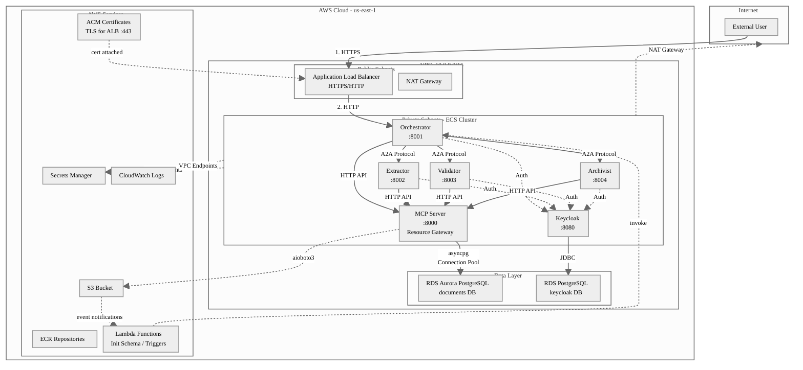
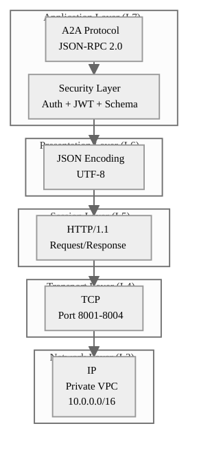
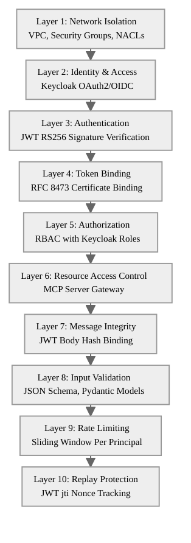
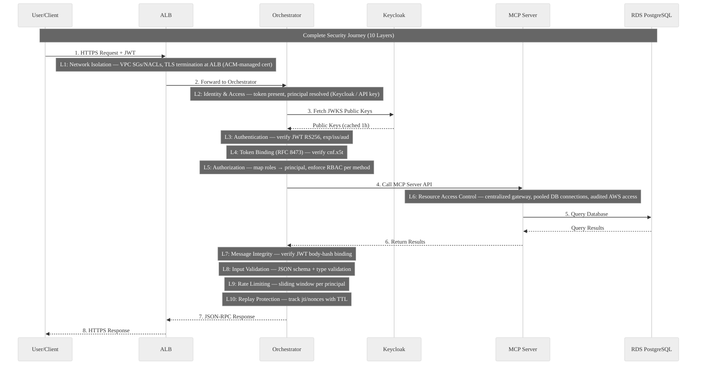
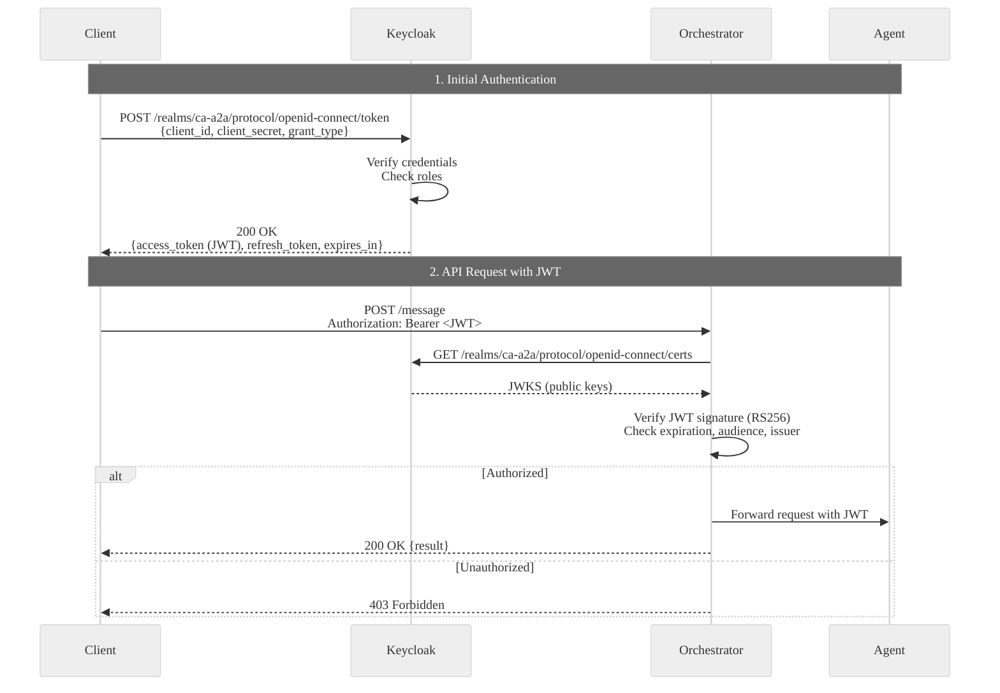
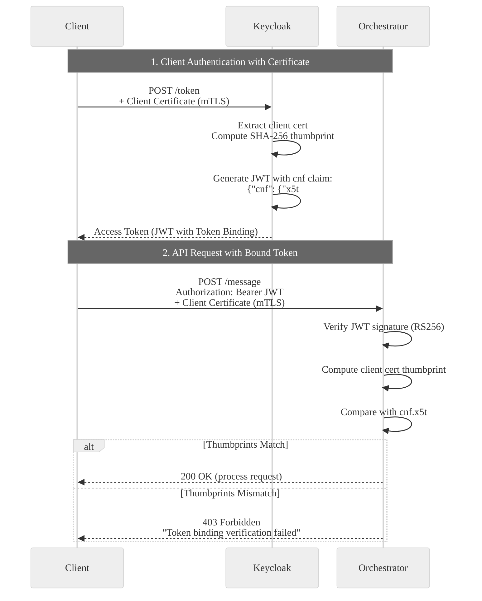
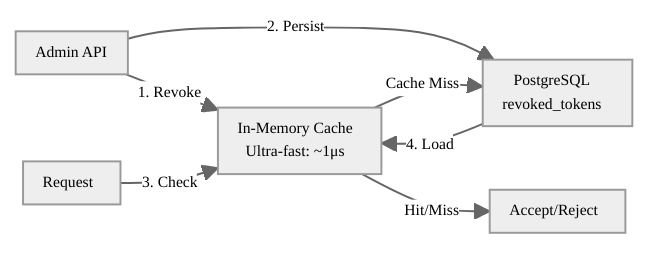
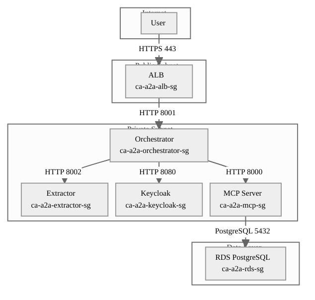
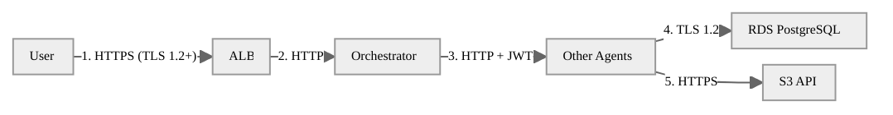
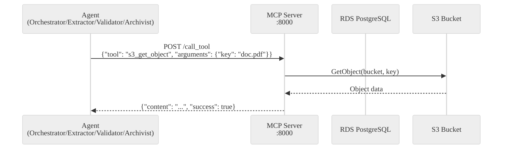

# CA-A2A Complete Security Documentation

**Comprehensive Technical Documentation on Agent-to-Agent Security Architecture**

**Version:** 5.0  
**Last Updated:** January 28, 2026  
**Status:** Production Deployed  
**Region:** us-east-1 (N. Virginia)  
**Environment:** AWS ECS Fargate

---

## Document Structure

This document is organized into logical parts for easy navigation:

| Part | Sections | Purpose |
|------|----------|---------|
| **I. Overview** | 1-2 | System architecture and protocol basics |
| **II. Threat Model** | 3-4 | Threats and defense strategy (read this to understand WHY) |
| **III. Identity & Access** | 5-7 | Authentication, authorization, token management |
| **IV. Infrastructure Security** | 8-9 | Network isolation, data protection |
| **V. Runtime Protection** | 10-11 | Input validation, rate limiting, replay protection |
| **VI. Operations** | 12-13 | Monitoring, incident response, AWS security services |
| **Appendices** | A-D | Reference, checklists, glossary |

---

## Executive Summary

The CA-A2A (Crédit Agricole Agent-to-Agent) system implements enterprise-grade security through a **defense-in-depth architecture with 10 independent security layers**. The system uses **JSON-RPC 2.0** as its communication protocol, deployed on AWS ECS Fargate in a private VPC with **Keycloak OAuth2/OIDC** for centralized authentication, **MCP Server** for resource access control, and role-based access control (RBAC).

**Security Framework:** OWASP Top 10 for Agentic Applications 2026 compliant

**Key Security Features:**

| Category | Features |
|----------|----------|
| **Authentication** | OAuth2/OIDC (Keycloak RS256 JWT), Token Binding (RFC 8473), Mutual TLS |
| **Authorization** | RBAC with Keycloak roles, fine-grained method permissions |
| **Network** | Private VPC, Security Groups, VPC Endpoints, no public IPs |
| **Data** | Encryption at rest (AES-256), TLS 1.2+ in transit, Secrets Manager |
| **Runtime** | Rate limiting (300 req/min), replay protection, JSON Schema validation |
| **Audit** | CloudWatch Logs, CloudTrail, structured security events |

---

# Part I: Overview

## 1. System Architecture

### 1.1 Production Deployment




### 1.2 Component Overview

| Component | Type | Port | Purpose | Instances |
|-----------|------|------|---------|-----------|
| **Orchestrator** | ECS Fargate | 8001 | Request coordination, workflow | 2 |
| **Extractor** | ECS Fargate | 8002 | Document text extraction | 2 |
| **Validator** | ECS Fargate | 8003 | Content validation | 2 |
| **Archivist** | ECS Fargate | 8004 | Document archival, retrieval | 2 |
| **Keycloak** | ECS Fargate | 8080 | Identity Provider (OAuth2/OIDC) | 1 |
| **MCP Server** | ECS Fargate | 8000 | Centralized S3/RDS access gateway | 1 |
| **ALB** | AWS Service | 80/443 | Load balancing, TLS termination | Multi-AZ |
| **RDS Aurora** | Managed DB | 5432 | Document metadata, audit logs | Multi-AZ |
| **RDS Postgres** | Managed DB | 5432 | Keycloak data (users, roles) | Multi-AZ |

### 1.3 Data Flow Summary

1. **External Request** → ALB (TLS termination) → Orchestrator
2. **Authentication** → Keycloak (JWT validation)
3. **Agent Coordination** → Orchestrator → Extractor/Validator/Archivist
4. **AWS Resources** → All agents → MCP Server → S3/RDS

---

## 2. A2A Protocol Overview

### 2.1 What is A2A Protocol?

**A2A (Agent-to-Agent) Protocol** is a standardized communication protocol for autonomous agents to exchange messages and coordinate actions in a distributed system.

**Our Implementation:**
- **Base Protocol:** JSON-RPC 2.0 (RFC 4627)
- **Transport:** HTTPS with Mutual TLS
- **Encoding:** UTF-8 JSON
- **Authentication:** Keycloak OAuth2/OIDC (RS256) + mTLS
- **Token Binding:** RFC 8473 (Certificate-bound tokens)

> **Key Insight:** A2A is "RPC between agents", but the **security model assumes an attacker may compromise an agent** and attempt lateral movement. This is why identity, token binding, RBAC, and centralized AWS access are first-class security layers.

### 2.2 Why JSON-RPC 2.0?

| Feature | Benefit | Security Impact |
|---------|---------|-----------------|
| **Standardized** | Well-defined spec | Reduces implementation errors |
| **Stateless** | No session state | Prevents session fixation |
| **Lightweight** | ~100-200 bytes overhead | Reduces attack surface |
| **Language Agnostic** | JSON is universal | No proprietary vulnerabilities |


### 2.3 Protocol Stack



### 2.4 Message Format

**Request:**
```json
{
  "jsonrpc": "2.0",
  "id": "req-abc123",
  "method": "process_document",
  "params": {
    "s3_key": "uploads/invoice-2026-01-15.pdf",
    "priority": "high"
  }
}
```

**Response:**
```json
{
  "jsonrpc": "2.0",
  "id": "req-abc123",
  "result": {
    "status": "success",
    "document_id": "doc-789"
  }
}
```

---

# Part II: Threat Model & Defense Strategy

## 3. Threat Model

Understanding threats FIRST justifies our security architecture decisions.

### 3.1 STRIDE Analysis

| Threat | Attack Vector | Defense Layer | Mitigation |
|--------|---------------|---------------|------------|
| **Spoofing** | Impersonate agent/user | L2, L3, L4 | Keycloak + JWT RS256 + Token Binding |
| **Tampering** | Modify request/response | L7 | JWT body hash binding |
| **Repudiation** | Deny actions | Audit | Logs with correlation IDs |
| **Information Disclosure** | Intercept traffic | L1 | VPC isolation + TLS |
| **Denial of Service** | Flood requests | L8, L9 | Rate limiting + input validation |
| **Elevation of Privilege** | Bypass RBAC | L5 | Keycloak roles + RBAC enforcement |

### 3.2 Penetration Testing Model

> **Important:** Our threat model assumes a **compromised agent inside the system** (attacker has a valid token and possibly a client certificate), NOT just "attacker outside the VPC".

Tests focus on:
- **RBAC boundaries** - Can a compromised agent escalate privileges?
- **Token binding** - Can a stolen token be used from another machine?
- **Replay protection** - Can captured requests be replayed?
- **Rate limiting** - Can an agent exhaust resources?
- **Input validation** - Can malicious payloads pass through?
- **AWS blast radius** - What can a compromised agent access via MCP?

### 3.3 Attack Scenarios & Defenses

#### Scenario 1: Token Theft

**Attack:** Attacker steals JWT access token.

**Defenses:**
1. **Token Binding (RFC 8473):** Token bound to client certificate - unusable without cert
2. **Short TTL:** Tokens expire in 5 minutes
3. **Token Revocation:** Admin can revoke compromised token
4. **Network Isolation:** Tokens only valid within VPC

#### Scenario 2: Replay Attack

**Attack:** Attacker captures valid request and replays it.

**Defenses:**
1. **JWT jti Tracking:** Each token has unique ID tracked in cache
2. **TTL-based Expiration:** jti cache entries expire after 2 minutes
3. **Timestamp Validation:** JWT iat (issued-at) checked for freshness

#### Scenario 3: SQL Injection

**Attack:** `query: "'; DROP TABLE documents;--"`

**Defenses:**
1. **Parameterized Queries:** asyncpg with prepared statements
2. **Input Validation:** JSON Schema validates all inputs
3. **MCP Server Isolation:** Agents never construct raw SQL

#### Scenario 4: Path Traversal

**Attack:** `s3_key: "../../etc/passwd"`

**Defenses:**
1. **JSON Schema Pattern:** `^[a-zA-Z0-9/_-]` rejects `..`
2. **Negative Lookahead:** `not: {"pattern": "\\.\\."}` explicitly blocks
3. **MCP Server Validation:** Additional server-side validation

### 3.4 Attack Matrix Summary

| Attack Type | Defense Layer | Mitigation |
|-------------|---------------|------------|
| **DDoS** | Rate Limiting | Token bucket (300 req/min) |
| **MITM** | mTLS + JWT | Certificate auth + RS256 |
| **Replay** | Token Binding + jti | Cert-bound + nonce tracking |
| **SQL Injection** | JSON Schema + Parameterized | Pattern + prepared statements |
| **Path Traversal** | JSON Schema | Negative lookahead regex |
| **Privilege Escalation** | Dynamic RBAC | Keycloak role enforcement |
| **Token Theft** | Token Binding | Certificate-bound tokens |

---

## 4. Defense-in-Depth Architecture

### 4.1 10 Security Layers

We implement **defense in depth**: each layer can fail safely without relying on previous layers being perfect.




### 4.2 Layer Responsibilities

| Layer | Purpose | Technology | Threat Mitigated |
|-------|---------|------------|------------------|
| **L1** | Network isolation | VPC, SG, NACL | Network attacks, DDoS |
| **L2** | Centralized identity | Keycloak | Unauthorized access |
| **L3** | Token verification | JWT RS256 | Impersonation, forged tokens |
| **L4** | Certificate-bound tokens | RFC 8473 | Token theft, token export |
| **L5** | Permission enforcement | RBAC | Privilege escalation |
| **L6** | Centralized AWS gateway | MCP Server | Credential sprawl |
| **L7** | Tampering detection | JWT body hash | MITM, message tampering |
| **L8** | Input rejection | JSON Schema | Injection attacks |
| **L9** | Abuse prevention | Sliding window | Resource exhaustion |
| **L10** | Duplicate detection | JWT jti + TTL | Replay attacks |

### 4.3 Complete Request Security Flow



### 4.4 OWASP Agentic AI Compliance

| OWASP ASI | Threat Category | CA-A2A Mitigation | Status |
|-----------|-----------------|-------------------|--------|
| **ASI01** | Agent Goal Hijack | Goal whitelisting, prompt isolation | ⚠️ Planned |
| **ASI02** | Tool Misuse | MCP Server centralized access | ✅ Implemented |
| **ASI03** | Identity Abuse | Keycloak OAuth2, RBAC, Token Binding | ✅ Implemented |
| **ASI04** | Supply Chain | Dependabot, SBOM, image scanning | ✅ Implemented |
| **ASI05** | Code Execution | Input validation, JSON Schema | ✅ Partial |
| **ASI06** | Context Poisoning | Context sanitization | ⚠️ Planned |
| **ASI07** | Insecure Comms | JSON-RPC 2.0, JWT, mTLS | ✅ Implemented |
| **ASI08** | Cascading Failures | Circuit breaker, timeouts | ✅ Partial |
| **ASI09** | Trust Exploitation | HITL for critical actions | ⚠️ Planned |
| **ASI10** | Rogue Agents | Agent registry, monitoring | ⚠️ Planned |

---

# Part III: Identity & Access

## 5. Authentication

### 5.1 Keycloak OAuth2/OIDC Flow



### 5.2 JWT Token Structure

**Access Token (RS256 signed by Keycloak):**

```json
{
  "header": {
    "alg": "RS256",
    "typ": "JWT",
    "kid": "keycloak-key-id"
  },
  "payload": {
    "exp": 1737845500,
    "iat": 1737845200,
    "jti": "abc123-token-id",
    "iss": "http://keycloak.ca-a2a.local:8080/realms/ca-a2a",
    "aud": "ca-a2a-agents",
    "sub": "user-uuid-1234",
    "realm_access": {
      "roles": ["admin", "orchestrator", "document-processor"]
    },
    "cnf": {
      "x5t#S256": "bDlkZGM4YTEyZGM4YTEyZGM4YTEyZGM4YTEyZGM4YTE"
    }
  }
}
```

**Key Claims:**
| Claim | Purpose |
|-------|---------|
| `exp` | Expiration timestamp (5-minute lifespan) |
| `jti` | Unique JWT ID for replay protection |
| `iss` | Issuer URL (Keycloak realm) |
| `aud` | Audience (ca-a2a-agents) |
| `realm_access.roles` | Keycloak roles for RBAC |
| `cnf.x5t#S256` | Certificate thumbprint for Token Binding |

### 5.3 JWT Verification Implementation

```python
class KeycloakJWTValidator:
    def verify_token(self, token: str, client_certificate=None):
        # 1. Get signing key from JWKS endpoint (cached)
        signing_key = self.jwks_client.get_signing_key_from_jwt(token)
        
        # 2. Verify signature and validate standard claims
        claims = jwt.decode(
            token,
            signing_key.key,
            algorithms=["RS256"],  # Only RS256 allowed!
            audience=self.client_id,
            issuer=self.issuer,
            options={"verify_exp": True, "verify_aud": True, "verify_iss": True}
        )
        
        # 3. Verify token binding (RFC 8473)
        if client_certificate:
            self.verify_token_binding(claims, client_certificate)
        
        return claims
```

---

## 6. Authorization (RBAC)

### 6.1 Role-Based Access Control


**Keycloak Realm Roles → A2A RBAC Mapping:**

| Keycloak Role | A2A Principal | Allowed Methods | Use Case |
|---------------|---------------|-----------------|----------|
| `admin` | `admin` | `*` (all methods) | Full system access |
| `lambda` | `lambda` | `upload_document`, `process_document` | External triggers (S3 events) |
| `orchestrator` | `orchestrator` | `extract_document`, `validate_document`, `archive_document` | Agent coordination |
| `document-processor` | `document-processor` | `process_document`, `list_pending_documents`, `check_status` | Document workflows |
| `viewer` | `viewer` | `list_documents`, `get_document`, `check_status` | Read-only access |

### 6.2 RBAC Implementation

```python
class KeycloakRBACMapper:
    def map_roles_to_principal(self, keycloak_roles: List[str]) -> Tuple[str, List[str]]:
        # Priority: admin > lambda > orchestrator > document-processor > viewer
        if "admin" in keycloak_roles:
            return "admin", ["*"]
        elif "lambda" in keycloak_roles:
            return "lambda", ["upload_document", "process_document"]
        elif "orchestrator" in keycloak_roles:
            return "orchestrator", ["extract_document", "validate_document", "archive_document"]
        elif "document-processor" in keycloak_roles:
            return "document-processor", ["process_document", "list_pending_documents", "check_status"]
        elif "viewer" in keycloak_roles:
            return "viewer", ["list_documents", "get_document", "check_status"]
        else:
            return "anonymous", []
```

---

## 7. Token Binding & mTLS

### 7.1 Token Binding (RFC 8473)

Token Binding extends OAuth 2.0 to create **proof-of-possession tokens**. The access token becomes cryptographically bound to the client's TLS certificate, making it unusable without the corresponding private key.




### 7.2 Token Binding Implementation

```python
class TokenBindingValidator:
    def compute_certificate_thumbprint(self, cert_pem: str) -> str:
        """Computes SHA-256 thumbprint of X.509 certificate."""
        cert = x509.load_pem_x509_certificate(cert_pem.encode('utf-8'))
        der_bytes = cert.public_bytes(x509.Encoding.DER)
        thumbprint_bytes = hashlib.sha256(der_bytes).digest()
        return base64.urlsafe_b64encode(thumbprint_bytes).decode('utf-8').rstrip('=')
    
    def verify_token_binding(self, jwt_claims: Dict, client_cert_pem: str) -> bool:
        expected = jwt_claims.get("cnf", {}).get("x5t#S256")
        presented = self.compute_certificate_thumbprint(client_cert_pem)
        # Constant-time comparison (prevents timing attacks)
        return secrets.compare_digest(expected, presented)
```

### 7.3 Token Revocation



**Performance:**
- Revoke operation: ~10ms (DB write + cache store)
- Check (cached): ~1μs
- Check (cache miss): ~10ms (DB query + cache load)

---

# Part IV: Infrastructure Security

## 8. Network Security

### 8.1 VPC Architecture


```
VPC: 10.0.0.0/16 (65,536 IPs)
├── Public Subnets (Internet-facing)
│   ├── 10.0.1.0/24 (AZ-a) - ALB, NAT Gateway
│   └── 10.0.2.0/24 (AZ-b) - ALB (Multi-AZ)
│
└── Private Subnets (Internal only)
    ├── 10.0.10.0/24 (AZ-a) - ECS Tasks
    └── 10.0.20.0/24 (AZ-b) - ECS Tasks, RDS
```

**Security Properties:**
- ✅ Zero public IPs on agents
- ✅ Outbound only via NAT
- ✅ Multi-AZ redundancy
- ✅ Private DNS for service discovery

### 8.2 Security Groups



| Security Group | Inbound Rules | Purpose |
|----------------|---------------|---------|
| **ALB-SG** | 80/443 from 0.0.0.0/0 | Public HTTP/HTTPS |
| **Orchestrator-SG** | 8001 from ALB-SG | ALB → Orchestrator |
| **Extractor-SG** | 8002 from Orch-SG | Orchestrator → Extractor |
| **Keycloak-SG** | 8080 from Agent-SGs | All agents → Keycloak |
| **MCP-SG** | 8000 from Agent-SGs | All agents → MCP |
| **RDS-SG** | 5432 from KC-SG + MCP-SG | Database access |

### 8.3 VPC Endpoints

| Service | Type | Purpose |
|---------|------|---------|
| **ECR (api, dkr)** | Interface | Pull container images |
| **S3** | Gateway | Object storage |
| **CloudWatch Logs** | Interface | Logging |
| **Secrets Manager** | Interface | Secrets retrieval |

**Note:** Interface endpoints have security groups allowing inbound TCP/443 from ECS task security groups. RDS is NOT a VPC endpoint - it's deployed inside the VPC with access controlled by security groups.

---

## 9. Data Security

### 9.1 Encryption at Rest

| Resource | Encryption | Key Management |
|----------|-----------|----------------|
| **RDS Aurora PostgreSQL** | AES-256 | AWS KMS (default key) |
| **RDS PostgreSQL (Keycloak)** | AES-256 | AWS KMS (default key) |
| **S3 Bucket** | SSE-S3 (AES-256) | AWS-managed keys |
| **Secrets Manager** | AES-256 | AWS KMS (dedicated key) |
| **CloudWatch Logs** | AES-256 | AWS-managed keys |

### 9.2 Encryption in Transit



### 9.3 Secrets Management

| Secret | Purpose |
|--------|---------|
| `ca-a2a/db-password` | RDS Aurora master password |
| `ca-a2a/keycloak-admin-password` | Keycloak admin console |
| `ca-a2a/keycloak-db-password` | Keycloak RDS password |
| `ca-a2a/keycloak-client-secret` | OAuth2 client secret |

> **Best Practice:** Agents do NOT store AWS credentials. They use **ECS Task Roles** with least-privilege IAM policies. Secrets are fetched from Secrets Manager at runtime.

### 9.4 S3 Security

- **IAM least privilege**: Task roles with specific bucket/prefix access
- **Block public access**: Enabled at account and bucket level
- **Encryption enforcement**: Deny `PutObject` without SSE
- **CORS**: Disabled unless browser upload required; prefer presigned URLs

### 9.5 MCP Server (Centralized Resource Access)

The MCP Server acts as a **centralized gateway** for all AWS resource access.



**Security Benefits:**
- Only MCP Server has AWS permissions (via ECS Task Role)
- All S3/RDS access logged in one place
- Shared connection pool (10 connections vs 80)
- Circuit breakers and timeouts applied uniformly

---

# Part V: Runtime Protection

## 10. Input Validation

### 10.1 JSON Schema Validation

**Schema for `process_document` method:**

```json
{
  "type": "object",
  "properties": {
    "s3_key": {
      "type": "string",
      "pattern": "^[a-zA-Z0-9/_-][a-zA-Z0-9/_.-]*$",
      "not": {"pattern": "\\.\\."},
      "minLength": 1,
      "maxLength": 1024
    },
    "priority": {
      "type": "string",
      "enum": ["low", "normal", "high"]
    }
  },
  "required": ["s3_key"],
  "additionalProperties": false
}
```

**Security Features:**
- ✅ Path traversal protection (`..` blocked)
- ✅ Length limits (prevents buffer overflow)
- ✅ No additional properties (prevents mass assignment)
- ✅ Type safety (strict string checking)

### 10.2 Attack Prevention Examples

| Attack | Payload | Defense |
|--------|---------|---------|
| **Path Traversal** | `../../../etc/passwd` | Pattern rejects `..` |
| **SQL Injection** | `'; DROP TABLE--` | Pattern allows only `[a-zA-Z0-9/_.-]` |
| **Buffer Overflow** | `"A" * 100000` | `maxLength: 1024` |

### 10.3 Error Codes

| Code | Meaning | Trigger |
|------|---------|---------|
| `-32700` | Parse error | Invalid JSON |
| `-32600` | Invalid Request | Missing `jsonrpc` or `method` |
| `-32602` | Invalid params | Schema validation failed |
| `-32010` | Unauthorized | Missing or invalid JWT |
| `-32011` | Forbidden | Insufficient permissions |
| `-32012` | Rate limit exceeded | Too many requests |
| `-32013` | Replay detected | Duplicate jti |

---

## 11. Rate Limiting & Replay Protection

### 11.1 Rate Limiting

**Algorithm:** Sliding Window per Principal (300 requests/minute)

```python
class SlidingWindowRateLimiter:
    def __init__(self, limit: int = 300, window_seconds: int = 60):
        self.limit = limit
        self.window_seconds = window_seconds
        self._events: Dict[str, List[int]] = {}
    
    def allow(self, key: str) -> Tuple[bool, Dict]:
        now = int(time.time())
        window_start = now - self.window_seconds
        events = [t for t in self._events.get(key, []) if t >= window_start]
        
        if len(events) < self.limit:
            events.append(now)
            self._events[key] = events
            return True, {"remaining": self.limit - len(events)}
        
        return False, {"retry_after": events[0] + self.window_seconds - now}
```

### 11.2 Replay Protection

**Mechanism:** Track JWT `jti` claim in TTL-based cache (120 seconds)

```python
class ReplayProtector:
    def check_and_store(self, nonce: str, exp: int) -> bool:
        if nonce in self._seen and self._seen[nonce] >= time.time():
            return False  # Replay detected!
        self._seen[nonce] = min(exp, time.time() + 120)
        return True
```

---

# Part VI: Operations

## 12. Monitoring & Audit

### 12.1 CloudWatch Logs

| Log Group | Purpose | Retention |
|-----------|---------|-----------|
| `/ecs/ca-a2a-orchestrator` | Orchestrator logs | 7 days |
| `/ecs/ca-a2a-extractor` | Extractor logs | 7 days |
| `/ecs/ca-a2a-validator` | Validator logs | 7 days |
| `/ecs/ca-a2a-archivist` | Archivist logs | 7 days |
| `/ecs/ca-a2a-keycloak` | Keycloak logs | 7 days |
| `/ecs/ca-a2a-mcp-server` | MCP Server logs | 7 days |

### 12.2 Security Events

| Event Type | Trigger | Log Level |
|------------|---------|-----------|
| `authentication_success` | Valid JWT | INFO |
| `authentication_failure` | Invalid JWT | WARN |
| `authorization_failure` | Insufficient permissions | WARN |
| `rate_limit_exceeded` | Too many requests | WARN |
| `replay_detected` | Duplicate jti | WARN |
| `invalid_input` | Schema validation failed | WARN |

### 12.3 Structured Log Format

```json
{
  "timestamp": "2026-01-15T10:30:00Z",
  "level": "INFO",
  "agent": "orchestrator",
  "event_type": "request",
  "correlation_id": "2026-01-15T10:30:00Z-a1b2c3d4",
  "method": "process_document",
  "principal": "document-processor",
  "duration_ms": 250,
  "success": true
}
```

### 12.4 Additional AWS Logging

- **CloudTrail**: Control-plane events (IAM, ECS, Secrets Manager)
- **ALB Access Logs**: Request-level logs (status, latency, path)
- **VPC Flow Logs**: Network flows for detecting anomalies

---

## 13. Security Operations

### 13.1 Token Compromise Procedure

```bash
# 1. Identify compromised token's jti
jti="abc123-compromised-token"

# 2. Revoke token via Admin API
curl -X POST http://admin-api:9000/admin/revoke-token \
  -H "Authorization: Bearer $ADMIN_JWT" \
  -d '{"jti": "'$jti'", "reason": "Security incident", "revoked_by": "security-team"}'

# 3. Investigate in CloudWatch Logs
aws logs filter-log-events \
  --log-group-name /ecs/ca-a2a-orchestrator \
  --filter-pattern "$jti" \
  --start-time $(date -d '24 hours ago' +%s)000
```

### 13.2 Weekly Security Audit Checklist

- [ ] Review CloudWatch Logs for authentication failures
- [ ] Check revoked tokens list for anomalies
- [ ] Verify no tokens with excessive TTL
- [ ] Review rate limit violations by principal
- [ ] Check for unusual traffic patterns
- [ ] Verify all secrets rotated within policy (90 days)
- [ ] Review IAM role permissions (least privilege)
- [ ] Review ECR image scan findings

### 13.3 AWS Security Services

| Service | Purpose |
|---------|---------|
| **AWS GuardDuty** | Threat detection (suspicious API calls, credential misuse) |
| **Amazon Inspector** | Vulnerability scanning for ECR images |
| **AWS Shield** | DDoS protection for ALB |
| **AWS WAF** | Web application firewall rules |

### 13.4 Container Image Scanning

- Enable **ECR enhanced scanning** (scan on push)
- CI pipeline: Pre-push scan with Trivy/Grype
- Fail builds on critical/high CVEs

---

# Appendices

## Appendix A: Security Checklist

### Pre-Production Deployment

- [ ] **Network Security**
  - [ ] VPC with private subnets configured
  - [ ] Security groups follow least-privilege
  - [ ] NAT Gateway for outbound access only
  - [ ] VPC endpoints for AWS services
  - [ ] No public IPs on agent tasks

- [ ] **Authentication & Authorization**
  - [ ] Keycloak deployed and configured
  - [ ] Realms and clients created
  - [ ] Roles defined and mapped to RBAC
  - [ ] Client secrets stored in Secrets Manager
  - [ ] JWT signature verification enabled

- [ ] **Data Security**
  - [ ] RDS encryption at rest enabled
  - [ ] S3 bucket encryption enabled
  - [ ] Secrets Manager for all credentials
  - [ ] TLS for RDS connections configured

- [ ] **Application Security**
  - [ ] Rate limiting enabled (300/min)
  - [ ] Replay protection enabled (120s TTL)
  - [ ] Input validation with JSON Schema
  - [ ] Audit logging to CloudWatch

---

## Appendix B: Implementation Reference

### Key Files

| File | Purpose |
|------|---------|
| `a2a_security.py` | Core security manager, JWT, RBAC, rate limiting |
| `keycloak_auth.py` | Keycloak JWT validation, RBAC mapper |
| `token_binding.py` | RFC 8473 Token Binding implementation |
| `base_agent.py` | Agent base class with security integration |
| `mcp_server.py` | Centralized resource access gateway |

### Environment Variables

```bash
# Authentication
A2A_REQUIRE_AUTH=true
A2A_USE_KEYCLOAK=true
KEYCLOAK_URL=http://keycloak.ca-a2a.local:8080
KEYCLOAK_REALM=ca-a2a
KEYCLOAK_CLIENT_ID=ca-a2a-agents

# Token Binding
TOKEN_BINDING_ENABLED=true
MTLS_ENABLED=true

# RBAC
A2A_RBAC_POLICY_JSON='{"allow":{"admin":["*"],"lambda":["upload_document"]}}'

# Rate Limiting
A2A_ENABLE_RATE_LIMIT=true
A2A_RATE_LIMIT_PER_MINUTE=300

# Replay Protection
A2A_ENABLE_REPLAY_PROTECTION=true
A2A_REPLAY_TTL_SECONDS=120
```

---

## Appendix C: Glossary

| Term | Definition |
|------|------------|
| **A2A** | Agent-to-Agent: Communication protocol for autonomous agents |
| **ALB** | Application Load Balancer: AWS load balancing service |
| **ECS** | Elastic Container Service: AWS container orchestration |
| **JWT** | JSON Web Token: Compact, URL-safe token format |
| **jti** | JWT ID: Unique identifier claim for replay protection |
| **MCP** | Model Context Protocol: Centralized resource access gateway |
| **mTLS** | Mutual TLS: Bidirectional certificate authentication |
| **RBAC** | Role-Based Access Control |
| **RFC 8473** | OAuth 2.0 Token Binding specification |
| **RS256** | RSA Signature with SHA-256: JWT signing algorithm |

---

## Appendix D: Security Metrics Summary

| Metric | Value |
|--------|-------|
| **Security Layers** | 10 (network → replay protection) |
| **Authentication** | Keycloak JWT (RS256) + mTLS + Token Binding |
| **Authorization** | Dynamic RBAC (Keycloak roles) |
| **Input Validation** | JSON Schema v7 + Pydantic |
| **Rate Limiting** | 300 req/min per principal |
| **Replay Window** | 2 minutes |
| **Token Lifespan** | 5 minutes (access) + 30 days (refresh) |
| **Compliance** | OWASP ASI + NIST 800-63B AAL3 |

---

**Document Version:** 5.0  
**Last Updated:** January 28, 2026  
**Authors:** Security Team  
**Status:** Production Ready

---

**End of Document**
