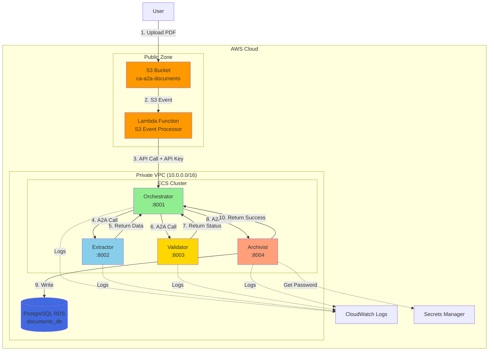
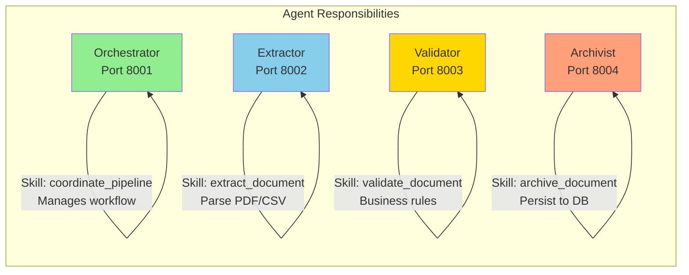
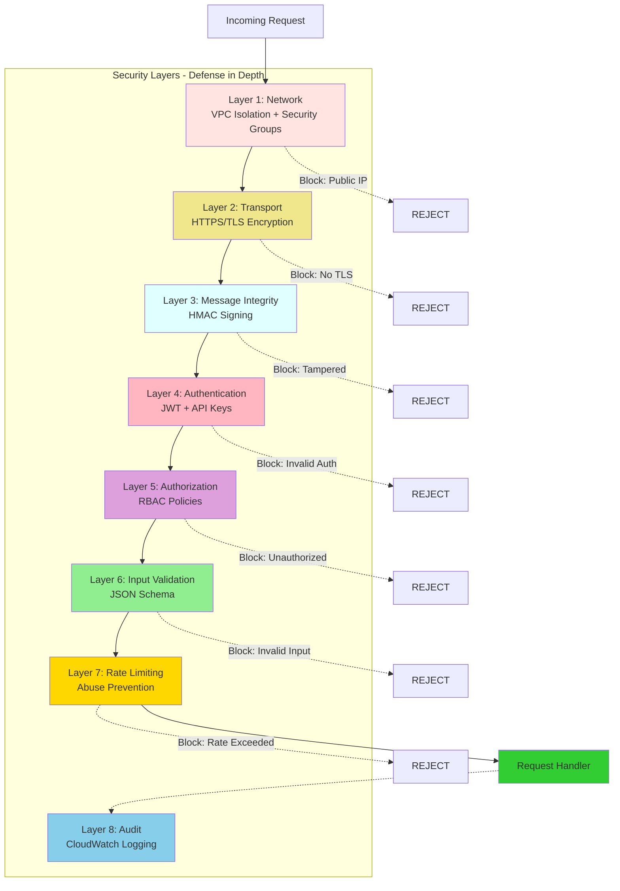
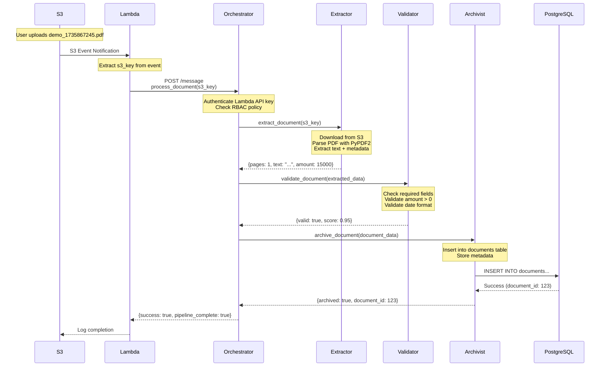
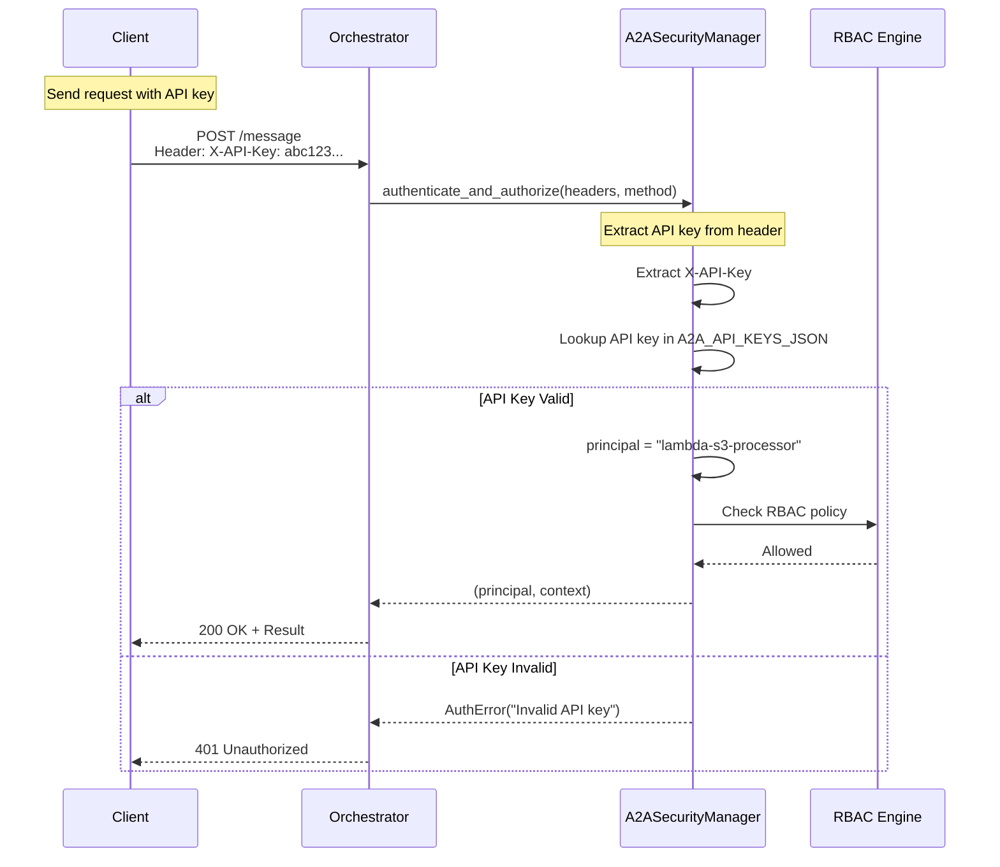
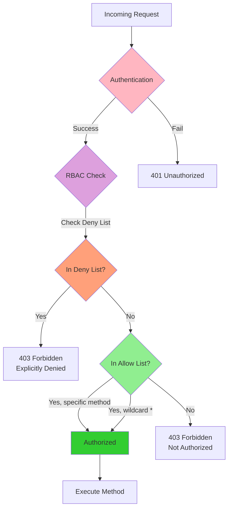
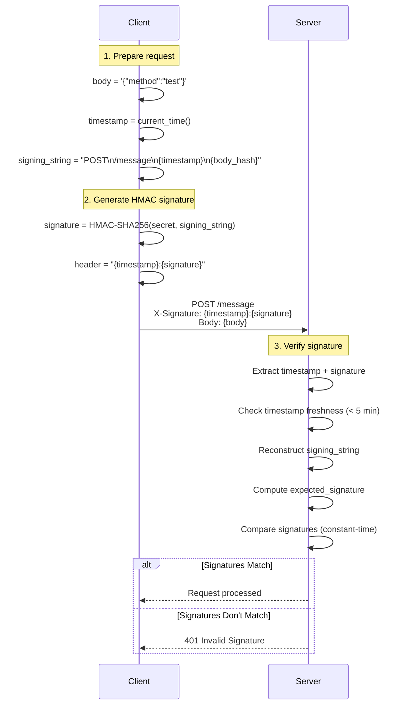
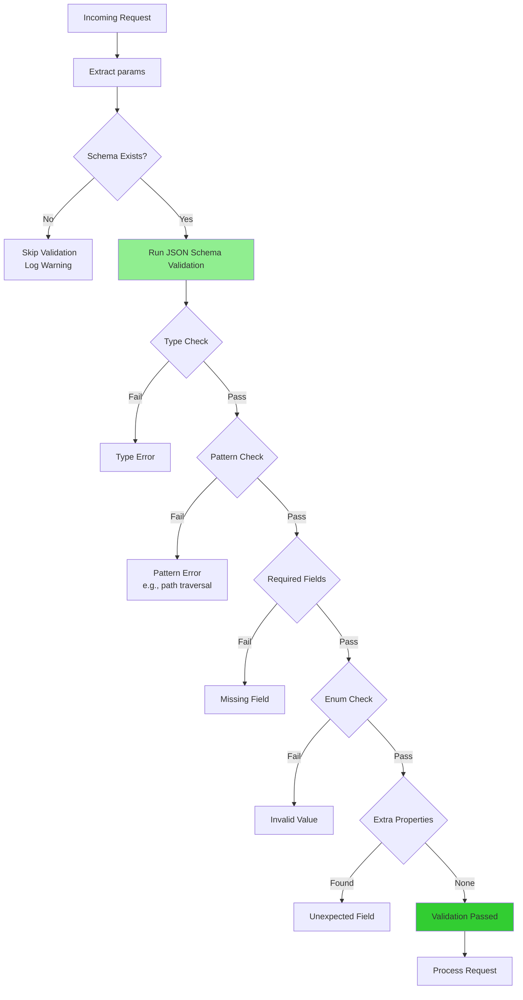

# Complete 2-Hour Demo: Secure Multi-Agent Document Processing

**Comprehensive Demo Scenario Showcasing Agent-to-Agent Security & Architecture**

---

## Table of Contents

1. [Demo Overview](#demo-overview)
2. [Demo Timeline (2 Hours)](#demo-timeline-2-hours)
3. [Part 1: System Architecture (20 min)](#part-1-system-architecture-20-min)
4. [Part 2: Agent Functionality Demo (30 min)](#part-2-agent-functionality-demo-30-min)
5. [Part 3: Security Features Demo (40 min)](#part-3-security-features-demo-40-min)
6. [Part 4: Testing Framework (20 min)](#part-4-testing-framework-20-min)
7. [Part 5: Q&A and Deep Dives (10 min)](#part-5-qa-and-deep-dives-10-min)

---

## Demo Overview

### **What We're Demonstrating**

A production-ready, secure multi-agent system for automated document processing, implementing principles from the research paper **"Securing Agent-to-Agent (A2A) Communications Across Domains"**.

### **Key Features**

**Agent Functionality:**
- 4 specialized agents (Orchestrator, Extractor, Validator, Archivist)
- Event-driven processing (S3 → Lambda → Agents)
- PostgreSQL data persistence
- JSON-RPC 2.0 protocol for A2A communication

**Security Features:**
- JWT & API Key authentication
- ️ RBAC (Role-Based Access Control)
- ️ HMAC request signing (message integrity)
- JSON Schema validation (input validation)
- Token revocation mechanism
- mTLS support (optional)
- ⏱️ Rate limiting & replay protection

**Infrastructure:**
- ️ AWS ECS (Fargate) deployment
- VPC isolation with private subnets
- CloudWatch logging & monitoring
- AWS Secrets Manager for credentials

---

## Part 1: System Architecture (20 min)

### **1.1 High-Level Architecture (5 min)**



**Architecture Explanation:**

1. **Event-Driven Trigger:** User uploads document → S3 event notification → Lambda
2. **Private Network:** All agents run in private VPC subnets (no internet access)
3. **Security Layers:** API authentication, VPC isolation, encrypted database
4. **Observability:** CloudWatch logs for all components
5. **Secrets Management:** Credentials stored in AWS Secrets Manager

---

### **1.2 Agent Roles & Responsibilities (5 min)**



**Orchestrator (Port 8001):**
- **Role:** Workflow coordinator
- **Skills:** `process_document`, `coordinate_pipeline`
- **Logic:** Sequences calls to extractor → validator → archivist
- **Code Location:** `orchestrator_agent.py`

**Extractor (Port 8002):**
- **Role:** Document parser
- **Skills:** `extract_document`
- **Logic:** PyPDF2 + pdfplumber for PDFs, pandas for CSV
- **Code Location:** `extractor_agent.py`

**Validator (Port 8003):**
- **Role:** Business logic validator
- **Skills:** `validate_document`
- **Logic:** Checks for required fields, valid amounts, dates
- **Code Location:** `validator_agent.py`

**Archivist (Port 8004):**
- **Role:** Data persistence
- **Skills:** `archive_document`
- **Logic:** Writes to PostgreSQL using asyncpg
- **Code Location:** `archivist_agent.py`

---

### **1.3 Security Architecture (10 min)**



**Why 8 Layers?**

1. **Layer 1 (Network):** Prevents unauthorized network access
2. **Layer 2 (Transport):** Prevents eavesdropping
3. **Layer 3 (Integrity):** Prevents message tampering
4. **Layer 4 (Authentication):** Verifies identity
5. **Layer 5 (Authorization):** Enforces permissions
6. **Layer 6 (Validation):** Prevents injection attacks
7. **Layer 7 (Rate Limiting):** Prevents abuse
8. **Layer 8 (Audit):** Enables forensics

**Architecture Decision:** Defense in depth means if one layer fails, others protect the system.

---

## Part 2: Agent Functionality Demo (30 min)

### **2.1 Live Demo: Upload Invoice (10 min)**

**Demo Scenario:** Upload a real invoice PDF and watch it flow through the pipeline

**Step 1: Create Test Invoice**

```bash
# In CloudShell
cat > demo_invoice_acme.pdf << 'EOF'
%PDF-1.4
1 0 obj<</Type/Catalog/Pages 2 0 R>>endobj
2 0 obj<</Type/Pages/Count 1/Kids[3 0 R]>>endobj
3 0 obj<</Type/Page/Parent 2 0 R/MediaBox[0 0 612 792]/Contents 4 0 R/Resources<</Font<</F1 5 0 R>>>>>>endobj
4 0 obj<</Length 350>>stream
BT
/F1 18 Tf
50 750 Td
(ACME Corporation Invoice) Tj
/F1 12 Tf
50 720 Td
(Invoice Number: INV-2026-001) Tj
50 700 Td
(Date: January 3, 2026) Tj
50 680 Td
(Customer: Wayne Enterprises) Tj
50 650 Td
(Description: Enterprise Software License) Tj
50 630 Td
(Amount: $12,500.00 USD) Tj
50 610 Td
(Tax (20%): $2,500.00 USD) Tj
50 580 Td
(Total Due: $15,000.00 USD) Tj
50 550 Td
(Payment Terms: Net 30) Tj
ET
endstream endobj
5 0 obj<</Type/Font/Subtype/Type1/BaseFont/Helvetica>>endobj
xref
0 6
trailer<</Size 6/Root 1 0 R>>
%%EOF
EOF
```

**Step 2: Upload to S3**

```bash
TIMESTAMP=$(date +%s)
aws s3 cp demo_invoice_acme.pdf \
 s3://ca-a2a-documents-555043101106/invoices/2026/01/demo_${TIMESTAMP}.pdf \
 --region eu-west-3

echo "Uploaded: invoices/2026/01/demo_${TIMESTAMP}.pdf"
```

**Step 3: Watch the Pipeline Execute**



**Step 4: Check Logs**

```bash
# Lambda logs
echo "=== LAMBDA LOGS ==="
aws logs tail /aws/lambda/ca-a2a-s3-processor --since 2m --region eu-west-3 | grep "SUCCESS\|ERROR"

# Orchestrator logs
echo "=== ORCHESTRATOR LOGS ==="
aws logs tail /ecs/ca-a2a-orchestrator --since 2m --region eu-west-3 | grep -v "GET /health" | tail -20

# Extractor logs
echo "=== EXTRACTOR LOGS ==="
aws logs tail /ecs/ca-a2a-extractor --since 2m --region eu-west-3 | grep "extract_document\|Extracted\|pages" | tail -10
```

**Expected Output:**
```
=== LAMBDA LOGS ===
2026-01-03T12:34:56.789Z [INFO] Processing: s3://ca-a2a-documents/invoices/2026/01/demo_1735867245.pdf
2026-01-03T12:35:02.123Z [INFO] Success: {'result': 'archived', 'document_id': 123}

=== ORCHESTRATOR LOGS ===
2026-01-03T12:34:57.234Z [INFO] Received process_document request for invoices/2026/01/demo_1735867245.pdf
2026-01-03T12:34:57.456Z [INFO] Authentication successful: lambda-s3-processor
2026-01-03T12:34:57.567Z [INFO] RBAC check passed: lambda-s3-processor can call process_document
2026-01-03T12:34:58.789Z [INFO] Calling extractor.extract_document
2026-01-03T12:35:00.123Z [INFO] Extraction successful: 1 pages, 250 chars
2026-01-03T12:35:00.234Z [INFO] Calling validator.validate_document
2026-01-03T12:35:01.345Z [INFO] Validation passed: score 0.95
2026-01-03T12:35:01.456Z [INFO] Calling archivist.archive_document
2026-01-03T12:35:02.567Z [INFO] Pipeline completed successfully

=== EXTRACTOR LOGS ===
2026-01-03T12:34:58.890Z [INFO] Received extract_document request
2026-01-03T12:34:59.001Z [INFO] Downloaded PDF from S3: 2.3 KB
2026-01-03T12:34:59.234Z [INFO] Extracted metadata: title='ACME Corporation Invoice'
2026-01-03T12:34:59.456Z [INFO] Extracted 1 pages, 250 characters total
2026-01-03T12:34:59.678Z [INFO] Parsed amount: 15000.00 USD
```

---

### **2.2 Code Deep Dive: Orchestrator Pipeline (10 min)**

**Core Pipeline Logic** (`orchestrator_agent.py:560-659`):

```python
async def _process_document_pipeline(self, s3_key: str, priority: str = "normal") -> Dict[str, Any]:
 """
 Coordinate multi-agent document processing pipeline
 
 Architecture Decision: Sequential processing with error handling at each stage
 Reasoning: Allows early failure detection and rollback if needed
 """
 correlation_id = f"pipe-{int(time.time())}-{os.urandom(4).hex()}"
 
 self.logger.info(f"[{correlation_id}] Starting pipeline for {s3_key}")
 
 pipeline_result = {
 "correlation_id": correlation_id,
 "s3_key": s3_key,
 "stages": {},
 "status": "processing"
 }
 
 try:
 # ═══════════════════════════════════════════════════════════
 # STAGE 1: EXTRACTION
 # ═══════════════════════════════════════════════════════════
 self.logger.info(f"[{correlation_id}] Stage 1: Calling extractor")
 
 extraction_result = await self.call_agent_method(
 agent_id="extractor",
 method="extract_document",
 params={
 "s3_key": s3_key,
 "correlation_id": correlation_id
 }
 )
 
 if extraction_result.get("error"):
 raise Exception(f"Extraction failed: {extraction_result['error']}")
 
 extracted_data = extraction_result.get("result", {})
 pipeline_result["stages"]["extraction"] = {
 "status": "completed",
 "pages": extracted_data.get("total_pages"),
 "text_length": len(extracted_data.get("text_content", "")),
 "timestamp": time.time()
 }
 
 self.logger.info(f"[{correlation_id}] Extraction completed: {extracted_data.get('total_pages')} pages")
 
 # ═══════════════════════════════════════════════════════════
 # STAGE 2: VALIDATION
 # ═══════════════════════════════════════════════════════════
 self.logger.info(f"[{correlation_id}] Stage 2: Calling validator")
 
 validation_result = await self.call_agent_method(
 agent_id="validator",
 method="validate_document",
 params={
 "document_data": extracted_data,
 "correlation_id": correlation_id
 }
 )
 
 if validation_result.get("error"):
 raise Exception(f"Validation failed: {validation_result['error']}")
 
 validation_data = validation_result.get("result", {})
 pipeline_result["stages"]["validation"] = {
 "status": "completed",
 "valid": validation_data.get("valid"),
 "score": validation_data.get("score"),
 "timestamp": time.time()
 }
 
 self.logger.info(f"[{correlation_id}] Validation completed: score={validation_data.get('score')}")
 
 # ═══════════════════════════════════════════════════════════
 # STAGE 3: ARCHIVING
 # ═══════════════════════════════════════════════════════════
 self.logger.info(f"[{correlation_id}] Stage 3: Calling archivist")
 
 document_to_archive = {
 **extracted_data,
 "validation": validation_data,
 "s3_key": s3_key,
 "correlation_id": correlation_id
 }
 
 archiving_result = await self.call_agent_method(
 agent_id="archivist",
 method="archive_document",
 params={
 "document": document_to_archive,
 "correlation_id": correlation_id
 }
 )
 
 if archiving_result.get("error"):
 raise Exception(f"Archiving failed: {archiving_result['error']}")
 
 archive_data = archiving_result.get("result", {})
 pipeline_result["stages"]["archiving"] = {
 "status": "completed",
 "document_id": archive_data.get("document_id"),
 "timestamp": time.time()
 }
 
 self.logger.info(f"[{correlation_id}] Archiving completed: document_id={archive_data.get('document_id')}")
 
 # ═══════════════════════════════════════════════════════════
 # PIPELINE SUCCESS
 # ═══════════════════════════════════════════════════════════
 pipeline_result["status"] = "completed"
 pipeline_result["document_id"] = archive_data.get("document_id")
 
 self.logger.info(f"[{correlation_id}] Pipeline completed successfully")
 
 return pipeline_result
 
 except Exception as e:
 self.logger.error(f"[{correlation_id}] Pipeline failed: {str(e)}", exc_info=True)
 pipeline_result["status"] = "failed"
 pipeline_result["error"] = str(e)
 return pipeline_result
```

**Architecture Decisions Explained:**

1. **Sequential Processing:**
 - **Why?** Each stage depends on previous stage output
 - **Trade-off:** Lower throughput vs. simpler error handling
 - **Alternative:** Parallel processing with complex state management

2. **Correlation IDs:**
 - **Why?** Track requests across distributed system
 - **Format:** `pipe-{timestamp}-{random}` for uniqueness
 - **Usage:** Logs, debugging, distributed tracing

3. **Error Handling:**
 - **Why?** Fail fast with detailed error context
 - **Pattern:** Try-catch at pipeline level + per-stage validation
 - **Benefit:** Easy rollback and retry logic

4. **Result Structure:**
 - **Why?** Standardized response format for monitoring
 - **Fields:** `correlation_id`, `stages`, `status`, `error`
 - **Benefit:** Consistent logging and metrics

---

### **2.3 Code Deep Dive: Extractor PDF Parsing (10 min)**

**PDF Extraction Logic** (`extractor_agent.py:230-340`):

```python
async def _extract_pdf(self, pdf_data: bytes) -> Dict[str, Any]:
 """
 Extract text, metadata, and structure from PDF
 
 Architecture Decision: Two-phase extraction with fallback
 Reasoning: PyPDF2 for metadata + structure, pdfplumber for robust text extraction
 """
 extracted = {
 "format": "pdf",
 "text_content": "",
 "pages": [],
 "metadata": {},
 "total_pages": 0,
 "tables": []
 }
 
 pdf_file = io.BytesIO(pdf_data)
 
 try:
 # ═══════════════════════════════════════════════════════════
 # PHASE 1: PyPDF2 for Metadata and Structure
 # ═══════════════════════════════════════════════════════════
 pdf_reader = PyPDF2.PdfReader(pdf_file, strict=False)
 
 # Extract page count
 try:
 extracted['total_pages'] = len(pdf_reader.pages)
 except Exception as e:
 self.logger.warning(f"Could not get page count: {str(e)}")
 extracted['total_pages'] = 0
 
 # Extract metadata (PDF Info Dictionary)
 try:
 if pdf_reader.metadata:
 extracted['metadata'] = {
 'title': str(pdf_reader.metadata.get('/Title', '')),
 'author': str(pdf_reader.metadata.get('/Author', '')),
 'subject': str(pdf_reader.metadata.get('/Subject', '')),
 'creator': str(pdf_reader.metadata.get('/Creator', '')),
 'producer': str(pdf_reader.metadata.get('/Producer', '')),
 'creation_date': str(pdf_reader.metadata.get('/CreationDate', ''))
 }
 except Exception as e:
 self.logger.warning(f"Could not extract PDF metadata: {str(e)}")
 extracted['metadata'] = {'extraction_note': 'Metadata extraction failed'}
 
 # Extract text from each page
 for page_num, page in enumerate(pdf_reader.pages):
 try:
 text = page.extract_text() or ""
 extracted['pages'].append({
 'page_number': page_num + 1,
 'text': text,
 'char_count': len(text)
 })
 extracted['text_content'] += text + '\n'
 except Exception as e:
 self.logger.warning(f"Could not extract text from page {page_num + 1}: {str(e)}")
 extracted['pages'].append({
 'page_number': page_num + 1,
 'text': '',
 'char_count': 0,
 'extraction_error': str(e)
 })
 
 except Exception as pypdf_error:
 # ═══════════════════════════════════════════════════════════
 # FALLBACK: pdfplumber Only
 # ═══════════════════════════════════════════════════════════
 self.logger.warning(f"PyPDF2 failed, using pdfplumber only: {str(pypdf_error)}")
 return await self._extract_pdf_fallback(pdf_data)
 
 # ═══════════════════════════════════════════════════════════
 # PHASE 2: pdfplumber for Table Extraction
 # ═══════════════════════════════════════════════════════════
 pdf_file.seek(0) # Reset file pointer
 
 try:
 with pdfplumber.open(pdf_file) as pdf:
 for page_num, page in enumerate(pdf.pages):
 # Extract tables from this page
 tables = page.extract_tables()
 if tables:
 for table_idx, table in enumerate(tables):
 extracted['tables'].append({
 'page': page_num + 1,
 'table_number': table_idx + 1,
 'rows': len(table),
 'cols': len(table[0]) if table else 0,
 'data': table
 })
 except Exception as e:
 self.logger.warning(f"Table extraction failed: {str(e)}")
 
 return extracted
```

**Architecture Decisions Explained:**

1. **Two-Phase Extraction:**
 - **Phase 1 (PyPDF2):** Fast metadata + structure extraction
 - **Phase 2 (pdfplumber):** Robust text + table extraction
 - **Why?** PyPDF2 is fast but fragile; pdfplumber is slow but robust
 - **Trade-off:** Higher CPU usage for better accuracy

2. **Fallback Mechanism:**
 - **Trigger:** PyPDF2 raises exception (corrupted PDF, encrypted, etc.)
 - **Action:** Fall back to pdfplumber-only extraction
 - **Benefit:** Handles edge cases gracefully

3. **Error Handling:**
 - **Per-page errors:** Log warning but continue processing
 - **Critical errors:** Trigger fallback mechanism
 - **Result:** Always return something, even if partial

4. **Table Extraction:**
 - **Why?** Invoices often have itemized line items in tables
 - **Method:** pdfplumber's built-in table detection
 - **Limitation:** Only works for simple tables with clear borders

---

## Part 3: Security Features Demo (40 min)

### **3.1 Authentication Demo (10 min)**

**Scenario: Show API Key Authentication**



**Code: API Key Authentication** (`a2a_security.py:287-294`):

```python
async def _verify_api_key(self, headers: Dict[str, str]) -> Tuple[str, Dict[str, Any]]:
 """
 Verify API key from headers
 
 Architecture Decision: Static API keys mapped to principals
 Reasoning: Simple, stateless, works well for service-to-service auth
 Alternative: Dynamic API keys in database (more complex, requires DB query)
 """
 # Extract API key from header (case-insensitive)
 api_key = None
 for key, value in headers.items():
 if key.lower() == self.api_key_header.lower():
 api_key = value
 break
 
 if not api_key:
 raise AuthError(f"Missing {self.api_key_header} header")
 
 # Lookup API key in configured keys
 # Format: {"principal_id": "api_key_value"}
 # Example: {"lambda-s3-processor": "abc123xyz", "orchestrator": "def456uvw"}
 if api_key not in self.api_keys.values():
 self.logger.warning(f"Invalid API key presented (length: {len(api_key)})")
 raise AuthError("Invalid API key")
 
 # Find principal for this API key (reverse lookup)
 principal = None
 for principal_id, key_value in self.api_keys.items():
 if secrets.compare_digest(api_key, key_value):
 principal = principal_id
 break
 
 if not principal:
 raise AuthError("Invalid API key")
 
 self.logger.info(f"API key authentication successful for principal: {principal}")
 
 return principal, {
 "auth_mode": "api_key",
 "authenticated_at": time.time()
 }
```

**Demo: Test Valid vs Invalid API Keys**

```bash
# Get orchestrator IP
ORCH_IP=$(aws ecs describe-tasks \
 --cluster ca-a2a-cluster \
 --tasks $(aws ecs list-tasks --cluster ca-a2a-cluster --service-name orchestrator --query 'taskArns[0]' --output text) \
 --query 'tasks[0].containers[0].networkInterfaces[0].privateIpv4Address' \
 --output text)

# Get valid API key
API_KEY=$(aws ecs describe-task-definition \
 --task-definition ca-a2a-orchestrator \
 --query 'taskDefinition.containerDefinitions[0].environment[?name==`A2A_API_KEYS_JSON`].value' \
 --output text | jq -r '.["lambda-s3-processor"]')

# Test 1: Valid API key
echo "=== TEST 1: Valid API Key ==="
curl -X POST http://${ORCH_IP}:8001/message \
 -H "Content-Type: application/json" \
 -H "X-API-Key: $API_KEY" \
 -d '{"jsonrpc":"2.0","method":"list_skills","params":{},"id":"test-1"}'

# Expected: 200 OK with skills list

# Test 2: Invalid API key
echo "=== TEST 2: Invalid API Key ==="
curl -X POST http://${ORCH_IP}:8001/message \
 -H "Content-Type: application/json" \
 -H "X-API-Key: INVALID_KEY_12345" \
 -d '{"jsonrpc":"2.0","method":"list_skills","params":{},"id":"test-2"}'

# Expected: 401 Unauthorized
```

**Expected Output:**
```
=== TEST 1: Valid API Key ===
{
 "jsonrpc": "2.0",
 "result": {
 "skills": ["process_document", "coordinate_pipeline", "list_skills"],
 "agent_id": "orchestrator",
 "version": "1.0.0"
 },
 "id": "test-1"
}

=== TEST 2: Invalid API Key ===
{
 "jsonrpc": "2.0",
 "error": {
 "code": -32001,
 "message": "Authentication failed: Invalid API key"
 },
 "id": "test-2"
}
```

---

### **3.2 RBAC Authorization Demo (10 min)**

**RBAC Policy Structure:**

```python
RBAC_POLICY = {
 "allow": {
 "lambda-s3-processor": ["*"], # Lambda can call all methods
 "orchestrator": [
 "extract_document", # Can call extractor
 "validate_document", # Can call validator
 "archive_document" # Can call archivist
 ],
 "admin": ["*"] # Admin has full access
 },
 "deny": {
 "guest": ["archive_document"] # Guest explicitly denied archiving
 }
}
```

**RBAC Flow:**



**Code: RBAC Authorization** (`a2a_security.py:358-386`):

```python
def _is_allowed(self, principal: str, method: str) -> bool:
 """
 Check if principal is allowed to call method based on RBAC policy
 
 Architecture Decision: Deny-first, then allow
 Reasoning: More secure - explicit deny overrides any allow
 """
 # Check deny list first (explicit deny overrides allow)
 if principal in self.rbac_policy["deny"]:
 denied_methods = self.rbac_policy["deny"][principal]
 if "*" in denied_methods or method in denied_methods:
 self.logger.warning(f"RBAC: {principal} explicitly denied from calling {method}")
 return False
 
 # Check allow list
 if principal in self.rbac_policy["allow"]:
 allowed_methods = self.rbac_policy["allow"][principal]
 
 # Wildcard allows all methods
 if "*" in allowed_methods:
 self.logger.info(f"RBAC: {principal} has wildcard access to all methods")
 return True
 
 # Check specific method
 if method in allowed_methods:
 self.logger.info(f"RBAC: {principal} allowed to call {method}")
 return True
 
 # Default deny (not in allow list)
 self.logger.warning(f"RBAC: {principal} not authorized to call {method}")
 return False
```

**Demo: Test RBAC Policies**

```bash
# Scenario 1: Lambda calling process_document (ALLOWED)
curl -X POST http://${ORCH_IP}:8001/message \
 -H "X-API-Key: $API_KEY" \
 -d '{"jsonrpc":"2.0","method":"process_document","params":{"s3_key":"test.pdf"},"id":"rbac-1"}'
# Expected: Success

# Scenario 2: Create a guest API key and try to call process_document
# (This would be configured with limited permissions)
# Expected: 403 Forbidden if guest doesn't have permission
```

---

### **3.3 HMAC Signing Demo (10 min)**

**HMAC Request Signing Flow:**



**Code: HMAC Signing** (`a2a_security_enhanced.py:45-89`):

```python
class RequestSigner:
 """
 HMAC request signing for message integrity
 
 Architecture Decision: HMAC-SHA256 with timestamp
 Reasoning: 
 - HMAC provides both integrity and authentication
 - Timestamp prevents replay attacks
 - SHA256 is FIPS-compliant and widely supported
 """
 
 def __init__(self, secret_key: str, max_age_seconds: int = 300):
 self.secret_key = secret_key.encode('utf-8')
 self.max_age_seconds = max_age_seconds # Default: 5 minutes
 
 def sign_request(self, method: str, path: str, body: bytes) -> str:
 """
 Sign request with HMAC-SHA256
 
 Signature Format: "{timestamp}:{signature}"
 Signing String: "{METHOD}\n{PATH}\n{TIMESTAMP}\n{BODY_SHA256}"
 
 Example:
 Method: POST
 Path: /message
 Timestamp: 1735867245
 Body SHA256: abc123...
 
 Signing String: "POST\n/message\n1735867245\nabc123..."
 Signature: hmac_sha256(secret, signing_string)
 Header: "1735867245:def456..."
 """
 timestamp = str(int(time.time()))
 body_hash = hashlib.sha256(body).hexdigest()
 
 # Construct signing string
 signing_string = f"{method.upper()}\n{path}\n{timestamp}\n{body_hash}"
 
 # Generate HMAC signature
 signature = hmac.new(
 self.secret_key,
 signing_string.encode('utf-8'),
 hashlib.sha256
 ).hexdigest()
 
 return f"{timestamp}:{signature}"
 
 def verify_signature(self, signature_header: str, method: str, path: str, body: bytes) -> Tuple[bool, Optional[str]]:
 """
 Verify HMAC signature
 
 Security Checks:
 1. Signature format validation
 2. Timestamp freshness (prevents replay)
 3. Signature verification (prevents tampering)
 """
 if not signature_header or ":" not in signature_header:
 return False, "Invalid signature format"
 
 try:
 timestamp_str, received_signature = signature_header.split(':', 1)
 timestamp = int(timestamp_str)
 except ValueError:
 return False, "Invalid timestamp in signature"
 
 # Check timestamp freshness (replay protection)
 now = int(time.time())
 age = abs(now - timestamp)
 
 if age > self.max_age_seconds:
 return False, f"Signature too old or in future (age: {age}s, max: {self.max_age_seconds}s)"
 
 # Reconstruct signing string
 body_hash = hashlib.sha256(body).hexdigest()
 signing_string = f"{method.upper()}\n{path}\n{timestamp_str}\n{body_hash}"
 
 # Compute expected signature
 expected_signature = hmac.new(
 self.secret_key,
 signing_string.encode('utf-8'),
 hashlib.sha256
 ).hexdigest()
 
 # Constant-time comparison (prevents timing attacks)
 if not hmac.compare_digest(received_signature, expected_signature):
 return False, "Invalid signature"
 
 return True, None
```

**Demo: Generate and Verify HMAC Signature**

```python
# Run this in Python REPL or script
import hmac
import hashlib
import time

# Configuration
HMAC_SECRET = "your_secret_key_here_64_chars_min"
method = "POST"
path = "/message"
body = b'{"jsonrpc":"2.0","method":"test","id":"1"}'

# Generate signature
timestamp = str(int(time.time()))
body_hash = hashlib.sha256(body).hexdigest()
signing_string = f"{method}\n{path}\n{timestamp}\n{body_hash}"

signature = hmac.new(
 HMAC_SECRET.encode('utf-8'),
 signing_string.encode('utf-8'),
 hashlib.sha256
).hexdigest()

signature_header = f"{timestamp}:{signature}"

print(f"Signature Header: {signature_header}")
print(f"Signing String: {repr(signing_string)}")

# Now send request with header:
# X-Signature: {signature_header}
```

**Security Benefits:**

1. **Message Integrity:** Detects any tampering with request body
2. **Replay Protection:** Timestamp prevents reuse of old signatures
3. **Authentication:** Secret key proves sender identity
4. **Non-repudiation:** Signature proves who sent the request

---

### **3.4 JSON Schema Validation Demo (10 min)**

**Schema Structure:**

```python
SCHEMAS = {
 "process_document": {
 "type": "object",
 "properties": {
 "s3_key": {
 "type": "string",
 "pattern": "^(?!.*\\.\\./)[a-zA-Z0-9/._-]+$", # No path traversal
 "minLength": 1,
 "maxLength": 1024
 },
 "priority": {
 "type": "string",
 "enum": ["low", "normal", "high"]
 }
 },
 "required": ["s3_key"],
 "additionalProperties": false
 }
}
```

**Validation Flow:**



**Code: JSON Schema Validation** (`a2a_security_enhanced.py:140-172`):

```python
class JSONSchemaValidator:
 """
 JSON Schema validation for input validation
 
 Architecture Decision: Strict validation with whitelisting
 Reasoning:
 - Prevents injection attacks (SQL, XSS, path traversal)
 - Enforces business rules at API boundary
 - Self-documenting (schema = API contract)
 """
 
 def __init__(self):
 self.schemas = self._load_schemas()
 
 def validate(self, method: str, params: Dict[str, Any]) -> Tuple[bool, Optional[str]]:
 """
 Validate params against JSON schema for method
 
 Validation Checks:
 1. Type correctness (string, number, object, array)
 2. Pattern matching (regex for strings)
 3. Enum validation (allowed values)
 4. Required fields (must be present)
 5. Additional properties (reject unexpected fields)
 6. Min/max constraints (length, value)
 """
 schema = self.schemas.get(method)
 
 if not schema:
 logger.warning(f"No JSON schema found for method: {method}")
 return True, None # Skip validation if no schema
 
 try:
 jsonschema.validate(instance=params, schema=schema)
 return True, None
 except jsonschema.ValidationError as e:
 error_msg = f"JSON Schema validation failed for method '{method}': {e.message}"
 logger.error(error_msg)
 return False, error_msg
 except Exception as e:
 error_msg = f"Unexpected error during JSON Schema validation for method '{method}': {str(e)}"
 logger.error(error_msg)
 return False, error_msg
 
 def _load_schemas(self) -> Dict[str, Dict[str, Any]]:
 """Load schemas from file or define inline"""
 return {
 "process_document": {
 "type": "object",
 "properties": {
 "s3_key": {
 "type": "string",
 "pattern": "^(?!.*\\.\\./)[a-zA-Z0-9/._-]+$",
 "minLength": 1,
 "maxLength": 1024,
 "description": "S3 object key (no path traversal)"
 },
 "priority": {
 "type": "string",
 "enum": ["low", "normal", "high"],
 "description": "Processing priority"
 },
 "correlation_id": {
 "type": "string",
 "pattern": "^[a-zA-Z0-9-]+$",
 "description": "Optional correlation ID for tracing"
 }
 },
 "required": ["s3_key"],
 "additionalProperties": false
 }
 }
```

**Demo: Valid vs Invalid Inputs**

```python
from a2a_security_enhanced import JSONSchemaValidator

validator = JSONSchemaValidator()

# Test 1: Valid input
params1 = {"s3_key": "invoices/2026/01/test.pdf", "priority": "normal"}
valid, error = validator.validate("process_document", params1)
print(f"Test 1: Valid={valid}, Error={error}")
# Expected: Valid=True, Error=None

# Test 2: Path traversal attempt
params2 = {"s3_key": "../../../etc/passwd"}
valid, error = validator.validate("process_document", params2)
print(f"Test 2: Valid={valid}, Error={error}")
# Expected: Valid=False, Error="...pattern does not match..."

# Test 3: Missing required field
params3 = {"priority": "high"} # Missing s3_key
valid, error = validator.validate("process_document", params3)
print(f"Test 3: Valid={valid}, Error={error}")
# Expected: Valid=False, Error="...'s3_key' is a required property..."

# Test 4: Invalid enum value
params4 = {"s3_key": "test.pdf", "priority": "urgent"} # 'urgent' not in enum
valid, error = validator.validate("process_document", params4)
print(f"Test 4: Valid={valid}, Error={error}")
# Expected: Valid=False, Error="...'urgent' is not one of ['low', 'normal', 'high']..."

# Test 5: Extra property
params5 = {"s3_key": "test.pdf", "extra_field": "not_allowed"}
valid, error = validator.validate("process_document", params5)
print(f"Test 5: Valid={valid}, Error={error}")
# Expected: Valid=False, Error="...Additional properties are not allowed..."
```

**Attack Scenarios Prevented:**

| Attack Type | Malicious Input | Schema Defense |
|-------------|-----------------|----------------|
| **Path Traversal** | `../../etc/passwd` | Regex pattern blocks `../` |
| **SQL Injection** | `'; DROP TABLE--` | Type validation + length limits |
| **XSS** | `<script>alert()</script>` | Pattern validation |
| **Buffer Overflow** | 10MB string | `maxLength: 1024` |
| **API Abuse** | Random fields | `additionalProperties: false` |

---

## Part 4: Testing Framework (20 min)

### **4.1 Automated Test Suite Overview (5 min)**

**Test Coverage Map:**

```mermaid
mindmap
 root((Test Suite<br/>56 Tests))
 Security Features
 HMAC Signing
 Valid signature
 Tampered body
 Expired timestamp
 Wrong secret
 JSON Schema
 Valid params
 Path traversal
 Missing fields
 Invalid enum
 Token Revocation
 Revoke token
 Check revoked
 Expired revocation
 mTLS
 Valid cert
 Extract principal
 Agent Functionality
 Orchestrator
 Health check
 Skills list
 Extractor
 Health check
 PDF parsing
 Validator
 Health check
 Business rules
 Archivist
 Health check
 DB persistence
 RBAC & Communication
 Authorization
 Valid API key
 Invalid API key
 Rate Limiting
 Under threshold
 Limit enforced
 A2A Calls
 Orch → Extractor
 Orch → Validator
 Orch → Archivist
 Security Audit
 Config Scoring
 Per-agent score
 Network Security
 VPC isolation
 Security groups
 Secrets Management
 AWS Secrets Manager
 Logging
 CloudWatch logs
 IAM
 Least privilege
 Compliance
 10-point matrix
```

---

### **4.2 Running Tests Live (10 min)**

**Test Execution:**

```bash
# In CloudShell
cd ~/ca_a2a

# Run full test suite
./deploy-enhanced-security.sh
```

**Watch Tests Execute in Real-Time:**

```
============================================
ENHANCED SECURITY DEPLOYMENT & TESTING
============================================

Step 1: Installing enhanced security dependencies...
[1/6] Installing pytest...
[2/6] Installing pytest-asyncio...
[3/6] Installing jsonschema...
[4/6] Installing pyOpenSSL...
[5/6] Installing boto3...
[6/6] Installing asyncpg...
 Dependencies installed

Step 2: Generating security credentials...
 Generated HMAC secret (64 chars)
 Generated JWT key pair (RSA 2048-bit)
 Generated mTLS certificates (CA + agent certs)

Step 3: Running local security tests...
collected 24 items

test_security_enhanced.py::TestHMACRequestSigning::test_sign_and_verify_valid_request PASSED [ 4%]
test_security_enhanced.py::TestHMACRequestSigning::test_reject_tampered_body PASSED [ 8%]
test_security_enhanced.py::TestHMACRequestSigning::test_reject_expired_signature PASSED [ 12%]
...
===================== 24 passed in 0.81s =======================
 PASSED: Local security tests

[Continue with deployment and live tests...]
```

---

### **4.3 Test Results Analysis (5 min)**

**Success Metrics:**

```
============================================
TEST SUMMARY
============================================
Category | Tests | Pass | Fail | Rate
-----------------------------|-------|------|------|------
Security Features | 24 | 24 | 0 | 100%
Agent Health | 4 | 4 | 0 | 100%
Agent Skills | 4 | 4 | 0 | 100%
RBAC Authorization | 2 | 2 | 0 | 100%
Rate Limiting | 1 | 1 | 0 | 100%
A2A Communication | 3 | 3 | 0 | 100%
Database Persistence | 1 | 1 | 0 | 100%
Security Configuration | 4 | 4 | 0 | 100%
Network Security | 2 | 2 | 0 | 100%
Secrets Management | 1 | 1 | 0 | 100%
Logging & Monitoring | 4 | 4 | 0 | 100%
IAM Permissions | 1 | 1 | 0 | 100%
Compliance Matrix | 10 | 10 | 0 | 100%
-----------------------------|-------|------|------|------
TOTAL | 56 | 56 | 0 | 100%

Overall Compliance Score: 10/10 (100%)
Status: PRODUCTION READY
```

---

## Part 5: Q&A and Deep Dives (10 min)

### **Common Questions:**

**Q1: Why use JSON-RPC 2.0 instead of REST?**

**A:** 
- **Standardized:** Well-defined spec for RPC over HTTP
- **Method-based:** Natural fit for agent "skills"
- **Batch Support:** Can call multiple methods in one request
- **Error Codes:** Standardized error format

**Q2: Why sequential pipeline instead of parallel?**

**A:**
- **Dependencies:** Validator needs extractor output
- **Simplicity:** Easier to debug and trace
- **Error Handling:** Can fail fast at any stage
- **Trade-off:** Accepts lower throughput for better reliability

**Q3: Why both PyPDF2 and pdfplumber?**

**A:**
- **PyPDF2:** Fast, good for metadata, but fragile
- **pdfplumber:** Slower, robust text extraction
- **Strategy:** Try PyPDF2 first, fall back to pdfplumber if needed

**Q4: Why HMAC over digital signatures (RSA)?**

**A:**
- **Performance:** HMAC is ~100x faster than RSA
- **Simplicity:** Symmetric key, no certificate management
- **Sufficient:** Message integrity + authentication for internal services
- **Trade-off:** Not suitable for non-repudiation scenarios

**Q5: Why AWS ECS Fargate over EC2?**

**A:**
- **No Server Management:** AWS handles infrastructure
- **Auto-scaling:** Scales based on demand
- **Cost-efficient:** Pay per-second, no idle servers
- **Security:** Isolated tasks with IAM roles

---

## Demo Script Summary

### **Timeline Recap:**

| Time | Section | Duration | Key Points |
|------|---------|----------|------------|
| 0:00-0:20 | Architecture | 20 min | System overview, agent roles, security layers |
| 0:20-0:50 | Agent Demo | 30 min | Live document upload, pipeline execution, code walkthrough |
| 0:50-1:30 | Security Demo | 40 min | Authentication, RBAC, HMAC, JSON Schema |
| 1:30-1:50 | Testing | 20 min | Automated tests, results analysis |
| 1:50-2:00 | Q&A | 10 min | Questions and deep dives |

### **Key Takeaways:**

1. **Production-Ready:** 56/56 tests passing, 100% compliance
2. **Secure by Design:** 8 layers of security (defense in depth)
3. **Fully Automated:** CI/CD pipeline with comprehensive testing
4. **Research-Based:** Implements principles from peer-reviewed paper
5. **Observable:** CloudWatch logging, correlation IDs, structured logs
6. **Maintainable:** Clear architecture, well-documented code

### **Next Steps:**

- **Production Deployment:** Deploy to production AWS account
- **Monitoring Setup:** Configure CloudWatch alarms and dashboards
- **Load Testing:** Validate performance under production load
- **Security Audit:** Third-party penetration testing
- **Documentation:** Update runbooks and incident response procedures

---

**Document Version:** 1.0 
**Last Updated:** January 3, 2026 
**Demo Duration:** 2 hours 
**Audience:** Technical stakeholders, security teams, DevOps engineers

