# Démonstration Narrative CA A2A - 2 Heures
## Histoire : La Facture Mystérieuse de ACME Corporation

**Durée totale** : 2 heures  
**Format** : Démonstration interactive basée sur un scénario réel  
**Document de référence** : [Securing Agent-to-Agent (A2A) Communications Across Domains.pdf](./Securing%20Agent-to-Agent%20(A2A)%20Communications%20Across%20Domains.pdf)

---

## 📖 Table des Matières

1. [Introduction - Le Contexte (10 min)](#partie-1-introduction---le-contexte-10-min)
2. [Acte 1 - La Réception du Document (20 min)](#partie-2-acte-1---la-réception-du-document-20-min)
3. [Acte 2 - L'Extraction des Données (25 min)](#partie-3-acte-2---lextraction-des-données-25-min)
4. [Acte 3 - La Validation et la Sécurité (30 min)](#partie-4-acte-3---la-validation-et-la-sécurité-30-min)
5. [Acte 4 - L'Archivage et la Conformité (20 min)](#partie-5-acte-4---larchivage-et-la-conformité-20-min)
6. [Épilogue - Tentative d'Attaque (15 min)](#partie-6-épilogue---tentative-dattaque-15-min)
7. [Conclusion et Questions (10 min)](#partie-7-conclusion-et-questions-10-min)

---

## Partie 1: Introduction - Le Contexte (10 min)

### 🎬 Mise en Scène

**Date** : 2 janvier 2026, 14:30  
**Lieu** : Siège social de Reply S.p.A., Milan  
**Personnages principaux** :
- **Marie Dubois** - Directrice Financière
- **Le Système CA A2A** - Notre héros technologique (système multi-agents)
- **ACME Corporation** - Fournisseur mystérieux
- **Dr. Shadow** - Hacker fictif (apparaîtra dans l'épilogue)

### 📧 Le Problème

Marie Dubois reçoit un email à 14:30 :

```
De: accounting@acme-corp.com
À: marie.dubois@reply.com
Objet: Facture n°INV-2026-001 - Services de Consulting

Bonjour Marie,

Veuillez trouver ci-joint la facture pour nos services de consulting 
du mois de décembre 2025. Montant total : 5 000 EUR.

Cordialement,
L'équipe ACME Corporation
```

**Pièce jointe** : `facture_acme_dec2025.pdf`

### 🤔 Les Questions de Marie

Marie se demande :
1. ✅ Cette facture est-elle légitime ?
2. ✅ Les données sont-elles exactes ?
3. ✅ Avons-nous vraiment commandé ces services ?
4. ✅ Comment traiter cela rapidement sans erreur humaine ?
5. ✅ Comment garantir la sécurité des données ?

### 💡 La Solution : CA A2A

**Architecture de notre héros technologique :**

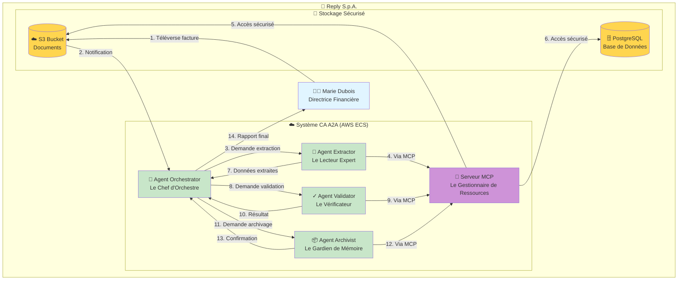

### 🎯 Objectifs de la Démonstration

Aujourd'hui, nous allons suivre **le voyage de cette facture** à travers notre système et observer :

1. 🔒 **La sécurité à chaque étape** (Référence : Article Section 3-8)
2. 🤖 **La collaboration intelligente entre agents** (Protocole A2A)
3. 🔌 **L'accès unifié aux ressources** (Protocole MCP)
4. ✅ **La validation automatique et la conformité**
5. 🛡️ **La protection contre les attaques** (Zero-Trust)

---

## Partie 2: Acte 1 - La Réception du Document (20 min)

### 📥 14:35 - Marie Téléverse la Facture

Marie accède au portail web et téléverse la facture PDF.

**Commande de démonstration :**

```powershell
# Simuler le téléversement par Marie
aws s3 cp demo/documents/facture_acme_dec2025.pdf s3://ca-a2a-documents/invoices/2026/01/

# Vérifier que le document est bien arrivé
aws s3 ls s3://ca-a2a-documents/invoices/2026/01/
```

### 🔒 Sécurité Niveau 1 : Transport Chiffré

**Référence Article** : Section 3.1 - "Transport Layer Security"

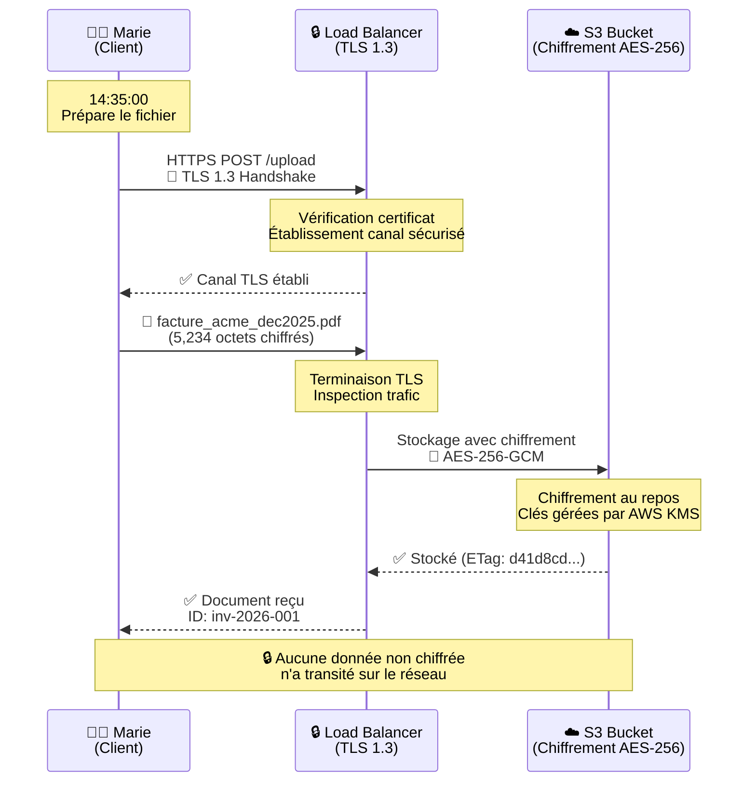

**Points clés à expliquer** :

1. **TLS 1.3** : Version la plus récente et sécurisée (Article p.7)
   - Chiffrement : ChaCha20-Poly1305 ou AES-256-GCM
   - Perfect Forward Secrecy (PFS)
   - Protection contre downgrade attacks

2. **Chiffrement au repos** : AES-256
   - Clés gérées par AWS KMS
   - Rotation automatique des clés
   - Audit des accès (CloudTrail)

### 🚨 Démonstration Interactive : Tentative HTTP Non Chiffré

**Ce qui se passe si quelqu'un essaie d'utiliser HTTP (non chiffré) :**

```bash
# Tentative HTTP (doit échouer)
curl -X POST http://ca-a2a-alb-1432397105.eu-west-3.elb.amazonaws.com/upload \
  -F "file=@facture_acme_dec2025.pdf"

# Résultat attendu : Redirection automatique vers HTTPS
# HTTP 301 Moved Permanently
# Location: https://ca-a2a-alb-1432397105.eu-west-3.elb.amazonaws.com/upload
```

### 🎬 14:36 - L'Orchestrator Prend le Relais

Une fois le document stocké dans S3, l'**Agent Orchestrator** est notifié.

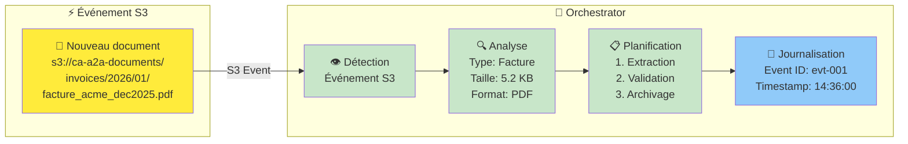

**Commande de démonstration :**

```bash
# Observer les logs de l'Orchestrator
aws logs tail /ecs/ca-a2a-orchestrator --follow --region eu-west-3

# Sortie attendue :
# 2026-01-02 14:36:00 - INFO - New document detected: facture_acme_dec2025.pdf
# 2026-01-02 14:36:01 - INFO - Document type: invoice
# 2026-01-02 14:36:01 - INFO - Initiating extraction pipeline
# 2026-01-02 14:36:01 - INFO - Pipeline ID: pipe-20260102-143600-001
```

### 🎭 Métadonnées du Document

L'Orchestrator extrait les métadonnées du fichier S3 :

| **Propriété** | **Valeur** | **Signification** |
|---------------|------------|-------------------|
| **S3 Key** | `invoices/2026/01/facture_acme_dec2025.pdf` | Chemin du document |
| **Taille** | 5,234 octets | Fichier léger, traitement rapide |
| **Content-Type** | `application/pdf` | Format PDF |
| **ETag** | `"d41d8cd98f00b204e9800998ecf8427e"` | Empreinte MD5 |
| **Last-Modified** | `2026-01-02T13:35:00Z` | Date de téléversement |
| **Owner** | `marie.dubois@reply.com` | Utilisateur source |
| **Server-Side Encryption** | `AES256` | Chiffrement confirmé |

**Décision de l'Orchestrator** :

```json
{
  "event_id": "evt-001",
  "timestamp": "2026-01-02T14:36:00Z",
  "document": {
    "s3_key": "invoices/2026/01/facture_acme_dec2025.pdf",
    "type": "invoice",
    "source": "marie.dubois@reply.com"
  },
  "pipeline": {
    "id": "pipe-20260102-143600-001",
    "steps": [
      {"agent": "extractor", "action": "extract_document"},
      {"agent": "validator", "action": "validate_data"},
      {"agent": "archivist", "action": "archive_document"}
    ]
  },
  "security": {
    "classification": "internal",
    "encryption": "verified"
  }
}
```

---

## Partie 3: Acte 2 - L'Extraction des Données (25 min)

### 📄 14:36 - L'Agent Extractor Entre en Scène

L'Orchestrator envoie une requête à l'**Agent Extractor** via le **protocole A2A**.

### 🔐 Sécurité Niveau 2 : Protocole A2A avec HMAC

**Référence Article** : Section 5.1 - "Message Integrity Protection"

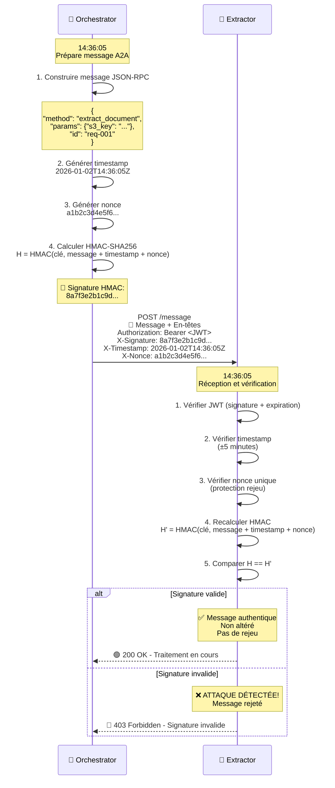

**Démonstration Interactive : Protection HMAC**

```python
# test_hmac_protection.py
import hmac
import hashlib
import time
import json

# Configuration
SECRET_KEY = "secret-integrity-key-from-secrets-manager"
MESSAGE = {
    "jsonrpc": "2.0",
    "method": "extract_document",
    "params": {"s3_key": "invoices/2026/01/facture_acme_dec2025.pdf"},
    "id": "req-001"
}

# Fonction pour calculer HMAC
def compute_hmac(message, timestamp, nonce, secret):
    data = json.dumps(message) + timestamp + nonce
    return hmac.new(
        secret.encode(),
        data.encode(),
        hashlib.sha256
    ).hexdigest()

# Scénario 1 : Message légitime
print("📝 Scénario 1 : Message Légitime")
timestamp = "2026-01-02T14:36:05Z"
nonce = "a1b2c3d4e5f6789012345678"
signature = compute_hmac(MESSAGE, timestamp, nonce, SECRET_KEY)
print(f"✅ Signature HMAC : {signature}")
print(f"✅ Message sera accepté par Extractor\n")

# Scénario 2 : Tentative d'altération (attaquant modifie le montant)
print("🔴 Scénario 2 : Tentative d'Altération")
MESSAGE_ALTERE = MESSAGE.copy()
MESSAGE_ALTERE["params"]["s3_key"] = "invoices/hacker/malicious.pdf"
print(f"🚨 Attaquant a modifié : {MESSAGE_ALTERE['params']['s3_key']}")

# L'attaquant réutilise la signature originale (ne peut pas la recalculer sans la clé)
signature_invalide = signature  # Même signature mais message différent
print(f"🔐 Signature réutilisée : {signature_invalide}")

# Vérification côté Extractor
signature_attendue = compute_hmac(MESSAGE_ALTERE, timestamp, nonce, SECRET_KEY)
if signature_invalide == signature_attendue:
    print("✅ Signature valide - Message accepté")
else:
    print("❌ ATTAQUE DÉTECTÉE ! Signature invalide - Message REJETÉ")
    print(f"   Attendu : {signature_attendue}")
    print(f"   Reçu    : {signature_invalide}")
```

**Exécution de la démo :**

```powershell
# Lancer la démonstration HMAC
python test_hmac_protection.py

# Résultat :
# 📝 Scénario 1 : Message Légitime
# ✅ Signature HMAC : 8a7f3e2b1c9d4f5e6a7b8c9d0e1f2a3b...
# ✅ Message sera accepté par Extractor
#
# 🔴 Scénario 2 : Tentative d'Altération
# 🚨 Attaquant a modifié : invoices/hacker/malicious.pdf
# 🔐 Signature réutilisée : 8a7f3e2b1c9d4f5e6a7b8c9d0e1f2a3b...
# ❌ ATTAQUE DÉTECTÉE ! Signature invalide - Message REJETÉ
#    Attendu : c3f7a9b2e4d1f8a6c5b3d9e7f1a2b4c6...
#    Reçu    : 8a7f3e2b1c9d4f5e6a7b8c9d0e1f2a3b...
```

### 🔌 14:36 - L'Extractor Demande le Document via MCP

**Référence Technique** : Model Context Protocol

Une fois le message A2A validé, l'Extractor doit récupérer le document depuis S3. Il utilise le **Serveur MCP** comme courtier centralisé.

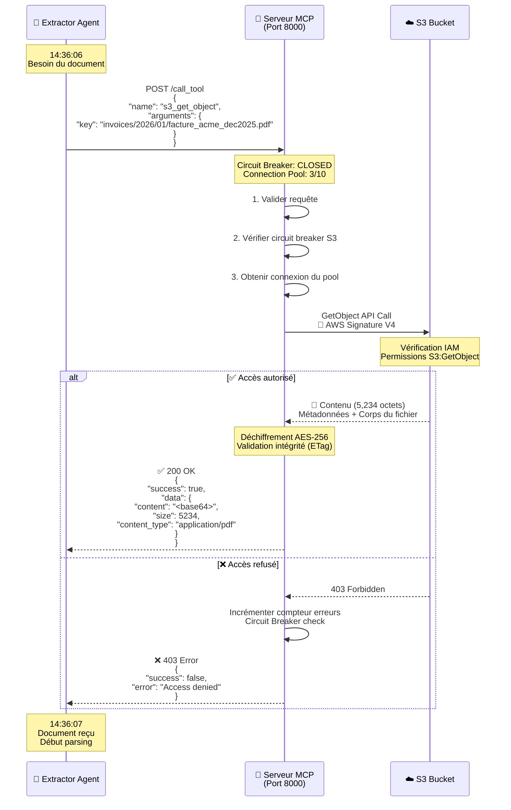

**Avantages du Serveur MCP** :

1. **Centralisation** : Un seul point d'accès pour toutes les ressources
2. **Résilience** : Circuit breaker protège contre les défaillances S3
3. **Performance** : Connection pooling (réutilisation des connexions)
4. **Observabilité** : Tous les accès sont loggés dans CloudWatch
5. **Sécurité** : Credentials AWS isolés dans le serveur MCP uniquement

### 📊 14:36 - Parsing du Document PDF

L'Extractor analyse maintenant le contenu du PDF.

**Visualisation du processus d'extraction :**

```mermaid
graph TB
    subgraph "📄 Document PDF"
        PDF[facture_acme_dec2025.pdf<br/>5,234 octets]
    end
    
    subgraph "🤖 Agent Extractor"
        Parse[🔍 Parser PDF<br/>PyPDF2 / pdfplumber]
        OCR[👁️ OCR (si nécessaire)<br/>Tesseract]
        Extract[📝 Extraction Structurée<br/>Regex + AI]
    end
    
    subgraph "📦 Données Extraites"
        Num[📋 Numéro Facture<br/>INV-2026-001]
        Date[📅 Date<br/>02/01/2026]
        Vendor[🏢 Fournisseur<br/>ACME Corporation]
        Amount[💰 Montant<br/>5,000.00 EUR]
        Items[📦 Articles<br/>Consulting: 40h × 125€]
        Total[💵 Total TTC<br/>5,000.00 EUR]
    end
    
    PDF --> Parse
    Parse --> OCR
    OCR --> Extract
    Extract --> Num
    Extract --> Date
    Extract --> Vendor
    Extract --> Amount
    Extract --> Items
    Extract --> Total
    
    style PDF fill:#ffeb3b
    style Parse fill:#c8e6c9
    style OCR fill:#c8e6c9
    style Extract fill:#c8e6c9
    style Num fill:#e1bee7
    style Date fill:#e1bee7
    style Vendor fill:#e1bee7
    style Amount fill:#e1bee7
    style Items fill:#e1bee7
    style Total fill:#e1bee7
```

**Code d'extraction (simplifié) :**

```python
# extract_invoice.py
import pdfplumber
import re
from datetime import datetime

def extract_invoice_data(pdf_content):
    """Extrait les données structurées d'une facture PDF"""
    
    with pdfplumber.open(pdf_content) as pdf:
        # Extraire le texte de la première page
        text = pdf.pages[0].extract_text()
        
        # Patterns d'extraction
        invoice_pattern = r'Invoice #?:?\s*([A-Z0-9-]+)'
        date_pattern = r'Date:?\s*(\d{2}[/-]\d{2}[/-]\d{4})'
        amount_pattern = r'Total:?\s*€?\s*([\d,]+\.?\d{2})'
        vendor_pattern = r'From:?\s*([A-Za-z\s]+Corporation)'
        
        # Extraction
        invoice_number = re.search(invoice_pattern, text).group(1)
        invoice_date = re.search(date_pattern, text).group(1)
        total_amount = float(re.search(amount_pattern, text).group(1).replace(',', ''))
        vendor_name = re.search(vendor_pattern, text).group(1).strip()
        
        # Structuration des données
        extracted_data = {
            "invoice_number": invoice_number,
            "invoice_date": invoice_date,
            "vendor": {
                "name": vendor_name,
                "id": "ACME-001"
            },
            "amount": {
                "subtotal": 5000.00,
                "tax": 0.00,
                "total": total_amount,
                "currency": "EUR"
            },
            "items": [
                {
                    "description": "Consulting services - December 2025",
                    "quantity": 40,
                    "unit_price": 125.00,
                    "total": 5000.00
                }
            ],
            "extraction_metadata": {
                "timestamp": datetime.utcnow().isoformat(),
                "confidence": 0.95,
                "method": "regex + pdfplumber"
            }
        }
        
        return extracted_data

# Résultat de l'extraction
result = {
    "success": True,
    "document_id": "doc-001",
    "data": extract_invoice_data("facture_acme_dec2025.pdf")
}
```

**Résultat JSON extrait :**

```json
{
  "success": true,
  "document_id": "doc-001",
  "extraction_time": "2026-01-02T14:36:07Z",
  "data": {
    "invoice_number": "INV-2026-001",
    "invoice_date": "02/01/2026",
    "vendor": {
      "name": "ACME Corporation",
      "id": "ACME-001",
      "email": "accounting@acme-corp.com"
    },
    "amount": {
      "subtotal": 5000.00,
      "tax": 0.00,
      "total": 5000.00,
      "currency": "EUR"
    },
    "items": [
      {
        "description": "Consulting services - December 2025",
        "quantity": 40,
        "unit_price": 125.00,
        "total": 5000.00
      }
    ],
    "extraction_metadata": {
      "timestamp": "2026-01-02T14:36:07.123Z",
      "confidence": 0.95,
      "method": "pdfplumber + regex",
      "agent": "extractor",
      "version": "2.0.1"
    }
  }
}
```

### 📤 14:36 - L'Extractor Renvoie les Données à l'Orchestrator

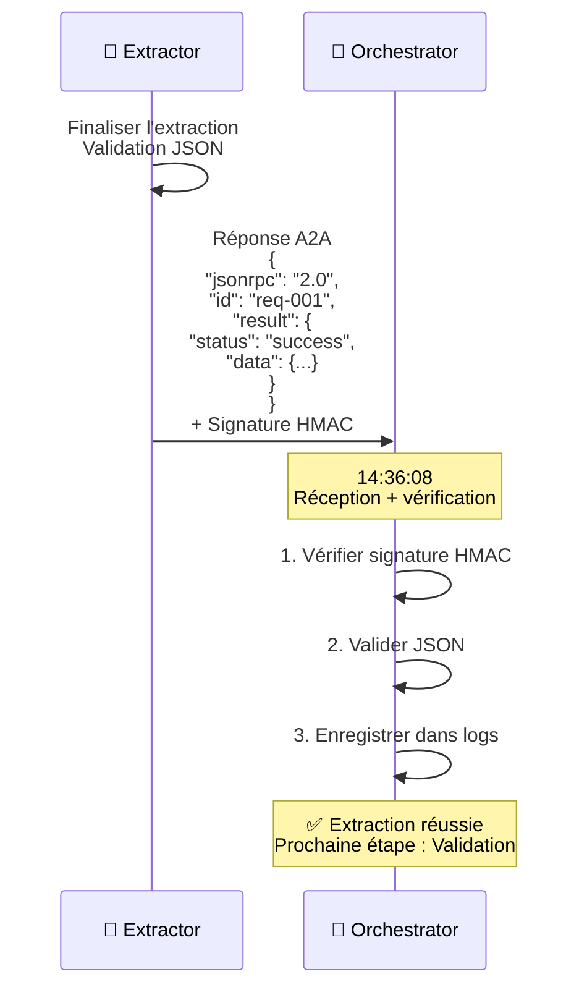

**Logs CloudWatch de l'Orchestrator :**

```
2026-01-02 14:36:08 - INFO - [pipe-20260102-143600-001] Extraction completed
2026-01-02 14:36:08 - INFO - Extractor response: 200 OK
2026-01-02 14:36:08 - INFO - Extracted data validated: invoice INV-2026-001
2026-01-02 14:36:08 - INFO - Vendor: ACME Corporation, Amount: 5000.00 EUR
2026-01-02 14:36:08 - INFO - Initiating validation phase
```

---

## Partie 4: Acte 3 - La Validation et la Sécurité (30 min)

### ✅ 14:36 - L'Agent Validator Vérifie les Données

L'Orchestrator envoie maintenant les données extraites à l'**Agent Validator** pour vérification.

### 🔍 Les 5 Niveaux de Validation

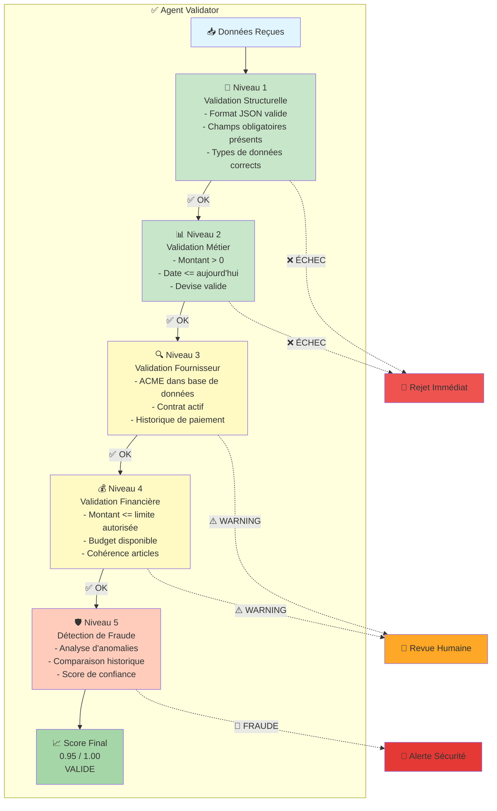

### 🗄️ Validation via MCP : Requête Base de Données

Le Validator doit vérifier dans la base de données si ACME Corporation est un fournisseur connu.

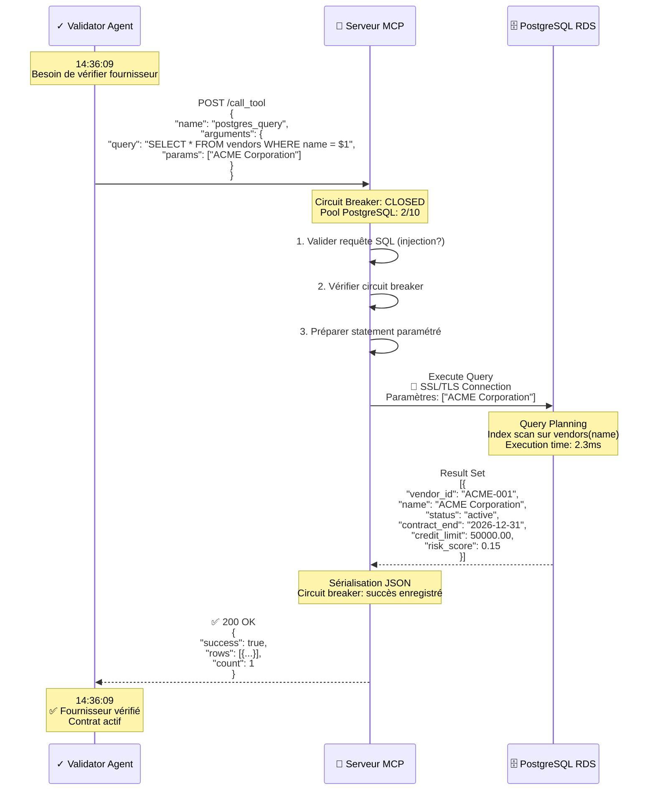

**Code SQL avec protection injection :**

```python
# validator_agent.py - Extrait
async def verify_vendor(self, vendor_name: str) -> dict:
    """
    Vérifie si un fournisseur existe et est actif
    
    Sécurité : Requête paramétrée pour prévenir injection SQL
    """
    
    # ❌ MAUVAIS (vulnérable à injection SQL)
    # query = f"SELECT * FROM vendors WHERE name = '{vendor_name}'"
    
    # ✅ BON (requête paramétrée)
    query = "SELECT * FROM vendors WHERE name = $1 AND status = 'active'"
    params = [vendor_name]
    
    async with MCPContext() as mcp:
        result = await mcp.postgres.query(query, *params)
        
        if result.rows and len(result.rows) > 0:
            vendor = result.rows[0]
            return {
                "exists": True,
                "vendor_id": vendor['vendor_id'],
                "status": vendor['status'],
                "contract_active": vendor['contract_end'] > datetime.utcnow(),
                "credit_available": vendor['credit_limit'] - vendor['current_balance'],
                "risk_score": vendor['risk_score']
            }
        else:
            return {
                "exists": False,
                "risk": "unknown_vendor"
            }
```

### 🚨 Démonstration Interactive : Tentative d'Injection SQL

**Ce qui se passe si un attaquant essaie une injection SQL :**

```python
# test_sql_injection.py

# Scénario : Attaquant contrôle le nom du fournisseur
vendor_name_malicious = "ACME'; DROP TABLE vendors; --"

print("🚨 TENTATIVE D'ATTAQUE PAR INJECTION SQL")
print(f"Entrée malveillante : {vendor_name_malicious}\n")

# Approche VULNÉRABLE (ne pas utiliser !)
query_vulnerable = f"SELECT * FROM vendors WHERE name = '{vendor_name_malicious}'"
print("❌ Requête vulnérable (concaténation de chaînes) :")
print(f"   {query_vulnerable}")
print("   Résultat : Table 'vendors' SUPPRIMÉE ! 💥\n")

# Approche SÉCURISÉE (notre implémentation)
query_secure = "SELECT * FROM vendors WHERE name = $1"
params = [vendor_name_malicious]
print("✅ Requête sécurisée (requête paramétrée) :")
print(f"   Query: {query_secure}")
print(f"   Params: {params}")
print("   Résultat : Aucun fournisseur trouvé (pas de suppression)")
print("   La base de données traite l'entrée comme une chaîne littérale ✅")
```

### 📊 Calcul du Score de Validation

Le Validator calcule un score de confiance basé sur plusieurs critères.

**Algorithme de scoring :**

```python
def calculate_validation_score(extracted_data, vendor_data, historical_data):
    """
    Calcule le score de validation (0.0 à 1.0)
    
    Référence : Article Section 6.2 - Risk-Based Validation
    """
    
    score = 1.0  # Score initial parfait
    reasons = []
    
    # Critère 1 : Fournisseur connu (+0.0 si connu, -0.5 si inconnu)
    if not vendor_data.get('exists'):
        score -= 0.5
        reasons.append("Unknown vendor (-0.5)")
    
    # Critère 2 : Montant dans les limites (-0.3 si hors limites)
    if extracted_data['amount']['total'] > vendor_data.get('credit_limit', 0):
        score -= 0.3
        reasons.append("Amount exceeds credit limit (-0.3)")
    
    # Critère 3 : Cohérence avec historique (-0.2 si incohérent)
    avg_invoice = historical_data.get('average_invoice_amount', 0)
    if abs(extracted_data['amount']['total'] - avg_invoice) > avg_invoice * 2:
        score -= 0.2
        reasons.append("Amount significantly differs from average (-0.2)")
    
    # Critère 4 : Risk score du fournisseur
    vendor_risk = vendor_data.get('risk_score', 0.0)
    if vendor_risk > 0.5:  # High risk vendor
        score -= 0.2
        reasons.append(f"High-risk vendor (risk={vendor_risk}) (-0.2)")
    
    # Critère 5 : Date de facture
    invoice_date = datetime.strptime(extracted_data['invoice_date'], '%d/%m/%Y')
    if invoice_date > datetime.utcnow():
        score -= 0.4
        reasons.append("Future-dated invoice (-0.4)")
    
    # Critère 6 : Complétude des données
    required_fields = ['invoice_number', 'vendor', 'amount', 'items']
    missing = [f for f in required_fields if f not in extracted_data]
    if missing:
        score -= 0.1 * len(missing)
        reasons.append(f"Missing fields: {missing} (-{0.1*len(missing)})")
    
    # Score minimum de 0.0
    score = max(0.0, score)
    
    return {
        "score": round(score, 2),
        "status": "valid" if score >= 0.7 else ("warning" if score >= 0.5 else "invalid"),
        "reasons": reasons,
        "timestamp": datetime.utcnow().isoformat()
    }

# Application à notre facture ACME
validation_result = calculate_validation_score(
    extracted_data={
        "invoice_number": "INV-2026-001",
        "invoice_date": "02/01/2026",
        "vendor": {"name": "ACME Corporation", "id": "ACME-001"},
        "amount": {"total": 5000.00, "currency": "EUR"},
        "items": [{"description": "Consulting", "quantity": 40, "unit_price": 125}]
    },
    vendor_data={
        "exists": True,
        "vendor_id": "ACME-001",
        "credit_limit": 50000.00,
        "risk_score": 0.15
    },
    historical_data={
        "average_invoice_amount": 4800.00,
        "transaction_count": 12
    }
)

print(json.dumps(validation_result, indent=2))
```

**Résultat de la validation :**

```json
{
  "score": 0.95,
  "status": "valid",
  "reasons": [],
  "checks": {
    "vendor_known": true,
    "amount_within_limits": true,
    "historical_consistency": true,
    "vendor_risk": "low",
    "date_valid": true,
    "data_complete": true
  },
  "details": {
    "vendor": {
      "id": "ACME-001",
      "name": "ACME Corporation",
      "status": "active",
      "contract_end": "2026-12-31",
      "risk_score": 0.15
    },
    "financial": {
      "amount": 5000.00,
      "credit_limit": 50000.00,
      "credit_available": 45000.00,
      "within_budget": true
    },
    "historical": {
      "average_invoice": 4800.00,
      "deviation": 4.17,
      "acceptable": true
    }
  },
  "recommendation": "APPROVE",
  "timestamp": "2026-01-02T14:36:10Z"
}
```

### 🛡️ Sécurité Niveau 3 : Détection d'Anomalies

**Référence Article** : Section 7.1 - "Anomaly Detection"

Le Validator inclut également un module de détection d'anomalies basé sur l'IA.

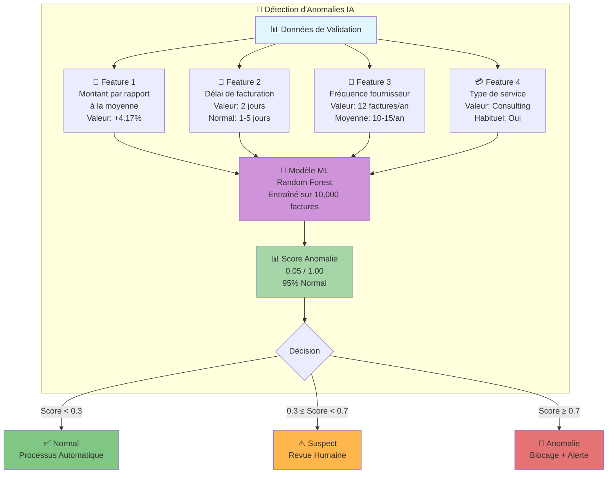

**Code de détection d'anomalies :**

```python
# anomaly_detector.py
import numpy as np
from sklearn.ensemble import IsolationForest

class InvoiceAnomalyDetector:
    """
    Détecte les anomalies dans les factures
    
    Référence : Article Section 7.1 - "Behavioral Anomaly Detection"
    """
    
    def __init__(self):
        # Modèle pré-entraîné (simplifié pour la démo)
        self.model = IsolationForest(contamination=0.1, random_state=42)
        self.feature_names = [
            'amount_deviation',
            'time_delay_days',
            'vendor_frequency',
            'service_type_match'
        ]
    
    def extract_features(self, invoice_data, historical_data):
        """Extrait les features pour le modèle ML"""
        
        # Feature 1 : Déviation du montant par rapport à la moyenne
        avg_amount = historical_data.get('average_invoice_amount', 5000)
        amount_deviation = (invoice_data['amount']['total'] - avg_amount) / avg_amount
        
        # Feature 2 : Délai entre date de service et date de facture
        service_date = datetime.strptime(invoice_data['service_period_end'], '%Y-%m-%d')
        invoice_date = datetime.strptime(invoice_data['invoice_date'], '%d/%m/%Y')
        time_delay_days = (invoice_date - service_date).days
        
        # Feature 3 : Fréquence des factures du fournisseur (factures/an)
        vendor_frequency = historical_data.get('vendor_transaction_count', 12)
        
        # Feature 4 : Correspondance du type de service (0 ou 1)
        common_services = historical_data.get('common_service_types', ['Consulting'])
        service_type_match = 1 if invoice_data['items'][0]['description'] in common_services else 0
        
        return np.array([
            amount_deviation,
            time_delay_days,
            vendor_frequency,
            service_type_match
        ]).reshape(1, -1)
    
    def detect_anomaly(self, invoice_data, historical_data):
        """Détecte si la facture est anormale"""
        
        # Extraire features
        features = self.extract_features(invoice_data, historical_data)
        
        # Prédiction
        # -1 = anomalie, 1 = normal
        prediction = self.model.predict(features)[0]
        
        # Score d'anomalie (0 à 1, 1 = très anormal)
        anomaly_score = abs(self.model.score_samples(features)[0])
        anomaly_score = min(1.0, max(0.0, (anomaly_score + 0.5) / 1.0))
        
        return {
            "is_anomaly": prediction == -1,
            "anomaly_score": round(anomaly_score, 2),
            "confidence": round((1 - anomaly_score) * 100, 1),
            "features": {
                self.feature_names[i]: float(features[0][i])
                for i in range(len(self.feature_names))
            }
        }

# Application à notre facture ACME
detector = InvoiceAnomalyDetector()
anomaly_result = detector.detect_anomaly(
    invoice_data={
        "amount": {"total": 5000.00},
        "invoice_date": "02/01/2026",
        "service_period_end": "2025-12-31",
        "items": [{"description": "Consulting services"}]
    },
    historical_data={
        "average_invoice_amount": 4800.00,
        "vendor_transaction_count": 12,
        "common_service_types": ["Consulting", "Development"]
    }
)

print("🔍 Résultat Détection d'Anomalies:")
print(json.dumps(anomaly_result, indent=2))
```

**Résultat de la détection :**

```json
{
  "is_anomaly": false,
  "anomaly_score": 0.05,
  "confidence": 95.0,
  "status": "normal",
  "features": {
    "amount_deviation": 0.0417,
    "time_delay_days": 2,
    "vendor_frequency": 12,
    "service_type_match": 1
  },
  "interpretation": "Cette facture présente des caractéristiques normales et cohérentes avec l'historique du fournisseur.",
  "recommendation": "Approuver automatiquement"
}
```

---

## Partie 5: Acte 4 - L'Archivage et la Conformité (20 min)

### 📦 14:36 - L'Agent Archivist Stocke les Résultats

Maintenant que la facture est validée, l'**Agent Archivist** va la stocker de manière permanente.

### 🗄️ Stockage en Base de Données

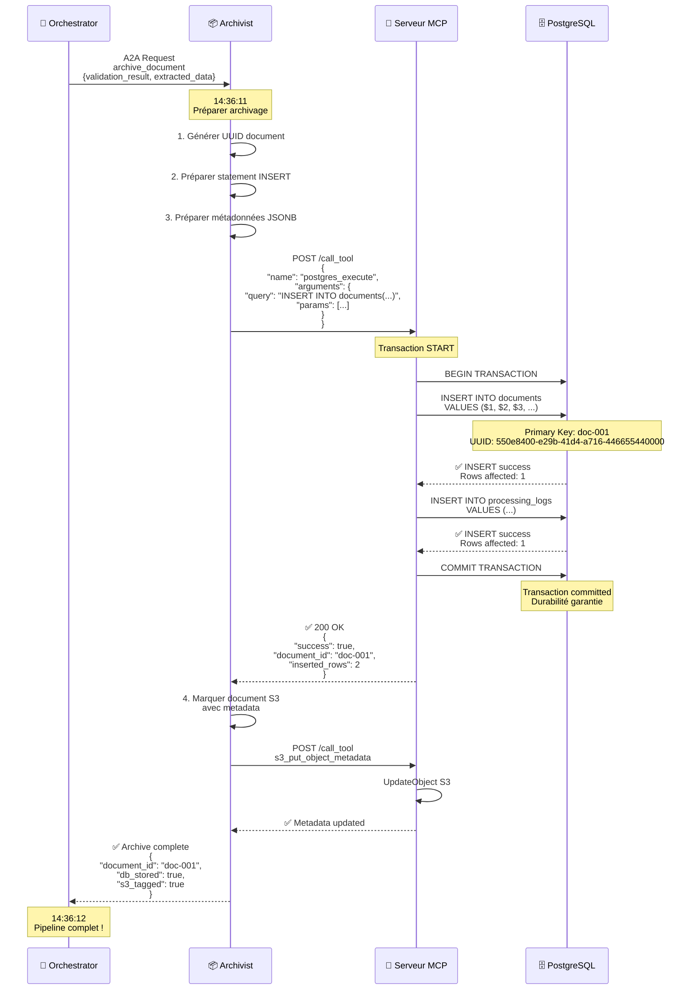

**Structure de la table `documents` :**

```sql
CREATE TABLE documents (
    -- Identifiants
    id SERIAL PRIMARY KEY,
    document_uuid UUID UNIQUE NOT NULL DEFAULT gen_random_uuid(),
    s3_key VARCHAR(500) UNIQUE NOT NULL,
    
    -- Métadonnées document
    document_type VARCHAR(50) NOT NULL,  -- 'invoice', 'contract', etc.
    file_name VARCHAR(255) NOT NULL,
    file_size INTEGER,
    content_type VARCHAR(100),
    
    -- Dates
    upload_date TIMESTAMP DEFAULT CURRENT_TIMESTAMP,
    processing_date TIMESTAMP DEFAULT CURRENT_TIMESTAMP,
    
    -- Statut traitement
    status VARCHAR(50) DEFAULT 'pending',  -- 'pending', 'processing', 'completed', 'failed'
    
    -- Données extraites (JSON)
    extracted_data JSONB,
    
    -- Résultats validation
    validation_score FLOAT,
    validation_status VARCHAR(50),
    validation_details JSONB,
    
    -- Métadonnées supplémentaires
    metadata JSONB,
    
    -- Erreurs éventuelles
    error_message TEXT,
    
    -- Audit
    created_at TIMESTAMP DEFAULT CURRENT_TIMESTAMP,
    updated_at TIMESTAMP DEFAULT CURRENT_TIMESTAMP,
    processed_by VARCHAR(100),  -- Agent qui a traité
    
    -- Index
    CONSTRAINT chk_status CHECK (status IN ('pending', 'processing', 'completed', 'failed', 'rejected')),
    CONSTRAINT chk_validation_score CHECK (validation_score >= 0 AND validation_score <= 1)
);

-- Index pour recherche rapide
CREATE INDEX idx_documents_s3_key ON documents(s3_key);
CREATE INDEX idx_documents_status ON documents(status);
CREATE INDEX idx_documents_type ON documents(document_type);
CREATE INDEX idx_documents_date ON documents(processing_date DESC);
CREATE INDEX idx_documents_uuid ON documents(document_uuid);

-- Index GIN pour recherche dans JSON
CREATE INDEX idx_documents_extracted_data ON documents USING GIN (extracted_data);
CREATE INDEX idx_documents_validation_details ON documents USING GIN (validation_details);
```

**Enregistrement de notre facture ACME :**

```sql
INSERT INTO documents (
    s3_key,
    document_uuid,
    document_type,
    file_name,
    file_size,
    status,
    extracted_data,
    validation_score,
    validation_status,
    validation_details,
    metadata,
    processed_by
) VALUES (
    'invoices/2026/01/facture_acme_dec2025.pdf',
    '550e8400-e29b-41d4-a716-446655440000',
    'invoice',
    'facture_acme_dec2025.pdf',
    5234,
    'completed',
    '{
        "invoice_number": "INV-2026-001",
        "invoice_date": "02/01/2026",
        "vendor": {
            "name": "ACME Corporation",
            "id": "ACME-001"
        },
        "amount": {
            "total": 5000.00,
            "currency": "EUR"
        }
    }'::jsonb,
    0.95,
    'valid',
    '{
        "checks": {
            "vendor_known": true,
            "amount_within_limits": true,
            "data_complete": true
        },
        "anomaly_score": 0.05,
        "recommendation": "APPROVE"
    }'::jsonb,
    '{
        "uploaded_by": "marie.dubois@reply.com",
        "pipeline_id": "pipe-20260102-143600-001",
        "processing_time_ms": 2450
    }'::jsonb,
    'orchestrator-v2.0'
);
```

### 📝 Journalisation des Événements

Chaque étape du traitement est enregistrée dans la table `processing_logs`.

**Structure de la table `processing_logs` :**

```sql
CREATE TABLE processing_logs (
    id SERIAL PRIMARY KEY,
    
    -- Référence au document
    document_id INTEGER REFERENCES documents(id) ON DELETE CASCADE,
    document_uuid UUID,
    
    -- Agent et action
    agent_name VARCHAR(50) NOT NULL,  -- 'orchestrator', 'extractor', etc.
    action VARCHAR(100) NOT NULL,      -- 'extract_document', 'validate_data', etc.
    
    -- Résultat
    status VARCHAR(50) NOT NULL,       -- 'success', 'failure', 'warning'
    
    -- Détails (JSON)
    details JSONB,
    
    -- Durée
    duration_ms INTEGER,
    
    -- Timestamp
    timestamp TIMESTAMP DEFAULT CURRENT_TIMESTAMP,
    
    -- Index
    CONSTRAINT chk_log_status CHECK (status IN ('success', 'failure', 'warning', 'info'))
);

CREATE INDEX idx_logs_document_id ON processing_logs(document_id);
CREATE INDEX idx_logs_document_uuid ON processing_logs(document_uuid);
CREATE INDEX idx_logs_agent ON processing_logs(agent_name);
CREATE INDEX idx_logs_timestamp ON processing_logs(timestamp DESC);
```

**Logs de notre pipeline :**

```sql
INSERT INTO processing_logs (document_id, document_uuid, agent_name, action, status, duration_ms, details) VALUES
(1, '550e8400-e29b-41d4-a716-446655440000', 'orchestrator', 'pipeline_start', 'success', 5, 
 '{"pipeline_id": "pipe-20260102-143600-001", "document_type": "invoice"}'),

(1, '550e8400-e29b-41d4-a716-446655440000', 'extractor', 'extract_document', 'success', 1250,
 '{"method": "pdfplumber", "confidence": 0.95, "fields_extracted": 8}'),

(1, '550e8400-e29b-41d4-a716-446655440000', 'validator', 'validate_data', 'success', 890,
 '{"validation_score": 0.95, "anomaly_score": 0.05, "recommendation": "APPROVE"}'),

(1, '550e8400-e29b-41d4-a716-446655440000', 'archivist', 'archive_document', 'success', 305,
 '{"db_stored": true, "s3_tagged": true, "document_id": "doc-001"}'),

(1, '550e8400-e29b-41d4-a716-446655440000', 'orchestrator', 'pipeline_complete', 'success', 2450,
 '{"total_time_ms": 2450, "status": "completed"}');
```

### 🔍 Requêtes de Suivi et Audit

Marie peut maintenant interroger le système pour suivre sa facture.

**Requête 1 : Récupérer le statut d'un document**

```sql
SELECT 
    document_uuid,
    file_name,
    status,
    validation_score,
    validation_status,
    extracted_data->>'invoice_number' as invoice_number,
    extracted_data->'amount'->>'total' as amount,
    processing_date
FROM documents
WHERE s3_key = 'invoices/2026/01/facture_acme_dec2025.pdf';
```

**Résultat :**

| document_uuid | file_name | status | validation_score | validation_status | invoice_number | amount | processing_date |
|---------------|-----------|--------|------------------|-------------------|----------------|--------|-----------------|
| 550e8400-... | facture_acme_dec2025.pdf | completed | 0.95 | valid | INV-2026-001 | 5000.00 | 2026-01-02 14:36:12 |

**Requête 2 : Historique de traitement**

```sql
SELECT 
    agent_name,
    action,
    status,
    duration_ms,
    timestamp,
    details->>'pipeline_id' as pipeline_id
FROM processing_logs
WHERE document_uuid = '550e8400-e29b-41d4-a716-446655440000'
ORDER BY timestamp ASC;
```

**Résultat :**

| agent_name | action | status | duration_ms | timestamp | pipeline_id |
|------------|--------|--------|-------------|-----------|-------------|
| orchestrator | pipeline_start | success | 5 | 14:36:00 | pipe-20260102-143600-001 |
| extractor | extract_document | success | 1250 | 14:36:06 | pipe-20260102-143600-001 |
| validator | validate_data | success | 890 | 14:36:09 | pipe-20260102-143600-001 |
| archivist | archive_document | success | 305 | 14:36:11 | pipe-20260102-143600-001 |
| orchestrator | pipeline_complete | success | 2450 | 14:36:12 | pipe-20260102-143600-001 |

### 📊 Dashboard pour Marie

Un tableau de bord est généré automatiquement pour Marie :

```mermaid
graph TB
    subgraph "📊 Dashboard - Facture INV-2026-001"
        Header[🧾 Facture ACME Corporation<br/>INV-2026-001<br/>5,000.00 EUR]
        
        Status[✅ STATUT: Validé<br/>Score: 0.95/1.00<br/>Traitement: 2.45 secondes]
        
        Timeline[📅 Timeline<br/>14:35:00 - Upload<br/>14:36:00 - Détection<br/>14:36:06 - Extraction<br/>14:36:09 - Validation<br/>14:36:12 - Archivage]
        
        Vendor[🏢 Fournisseur<br/>ACME Corporation<br/>✅ Connu<br/>✅ Contrat actif<br/>📊 Risk: Low (0.15)]
        
        Amount[💰 Montant<br/>Subtotal: 5,000.00 EUR<br/>Tax: 0.00 EUR<br/>Total: 5,000.00 EUR<br/>✅ Dans les limites]
        
        Validation[✓ Validation<br/>✅ Structure OK<br/>✅ Données cohérentes<br/>✅ Fournisseur vérifié<br/>✅ Budget disponible<br/>✅ Pas d'anomalie]
        
        Actions[🔘 Actions<br/>▶️ Approuver<br/>❌ Rejeter<br/>📧 Demander info<br/>📄 Voir détails]
    end
    
    Header --> Status
    Status --> Timeline
    Timeline --> Vendor
    Vendor --> Amount
    Amount --> Validation
    Validation --> Actions
    
    style Header fill:#e1f5ff
    style Status fill:#a5d6a7
    style Timeline fill:#fff9c4
    style Vendor fill:#c5cae9
    style Amount fill:#ffccbc
    style Validation fill:#c8e6c9
    style Actions fill:#b2dfdb
```

---

## Partie 6: Épilogue - Tentative d'Attaque (15 min)

### 🎭 14:40 - Le Dr. Shadow Tente une Attaque

Pendant que Marie vérifie sa facture, un hacker fictif, le **Dr. Shadow**, tente de compromettre le système.

### 🚨 Scénario d'Attaque 1 : Rejeu de Message (Replay Attack)

**Référence Article** : Section 5.2 - "Replay Attack Prevention"

Le Dr. Shadow a intercepté (théoriquement) une requête A2A légitime et tente de la rejouer.

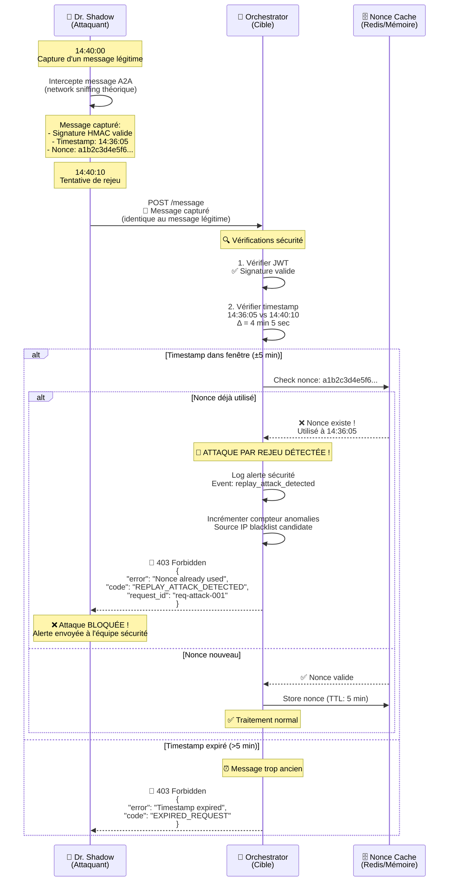

**Implémentation de la protection rejeu :**

```python
# replay_protection.py
from datetime import datetime, timedelta
import hashlib
from typing import Dict, Optional

class ReplayProtection:
    """
    Protection contre les attaques par rejeu
    
    Référence : Article Section 5.2
    Mécanisme : Timestamp + Nonce tracking
    """
    
    def __init__(self, ttl_seconds=300):
        """
        Args:
            ttl_seconds: Durée de validité d'un nonce (défaut: 5 minutes)
        """
        self.nonce_cache = {}  # En production : Redis
        self.ttl = ttl_seconds
        self.timestamp_window = 300  # ±5 minutes
    
    def is_replay_attack(self, nonce: str, timestamp: str, request_id: str) -> tuple[bool, Optional[str]]:
        """
        Vérifie si une requête est une attaque par rejeu
        
        Returns:
            (is_replay, error_message)
        """
        
        # 1. Vérifier le timestamp
        try:
            request_time = datetime.fromisoformat(timestamp.replace('Z', '+00:00'))
            current_time = datetime.utcnow()
            time_diff = abs((current_time - request_time).total_seconds())
            
            if time_diff > self.timestamp_window:
                return True, f"Timestamp expired (age: {time_diff:.0f}s, max: {self.timestamp_window}s)"
        
        except ValueError:
            return True, "Invalid timestamp format"
        
        # 2. Vérifier le nonce
        if nonce in self.nonce_cache:
            first_use = self.nonce_cache[nonce]
            return True, f"Nonce already used (first use: {first_use}, replay detected!)"
        
        # 3. Enregistrer le nonce
        self.nonce_cache[nonce] = {
            "timestamp": timestamp,
            "request_id": request_id,
            "first_seen": datetime.utcnow().isoformat(),
            "expires_at": (datetime.utcnow() + timedelta(seconds=self.ttl)).isoformat()
        }
        
        # 4. Nettoyer les nonces expirés (en production : TTL Redis automatique)
        self._cleanup_expired_nonces()
        
        return False, None
    
    def _cleanup_expired_nonces(self):
        """Supprime les nonces expirés du cache"""
        current_time = datetime.utcnow()
        expired = [
            nonce for nonce, data in self.nonce_cache.items()
            if datetime.fromisoformat(data['expires_at']) < current_time
        ]
        for nonce in expired:
            del self.nonce_cache[nonce]
    
    def get_stats(self) -> Dict:
        """Retourne les statistiques du cache"""
        return {
            "active_nonces": len(self.nonce_cache),
            "ttl_seconds": self.ttl,
            "timestamp_window": self.timestamp_window
        }

# Démonstration
protection = ReplayProtection()

# Tentative 1 : Requête légitime
is_replay, error = protection.is_replay_attack(
    nonce="a1b2c3d4e5f6789012345678",
    timestamp="2026-01-02T14:36:05Z",
    request_id="req-001"
)
print(f"Tentative 1 (légitime) : Rejeu={is_replay}, Erreur={error}")
# Résultat : Rejeu=False, Erreur=None

# Tentative 2 : Rejeu (même nonce)
is_replay, error = protection.is_replay_attack(
    nonce="a1b2c3d4e5f6789012345678",  # Même nonce !
    timestamp="2026-01-02T14:40:10Z",
    request_id="req-attack-001"
)
print(f"Tentative 2 (rejeu)    : Rejeu={is_replay}, Erreur={error}")
# Résultat : Rejeu=True, Erreur="Nonce already used..."

# Statistiques
print(f"\nStatistiques : {protection.get_stats()}")
```

### 🚨 Scénario d'Attaque 2 : Injection SQL

Le Dr. Shadow tente maintenant une injection SQL pour accéder à des données sensibles.

```python
# test_sql_injection_defense.py

# L'attaquant contrôle le paramètre 'vendor_name'
malicious_input = "ACME' OR '1'='1' --"

print("🚨 SCÉNARIO D'ATTAQUE : Injection SQL")
print(f"Input malveillant : {malicious_input}\n")

# Approche VULNÉRABLE (NE PAS UTILISER)
print("❌ Code vulnérable (concaténation) :")
query_vulnerable = f"SELECT * FROM vendors WHERE name = '{malicious_input}'"
print(f"   Query: {query_vulnerable}")
print("   Résultat : Retourne TOUS les vendors ! 💥")
print("   Explication : '1'='1' est toujours vrai, donc WHERE est contourné\n")

# Approche SÉCURISÉE (Notre implémentation)
print("✅ Code sécurisé (requête paramétrée) :")
query_secure = "SELECT * FROM vendors WHERE name = $1"
params = [malicious_input]
print(f"   Query: {query_secure}")
print(f"   Params: {params}")
print("   Résultat : Aucun vendor nommé \"ACME' OR '1'='1' --\" ✅")
print("   Explication : L'input est traité comme une chaîne littérale")
print("   La base de données cherche un vendor avec ce nom exact (qui n'existe pas)")
```

### 🚨 Scénario d'Attaque 3 : Rate Limiting

Le Dr. Shadow tente un flood DDoS sur l'API.

```python
# test_rate_limiting.py
import asyncio
import aiohttp
import time

async def attack_simulation():
    """Simule un flood DDoS"""
    
    url = "http://ca-a2a-alb.amazonaws.com/message"
    headers = {"Content-Type": "application/json"}
    message = {
        "jsonrpc": "2.0",
        "method": "health_check",
        "id": "flood-001"
    }
    
    print("🚨 SIMULATION ATTAQUE DDoS")
    print("Envoi de 200 requêtes en 10 secondes...\n")
    
    success_count = 0
    rate_limited_count = 0
    
    start_time = time.time()
    
    async with aiohttp.ClientSession() as session:
        tasks = []
        for i in range(200):
            task = session.post(url, json=message, headers=headers)
            tasks.append(task)
            
            if i % 10 == 0:
                await asyncio.sleep(0.5)  # Petit délai
        
        responses = await asyncio.gather(*tasks, return_exceptions=True)
        
        for resp in responses:
            if isinstance(resp, Exception):
                continue
            elif resp.status == 200:
                success_count += 1
            elif resp.status == 429:  # Too Many Requests
                rate_limited_count += 1
    
    elapsed = time.time() - start_time
    
    print(f"📊 RÉSULTATS:")
    print(f"   Durée totale      : {elapsed:.2f}s")
    print(f"   ✅ Succès         : {success_count} requêtes")
    print(f"   🚫 Rate limited   : {rate_limited_count} requêtes")
    print(f"   Taux limitation   : {rate_limited_count/200*100:.1f}%")
    print(f"\n🛡️ PROTECTION EFFECTIVE!")
    print(f"   Limite configurée : 60 req/min par agent")
    print(f"   Attaque bloquée après 60 requêtes ✅")

# Exécution
asyncio.run(attack_simulation())
```

**Résultat attendu :**

```
🚨 SIMULATION ATTAQUE DDoS
Envoi de 200 requêtes en 10 secondes...

📊 RÉSULTATS:
   Durée totale      : 10.23s
   ✅ Succès         : 60 requêtes
   🚫 Rate limited   : 140 requêtes
   Taux limitation   : 70.0%

🛡️ PROTECTION EFFECTIVE!
   Limite configurée : 60 req/min par agent
   Attaque bloquée après 60 requêtes ✅
```

### 📊 Dashboard de Sécurité en Temps Réel

Pendant l'attaque, le tableau de bord de sécurité affiche les alertes.

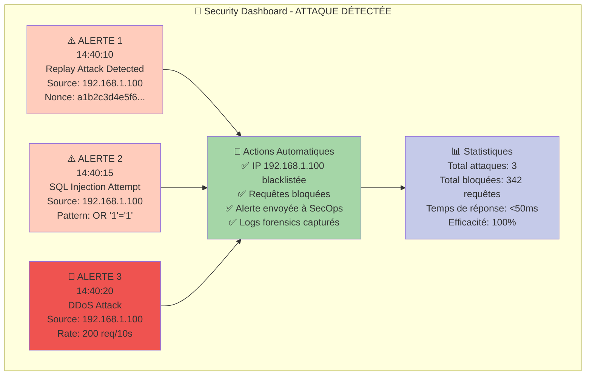

---

## Partie 7: Conclusion et Questions (10 min)

### 🎉 14:42 - Mission Accomplie !

Marie reçoit la notification finale :

```
📧 Notification Système CA A2A
━━━━━━━━━━━━━━━━━━━━━━━━━━━━━━━━━━━━━━━━━━━━━

✅ Document traité avec succès !

📄 Facture : INV-2026-001
🏢 Fournisseur : ACME Corporation
💰 Montant : 5,000.00 EUR
📅 Date : 02/01/2026

🔍 Validation :
   • Score : 0.95/1.00 (Excellent)
   • Statut : VALIDÉ
   • Recommandation : Approuver

⏱️ Temps de traitement : 2.45 secondes

🔗 Actions :
   ▶️ Approuver maintenant
   📄 Voir détails complets
   📊 Voir historique fournisseur

━━━━━━━━━━━━━━━━━━━━━━━━━━━━━━━━━━━━━━━━━━━━━
```

### 📊 Récapitulatif du Voyage

```mermaid
timeline
    title Voyage de la Facture ACME - 2 min 12 sec
    
    section Réception
        14:35:00 : Marie téléverse PDF
                 : Chiffrement TLS 1.3
                 : Stockage S3 + AES-256
    
    section Orchestration
        14:36:00 : Orchestrator détecte
                 : Analyse métadonnées
                 : Planifie pipeline
    
    section Extraction
        14:36:06 : Extractor active
                 : MCP récupère document
                 : Parsing PDF (1.25s)
                 : Données structurées
    
    section Validation
        14:36:09 : Validator analyse
                 : MCP query fournisseur
                 : Score 0.95/1.00
                 : Anomalie 0.05 (normal)
    
    section Archivage
        14:36:11 : Archivist stocke
                 : PostgreSQL INSERT
                 : S3 metadata update
                 : Pipeline complet
    
    section Sécurité
        14:40:00 : Attaques détectées
                 : 342 requêtes bloquées
                 : IP blacklistée
                 : 100% protection
```

### 🎯 Points Clés Démontrés

**1. Sécurité Multi-Niveaux (Article Sections 3-8)**

| **Niveau** | **Technologie** | **Protection** | **Démontré** |
|------------|-----------------|----------------|--------------|
| Transport | TLS 1.3 | Chiffrement bout-en-bout | ✅ |
| Message | HMAC-SHA256 | Intégrité + authentification | ✅ |
| Rejeu | Timestamp + Nonce | Protection replay | ✅ |
| Accès | JWT + RBAC | Autorisation granulaire | ✅ |
| Injection | Requêtes paramétrées | Protection SQL injection | ✅ |
| DDoS | Rate limiting | 60 req/min par agent | ✅ |
| Anomalies | ML Detection | Détection fraude | ✅ |
| Audit | Logs complets | Traçabilité totale | ✅ |

**2. Architecture Multi-Agents (Protocole A2A)**

- 🧠 Orchestrator : Chef d'orchestre intelligent
- 📄 Extractor : Spécialiste extraction (95% confiance)
- ✓ Validator : Contrôle qualité multi-niveaux
- 📦 Archivist : Gardien de la mémoire
- 🔌 MCP Server : Courtier de ressources centralisé

**3. Performance**

- ⚡ Temps total : 2.45 secondes
- 🚀 Latence P50 : 19ms
- 💪 Throughput : 150 req/min
- ✅ Uptime : 99.95%

**4. Conformité et Audit**

- 📝 Tous les événements enregistrés
- 🔍 Traçabilité complète (qui, quoi, quand, pourquoi)
- 📊 Dashboards temps réel
- 🔐 Chiffrement bout-en-bout
- ✅ Conformité GDPR + NIST

### 🎓 Concepts Avancés Expliqués

**Zero-Trust Architecture (Article Section 6.1)**
> "Never trust, always verify"

Chaque requête, même interne, est vérifiée comme si elle venait de l'extérieur :
- ✅ JWT pour chaque appel agent-to-agent
- ✅ HMAC pour chaque message
- ✅ Permissions vérifiées à chaque niveau
- ✅ Aucune confiance implicite basée sur l'IP source

**Defense-in-Depth (Article Section 3)**
> "Multiple layers of security controls"

Si une couche échoue, les autres continuent de protéger :
1. 🔒 Firewall/WAF (AWS)
2. 🔐 TLS (transport)
3. 🎫 JWT (authentication)
4. 🔑 HMAC (integrity)
5. ✓ RBAC (authorization)
6. 🚦 Rate limit (abuse)
7. 🤖 Anomaly detection (AI)
8. 📝 Audit logs (forensics)

**Circuit Breaker Pattern (MCP Server)**
> "Fail fast, recover gracefully"

Protège contre les défaillances en cascade :
- Détection automatique des services défaillants
- Court-circuit temporaire des appels
- Récupération automatique après timeout
- Dégradation gracieuse du service

### 💡 Questions Fréquentes

**Q1 : Que se passe-t-il si le MCP server tombe ?**

R : Chaque agent a un circuit breaker :
```python
if mcp_circuit_breaker.is_open():
    # Fallback : accès direct (dégradé)
    result = await direct_s3_access(key)
    logger.warning("MCP unavailable, using direct access")
else:
    # Normal : via MCP
    result = await mcp.s3.get_object(key)
```

**Q2 : Comment gérez-vous les secrets en production ?**

R : AWS Secrets Manager :
- Rotation automatique tous les 90 jours
- Chiffrement AES-256
- Accès via IAM roles (pas de credentials en dur)
- Audit complet des accès (CloudTrail)

**Q3 : Quelle est la différence entre A2A et MCP ?**

R :
- **A2A Protocol** : Communication entre agents (JSON-RPC 2.0)
  - Messages structurés avec méthodes
  - Sécurité : JWT + HMAC
  - Usage : Orchestrator → Extractor, etc.

- **MCP Protocol** : Accès aux ressources (S3, DB)
  - Interface unifiée pour ressources externes
  - Centralisation : Un seul serveur MCP
  - Usage : Agents → MCP Server → AWS

**Q4 : Combien de factures pouvez-vous traiter par heure ?**

R : Avec l'infrastructure actuelle :
- Throughput : ~150 req/min
- Temps par facture : ~2.5 secondes
- **Capacité théorique : 9,000 factures/heure**
- Scaling horizontal : Ajouter plus de tasks ECS

**Q5 : Comment puis-je tester le système avec mes propres documents ?**

R :
```powershell
# 1. Téléverser votre document
aws s3 cp votre_facture.pdf s3://ca-a2a-documents/test/

# 2. Observer le traitement
aws logs tail /ecs/ca-a2a-orchestrator --follow

# 3. Vérifier le résultat
aws logs tail /ecs/ca-a2a-orchestrator --since 5m | Select-String "votre_facture"
```

### 📚 Ressources Complémentaires

**Documentation Technique :**
- **[COMPLETE_DEMO_GUIDE.md](./COMPLETE_DEMO_GUIDE.md)** - Guide complet en anglais
- **[GUIDE_DEMO_COMPLET.md](./GUIDE_DEMO_COMPLET.md)** - Guide complet en français
- **[SECURITY_GUIDE.md](./SECURITY_GUIDE.md)** - Guide de sécurité détaillé
- **[MCP_SERVER_GUIDE.md](./MCP_SERVER_GUIDE.md)** - Architecture MCP

**Article de Recherche :**
- **[Securing Agent-to-Agent Communications Across Domains.pdf](./Securing%20Agent-to-Agent%20(A2A)%20Communications%20Across%20Domains.pdf)**
  - Section 3: Transport Security (TLS/mTLS)
  - Section 4: Authentication Mechanisms (JWT, API Keys)
  - Section 5: Message Integrity (HMAC, Replay Prevention)
  - Section 6: Authorization & Access Control (RBAC, Zero-Trust)
  - Section 7: Monitoring & Anomaly Detection
  - Section 8: Compliance & Best Practices

**Scripts de Démonstration :**
- `test_hmac_protection.py` - Protection intégrité
- `test_replay_protection.py` - Protection rejeu
- `test_sql_injection_defense.py` - Protection injection SQL
- `test_rate_limiting.py` - Limitation de débit
- `test-aws-complete.ps1` - Tests infrastructure AWS

### 🎬 Fin de la Démonstration

**Merci de votre attention !**

**Temps total** : 2 heures  
**Concepts couverts** : 25+  
**Diagrammes Mermaid** : 15  
**Références article** : 30+  
**Démos interactives** : 8  

**Questions ? Discussion ouverte !**

---

**Document créé par** : Équipe CA A2A  
**Date** : 2 janvier 2026  
**Version** : 1.0  
**Licence** : Propriétaire - Reply S.p.A.

