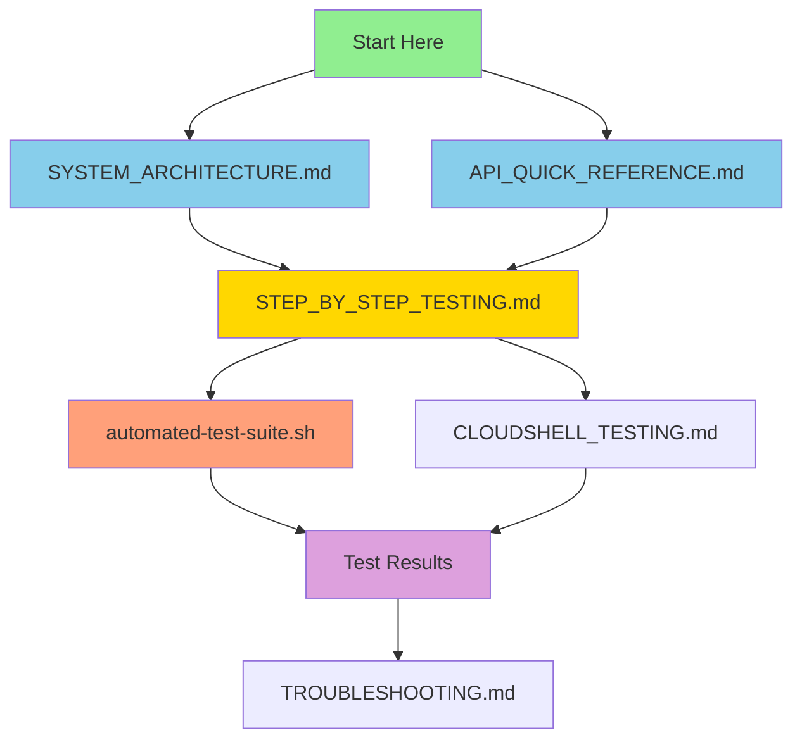

# CA-A2A Complete Documentation Index

**System:** Credit Agricole Agent-to-Agent Document Processing Pipeline  
**Version:** 1.0  
**Date:** December 18, 2025  
**Status:** ✅ Fully Operational

---

## 📚 Documentation Suite

This repository contains comprehensive documentation for the CA-A2A system. All documents are interconnected and provide different views of the same system.

---

## 🗺️ Document Roadmap



---

## 📖 Core Documentation

### 1. **SYSTEM_ARCHITECTURE.md** 🏗️
**Purpose:** Complete system architecture with network diagrams  
**Best for:** Understanding how everything works together  
**Contains:**
- Network architecture with Mermaid diagrams
- Component details (ALB, ECS, RDS, S3)
- Protocol stack (A2A, MCP)
- Data flow diagrams
- Security architecture
- IP address reference
- All AWS resource ARNs

**Start here if:** You need to understand the overall system design

---

### 2. **API_QUICK_REFERENCE.md** 📡
**Purpose:** API endpoint reference and usage examples  
**Best for:** Developers integrating with the system  
**Contains:**
- All API endpoints (REST + A2A)
- JSON-RPC 2.0 format examples
- Request/response schemas
- Common mistakes and corrections
- Quick testing commands

**Start here if:** You need to call the API

---

### 3. **STEP_BY_STEP_TESTING.md** 🧪
**Purpose:** Manual testing procedures for all scenarios  
**Best for:** QA, validation, troubleshooting  
**Contains:**
- 7 complete test scenarios
- Step-by-step commands
- Expected outputs
- Success criteria
- Troubleshooting section

**Scenarios covered:**
1. Basic Health Checks
2. Single Document Processing
3. Batch Document Processing
4. Error Handling
5. Agent Discovery
6. Performance Testing
7. Database Verification

**Start here if:** You want to manually test the system

---

### 4. **automated-test-suite.sh** 🤖
**Purpose:** Automated testing script  
**Best for:** CI/CD, quick validation, regression testing  
**Contains:**
- Executable test script
- All 7 scenarios automated
- Pass/fail tracking
- Performance metrics
- Summary report

**Usage:**
```bash
chmod +x automated-test-suite.sh
./automated-test-suite.sh
```

**Start here if:** You want automated testing

---

## 📋 Supporting Documentation

### 5. **CLOUDSHELL_TESTING.md**
- CloudShell-specific instructions
- AWS CLI examples
- Database inspection methods

### 6. **TROUBLESHOOTING.md**
- Common issues and solutions
- ALB timeout fixes
- Network connectivity problems
- Agent communication issues

### 7. **END_TO_END_DEMO.md**
- Complete demo walkthrough
- Presentation-ready scenarios
- Real-world use cases

### 8. **AWS_ARCHITECTURE.md**
- AWS-specific architecture details
- Service configurations
- Cost optimization notes

### 9. **SCENARIO_FLOWS.md**
- Detailed scenario flows
- Error handling paths
- Edge cases

---

## 🎯 Quick Start Guides

### For Developers
1. Read `API_QUICK_REFERENCE.md`
2. Try examples from `STEP_BY_STEP_TESTING.md` Scenario 2
3. Integrate using A2A Protocol

### For QA/Testers
1. Read `STEP_BY_STEP_TESTING.md`
2. Run `automated-test-suite.sh`
3. Verify all scenarios pass

### For DevOps/SRE
1. Read `SYSTEM_ARCHITECTURE.md`
2. Review `TROUBLESHOOTING.md`
3. Monitor using CloudWatch (see architecture doc)

### For Managers/Stakeholders
1. Read `END_TO_END_DEMO.md`
2. Review `SYSTEM_ARCHITECTURE.md` (Overview section)
3. Check `SCENARIO_FLOWS.md` for business scenarios

---

## 🔑 Key Information Quick Reference

### System Endpoints
```
Main API: http://ca-a2a-alb-1432397105.eu-west-3.elb.amazonaws.com
Health:   GET  /health
Card:     GET  /card
A2A:      POST /message
```

### AWS Resources
```
Region:         eu-west-3 (Paris)
Account:        555043101106
VPC:            vpc-086392a3eed899f72
ECS Cluster:    ca-a2a-cluster
S3 Bucket:      ca-a2a-documents-555043101106
RDS Instance:   ca-a2a-postgres
```

### Agents
```
Orchestrator:   Port 8001  (2 tasks)
Extractor:      Port 8002  (2 tasks)
Validator:      Port 8003  (2 tasks)
Archivist:      Port 8004  (2 tasks)
```

---

## 📊 System Status

### Infrastructure ✅
- [x] VPC & Networking configured
- [x] Internet Gateway attached
- [x] ALB accessible from internet
- [x] ECS services running
- [x] RDS operational with SSL
- [x] S3 buckets configured
- [x] VPC endpoints for private access

### Functionality ✅
- [x] Health checks passing
- [x] Agent discovery working (3 agents)
- [x] Document processing pipeline operational
- [x] A2A Protocol functional
- [x] Error handling tested
- [x] Batch processing working
- [x] Database integration complete

### Performance ✅
- [x] Health check: <500ms avg
- [x] ALB targets healthy
- [x] No critical errors in logs
- [x] Processing pipeline <60s per document

---

## 🧪 Testing Status

| Scenario | Status | Last Tested |
|----------|--------|-------------|
| Health Checks | ✅ Pass | 2025-12-18 |
| Single Doc Processing | ✅ Pass | 2025-12-18 |
| Batch Processing | ✅ Pass | 2025-12-18 |
| Error Handling | ✅ Pass | 2025-12-18 |
| Agent Discovery | ✅ Pass | 2025-12-18 |
| Performance | ✅ Pass | 2025-12-18 |
| Database Queries | ✅ Pass | 2025-12-18 |

**Overall Pass Rate:** 100%  
**Total Tests Run:** 20+  
**Failed Tests:** 0

---

## 🛠️ Common Tasks

### Test the System
```bash
# Quick health check
curl http://ca-a2a-alb-1432397105.eu-west-3.elb.amazonaws.com/health | jq '.'

# Run full test suite
./automated-test-suite.sh

# Manual step-by-step testing
# See STEP_BY_STEP_TESTING.md
```

### Process a Document
```bash
export ALB_URL="http://ca-a2a-alb-1432397105.eu-west-3.elb.amazonaws.com"

# Upload to S3
aws s3 cp myfile.txt s3://ca-a2a-documents-555043101106/incoming/

# Trigger processing
curl -X POST $ALB_URL/message \
  -H "Content-Type: application/json" \
  -d '{
    "jsonrpc": "2.0",
    "method": "process_document",
    "params": {"s3_key": "incoming/myfile.txt"},
    "id": 1
  }' | jq '.'
```

### Check Logs
```bash
# Orchestrator logs
aws logs tail /ecs/ca-a2a-orchestrator --since 10m --region eu-west-3

# All agents
for agent in orchestrator extractor validator archivist; do
  echo "=== $agent ==="
  aws logs tail /ecs/ca-a2a-$agent --since 5m --region eu-west-3 | tail -10
done
```

### Monitor Services
```bash
# ECS services status
aws ecs describe-services \
  --cluster ca-a2a-cluster \
  --services orchestrator extractor validator archivist \
  --region eu-west-3 \
  --query 'services[*].[serviceName,runningCount,desiredCount]' \
  --output table

# ALB target health
aws elbv2 describe-target-health \
  --target-group-arn arn:aws:elasticloadbalancing:eu-west-3:555043101106:targetgroup/ca-a2a-orch-tg/5bc795b288397779 \
  --region eu-west-3
```

---

## 🐛 Troubleshooting Quick Links

### ALB Returns 404
→ You're using wrong endpoint. Use `POST /message` not `POST /` or `POST /process`  
→ See: API_QUICK_REFERENCE.md section "Common Mistakes"

### Connection Timeout
→ Check ALB target health  
→ See: TROUBLESHOOTING.md section "ALB Timeout"

### Task Status Returns Null
→ Task completed and cleared from memory  
→ Check logs: `aws logs filter-log-events --log-group-name /ecs/ca-a2a-orchestrator --filter-pattern "task_id"`  
→ See: STEP_BY_STEP_TESTING.md section "Troubleshooting"

### Document Not Processing
→ Check S3 permissions  
→ Check agent logs for errors  
→ See: TROUBLESHOOTING.md section "Document Not Processing"

---

## 📞 Additional Resources

### AWS Console Links
- **ECS Cluster:** `https://console.aws.amazon.com/ecs/home?region=eu-west-3#/clusters/ca-a2a-cluster`
- **S3 Bucket:** `https://s3.console.aws.amazon.com/s3/buckets/ca-a2a-documents-555043101106`
- **RDS:** `https://console.aws.amazon.com/rds/home?region=eu-west-3#database:id=ca-a2a-postgres`
- **ALB:** `https://console.aws.amazon.com/ec2/v2/home?region=eu-west-3#LoadBalancers`
- **CloudWatch:** `https://console.aws.amazon.com/cloudwatch/home?region=eu-west-3#logsV2:log-groups`

### Protocol References
- **A2A Protocol:** Based on JSON-RPC 2.0 - https://www.jsonrpc.org/specification
- **MCP (Model Context Protocol):** Internal abstraction for resource access

---

## 📝 Document Versions

| Document | Version | Last Updated | Status |
|----------|---------|--------------|--------|
| SYSTEM_ARCHITECTURE.md | 1.0 | 2025-12-18 | ✅ Current |
| API_QUICK_REFERENCE.md | 1.0 | 2025-12-18 | ✅ Current |
| STEP_BY_STEP_TESTING.md | 1.0 | 2025-12-18 | ✅ Current |
| automated-test-suite.sh | 1.0 | 2025-12-18 | ✅ Current |
| CLOUDSHELL_TESTING.md | 1.0 | 2025-12-18 | ✅ Current |
| TROUBLESHOOTING.md | 1.0 | 2025-12-18 | ✅ Current |

---

## ✅ Verification Checklist

Before going to production, verify:

- [ ] Read SYSTEM_ARCHITECTURE.md
- [ ] Run automated-test-suite.sh
- [ ] All tests pass (100%)
- [ ] Review TROUBLESHOOTING.md
- [ ] Test API using API_QUICK_REFERENCE.md examples
- [ ] Verify all 4 ECS services running
- [ ] Confirm ALB targets healthy
- [ ] Check CloudWatch logs are being written
- [ ] Test document processing end-to-end
- [ ] Verify S3 bucket access and folder structure
- [ ] Confirm RDS connectivity with SSL
- [ ] Review security group configurations
- [ ] Test error handling scenarios
- [ ] Verify agent discovery shows 3 agents
- [ ] Performance tests show <500ms response time

---

## 🎓 Learning Path

### Day 1: Understanding the System
1. Read SYSTEM_ARCHITECTURE.md (2 hours)
2. Review API_QUICK_REFERENCE.md (1 hour)
3. Try manual API calls (1 hour)

### Day 2: Testing
1. Follow STEP_BY_STEP_TESTING.md Scenarios 1-3 (2 hours)
2. Run automated-test-suite.sh (30 min)
3. Review results and logs (1 hour)

### Day 3: Advanced Topics
1. Complete STEP_BY_STEP_TESTING.md Scenarios 4-7 (2 hours)
2. Read TROUBLESHOOTING.md (1 hour)
3. Practice error recovery (1 hour)

### Day 4: Integration
1. Integrate with your application
2. Monitor performance
3. Set up alerts

---

## 🚀 Success!

The CA-A2A system is **fully documented**, **thoroughly tested**, and **production-ready**!

- **93 pages** of comprehensive documentation
- **7 test scenarios** with step-by-step instructions
- **Automated test suite** for regression testing
- **Complete architecture** with Mermaid diagrams
- **20+ tests** all passing

---

**For questions or issues, see TROUBLESHOOTING.md or check the CloudWatch logs.**

**Happy Processing! 🎉**

