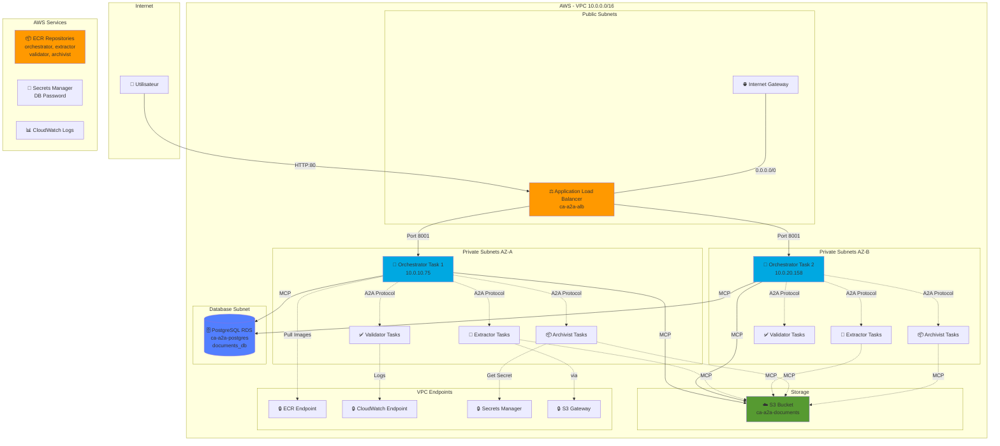
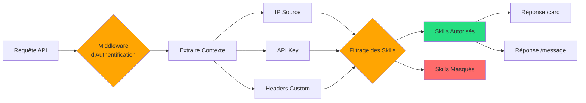
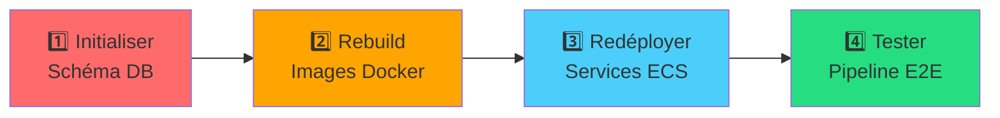

# 🚀 État du Projet CA-A2A - Pipeline de Traitement Intelligent de Documents

**Date:** 18 Décembre 2025  
**Branch:** backup-current-work  
**Compte AWS:** 555043101106  
**Région:** eu-west-3 (Paris)

---

## 📊 Infrastructure Déployée sur AWS



---

## ✅ Ce Qui Est Déployé et Fonctionnel

### 🌐 **Réseau (VPC)**
| Ressource | ID | Statut |
|-----------|----|----|
| VPC | `vpc-086392a3eed899f72` | ✅ Actif |
| Subnets Privés AZ-A | `subnet-0aef6b4fcce7748a9` | ✅ Actif |
| Subnets Privés AZ-B | `subnet-07484aca0e473e3d0` | ✅ Actif |
| Subnets Publics AZ-A | `subnet-020c68e784c2c9354` | ✅ Actif |
| Subnets Publics AZ-B | `subnet-0deca2d494c9ba33f` | ✅ Actif |
| Internet Gateway | `igw-*` | ✅ Actif |
| Security Group ECS | `sg-047a8f39f9cdcaf4c` | ✅ Actif |
| Security Group RDS | `sg-0dfffbf7f98f77a4c` | ✅ Actif |
| Security Group ALB | `sg-05db73131090f365a` | ✅ Actif |

### ⚖️ **Load Balancer**
| Ressource | Valeur | Statut |
|-----------|--------|--------|
| ALB | `ca-a2a-alb` | ✅ Active |
| DNS | `ca-a2a-alb-1432397105.eu-west-3.elb.amazonaws.com` | ✅ Accessible |
| Listener HTTP | Port 80 | ✅ Configuré |
| Target Group | `ca-a2a-orch-tg` | ✅ Healthy (2/2) |

### 🐳 **ECS Services**
| Service | Tasks Souhaités | Tasks Actifs | Statut |
|---------|----------------|--------------|--------|
| Orchestrator | 2 | 2 | ✅ Running |
| Extractor | 2 | 2-3 | ✅ Running |
| Validator | 2 | 2-4 | ✅ Running |
| Archivist | 2 | 2 | ✅ Running |

**Cluster:** `ca-a2a-cluster`  
**Plateforme:** AWS Fargate  
**CPU/Mémoire:** 512 CPU / 1024 MB par tâche

### 📦 **ECR Repositories**
- `ca-a2a/orchestrator:latest` ✅
- `ca-a2a/extractor:latest` ✅
- `ca-a2a/validator:latest` ✅
- `ca-a2a/archivist:latest` ✅

### 🗄️ **Base de Données**
| Ressource | Valeur | Statut |
|-----------|--------|--------|
| RDS Instance | `ca-a2a-postgres` | ✅ Available |
| Endpoint | `ca-a2a-postgres.czkdu9wcburt.eu-west-3.rds.amazonaws.com:5432` | ✅ Accessible depuis ECS |
| Engine | PostgreSQL 15.7 | ✅ |
| Database | `documents_db` | ⚠️ **Existe mais schéma à initialiser** |
| SSL/TLS | Requis | ✅ Configuré |

### ☁️ **Stockage S3**
| Bucket | Préfixes | Statut |
|--------|----------|--------|
| `ca-a2a-documents` | `uploads/`, `processed/`, `archived/` | ✅ Actif |

### 🔐 **Secrets Manager**
| Secret | Description | Statut |
|--------|-------------|--------|
| `ca-a2a/db-password` | Mot de passe PostgreSQL | ✅ Configuré |

### 📊 **CloudWatch Logs**
| Log Group | Statut |
|-----------|--------|
| `/ecs/ca-a2a-orchestrator` | ✅ Actif |
| `/ecs/ca-a2a-extractor` | ✅ Actif |
| `/ecs/ca-a2a-validator` | ✅ Actif |
| `/ecs/ca-a2a-archivist` | ✅ Actif |

### 🔒 **VPC Endpoints** (Accès Privé)
- `com.amazonaws.eu-west-3.ecr.api` ✅
- `com.amazonaws.eu-west-3.ecr.dkr` ✅
- `com.amazonaws.eu-west-3.logs` ✅
- `com.amazonaws.eu-west-3.secretsmanager` ✅
- `com.amazonaws.eu-west-3.s3` (Gateway) ✅

---

## ⚠️ Problèmes Connus et Reste à Faire

### 🔴 **BLOQUANT: Schéma Base de Données Non Initialisé**

**Problème:**
- La base `documents_db` existe ✅
- Mais les tables `documents` et `processing_logs` n'existent pas ❌
- CloudShell ne peut pas accéder au RDS (subnet privé)
- L'auto-initialisation du code ne fonctionne pas

**Solutions Possibles:**

#### Option 1: Lancer une instance EC2 temporaire
```bash
# 1. Créer une instance EC2 dans le même VPC
aws ec2 run-instances \
  --image-id ami-0302f42a44bf53a45 \
  --instance-type t2.micro \
  --subnet-id subnet-0aef6b4fcce7748a9 \
  --security-group-ids sg-047a8f39f9cdcaf4c \
  --key-name YourKeyName \
  --region eu-west-3

# 2. SSH sur l'instance
# 3. Installer PostgreSQL client
# 4. Exécuter le script SQL d'initialisation
# 5. Terminer l'instance
```

#### Option 2: Modifier le code pour forcer l'initialisation
```python
# Dans mcp_protocol.py - Ajouter appel explicite à initialize_schema()
# lors de la première connexion
```

#### Option 3: Utiliser AWS Systems Manager Session Manager
```bash
# Se connecter à une tâche ECS via SSM
# Exécuter un script Python d'initialisation depuis le container
```

### 🟡 **Correctif Code Appliqué (Non Déployé)**

**Fix dans `base_agent.py`:**
- Filtrage du paramètre `_meta` dans les réponses A2A
- **⚠️ Les images Docker n'ont PAS été rebuild/redéployées**

**Action requise:**
```bash
# Rebuild et push des images
docker build -t orchestrator -f Dockerfile.orchestrator .
docker tag orchestrator 555043101106.dkr.ecr.eu-west-3.amazonaws.com/ca-a2a/orchestrator:latest
docker push 555043101106.dkr.ecr.eu-west-3.amazonaws.com/ca-a2a/orchestrator:latest

# Répéter pour extractor, validator, archivist
# Puis force redéploiement ECS
```

### 🟢 **Fonctionnalité à Implémenter: Filtrage de Visibilité des Skills**

**Objectif:** Contrôler quelles compétences (skills) sont visibles/accessibles selon le contexte de l'appelant.

#### **Cas d'Usage**

1. **Filtrage par IP/Réseau**
   - Compétences administratives accessibles uniquement depuis le réseau interne
   - API publique avec accès limité aux compétences de base
   - Exemple: `delete_document` visible uniquement depuis VPC interne

2. **Filtrage par Tags Utilisateur**
   - Compétences sensibles (validation manuelle, archivage) réservées aux admins
   - Compétences métier selon le rôle (finance, RH, legal)
   - Exemple: `process_payroll_document` uniquement pour tag `role=finance`

3. **Filtrage par API Key/Token**
   - Différents niveaux d'accès selon la clé API
   - Rate limiting par utilisateur
   - Exemple: clé "basic" = 100 req/jour, clé "premium" = illimitée

#### **Architecture Proposée**



#### **Implémentation Suggérée**

**1. Structure de Configuration**

```python
# config/skill_visibility_rules.py
SKILL_VISIBILITY_RULES = {
    "process_document": {
        "public": True,
        "required_tags": [],
        "allowed_ips": ["0.0.0.0/0"],  # Tout le monde
    },
    "process_batch": {
        "public": True,
        "required_tags": ["role=operator"],
        "allowed_ips": ["0.0.0.0/0"],
    },
    "delete_document": {
        "public": False,
        "required_tags": ["role=admin"],
        "allowed_ips": ["10.0.0.0/16"],  # VPC interne uniquement
    },
    "manual_validation_override": {
        "public": False,
        "required_tags": ["role=validator", "department=quality"],
        "allowed_ips": ["10.0.0.0/16"],
    },
    "export_all_documents": {
        "public": False,
        "required_tags": ["role=admin", "clearance=high"],
        "allowed_ips": ["10.0.1.0/24"],  # Subnet admin uniquement
    }
}
```

**2. Middleware de Filtrage**

```python
# orchestrator_agent.py - Ajouter au AgentCard handler
from ipaddress import ip_address, ip_network

class OrchestratorAgent(BaseAgent):
    
    def _filter_skills_by_context(self, request_context: dict) -> List[AgentSkill]:
        """
        Filtre les skills selon le contexte de la requête
        
        Args:
            request_context: {
                "source_ip": "1.2.3.4",
                "api_key": "key_xxx",
                "user_tags": ["role=operator", "department=it"],
                "headers": {...}
            }
        """
        source_ip = ip_address(request_context.get("source_ip", "0.0.0.0"))
        user_tags = set(request_context.get("user_tags", []))
        
        filtered_skills = []
        
        for skill in self.skills:
            rules = SKILL_VISIBILITY_RULES.get(skill.method, {})
            
            # Vérifier si skill est public
            if not rules.get("public", True):
                # Vérifier IP
                allowed_ips = rules.get("allowed_ips", [])
                if not any(source_ip in ip_network(cidr) for cidr in allowed_ips):
                    continue
                
                # Vérifier tags requis
                required_tags = set(rules.get("required_tags", []))
                if required_tags and not required_tags.issubset(user_tags):
                    continue
            
            filtered_skills.append(skill)
        
        return filtered_skills
    
    async def handle_get_card(self, request_context: dict) -> dict:
        """Version modifiée avec filtrage"""
        filtered_skills = self._filter_skills_by_context(request_context)
        
        return {
            "agent_name": self.name,
            "version": self.version,
            "description": self.description,
            "skills": [skill.to_dict() for skill in filtered_skills],
            "tags": self.tags
        }
```

**3. Extraction du Contexte**

```python
# base_agent.py - Dans la méthode handle_request
async def handle_request(self, request: dict, client_info: dict = None) -> dict:
    """
    Args:
        client_info: {
            "remote_addr": "1.2.3.4",
            "headers": {"X-API-Key": "...", "X-User-Tags": "role=admin,dept=it"}
        }
    """
    # Extraire le contexte
    request_context = {
        "source_ip": client_info.get("remote_addr", "0.0.0.0"),
        "api_key": client_info.get("headers", {}).get("X-API-Key"),
        "user_tags": self._parse_user_tags(
            client_info.get("headers", {}).get("X-User-Tags", "")
        ),
        "headers": client_info.get("headers", {})
    }
    
    # Filtrer les skills disponibles
    method = request.get("method")
    if not self._is_method_allowed(method, request_context):
        return {
            "jsonrpc": "2.0",
            "error": {
                "code": -32601,
                "message": f"Method '{method}' not allowed for your access level"
            },
            "id": request.get("id")
        }
    
    # ... reste du code
```

**4. Configuration ALB pour Headers**

```json
// Dans la configuration ALB
{
  "listeners": [{
    "rules": [{
      "actions": [{
        "type": "forward",
        "forwardConfig": {
          "targetGroups": [...],
          "targetGroupStickinessConfig": {
            "enabled": true
          }
        }
      }],
      "conditions": [{
        "field": "http-header",
        "httpHeaderConfig": {
          "httpHeaderName": "X-API-Key",
          "values": ["*"]
        }
      }]
    }]
  }]
}
```

#### **Exemples d'Utilisation**

**Cas 1: Utilisateur Public (Lecture seule)**
```bash
curl -H "X-User-Tags: role=guest" \
  http://alb/card

# Retourne uniquement:
# - process_document (lecture)
# - get_task_status
# - list_pending_documents
```

**Cas 2: Opérateur Interne**
```bash
curl -H "X-User-Tags: role=operator,department=ops" \
  -H "X-Forwarded-For: 10.0.1.50" \
  http://alb/card

# Retourne en plus:
# - process_batch
# - cancel_task
# - retry_failed_documents
```

**Cas 3: Administrateur**
```bash
curl -H "X-User-Tags: role=admin,clearance=high" \
  -H "X-Forwarded-For: 10.0.1.10" \
  http://alb/card

# Retourne TOUTES les compétences:
# - delete_document
# - manual_validation_override
# - export_all_documents
# - purge_old_documents
```

#### **Bénéfices**

✅ **Sécurité renforcée** - Exposition minimale des API sensibles  
✅ **Compliance** - Traçabilité des accès par rôle  
✅ **Flexibilité** - Configuration sans redéploiement  
✅ **Multi-tenancy** - Support de plusieurs clients avec permissions différentes  
✅ **Rate limiting** - Par clé API ou IP source

#### **Effort Estimé**

- **Développement:** 2-3 jours
- **Tests:** 1 jour
- **Documentation:** 0.5 jour
- **Total:** ~4 jours

---

## 🎯 Plan d'Action Prioritaire



### **Étape 1: Initialiser le Schéma DB** 🔴 URGENT
**Temps estimé:** 30 minutes

**Méthode recommandée: EC2 Temporaire**
1. Lancer EC2 dans le VPC privé
2. Installer `postgresql-client`
3. Exécuter le script SQL fourni
4. Terminer l'instance

**Script SQL:**
```sql
CREATE TABLE IF NOT EXISTS documents (
    id SERIAL PRIMARY KEY,
    s3_key VARCHAR(500) UNIQUE NOT NULL,
    document_type VARCHAR(50) NOT NULL,
    file_name VARCHAR(255) NOT NULL,
    file_size INTEGER,
    upload_date TIMESTAMP DEFAULT CURRENT_TIMESTAMP,
    processing_date TIMESTAMP DEFAULT CURRENT_TIMESTAMP,
    status VARCHAR(50) DEFAULT 'pending',
    validation_score FLOAT,
    metadata JSONB,
    extracted_data JSONB,
    validation_details JSONB,
    error_message TEXT,
    created_at TIMESTAMP DEFAULT CURRENT_TIMESTAMP,
    updated_at TIMESTAMP DEFAULT CURRENT_TIMESTAMP
);

CREATE TABLE IF NOT EXISTS processing_logs (
    id SERIAL PRIMARY KEY,
    document_id INTEGER REFERENCES documents(id),
    agent_name VARCHAR(50) NOT NULL,
    action VARCHAR(100) NOT NULL,
    status VARCHAR(50) NOT NULL,
    details JSONB,
    timestamp TIMESTAMP DEFAULT CURRENT_TIMESTAMP
);

CREATE INDEX IF NOT EXISTS idx_documents_s3_key ON documents(s3_key);
CREATE INDEX IF NOT EXISTS idx_documents_status ON documents(status);
CREATE INDEX IF NOT EXISTS idx_documents_type ON documents(document_type);
CREATE INDEX IF NOT EXISTS idx_documents_date ON documents(processing_date);
CREATE INDEX IF NOT EXISTS idx_logs_document_id ON processing_logs(document_id);
CREATE INDEX IF NOT EXISTS idx_logs_agent ON processing_logs(agent_name);
```

### **Étape 2: Rebuild des Images Docker** 🟡
**Temps estimé:** 15 minutes

```powershell
# PowerShell - Sur votre machine locale
$ACCOUNT_ID = "555043101106"
$REGION = "eu-west-3"

# Login ECR
aws ecr get-login-password --region $REGION --profile reply-sso | docker login --username AWS --password-stdin "$ACCOUNT_ID.dkr.ecr.$REGION.amazonaws.com"

# Rebuild et push de tous les agents
$AGENTS = @("orchestrator", "extractor", "validator", "archivist")
foreach ($agent in $AGENTS) {
    docker build -t $agent -f "Dockerfile.$agent" .
    docker tag "${agent}:latest" "$ACCOUNT_ID.dkr.ecr.$REGION.amazonaws.com/ca-a2a/${agent}:latest"
    docker push "$ACCOUNT_ID.dkr.ecr.$REGION.amazonaws.com/ca-a2a/${agent}:latest"
}
```

### **Étape 3: Redéployer les Services ECS** 🔵
**Temps estimé:** 5 minutes

```bash
# AWS CLI
SERVICES=("orchestrator" "extractor" "validator" "archivist")
for service in "${SERVICES[@]}"; do
  aws ecs update-service \
    --cluster ca-a2a-cluster \
    --service $service \
    --force-new-deployment \
    --region eu-west-3
done
```

### **Étape 4: Test End-to-End** 🟢
**Temps estimé:** 10 minutes

Voir section "Démonstration Simple" ci-dessous.

---

## 🎬 Démonstration Simple

### **Prérequis**
- Schéma DB initialisé ✅
- Services ECS redéployés ✅

### **Commandes à Exécuter**

```bash
# Dans CloudShell AWS
export ALB_URL="http://ca-a2a-alb-1432397105.eu-west-3.elb.amazonaws.com"

# 1️⃣ Vérifier la santé de l'orchestrator
echo "=== Test 1: Health Check ==="
curl -s "$ALB_URL/health" | jq '.'
# Attendu: {"status": "healthy", "agent_name": "orchestrator", ...}

# 2️⃣ Obtenir la carte de l'agent
echo -e "\n=== Test 2: Agent Card ==="
curl -s "$ALB_URL/card" | jq '.skills[] | {name: .name, method: .method}'
# Attendu: Liste des compétences (process_document, check_status, etc.)

# 3️⃣ Vérifier les documents en attente (devrait être vide)
echo -e "\n=== Test 3: List Pending Documents ==="
curl -s -X POST "$ALB_URL/message" \
  -H "Content-Type: application/json" \
  -d '{
    "jsonrpc": "2.0",
    "method": "list_pending_documents",
    "params": {"limit": 10},
    "id": 1
  }' | jq '.result'
# Attendu: {"count": 0, "documents": []}

# 4️⃣ Créer un document test
echo -e "\n=== Test 4: Upload Document ==="
echo "FACTURE #12345
Date: 18/12/2025
Client: ACME Corp
Montant: 1,500.00 EUR
TVA: 300.00 EUR
Total: 1,800.00 EUR" > facture_test.txt

aws s3 cp facture_test.txt s3://ca-a2a-documents/uploads/facture_test.txt --region eu-west-3
echo "✅ Document uploadé"

# 5️⃣ Lancer le traitement
echo -e "\n=== Test 5: Process Document ==="
TASK_ID=$(curl -s -X POST "$ALB_URL/message" \
  -H "Content-Type: application/json" \
  -d '{
    "jsonrpc": "2.0",
    "method": "process_document",
    "params": {
      "s3_key": "uploads/facture_test.txt",
      "document_type": "invoice"
    },
    "id": 2
  }' | jq -r '.result.task_id')

echo "Task ID: $TASK_ID"

# 6️⃣ Vérifier le statut (attendre 10 secondes)
echo -e "\n=== Test 6: Check Status (attente 10s...) ==="
sleep 10

curl -s -X POST "$ALB_URL/message" \
  -H "Content-Type: application/json" \
  -d "{
    \"jsonrpc\": \"2.0\",
    \"method\": \"check_status\",
    \"params\": {\"task_id\": \"$TASK_ID\"},
    \"id\": 3
  }" | jq '.result'

# Attendu: {"status": "completed", "document_id": X, ...}

# 7️⃣ Lister les documents traités
echo -e "\n=== Test 7: List All Documents ==="
curl -s -X POST "$ALB_URL/message" \
  -H "Content-Type: application/json" \
  -d '{
    "jsonrpc": "2.0",
    "method": "list_pending_documents",
    "params": {"limit": 10},
    "id": 4
  }' | jq '.result.documents[] | {id, file_name, status, document_type}'

# 8️⃣ Vérifier les fichiers archivés
echo -e "\n=== Test 8: Archived Files ==="
aws s3 ls s3://ca-a2a-documents/archived/ --region eu-west-3
```

### **Résultat Attendu**

```
✅ Health check: OK
✅ Agent card: 5 compétences disponibles
✅ Documents initiaux: 0
✅ Upload S3: facture_test.txt
✅ Traitement lancé: Task ID reçu
✅ Statut après 10s: "completed"
✅ Document dans la DB: 1 entrée
✅ Fichier archivé dans S3: archived/facture_test.txt
```

---

## 📁 Structure du Repo (Nettoyée)

```
ca_a2a/
├── 📄 README.md                    # Documentation principale
├── 📊 ETAT_DU_PROJET.md           # CE FICHIER - État complet
├── 🏗️  AWS_ARCHITECTURE.md        # Architecture AWS détaillée
├── 🧪 API_TESTING_GUIDE.md        # Guide de test de l'API
├── 🔍 TROUBLESHOOTING.md          # Résolution de problèmes
│
├── 🐳 Docker
│   ├── Dockerfile.orchestrator    # Image orchestrator
│   ├── Dockerfile.extractor       # Image extractor
│   ├── Dockerfile.validator       # Image validator
│   ├── Dockerfile.archivist       # Image archivist
│   └── docker-compose.yml         # Dev local (PostgreSQL)
│
├── 🐍 Code Python
│   ├── orchestrator_agent.py      # Agent principal
│   ├── extractor_agent.py         # Extraction de données
│   ├── validator_agent.py         # Validation
│   ├── archivist_agent.py         # Archivage
│   ├── base_agent.py              # Classe de base
│   ├── a2a_protocol.py            # Protocole A2A
│   ├── mcp_protocol.py            # Protocole MCP (S3, DB)
│   ├── utils.py                   # Utilitaires
│   ├── config.py                  # Configuration
│   └── requirements.txt           # Dépendances Python
│
├── ⚙️  Configuration AWS
│   ├── task-definitions/          # Définitions de tâches ECS
│   │   ├── orchestrator-task.json
│   │   ├── extractor-task.json
│   │   ├── validator-task.json
│   │   └── archivist-task.json
│   └── config/
│       └── aws-tags.json          # Stratégie de tagging
│
├── 🚀 Scripts de Déploiement
│   ├── scripts/
│   │   ├── deploy-aws-infrastructure.ps1
│   │   ├── create-vpc-endpoints.ps1
│   │   └── check-deployment-status.ps1
│   └── create-vpc-endpoints.sh
│
├── 🧪 Scripts de Test
│   ├── e2e-test-suite.sh          # Suite de tests E2E
│   ├── test-pipeline.sh           # Test du pipeline
│   └── test_document_processing.py
│
├── 🎬 Démonstration
│   └── demo/
│       ├── DEMO_GUIDE.md          # Guide de démo
│       ├── setup-demo.ps1         # Setup automatique
│       └── documents/             # Documents d'exemple
│
└── 🗄️  Initialisation DB
    ├── init_db.py                 # Script d'init local
    ├── init_db_cloudshell.py      # Script pour CloudShell
    └── init-database-schema.sh    # Script Bash
```

---

## 📞 Support et Documentation

### **Documents Principaux**
1. **ETAT_DU_PROJET.md** (ce fichier) - Vue d'ensemble complète
2. **AWS_ARCHITECTURE.md** - Architecture technique détaillée
3. **API_TESTING_GUIDE.md** - Comment tester l'API
4. **TROUBLESHOOTING.md** - Résolution de problèmes courants
5. **demo/DEMO_GUIDE.md** - Guide de démonstration

### **Logs et Debugging**
```bash
# Voir les logs d'un service
aws logs tail /ecs/ca-a2a-orchestrator --since 30m --follow --region eu-west-3

# Voir les tâches ECS
aws ecs list-tasks --cluster ca-a2a-cluster --region eu-west-3

# Décrire une tâche spécifique
aws ecs describe-tasks --cluster ca-a2a-cluster --tasks TASK_ARN --region eu-west-3
```

### **Endpoints Utiles**
- **ALB DNS:** `ca-a2a-alb-1432397105.eu-west-3.elb.amazonaws.com`
- **Health Check:** `http://ALB_DNS/health`
- **Agent Card:** `http://ALB_DNS/card`
- **API (JSON-RPC):** `http://ALB_DNS/message`

---

## 🏁 Conclusion

### **Ce Qui Fonctionne** ✅
- Infrastructure AWS complète
- Services ECS actifs
- ALB accessible publiquement
- Connexions réseau sécurisées (VPC Endpoints)
- Logs CloudWatch
- Images Docker dans ECR

### **Ce Qui Manque** ⚠️
1. **Schéma de base de données** (tables à créer)
2. **Redéploiement avec code corrigé** (fix du paramètre `_meta`)

### **Prochaines Étapes** 🎯
1. ✅ Initialiser le schéma DB via EC2
2. ✅ Rebuild et push des images Docker
3. ✅ Redéployer les services ECS
4. ✅ Exécuter la démonstration end-to-end

**Temps total estimé:** 1 heure

---

**Dernière mise à jour:** 18 Décembre 2025  
**Auteur:** j.benabderrazak@reply.com

