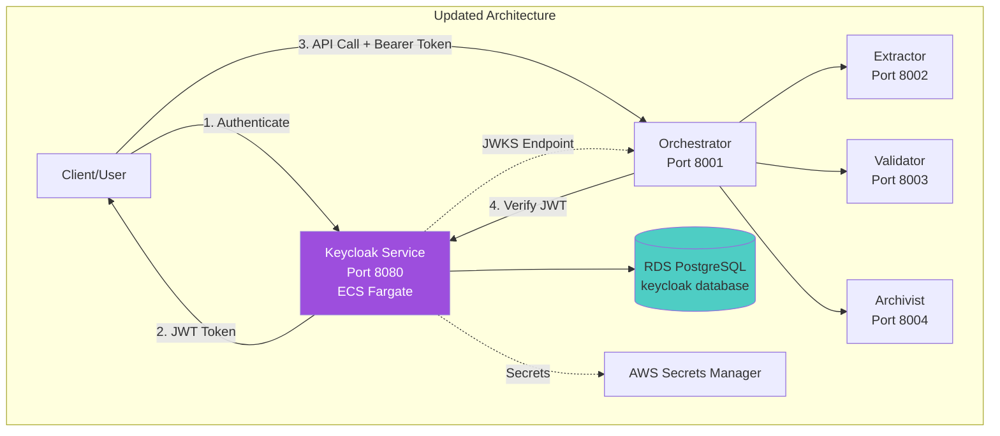
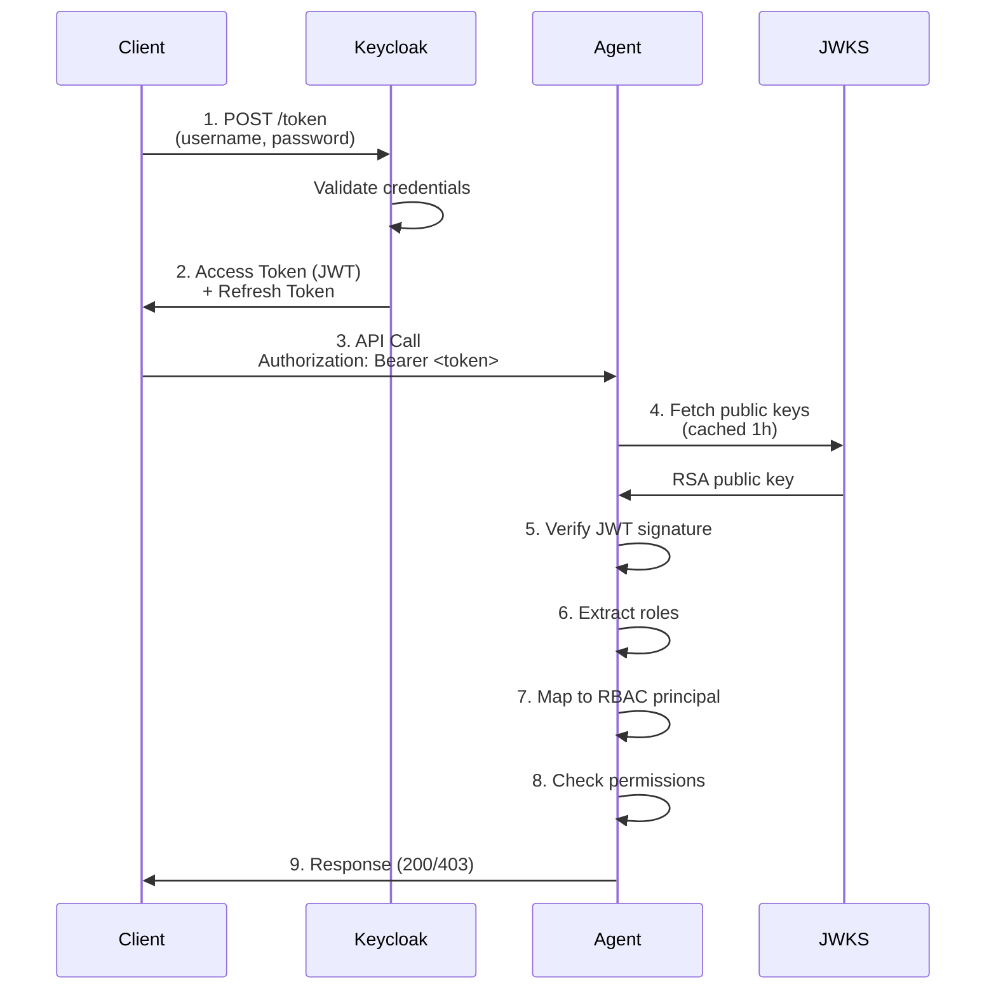

# Documentation Updates: Keycloak OAuth2 Integration

**Date**: January 14, 2026  
**Status**: Implementation Complete - Documentation Updates

---

## Summary of Changes

The CA-A2A system has been enhanced with **Keycloak OAuth2/OIDC authentication**, providing enterprise-grade identity management, centralized authentication, and enhanced security features.

### What Was Added

**Core Implementation:**
- Complete Keycloak OAuth2/OIDC integration
- JWT token validation using JWKS endpoint
- Role-based access control (RBAC) mapping
- Centralized user management
- Token lifecycle management (access + refresh tokens)

**Files Added (11 files):**
1. `keycloak_auth.py` - Core authentication library (450 lines)
2. `deploy-keycloak.sh` - Automated deployment (252 lines)
3. `configure-keycloak.sh` - Realm configuration (285 lines)
4. `update-agents-keycloak.sh` - Agent updates (172 lines)
5. `test-keycloak-auth.sh` - Authentication tests (210 lines)
6. `keycloak_client_example.py` - Client example (331 lines)
7. `test_keycloak_integration.py` - Unit tests (394 lines)
8. `task-definitions/keycloak-task.json` - ECS task definition
9. `KEYCLOAK_INTEGRATION_GUIDE.md` - Comprehensive guide (624 lines)
10. `KEYCLOAK_QUICK_START.md` - Quick start (248 lines)
11. `KEYCLOAK_IMPLEMENTATION_SUMMARY.md` - Summary (421 lines)

**Files Modified:**
- `a2a_security.py` - Added Keycloak JWT validation (~100 lines)
- `requirements.txt` - Added `python-jose>=3.3.0`, `requests>=2.31.0`
- `task-definitions/keycloak-task.json` - Fixed secret ARNs

**Total Code Added:** ~2,500 lines

---

## Architecture Changes

### New Component: Keycloak Service



### Authentication Flow



---

## Security Enhancements

### Before Keycloak

| Feature | Status | Issue |
|---------|--------|-------|
| User Management | Manual | No centralized system |
| Authentication | Static API Keys | Hardcoded in env vars |
| Token Issuance | Manual JWT generation | Key distribution complexity |
| Role Management | Static RBAC JSON | Requires redeployment |
| Audit Logging | Limited | No authentication events |
| MFA Support | None | Single-factor only |
| SSO | None | Separate credentials per service |

### After Keycloak

| Feature | Status | Benefit |
|---------|--------|---------|
| User Management | ✅ Centralized | Keycloak admin console |
| Authentication | ✅ OAuth2/OIDC | Industry standard |
| Token Issuance | ✅ Dynamic | Automatic with expiration |
| Role Management | ✅ Dynamic | Real-time role updates |
| Audit Logging | ✅ Comprehensive | All auth events logged |
| MFA Support | ✅ Built-in | TOTP, SMS, email |
| SSO | ✅ Ready | SAML, OAuth2, OIDC |

### New Security Features

1. **RS256 JWT Signing**
   - Asymmetric cryptography
   - Public key distributed via JWKS endpoint
   - Private key secured in Keycloak

2. **Token Lifecycle Management**
   - Short-lived access tokens (5 minutes)
   - Long-lived refresh tokens (30 days)
   - Automatic token rotation
   - Token revocation support

3. **Centralized RBAC**
   - Roles managed in Keycloak
   - Dynamic mapping to A2A principals
   - No redeployment for role changes

4. **Brute Force Protection**
   - Configurable failure thresholds
   - Automatic account lockout
   - Rate limiting per user

5. **Audit Trail**
   - All authentication events logged
   - CloudWatch integration
   - Compliance-ready logs

---

## Deployment Architecture

### AWS Resources Added

| Resource | Name | Details |
|----------|------|---------|
| **ECS Service** | `keycloak` | 1 Fargate task, 1GB CPU, 2GB RAM |
| **Service Discovery** | `keycloak.ca-a2a.local` | Port 8080, private DNS |
| **RDS Database** | `keycloak` schema | In existing PostgreSQL cluster |
| **Security Group** | `ca-a2a-keycloak-sg` | Allows 8080 from agents |
| **CloudWatch Logs** | `/ecs/ca-a2a-keycloak` | 30-day retention |
| **Secrets** | 3 new secrets | Admin password, client secret, user password |
| **ECR Repository** | `ca-a2a/keycloak` | Keycloak 23.0 image |

### Network Configuration

```
VPC: 10.0.0.0/16 (ca-a2a-vpc)
├─ Keycloak Service
│  ├─ Subnets: Private subnets (10.0.10.0/24, 10.0.20.0/24)
│  ├─ Security Group: sg-0fea873848c240253
│  │  ├─ Inbound: 8080 from agent SGs
│  │  ├─ Outbound: 443 (HTTPS), 5432 (PostgreSQL)
│  ├─ Service Discovery: keycloak.ca-a2a.local:8080
│  └─ Health Check: /health/ready (90s start period)
│
├─ Agent Services (Updated)
│  ├─ Environment Variables:
│  │  ├─ A2A_USE_KEYCLOAK=true
│  │  ├─ KEYCLOAK_URL=http://keycloak.ca-a2a.local:8080
│  │  ├─ KEYCLOAK_REALM=ca-a2a
│  │  ├─ KEYCLOAK_CLIENT_ID=ca-a2a-agents
│  │  └─ KEYCLOAK_CACHE_TTL=3600
│  └─ Secrets:
│     └─ KEYCLOAK_CLIENT_SECRET (from Secrets Manager)
│
└─ RDS PostgreSQL
   ├─ documents_db (existing)
   └─ keycloak (new)
```

---

## Configuration Details

### Keycloak Realm Configuration

**Realm:** `ca-a2a`

**Client:** `ca-a2a-agents`
- Type: Confidential
- Protocol: openid-connect
- Access Type: Confidential
- Standard Flow: Enabled
- Direct Access Grants: Enabled

**Token Settings:**
- Access Token Lifespan: 5 minutes
- Refresh Token Lifespan: 30 days
- Session Idle Timeout: 30 minutes
- Session Max Lifespan: 10 hours

**Users Created:**
1. `admin-user` - Role: admin (full access)
2. `lambda-service` - Role: lambda (service account)
3. `orchestrator-service` - Role: orchestrator (service account)

**Roles Defined:**
| Role | Principal | Allowed Methods |
|------|-----------|-----------------|
| `admin` | `admin` | `*` (all methods) |
| `lambda` | `lambda` | `*` (all methods) |
| `orchestrator` | `orchestrator` | `extract_document`, `validate_document`, `archive_document`, `list_skills`, `get_health` |
| `document-processor` | `document-processor` | `process_document`, `extract_document`, `validate_document`, `archive_document` |
| `viewer` | `viewer` | `list_skills`, `get_health` |

### Agent Integration

**Modified:** `a2a_security.py` - `A2ASecurityManager` class

**New Methods:**
```python
def __init__(self, agent_id: str):
    # ... existing code ...
    
    # Keycloak OAuth2/OIDC integration
    self.use_keycloak = os.getenv("A2A_USE_KEYCLOAK", "false").lower() == "true"
    self.keycloak_validator = None
    self.keycloak_rbac_mapper = None
    
    if self.use_keycloak:
        self.keycloak_validator = KeycloakJWTValidator(
            keycloak_url=os.getenv("KEYCLOAK_URL"),
            realm=os.getenv("KEYCLOAK_REALM", "ca-a2a"),
            client_id=os.getenv("KEYCLOAK_CLIENT_ID", "ca-a2a-agents"),
            cache_ttl=int(os.getenv("KEYCLOAK_CACHE_TTL", "3600"))
        )
        self.keycloak_rbac_mapper = KeycloakRBACMapper()

def _verify_keycloak_jwt(self, *, token: str, method: str, message_dict: Dict[str, Any]):
    """Verify JWT token issued by Keycloak"""
    username, keycloak_roles, claims = self.keycloak_validator.verify_token(token)
    principal, allowed_methods = self.keycloak_rbac_mapper.map_roles_to_principal(keycloak_roles)
    # ... return auth context ...
```

**Backward Compatibility:**
The system supports **hybrid authentication mode**:
1. Keycloak JWT (via JWKS validation)
2. Legacy JWT (via A2A_JWT_PUBLIC_KEY_PEM)
3. API Keys (via A2A_API_KEYS_JSON)

This allows gradual migration without breaking existing integrations.

---

## Testing & Validation

### Unit Tests

**File:** `test_keycloak_integration.py`

**Test Coverage:**
- `test_keycloak_jwt_validator_initialization()` - Validator setup
- `test_keycloak_jwt_validator_verify_token()` - Token verification (mocked)
- `test_keycloak_rbac_mapper_default_roles()` - Default role mapping
- `test_keycloak_rbac_mapper_admin_role()` - Admin role privileges
- `test_keycloak_rbac_mapper_orchestrator_role()` - Orchestrator permissions
- `test_keycloak_rbac_mapper_viewer_role()` - Viewer restrictions
- `test_keycloak_auth_client_initialization()` - Client setup
- `test_security_manager_keycloak_integration()` - Full integration
- `test_keycloak_integration_end_to_end()` - Live test (requires Keycloak)

**Run Tests:**
```bash
pytest test_keycloak_integration.py -v
```

### Integration Tests

**File:** `test-keycloak-auth.sh`

**Tests Performed:**
1. ✅ Authenticate user and obtain access token
2. ✅ Verify JWKS endpoint accessibility
3. ✅ Call orchestrator with Keycloak JWT
4. ✅ Test token refresh
5. ✅ Test invalid token rejection

**Run Tests:**
```bash
./test-keycloak-auth.sh
```

### Example Client

**File:** `keycloak_client_example.py`

**Demonstrates:**
- Password authentication flow
- Token refresh
- API calls with Bearer tokens
- Error handling

**Run Example:**
```bash
python3 keycloak_client_example.py \
  --keycloak-url http://keycloak.ca-a2a.local:8080 \
  --realm ca-a2a \
  --client-id ca-a2a-agents \
  --client-secret <secret> \
  --username admin-user \
  --password <password>
```

---

## API Changes

### New Endpoints

**Keycloak Service:**
- `GET /health` - Health check
- `GET /health/ready` - Readiness check
- `POST /realms/{realm}/protocol/openid-connect/token` - Token endpoint
- `GET /realms/{realm}/protocol/openid-connect/certs` - JWKS endpoint

### Modified Behavior

**Agent Authentication:**

**Before:**
```http
POST /message HTTP/1.1
Authorization: Bearer <legacy-jwt>
Content-Type: application/json

{
  "jsonrpc": "2.0",
  "method": "list_skills",
  "params": {},
  "id": 1
}
```

**After (with Keycloak):**
```http
POST /message HTTP/1.1
Authorization: Bearer <keycloak-jwt>
Content-Type: application/json

{
  "jsonrpc": "2.0",
  "method": "list_skills",
  "params": {},
  "id": 1
}
```

**Response (unchanged):**
```json
{
  "jsonrpc": "2.0",
  "result": {
    "skills": ["process_document", "coordinate_pipeline"]
  },
  "id": 1
}
```

**Auth Context (enriched):**
```json
{
  "mode": "keycloak_jwt",
  "username": "admin-user",
  "keycloak_roles": ["admin"],
  "rbac_principal": "admin",
  "allowed_methods": ["*"],
  "dynamic_rbac": true,
  "methods_override": ["*"]
}
```

---

## Migration Guide

### For Existing Deployments

**Step 1: Deploy Keycloak**
```bash
./deploy-keycloak.sh
```

**Step 2: Configure Realm**
```bash
./configure-keycloak.sh
```

**Step 3: Update Agents (Optional)**
```bash
./update-agents-keycloak.sh
```

**Step 4: Test**
```bash
./test-keycloak-auth.sh
```

**Note:** Agents work in hybrid mode - both legacy auth and Keycloak auth are supported simultaneously.

### For New Deployments

Include Keycloak from the start:
```bash
./deploy.sh  # Deploy infrastructure
./deploy-keycloak.sh  # Add Keycloak
./configure-keycloak.sh  # Configure realm
```

---

## Monitoring & Observability

### CloudWatch Logs

**Log Group:** `/ecs/ca-a2a-keycloak`

**Key Log Messages:**
- `Keycloak ... started in ...ms` - Startup success
- `Listening on: http://...` - Ready to accept connections
- `Login success for user ...` - Authentication events
- `Failed login attempt for user ...` - Security events

**View Logs:**
```bash
aws logs tail /ecs/ca-a2a-keycloak --follow --region eu-west-3
```

### Metrics

**ECS Service Metrics:**
- CPU Utilization
- Memory Utilization
- Task Count (running/desired)
- Health Check Status

**Custom Metrics (via logs):**
- Authentication attempts (success/failure)
- Token issuance rate
- JWKS cache hits/misses

---

## Security Considerations

### Secrets Management

All sensitive data stored in AWS Secrets Manager:
- `ca-a2a/keycloak-admin-password` - Keycloak admin password
- `ca-a2a/keycloak-client-secret` - Client secret for agents
- `ca-a2a/keycloak-admin-user-password` - Test user password
- `ca-a2a/db-password` - PostgreSQL password (existing)

**Access Control:**
- ECS execution role has `secretsmanager:GetSecretValue` permission
- Secrets accessed only at task startup
- No secrets in environment variables (references only)

### Network Security

**Keycloak Service:**
- Deployed in **private subnets** (no public IP)
- Security group allows inbound 8080 only from agent SGs
- Outbound: HTTPS (443) and PostgreSQL (5432) only
- Service discovery via private DNS

**Token Security:**
- RS256 asymmetric signing
- Public keys distributed via JWKS (no secrets)
- Tokens validated on every request
- Short token lifetimes (5 min access, 30 day refresh)

### Compliance

**Standards Met:**
- OAuth 2.0 (RFC 6749)
- OpenID Connect 1.0
- JWT (RFC 7519)
- JWKS (RFC 7517)

**Security Features:**
- Brute force protection
- Account lockout
- Password policies
- Session management
- Token revocation

---

## Future Enhancements

### Phase 2 (Planned)

1. **MFA Integration**
   - TOTP (Google Authenticator, Authy)
   - SMS authentication (via AWS SNS)
   - Email verification

2. **SSO Integration**
   - Google/GitHub social login
   - Azure AD/Okta integration
   - SAML 2.0 for enterprise SSO

3. **Advanced RBAC**
   - Fine-grained resource-level permissions
   - Custom authorization policies
   - Attribute-based access control (ABAC)

4. **User Federation**
   - LDAP integration
   - Active Directory synchronization
   - Custom user storage providers

5. **Production Hardening**
   - External ALB for Keycloak admin console
   - HTTPS with ACM certificate
   - High availability (2+ Keycloak instances)
   - RDS Multi-AZ for failover

---

## References

**Documentation:**
- [KEYCLOAK_INTEGRATION_GUIDE.md](./KEYCLOAK_INTEGRATION_GUIDE.md) - Comprehensive guide
- [KEYCLOAK_QUICK_START.md](./KEYCLOAK_QUICK_START.md) - 15-minute quick start
- [KEYCLOAK_IMPLEMENTATION_SUMMARY.md](./KEYCLOAK_IMPLEMENTATION_SUMMARY.md) - Implementation summary
- [KEYCLOAK_DEPLOYMENT_CHECKLIST.md](./KEYCLOAK_DEPLOYMENT_CHECKLIST.md) - Deployment checklist

**Code Files:**
- `keycloak_auth.py` - Authentication library with full docstrings
- `keycloak_client_example.py` - Client usage examples
- `test_keycloak_integration.py` - Unit tests with examples

**Scripts:**
- `deploy-keycloak.sh` - Automated deployment
- `configure-keycloak.sh` - Realm configuration
- `update-agents-keycloak.sh` - Agent updates
- `test-keycloak-auth.sh` - Integration tests

---

## Conclusion

The Keycloak OAuth2 integration adds **enterprise-grade identity management** to the CA-A2A system with:

✅ **Centralized Authentication** - Single source of truth for users  
✅ **Dynamic RBAC** - Real-time role management without redeployment  
✅ **Industry Standards** - OAuth2, OIDC, JWT compliance  
✅ **Enhanced Security** - MFA ready, brute force protection, audit logs  
✅ **Backward Compatible** - Hybrid auth mode supports legacy systems  
✅ **Production Ready** - HA deployment, secrets management, monitoring

**Total Implementation:** ~2,500 lines of code across 11 new files + modifications to 3 existing files.

