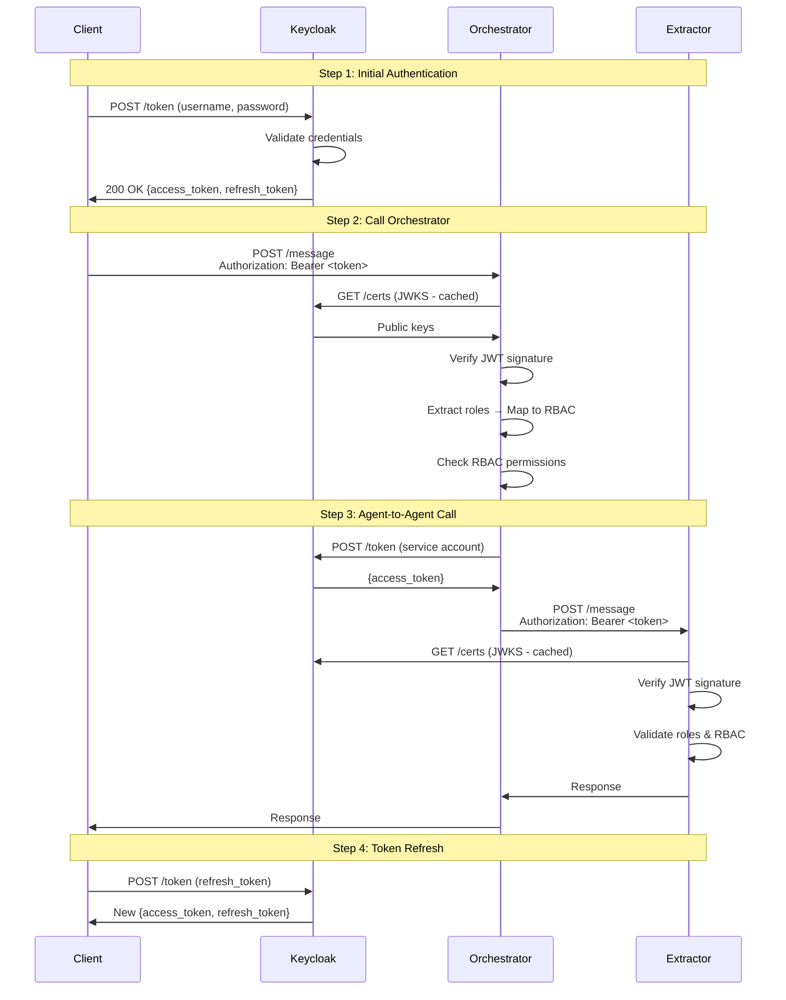

# Keycloak OAuth2 Integration for CA-A2A

Complete guide for deploying and using Keycloak OAuth2/OIDC authentication with the CA-A2A multi-agent document processing system.

## Table of Contents

1. [Overview](#overview)
2. [Architecture](#architecture)
3. [Deployment](#deployment)
4. [Configuration](#configuration)
5. [Client Integration](#client-integration)
6. [Testing](#testing)
7. [Troubleshooting](#troubleshooting)
8. [Security Considerations](#security-considerations)

---

## Overview

### What is Keycloak?

Keycloak is an open-source Identity and Access Management (IAM) solution that provides:

- **Centralized Authentication**: Single source of truth for users and credentials
- **OAuth2/OIDC Support**: Industry-standard authentication protocols
- **JWT Tokens**: Secure, stateless authentication tokens
- **Role-Based Access Control (RBAC)**: Fine-grained permissions management
- **MFA Support**: Multi-factor authentication (TOTP, SMS, email)
- **SSO**: Single Sign-On across multiple applications
- **User Federation**: LDAP, Active Directory integration

### Why Use Keycloak with CA-A2A?

**Before Keycloak:**
- Manual JWT key distribution
- Static API keys in environment variables
- No centralized user management
- Limited audit capabilities

**After Keycloak:**
- ✅ Centralized user and credential management
- ✅ Dynamic token issuance and revocation
- ✅ Built-in MFA and SSO support
- ✅ Comprehensive audit logs
- ✅ Easy user provisioning/deprovisioning
- ✅ Role-based access control with UI

---

## Architecture

### System Components

```
┌─────────────────────────────────────────────────────────────┐
│                     AWS VPC (10.0.0.0/16)                   │
│                                                             │
│  ┌─────────────────────────────────────────────────────┐   │
│  │ Public Subnet (10.0.1.0/24)                         │   │
│  │  └─ ALB (Optional - for external Keycloak access)   │   │
│  └─────────────────────────────────────────────────────┘   │
│                                                             │
│  ┌─────────────────────────────────────────────────────┐   │
│  │ Private Subnet 1 (10.0.10.0/24)                     │   │
│  │                                                      │   │
│  │  ┌──────────────────────────────────────────────┐   │   │
│  │  │ Keycloak (ECS Fargate)                       │   │   │
│  │  │ - Port 8080                                  │   │   │
│  │  │ - Service Discovery: keycloak.ca-a2a.local   │   │   │
│  │  │ - Database: PostgreSQL (shared with agents) │   │   │
│  │  └──────────────────────────────────────────────┘   │   │
│  │                                                      │   │
│  │  ┌──────────────────────────────────────────────┐   │   │
│  │  │ Orchestrator Agent                           │   │   │
│  │  │ - Validates Keycloak JWTs                    │   │   │
│  │  │ - Maps roles to RBAC permissions             │   │   │
│  │  └──────────────────────────────────────────────┘   │   │
│  │                                                      │   │
│  │  ┌──────────────────────────────────────────────┐   │   │
│  │  │ Extractor, Validator, Archivist Agents       │   │   │
│  │  │ - All use Keycloak for authentication        │   │   │
│  │  └──────────────────────────────────────────────┘   │   │
│  └─────────────────────────────────────────────────────┘   │
│                                                             │
│  ┌─────────────────────────────────────────────────────┐   │
│  │ Private Subnet 2 (10.0.20.0/24)                     │   │
│  │  └─ RDS Aurora PostgreSQL                           │   │
│  │     - documents_db (agents)                         │   │
│  │     - keycloak (Keycloak database)                  │   │
│  └─────────────────────────────────────────────────────┘   │
└─────────────────────────────────────────────────────────────┘
```

### Authentication Flow



### Role Mapping

Keycloak roles are mapped to A2A RBAC principals:

| Keycloak Role | RBAC Principal | Allowed Methods |
|---------------|----------------|-----------------|
| `admin` | `admin` | `*` (all methods) |
| `lambda` | `lambda` | `*` (all methods) |
| `orchestrator` | `orchestrator` | `extract_document`, `validate_document`, `archive_document`, `list_skills`, `get_health` |
| `document-processor` | `document-processor` | `process_document`, `extract_document`, `validate_document`, `archive_document` |
| `viewer` | `viewer` | `list_skills`, `get_health` |

---

## Deployment

### Prerequisites

- AWS account with ECS, RDS, and Secrets Manager access
- CA-A2A infrastructure already deployed (`deploy.sh` completed)
- AWS CLI configured
- CloudShell or VPC access for configuration

### Step 1: Deploy Keycloak Service

```bash
# From CloudShell or within VPC
cd ca_a2a

# Make scripts executable
chmod +x deploy-keycloak.sh
chmod +x configure-keycloak.sh
chmod +x update-agents-keycloak.sh
chmod +x test-keycloak-auth.sh

# Deploy Keycloak to ECS
./deploy-keycloak.sh
```

**What this does:**
1. Creates Keycloak admin password in Secrets Manager
2. Creates Keycloak database in RDS
3. Creates CloudWatch log group
4. Creates security group for Keycloak
5. Registers ECS task definition
6. Creates service discovery entry (keycloak.ca-a2a.local)
7. Deploys Keycloak service to ECS Fargate
8. Waits for service to become healthy

**Expected output:**
```
============================================
KEYCLOAK DEPLOYMENT COMPLETE
============================================

Keycloak Admin Console:
  Internal URL: http://keycloak.ca-a2a.local:8080
  Admin Username: admin
  Admin Password: (stored in Secrets Manager)

Next steps:
  1. Run ./configure-keycloak.sh to setup realm and clients
```

### Step 2: Configure Keycloak Realm

```bash
# This must be run from within the VPC (ECS task or bastion)
./configure-keycloak.sh
```

**What this does:**
1. Creates realm: `ca-a2a`
2. Creates roles: `admin`, `lambda`, `orchestrator`, `document-processor`, `viewer`
3. Creates client: `ca-a2a-agents` (with client secret)
4. Creates service account users:
   - `lambda-service` (role: lambda)
   - `orchestrator-service` (role: orchestrator)
   - `admin-user` (role: admin)
5. Stores client secret and user passwords in Secrets Manager

**Expected output:**
```
============================================
KEYCLOAK CONFIGURATION COMPLETE
============================================

Realm: ca-a2a
Client ID: ca-a2a-agents
Client Secret: (stored in ca-a2a/keycloak-client-secret)

Service Accounts Created:
  - lambda-service (role: lambda)
  - orchestrator-service (role: orchestrator)
  - admin-user (role: admin)

Token Endpoint:
  http://keycloak.ca-a2a.local:8080/realms/ca-a2a/protocol/openid-connect/token

JWKS Endpoint:
  http://keycloak.ca-a2a.local:8080/realms/ca-a2a/protocol/openid-connect/certs
```

### Step 3: Update Agent Services

```bash
# Update all agent task definitions to use Keycloak
./update-agents-keycloak.sh
```

**What this does:**
1. Adds Keycloak environment variables to all agent task definitions
2. Adds Keycloak client secret to all agents
3. Registers updated task definitions
4. Optionally triggers service redeployment

**Environment variables added:**
```bash
A2A_USE_KEYCLOAK=true
KEYCLOAK_URL=http://keycloak.ca-a2a.local:8080
KEYCLOAK_REALM=ca-a2a
KEYCLOAK_CLIENT_ID=ca-a2a-agents
KEYCLOAK_CACHE_TTL=3600
```

**Secrets added:**
```bash
KEYCLOAK_CLIENT_SECRET → arn:aws:secretsmanager:...:secret:ca-a2a/keycloak-client-secret
```

---

## Configuration

### Keycloak Environment Variables

Add to agent task definitions:

```json
{
  "environment": [
    {"name": "A2A_USE_KEYCLOAK", "value": "true"},
    {"name": "KEYCLOAK_URL", "value": "http://keycloak.ca-a2a.local:8080"},
    {"name": "KEYCLOAK_REALM", "value": "ca-a2a"},
    {"name": "KEYCLOAK_CLIENT_ID", "value": "ca-a2a-agents"},
    {"name": "KEYCLOAK_CACHE_TTL", "value": "3600"}
  ],
  "secrets": [
    {
      "name": "KEYCLOAK_CLIENT_SECRET",
      "valueFrom": "arn:aws:secretsmanager:eu-west-3:555043101106:secret:ca-a2a/keycloak-client-secret"
    }
  ]
}
```

### Hybrid Mode (Keycloak + Legacy JWT/API Keys)

To support both Keycloak and legacy authentication:

```bash
# Enable Keycloak but keep A2A_REQUIRE_AUTH flexible
A2A_USE_KEYCLOAK=true
A2A_REQUIRE_AUTH=true

# Legacy JWT still works if token is not from Keycloak
A2A_JWT_PUBLIC_KEY_PEM=<legacy-public-key>

# API keys still work
A2A_API_KEYS_JSON={"lambda": "api-key-here"}
```

Authentication priority:
1. Check if JWT is from Keycloak (validate with JWKS)
2. If not, try legacy JWT validation
3. If no JWT, try API key
4. If all fail, reject with 401

---

## Client Integration

### Python Client Example

```python
from keycloak_auth import KeycloakAuthClient
import requests

# Initialize client
auth_client = KeycloakAuthClient(
    keycloak_url="http://keycloak.ca-a2a.local:8080",
    realm="ca-a2a",
    client_id="ca-a2a-agents",
    client_secret="<from-secrets-manager>"
)

# Authenticate and get token
access_token, refresh_token, expires_in = auth_client.authenticate_password(
    username="admin-user",
    password="<from-secrets-manager>"
)

# Call orchestrator with token
response = requests.post(
    "http://orchestrator.ca-a2a.local:8001/message",
    headers={
        "Content-Type": "application/json",
        "Authorization": f"Bearer {access_token}"
    },
    json={
        "jsonrpc": "2.0",
        "id": 1,
        "method": "process_document",
        "params": {
            "document_id": "doc-123",
            "s3_bucket": "ca-a2a-documents-555043101106",
            "s3_key": "invoice.pdf"
        }
    }
)

print(response.json())
```

### Shell Script Example

```bash
#!/bin/bash

# Get credentials from Secrets Manager
CLIENT_SECRET=$(aws secretsmanager get-secret-value \
    --secret-id ca-a2a/keycloak-client-secret \
    --query SecretString --output text)

USER_PASSWORD=$(aws secretsmanager get-secret-value \
    --secret-id ca-a2a/keycloak-admin-user-password \
    --query SecretString --output text)

# Authenticate and get token
TOKEN_RESPONSE=$(curl -s -X POST \
    "http://keycloak.ca-a2a.local:8080/realms/ca-a2a/protocol/openid-connect/token" \
    -d "grant_type=password" \
    -d "client_id=ca-a2a-agents" \
    -d "client_secret=$CLIENT_SECRET" \
    -d "username=admin-user" \
    -d "password=$USER_PASSWORD")

ACCESS_TOKEN=$(echo "$TOKEN_RESPONSE" | jq -r '.access_token')

# Call orchestrator
curl -X POST "http://orchestrator.ca-a2a.local:8001/message" \
    -H "Content-Type: application/json" \
    -H "Authorization: Bearer $ACCESS_TOKEN" \
    -d '{
        "jsonrpc": "2.0",
        "id": 1,
        "method": "list_skills",
        "params": {}
    }'
```

---

## Testing

### Test Script

```bash
# Run comprehensive Keycloak authentication test
./test-keycloak-auth.sh
```

**Tests performed:**
1. ✅ Authenticate user and obtain access token
2. ✅ Verify JWKS endpoint is accessible
3. ✅ Call orchestrator service with Keycloak JWT
4. ✅ Test token refresh
5. ✅ Test invalid token rejection

**Expected output:**
```
============================================
KEYCLOAK AUTHENTICATION TEST COMPLETE
============================================

Summary:
  ✓ Token Endpoint: Working
  ✓ JWKS Endpoint: Accessible
  ✓ Token Issuance: Successful
  ✓ Token Refresh: Working
  ✓ Service Integration: Tested

Keycloak authentication is properly configured!
```

### Manual Testing

1. **Get a token:**
   ```bash
   curl -X POST "http://keycloak.ca-a2a.local:8080/realms/ca-a2a/protocol/openid-connect/token" \
     -d "grant_type=password" \
     -d "client_id=ca-a2a-agents" \
     -d "client_secret=<secret>" \
     -d "username=admin-user" \
     -d "password=<password>"
   ```

2. **Inspect token claims:**
   ```bash
   # Decode JWT (payload part)
   echo "<access_token>" | cut -d'.' -f2 | base64 -d | jq
   ```

3. **Call service with token:**
   ```bash
   curl -X POST "http://orchestrator.ca-a2a.local:8001/message" \
     -H "Authorization: Bearer <access_token>" \
     -H "Content-Type: application/json" \
     -d '{"jsonrpc":"2.0","id":1,"method":"list_skills","params":{}}'
   ```

---

## Troubleshooting

### Issue: Cannot reach Keycloak URL

**Symptom:**
```
curl: (7) Failed to connect to keycloak.ca-a2a.local port 8080
```

**Solution:**
- Keycloak is only accessible from within the VPC
- Run tests from CloudShell, ECS task, or bastion host
- Check security groups allow inbound on port 8080

### Issue: Invalid token signature

**Symptom:**
```
{"error": {"code": -32600, "message": "Invalid Keycloak JWT: Signature verification failed"}}
```

**Solutions:**
1. Verify Keycloak URL matches in agent configuration
2. Check JWKS endpoint is accessible from agents
3. Ensure token is not expired
4. Verify issuer claim matches Keycloak realm URL

### Issue: Keycloak service not starting

**Symptom:**
```
Task failed health checks
```

**Solutions:**
1. Check CloudWatch logs:
   ```bash
   aws logs tail /ecs/ca-a2a-keycloak --follow --region eu-west-3
   ```

2. Verify database connectivity:
   - Check security groups allow Keycloak → RDS
   - Verify database `keycloak` exists in RDS
   - Check database password in Secrets Manager

3. Increase task memory if needed (default: 2048 MB)

### Issue: RBAC permission denied

**Symptom:**
```
{"error": {"code": 403, "message": "Keycloak role does not permit method 'process_document'"}}
```

**Solutions:**
1. Check user roles in Keycloak admin console
2. Verify role mapping in `keycloak_auth.py`
3. Add role to user:
   ```bash
   # Via Keycloak API or admin console
   # Users → <username> → Role Mappings → Assign Role
   ```

---

## Security Considerations

### Token Lifetime

**Current configuration:**
- Access token: 5 minutes (300 seconds)
- Refresh token: 30 days (2,592,000 seconds)
- Session max: 10 hours (36,000 seconds)

**Recommendations:**
- Keep access tokens short-lived (5-15 minutes)
- Use refresh tokens for long-running applications
- Implement token revocation for compromised credentials

### Network Security

**Current setup:**
- Keycloak is in private subnet (no direct internet access)
- Only accessible via service discovery (keycloak.ca-a2a.local)
- Security groups restrict access to agent services only

**For external access:**
1. Add ALB in public subnet
2. Configure ALB listener for HTTPS (port 443)
3. Use ACM certificate for TLS
4. Restrict ALB security group to specific IP ranges

### Secrets Management

**Current implementation:**
- ✅ Keycloak admin password in Secrets Manager
- ✅ Client secret in Secrets Manager
- ✅ User passwords in Secrets Manager
- ✅ Database password in Secrets Manager

**Best practices:**
- Rotate secrets regularly (30-90 days)
- Use IAM policies for least-privilege access
- Enable secret rotation with Lambda
- Audit secret access in CloudTrail

### Audit Logging

**Keycloak audit events:**
- Login success/failure
- Token issuance
- User role changes
- Client secret access

**Access logs:**
```bash
# View Keycloak logs
aws logs tail /ecs/ca-a2a-keycloak --follow --region eu-west-3

# Search for authentication events
aws logs filter-log-events \
    --log-group-name /ecs/ca-a2a-keycloak \
    --filter-pattern "LOGIN" \
    --region eu-west-3
```

### Compliance

**OAuth2/OIDC Standards:**
- ✅ RFC 6749 (OAuth 2.0 Authorization Framework)
- ✅ RFC 7519 (JSON Web Token)
- ✅ RFC 7517 (JSON Web Key)
- ✅ OpenID Connect Core 1.0

**Security Standards:**
- ✅ OWASP API Security Top 10
- ✅ NIST SP 800-63B (Digital Identity Guidelines)
- ✅ PCI DSS compliant (with proper configuration)

---

## References

- [Keycloak Documentation](https://www.keycloak.org/documentation)
- [OAuth 2.0 RFC 6749](https://datatracker.ietf.org/doc/html/rfc6749)
- [OpenID Connect](https://openid.net/connect/)
- [JWT Best Practices](https://datatracker.ietf.org/doc/html/rfc8725)
- [AWS ECS Security](https://docs.aws.amazon.com/AmazonECS/latest/bestpracticesguide/security.html)

---

## Summary

Keycloak integration provides:

- ✅ **Centralized Authentication** - Single source of truth
- ✅ **Industry Standards** - OAuth2/OIDC compliance
- ✅ **Enhanced Security** - MFA, token rotation, audit logs
- ✅ **Scalability** - Supports thousands of users and services
- ✅ **Flexibility** - Hybrid mode with legacy authentication
- ✅ **Production Ready** - Battle-tested IAM solution

Next steps:
1. Deploy Keycloak: `./deploy-keycloak.sh`
2. Configure realm: `./configure-keycloak.sh`
3. Update agents: `./update-agents-keycloak.sh`
4. Test authentication: `./test-keycloak-auth.sh`
5. Integrate into applications using provided examples

For questions or issues, refer to troubleshooting section or Keycloak documentation.

