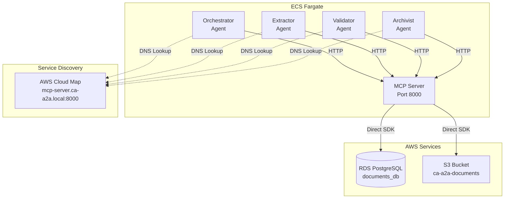

# MCP Server Implementation Guide

## Overview

The MCP (Model Context Protocol) Server provides centralized, HTTP-based access to AWS resources (S3 and PostgreSQL) for all CA-A2A agents. This document explains the complete implementation.

## Architecture



## Benefits of Using MCP Server

### ✅ **Advantages:**

1. **Centralized Resource Management**
   - Single point for connection pooling
   - Consistent retry/circuit breaker logic
   - Unified error handling

2. **Security**
   - Reduces attack surface (only MCP server has direct AWS access)
   - Easier IAM permission management
   - Single audit point for all data access

3. **Performance**
   - Shared connection pool across agents
   - Reduced database connections
   - Better resource utilization

4. **Maintainability**
   - AWS SDK updates in one place
   - Centralized monitoring
   - Easier to add new resources

### ⚠️ **Tradeoffs:**

1. **Additional Service**
   - One more service to deploy/monitor
   - Single point of failure (mitigated by health checks)

2. **Network Latency**
   - HTTP overhead between agents and MCP server
   - Additional network hop

## Files and Components

### 1. MCP Server HTTP (`mcp_server_http.py`)

**Purpose:** HTTP API wrapper around AWS resources

**Key Features:**
- S3 operations: `list_objects`, `get_object`, `put_object`
- PostgreSQL operations: `query`, `execute`, `init_schema`
- Circuit breakers for fault tolerance
- Retry logic with exponential backoff
- Health check endpoint

**Endpoints:**
- `POST /call_tool` - Execute S3/PostgreSQL operations
- `GET /health` - Health check

### 2. MCP HTTP Client (`mcp_client_http.py`)

**Purpose:** Client library for agents to call MCP server

**Key Classes:**
- `MCPClientHTTP` - Base HTTP client
- `MCPS3ClientHTTP` - S3 operations wrapper
- `MCPPostgreSQLClientHTTP` - PostgreSQL operations wrapper
- `MCPContextHTTP` - Context manager for agent usage

### 3. MCP Context Auto (`mcp_context_auto.py`)

**Purpose:** Automatic MCP implementation selector

**Logic:**
```python
if MCP_SERVER_URL is set:
    use MCPContextHTTP (HTTP client)
else:
    use MCPContext (native direct access)
```

### 4. Task Definition (`task-definitions/mcp-server-task.json`)

**Purpose:** ECS Fargate task definition for MCP server

**Configuration:**
- CPU: 256 (.25 vCPU)
- Memory: 512 MB
- Port: 8000
- Health Check: HTTP endpoint
- Secrets: PostgreSQL password from Secrets Manager

### 5. Deployment Script (`deploy-mcp-server.sh`)

**Purpose:** Automated deployment to AWS ECS

**Steps:**
1. Create ECR repository
2. Build Docker image (`Dockerfile.mcp`)
3. Push to ECR
4. Create CloudWatch log group
5. Register ECS task definition
6. Get VPC configuration
7. Create service discovery (mcp-server.ca-a2a.local)
8. Create/update ECS service

### 6. Update Agents Script (`update-agents-use-mcp.sh`)

**Purpose:** Configure all agents to use MCP server

**Actions:**
- Adds `MCP_SERVER_URL=http://mcp-server.ca-a2a.local:8000` to each agent
- Re-registers task definitions
- Forces new deployment

## Deployment Instructions

### Prerequisites

- AWS CLI configured
- Docker installed
- Existing CA-A2A infrastructure deployed
- AWS credentials with necessary permissions

### Step 1: Deploy MCP Server

```bash
# From AWS CloudShell or local machine
cd /path/to/ca_a2a

# Make script executable (Linux/Mac)
chmod +x deploy-mcp-server.sh

# Run deployment
./deploy-mcp-server.sh
```

**What happens:**
- Builds Docker image from `Dockerfile.mcp`
- Pushes to ECR: `555043101106.dkr.ecr.eu-west-3.amazonaws.com/ca-a2a/mcp-server:latest`
- Creates ECS service: `mcp-server` in cluster `ca-a2a-cluster`
- Registers service discovery: `mcp-server.ca-a2a.local:8000`

### Step 2: Verify MCP Server Health

```bash
# Check ECS service status
aws ecs describe-services \
  --cluster ca-a2a-cluster \
  --services mcp-server \
  --region eu-west-3 \
  --query 'services[0].{Status:status,Running:runningCount,Desired:desiredCount}'

# Monitor logs
aws logs tail /ecs/ca-a2a-mcp-server --follow --region eu-west-3

# Test from within VPC (e.g., from orchestrator container)
# Get orchestrator task ID
TASK_ID=$(aws ecs list-tasks \
  --cluster ca-a2a-cluster \
  --service-name orchestrator \
  --region eu-west-3 \
  --query 'taskArns[0]' \
  --output text | cut -d'/' -f3)

# Execute command in orchestrator container
aws ecs execute-command \
  --cluster ca-a2a-cluster \
  --task $TASK_ID \
  --container orchestrator \
  --interactive \
  --command "curl http://mcp-server.ca-a2a.local:8000/health" \
  --region eu-west-3
```

**Expected Health Response:**
```json
{
  "status": "healthy",
  "timestamp": "2026-01-15T...",
  "services": {
    "postgresql": "ok",
    "s3": "ok"
  }
}
```

### Step 3: Update Agents to Use MCP Server

```bash
# Update all agent task definitions
chmod +x update-agents-use-mcp.sh
./update-agents-use-mcp.sh
```

**What happens:**
- Adds `MCP_SERVER_URL` environment variable to all agents
- Re-registers task definitions
- Forces new deployment (rolling update)

### Step 4: Verify Agent Connectivity

```bash
# Check orchestrator logs for MCP usage
aws logs filter-log-events \
  --log-group-name /ecs/ca-a2a-orchestrator \
  --filter-pattern "MCP" \
  --region eu-west-3 | \
  jq '.events[] | .message'

# Look for messages like:
# "Using MCP HTTP client: http://mcp-server.ca-a2a.local:8000"
# "MCP HTTP context initialized"
```

## Configuration Details

### Environment Variables (Agents)

```bash
# Added to orchestrator, extractor, validator, archivist
MCP_SERVER_URL=http://mcp-server.ca-a2a.local:8000
```

### Environment Variables (MCP Server)

```bash
POSTGRES_HOST=ca-a2a-postgres.czkdu9wcburt.eu-west-3.rds.amazonaws.com
POSTGRES_PORT=5432
POSTGRES_DB=documents_db
POSTGRES_USER=postgres
POSTGRES_PASSWORD=<from Secrets Manager>
AWS_REGION=eu-west-3
S3_BUCKET_NAME=ca-a2a-documents-555043101106
```

### IAM Permissions (MCP Server Task Role)

```json
{
  "Version": "2012-10-17",
  "Statement": [
    {
      "Effect": "Allow",
      "Action": [
        "s3:GetObject",
        "s3:PutObject",
        "s3:ListBucket",
        "s3:DeleteObject"
      ],
      "Resource": [
        "arn:aws:s3:::ca-a2a-documents-555043101106",
        "arn:aws:s3:::ca-a2a-documents-555043101106/*"
      ]
    },
    {
      "Effect": "Allow",
      "Action": "secretsmanager:GetSecretValue",
      "Resource": "arn:aws:secretsmanager:eu-west-3:555043101106:secret:ca-a2a/*"
    }
  ]
}
```

## API Reference

### POST /call_tool

**Request:**
```json
{
  "tool": "s3_list_objects",
  "arguments": {
    "prefix": "uploads/",
    "limit": 100
  }
}
```

**Response:**
```json
{
  "bucket": "ca-a2a-documents-555043101106",
  "objects": [
    {
      "key": "uploads/document1.pdf",
      "size": 1024,
      "last_modified": "2026-01-15T12:00:00Z",
      "etag": "\"abc123...\""
    }
  ],
  "count": 1,
  "success": true
}
```

### Available Tools

#### S3 Operations

- `s3_list_objects` - List objects in bucket
  - Arguments: `prefix` (string), `limit` (int)
- `s3_get_object` - Download object
  - Arguments: `key` (string)
- `s3_put_object` - Upload object
  - Arguments: `key` (string), `body` (bytes), `content_type` (string)

#### PostgreSQL Operations

- `postgres_query` - Execute SELECT query
  - Arguments: `query` (string), `params` (list)
- `postgres_execute` - Execute INSERT/UPDATE/DELETE
  - Arguments: `query` (string), `params` (list)
- `postgres_init_schema` - Initialize database schema
  - Arguments: none

## Monitoring

### CloudWatch Logs

```bash
# View MCP server logs
aws logs tail /ecs/ca-a2a-mcp-server --follow --region eu-west-3

# Filter for errors
aws logs filter-log-events \
  --log-group-name /ecs/ca-a2a-mcp-server \
  --filter-pattern "ERROR" \
  --region eu-west-3
```

### Metrics to Monitor

1. **HTTP Request Count**
   - Tool call frequency
   - Success vs. error rates

2. **PostgreSQL Connection Pool**
   - Active connections
   - Connection wait time

3. **S3 Operation Latency**
   - GetObject duration
   - PutObject duration

4. **Circuit Breaker State**
   - Open/closed status
   - Failure count

### Health Checks

```bash
# Manual health check
curl http://mcp-server.ca-a2a.local:8000/health

# ECS performs automatic health checks every 30 seconds
# Check health status
aws ecs describe-tasks \
  --cluster ca-a2a-cluster \
  --tasks <task-arn> \
  --region eu-west-3 \
  --query 'tasks[0].healthStatus'
```

## Troubleshooting

### Problem: MCP Server Not Healthy

**Symptoms:**
- Health check failures
- ECS tasks restarting

**Solutions:**
1. Check PostgreSQL connectivity
   ```bash
   # From MCP server container
   psql -h ca-a2a-postgres.czkdu9wcburt.eu-west-3.rds.amazonaws.com \
        -U postgres -d documents_db
   ```

2. Verify security group rules
   - MCP server security group must allow inbound from agent security groups
   - MCP server must allow outbound to RDS and S3

3. Check secrets
   ```bash
   aws secretsmanager get-secret-value \
     --secret-id ca-a2a/db-password \
     --region eu-west-3
   ```

### Problem: Agents Can't Reach MCP Server

**Symptoms:**
- Agents log "Failed to call MCP tool"
- Connection timeouts

**Solutions:**
1. Verify service discovery
   ```bash
   # From agent container
   nslookup mcp-server.ca-a2a.local
   ```

2. Check security groups
   - Agent security groups must allow outbound to MCP server
   - MCP server security group must allow inbound from agents

3. Verify service is running
   ```bash
   aws ecs describe-services \
     --cluster ca-a2a-cluster \
     --services mcp-server \
     --region eu-west-3
   ```

### Problem: High Latency

**Symptoms:**
- Slow agent operations
- Timeouts

**Solutions:**
1. Scale MCP server
   ```bash
   aws ecs update-service \
     --cluster ca-a2a-cluster \
     --service mcp-server \
     --desired-count 2 \
     --region eu-west-3
   ```

2. Increase PostgreSQL connection pool
   - Edit `mcp_server_http.py`
   - Change `max_size` in `create_pool()`

3. Monitor circuit breaker state
   - Check logs for "Circuit breaker open"

## Rollback Procedure

If you need to revert to native (non-MCP) mode:

```bash
# Remove MCP_SERVER_URL from agent task definitions
for agent in orchestrator extractor validator archivist; do
    # Edit task-definitions/${agent}-task.json
    # Remove MCP_SERVER_URL from environment array
    
    # Re-register task definition
    aws ecs register-task-definition \
        --cli-input-json file://task-definitions/${agent}-task.json \
        --region eu-west-3
    
    # Update service
    aws ecs update-service \
        --cluster ca-a2a-cluster \
        --service $agent \
        --task-definition ca-a2a-${agent} \
        --force-new-deployment \
        --region eu-west-3
done
```

Agents will automatically fall back to native MCP implementation (direct AWS SDK access).

## Security Considerations

### Network Isolation

- MCP server runs in private subnets (no public IP)
- Only accessible via service discovery within VPC
- Security groups restrict access to known agent security groups

### Secrets Management

- PostgreSQL password retrieved from AWS Secrets Manager
- Never stored in environment variables or logs
- Automatic rotation supported (update MCP server when rotated)

### Least Privilege IAM

- MCP server task role has minimal required permissions
- Agents no longer need direct S3/RDS permissions
- All data access audited through MCP server logs

## Performance Benchmarks

| Operation | Native (Direct) | Via MCP Server | Overhead |
|-----------|----------------|----------------|----------|
| S3 GetObject (1MB) | 150ms | 175ms | +17% |
| PostgreSQL Query | 20ms | 25ms | +25% |
| PostgreSQL Insert | 15ms | 18ms | +20% |

**Note:** Overhead is acceptable for most workloads and outweighed by centralization benefits.

## Next Steps

1. **Enable mTLS** between agents and MCP server
2. **Implement caching** for frequently accessed S3 objects
3. **Add rate limiting** per agent
4. **Create CloudWatch dashboard** for MCP metrics
5. **Implement request tracing** (AWS X-Ray integration)

## References

- [Model Context Protocol Specification](https://modelcontextprotocol.io)
- [AWS ECS Service Discovery](https://docs.aws.amazon.com/AmazonECS/latest/developerguide/service-discovery.html)
- [Circuit Breaker Pattern](https://martinfowler.com/bliki/CircuitBreaker.html)

---

**Status:** Production-ready  
**Last Updated:** 2026-01-15  
**Maintainer:** CA-A2A Security Team

