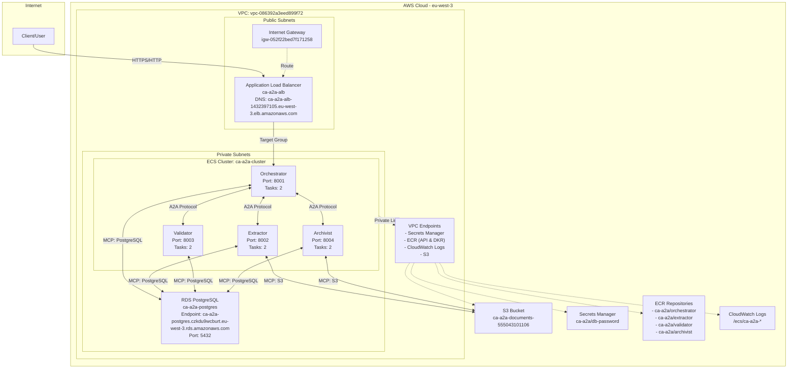
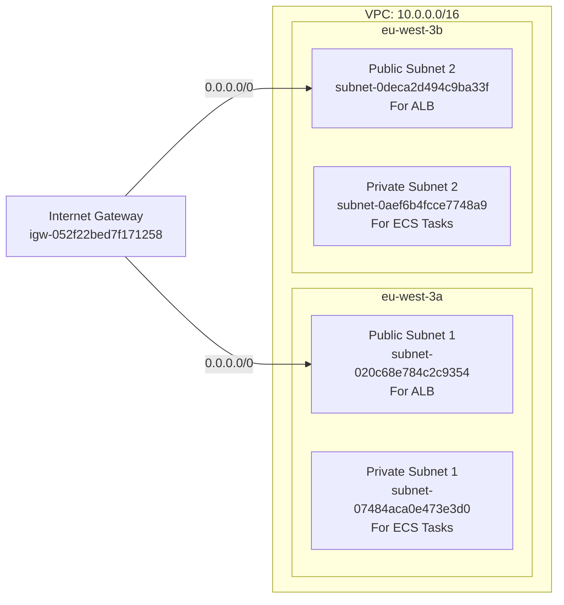
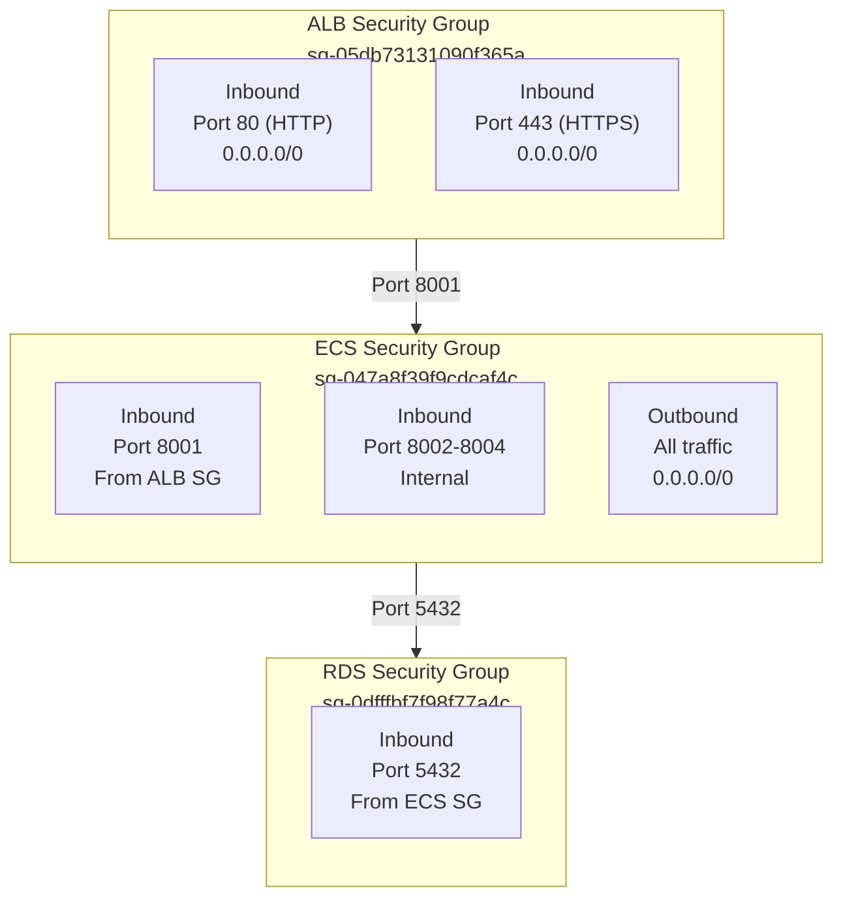
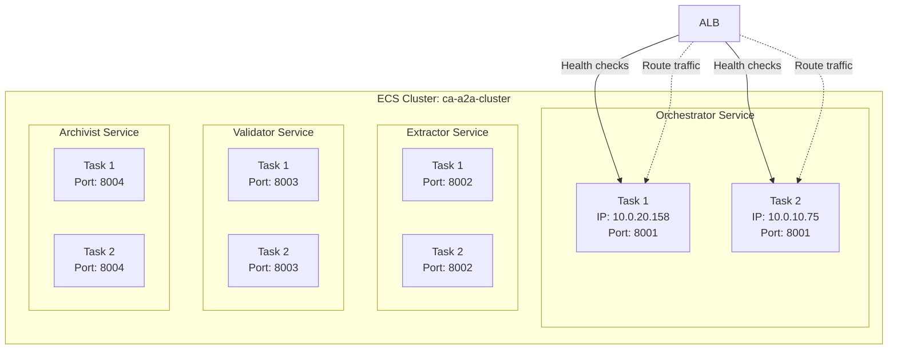
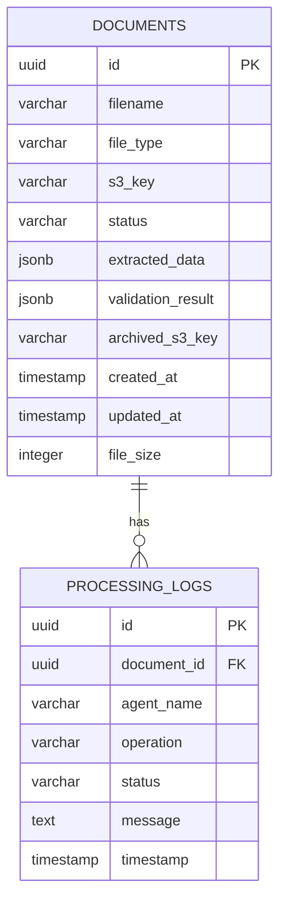
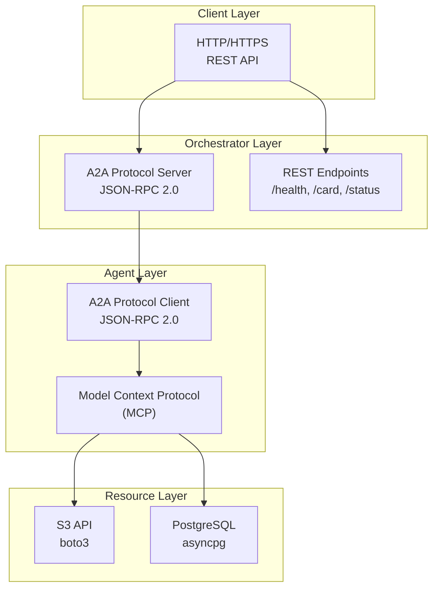
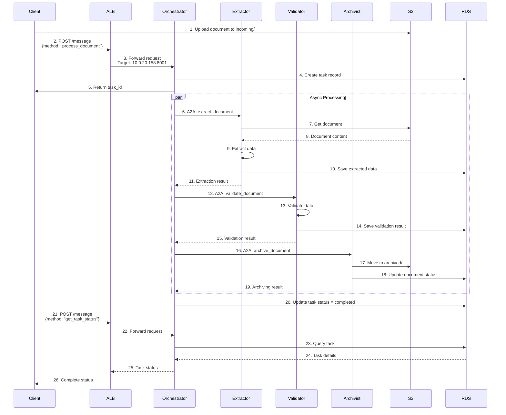
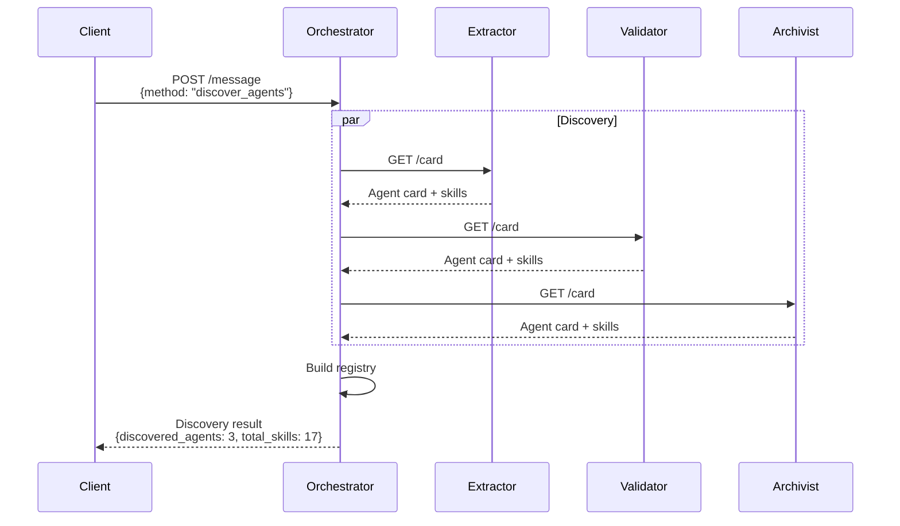
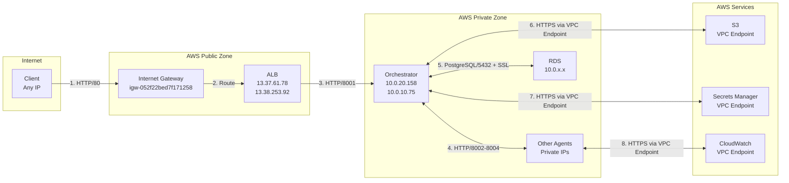
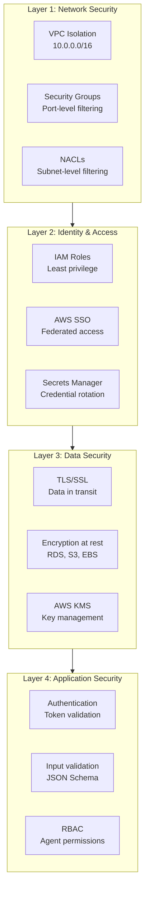

# CA-A2A System Architecture & Network Documentation

**Document Version:** 1.0 
**Last Updated:** December 18, 2025 
**Region:** eu-west-3 (Paris)

---

## Table of Contents

1. [System Overview](#system-overview)
2. [Network Architecture](#network-architecture)
3. [Component Details](#component-details)
4. [Protocol Stack](#protocol-stack)
5. [Data Flow](#data-flow)
6. [Security Architecture](#security-architecture)

---

## 1. System Overview

The CA-A2A (Credit Agricole Agent-to-Agent) system is an intelligent document processing pipeline built on AWS using a multi-agent architecture with the A2A protocol.

### High-Level Architecture



---

## 2. Network Architecture

### 2.1 VPC Configuration

**VPC Details:**
- **VPC ID:** `vpc-086392a3eed899f72`
- **CIDR Block:** `10.0.0.0/16`
- **Region:** `eu-west-3` (Paris)
- **Availability Zones:** `eu-west-3a`, `eu-west-3b`

### 2.2 Subnet Layout



### 2.3 Route Tables

**Main Route Table:** `rtb-0ec94e9c7c6ffbb24`

| Destination | Target | Purpose |
|-------------|--------|---------|
| `10.0.0.0/16` | `local` | VPC internal routing |
| `0.0.0.0/0` | `igw-052f22bed7f171258` | Internet access |

### 2.4 Security Groups



**Security Group Rules:**

| Security Group | Type | Protocol | Port | Source | Purpose |
|----------------|------|----------|------|--------|---------|
| `sg-05db73131090f365a` (ALB) | Inbound | TCP | 80 | `0.0.0.0/0` | HTTP from internet |
| `sg-05db73131090f365a` (ALB) | Inbound | TCP | 443 | `0.0.0.0/0` | HTTPS from internet |
| `sg-047a8f39f9cdcaf4c` (ECS) | Inbound | TCP | 8001 | ALB SG | Orchestrator from ALB |
| `sg-047a8f39f9cdcaf4c` (ECS) | Inbound | TCP | 8002-8004 | Self | Agent-to-agent |
| `sg-047a8f39f9cdcaf4c` (ECS) | Outbound | All | All | `0.0.0.0/0` | External access |
| `sg-0dfffbf7f98f77a4c` (RDS) | Inbound | TCP | 5432 | ECS SG | PostgreSQL from ECS |

---

## 3. Component Details

### 3.1 Application Load Balancer

**Configuration:**
- **Name:** `ca-a2a-alb`
- **ARN:** `arn:aws:elasticloadbalancing:eu-west-3:555043101106:loadbalancer/app/ca-a2a-alb/3c05d16b10706799`
- **DNS:** `ca-a2a-alb-1432397105.eu-west-3.elb.amazonaws.com`
- **Scheme:** `internet-facing`
- **IP Type:** `ipv4`
- **IPs:** `13.37.61.78`, `13.38.253.92`

**Listener Configuration:**
- **Protocol:** HTTP
- **Port:** 80
- **Default Action:** Forward to target group

**Target Group:**
- **Name:** `ca-a2a-orch-tg`
- **ARN:** `arn:aws:elasticloadbalancing:eu-west-3:555043101106:targetgroup/ca-a2a-orch-tg/5bc795b288397779`
- **Protocol:** HTTP
- **Port:** 8001
- **Health Check Path:** `/health`
- **Health Check Interval:** 30 seconds
- **Healthy Threshold:** 2
- **Unhealthy Threshold:** 2
- **Timeout:** 5 seconds

**Current Targets:**
- `10.0.20.158:8001` - Healthy
- `10.0.10.75:8001` - Healthy

### 3.2 ECS Services



**Service Details:**

| Service | Image | Port | Desired | Running | Task Definition |
|---------|-------|------|---------|---------|-----------------|
| orchestrator | `555043101106.dkr.ecr.eu-west-3.amazonaws.com/ca-a2a/orchestrator:latest` | 8001 | 2 | 2 | ca-a2a-orchestrator:6 |
| extractor | `555043101106.dkr.ecr.eu-west-3.amazonaws.com/ca-a2a/extractor:latest` | 8002 | 2 | 2 | ca-a2a-extractor:6 |
| validator | `555043101106.dkr.ecr.eu-west-3.amazonaws.com/ca-a2a/validator:latest` | 8003 | 2 | 2 | ca-a2a-validator:6 |
| archivist | `555043101106.dkr.ecr.eu-west-3.amazonaws.com/ca-a2a/archivist:latest` | 8004 | 2 | 2 | ca-a2a-archivist:6 |

**Task Configuration:**
- **Launch Type:** Fargate
- **Platform Version:** 1.4.0
- **CPU:** 256 (.25 vCPU)
- **Memory:** 512 MB
- **Network Mode:** `awsvpc`

### 3.3 RDS PostgreSQL

**Configuration:**
- **Identifier:** `ca-a2a-postgres`
- **Engine:** PostgreSQL 15.7
- **Instance Class:** `db.t3.micro`
- **Endpoint:** `ca-a2a-postgres.czkdu9wcburt.eu-west-3.rds.amazonaws.com:5432`
- **Database:** `documents_db`
- **Multi-AZ:** No
- **Publicly Accessible:** No
- **Storage:** 20 GB (gp2)
- **Backup Retention:** 7 days
- **Encryption:** Enabled (at rest)
- **SSL/TLS:** Required

**Database Schema:**



### 3.4 S3 Storage

**Bucket:** `ca-a2a-documents-555043101106`

**Folder Structure:**
```
ca-a2a-documents-555043101106/
├── incoming/ # Uploaded documents awaiting processing
├── processed/ # Successfully processed documents
├── archived/ # Long-term archived documents
└── failed/ # Failed processing attempts
```

**Bucket Policy:** Private (accessed via IAM roles)

---

## 4. Protocol Stack

### 4.1 Protocol Architecture



### 4.2 A2A Protocol (Agent-to-Agent)

**Based on:** JSON-RPC 2.0 Specification

**Endpoint:** `POST /message`

**Message Format:**

```json
{
 "jsonrpc": "2.0",
 "method": "method_name",
 "params": {
 "param1": "value1"
 },
 "id": 1
}
```

**Response Format:**

```json
{
 "jsonrpc": "2.0",
 "result": {
 "key": "value"
 },
 "id": 1,
 "_meta": {
 "correlation_id": "uuid"
 }
}
```

**Error Format:**

```json
{
 "jsonrpc": "2.0",
 "error": {
 "code": -32600,
 "message": "Error description",
 "data": {}
 },
 "id": 1
}
```

**Standard Error Codes:**
- `-32700`: Parse error
- `-32600`: Invalid request
- `-32601`: Method not found
- `-32602`: Invalid params
- `-32603`: Internal error

### 4.3 MCP (Model Context Protocol)

**Purpose:** Unified access to resources (S3, PostgreSQL)

**Features:**
- Connection pooling
- Retry logic with exponential backoff
- Circuit breaker pattern
- Timeout management
- SSL/TLS encryption

**S3 Resource Methods:**
- `get_object(key)` - Retrieve file from S3
- `put_object(key, data)` - Upload file to S3
- `list_objects(prefix, suffix)` - List files
- `delete_object(key)` - Delete file

**PostgreSQL Resource Methods:**
- `execute(query, *args)` - Execute INSERT/UPDATE/DELETE
- `fetch(query, *args)` - Fetch multiple rows
- `fetchrow(query, *args)` - Fetch single row
- `fetchval(query, *args)` - Fetch single value

---

## 5. Data Flow

### 5.1 Document Processing Pipeline



### 5.2 Agent Discovery Flow



### 5.3 Network Traffic Flow



---

## 6. Security Architecture

### 6.1 Security Layers



### 6.5 Application security (A2A hardening)

Public entrypoint: **ALB → Orchestrator** (`POST /message`).

- **Authentication**
 - External client: `X-API-Key`
 - Agent-to-agent: **JWT Bearer** (short-lived, request-bound)
- **Authorization (RBAC)**: allow-list by principal (`A2A_RBAC_POLICY_JSON`)
- **Replay protection**: JWT `jti` nonce cache with TTL
- **Rate limiting**: per-principal sliding window (abuse resistance)
- **Payload size limits**: aiohttp `client_max_size` (DoS resistance)
- **Capability disclosure minimization**: `/card` and `/skills` can be **RBAC-filtered** (`A2A_CARD_VISIBILITY_MODE=rbac`)

Implementation reference:
- `a2a_security.py` (AuthN/AuthZ, replay, rate limiting)
- `base_agent.py` (enforcement on `/message`, RBAC-filtered `/card` + `/skills`)

Evidence:
- `DEMO_SECURITY_EVIDENCE.md` (captured outputs)
- `SECURITY.md` (security summary)

### 6.2 IAM Roles

**ECS Task Execution Role:** `ca-a2a-ecs-execution-role`
- Pull images from ECR
- Write logs to CloudWatch
- Read secrets from Secrets Manager

**ECS Task Role:** `ca-a2a-ecs-task-role`
- Access S3 bucket
- Connect to RDS (via security group)

### 6.3 Secrets Management

**Secrets stored in AWS Secrets Manager:**
- `ca-a2a/db-password` - RDS master password
- Retrieved at runtime via VPC endpoint
- Never hardcoded in code or environment variables

### 6.4 Encryption

**In Transit:**
- ALB to Internet: HTTP (HTTPS ready)
- ALB to ECS: HTTP (internal network)
- ECS to RDS: PostgreSQL with SSL/TLS (`ssl='require'`)
- ECS to S3: HTTPS via VPC endpoint
- ECS to Secrets Manager: HTTPS via VPC endpoint

**At Rest:**
- RDS: Encrypted with AWS KMS
- S3: Server-side encryption (SSE-S3)
- EBS volumes: Encrypted

---

## 7. Monitoring & Observability

### 7.1 CloudWatch Logs

**Log Groups:**
- `/ecs/ca-a2a-orchestrator` - Orchestrator logs
- `/ecs/ca-a2a-extractor` - Extractor logs
- `/ecs/ca-a2a-validator` - Validator logs
- `/ecs/ca-a2a-archivist` - Archivist logs

**Log Format:** JSON structured logging
**Retention:** 7 days (default)

### 7.2 Metrics

**ALB Metrics:**
- Target response time
- Healthy/unhealthy host count
- Request count
- HTTP 4xx/5xx errors

**ECS Metrics:**
- CPU utilization
- Memory utilization
- Task count
- Service deployment status

**RDS Metrics:**
- Database connections
- CPU utilization
- Free storage space
- Read/write IOPS

---

## 8. IP Address Reference

### External IPs
- **ALB:** `13.37.61.78`, `13.38.253.92`

### Internal IPs (Private)
- **Orchestrator Tasks:** `10.0.20.158`, `10.0.10.75`
- **Other agents:** Dynamic IPs in `10.0.0.0/16` range
- **RDS:** Private IP in VPC (accessed via DNS)

### DNS Names
- **ALB:** `ca-a2a-alb-1432397105.eu-west-3.elb.amazonaws.com`
- **RDS:** `ca-a2a-postgres.czkdu9wcburt.eu-west-3.rds.amazonaws.com`

---

## 9. Quick Reference

### API Endpoint
```
http://ca-a2a-alb-1432397105.eu-west-3.elb.amazonaws.com
```

### Available Protocols
- **REST:** GET /health, /card, /status, /skills
- **A2A (JSON-RPC 2.0):** POST /message

### Network Ports
- **80** - ALB HTTP listener
- **8001** - Orchestrator service
- **8002** - Extractor service
- **8003** - Validator service
- **8004** - Archivist service
- **5432** - PostgreSQL RDS

---

**End of Architecture Documentation**

