# CA A2A Multi-Agent Pipeline - Technical Deep Dive

A comprehensive technical explanation of the distributed multi-agent document processing system using A2A (Agent-to-Agent) protocol and AWS cloud infrastructure.

## Table of Contents

1. [System Overview](#system-overview)
2. [Architecture Layers](#architecture-layers)
3. [Network Topology](#network-topology)
4. [Agent Communication Protocol](#agent-communication-protocol)
5. [Document Processing Flow](#document-processing-flow)
6. [AWS Infrastructure](#aws-infrastructure)
7. [Data Flow & State Management](#data-flow--state-management)
8. [Service Discovery](#service-discovery)
9. [Security & Resilience](#security--resilience)
10. [Deployment Architecture](#deployment-architecture)

---

## System Overview

### What is CA A2A?

CA A2A is a **distributed multi-agent system** for intelligent document processing. It uses autonomous agents that communicate via the **A2A (Agent-to-Agent) protocol** to extract, validate, and archive structured data from documents (PDF and CSV).

### Key Concepts

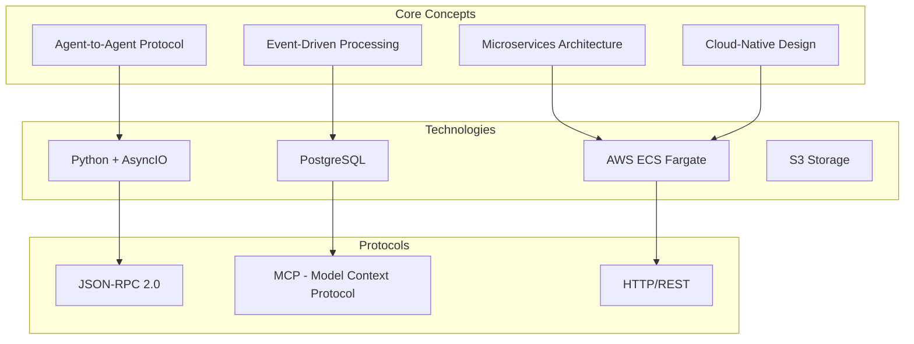

### System Components

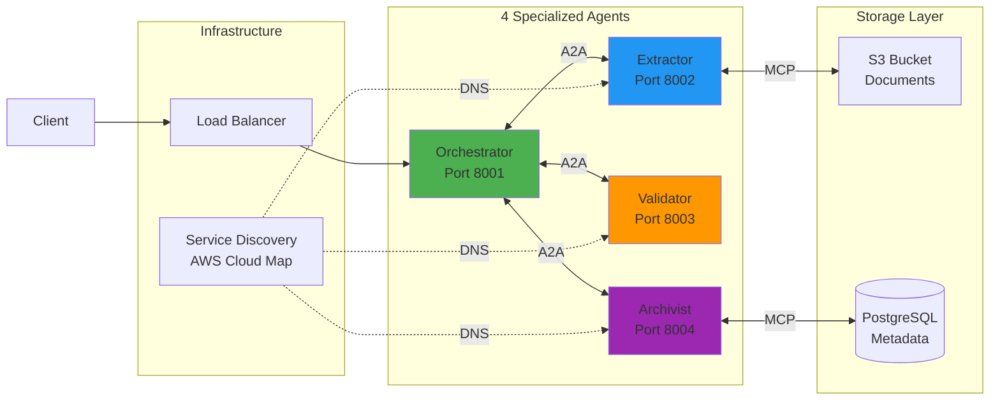

---

## Architecture Layers

The system is organized in distinct layers, each with specific responsibilities.

### Layer Architecture

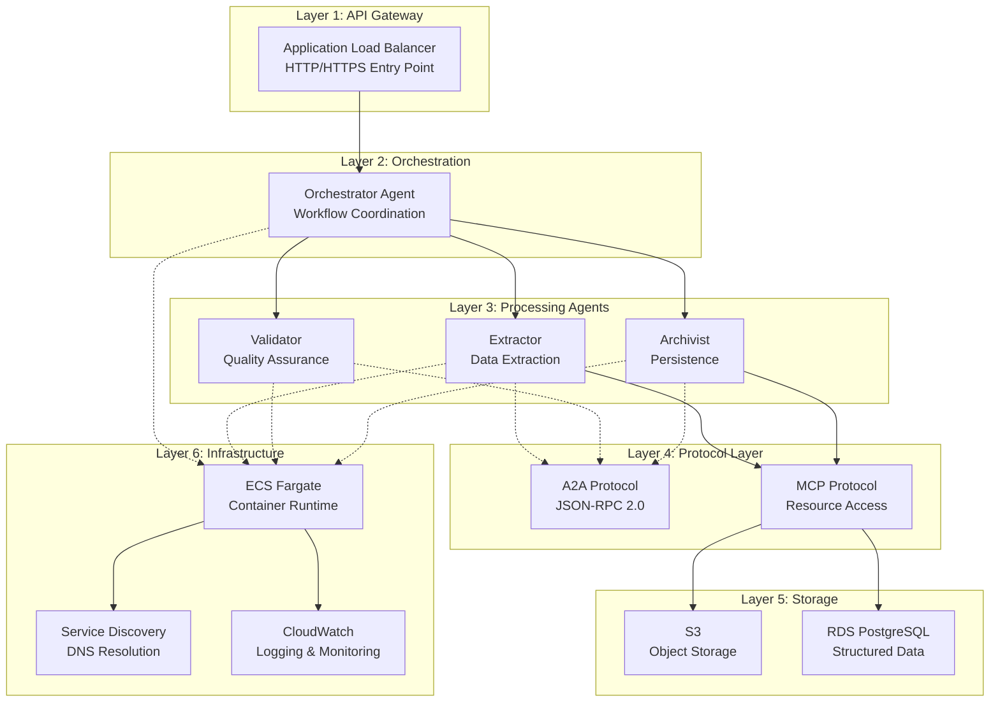

### Responsibilities by Layer

| Layer | Purpose | Components | Technology |
|-------|---------|------------|------------|
| **API Gateway** | External access point | ALB | AWS ELB |
| **Orchestration** | Workflow management | Orchestrator | Python AsyncIO |
| **Processing** | Business logic | 3 specialized agents | Python + Libraries |
| **Protocol** | Communication standards | A2A, MCP | JSON-RPC 2.0 |
| **Storage** | Data persistence | S3, RDS | AWS managed |
| **Infrastructure** | Runtime & ops | ECS, CloudWatch | AWS services |

---

## Network Topology

### AWS VPC Architecture

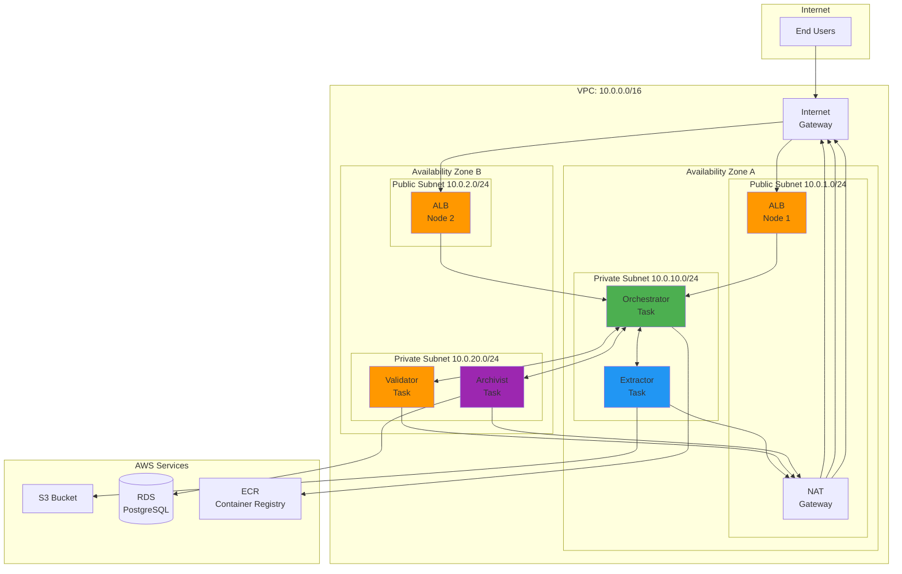

### Network Flow Explanation

1. **Public Subnets (10.0.1.0/24, 10.0.2.0/24)**
   - Host Application Load Balancer
   - Host NAT Gateway for outbound traffic
   - Direct route to Internet Gateway

2. **Private Subnets (10.0.10.0/24, 10.0.20.0/24)**
   - Host ECS Fargate tasks (agents)
   - No direct internet access
   - Route outbound through NAT Gateway
   - Access AWS services via service endpoints

3. **Security Groups**
   ```mermaid
   graph LR
       subgraph "Security Groups"
           SG1[ALB-SG<br/>Allow 80/443<br/>from Internet]
           SG2[ECS-SG<br/>Allow 8000-8999<br/>from ALB-SG]
           SG3[RDS-SG<br/>Allow 5432<br/>from ECS-SG]
       end

       Internet --> SG1
       SG1 --> SG2
       SG2 --> SG3
   ```

---

## Agent Communication Protocol

### A2A Protocol (JSON-RPC 2.0)

The A2A protocol enables standardized, reliable communication between agents.

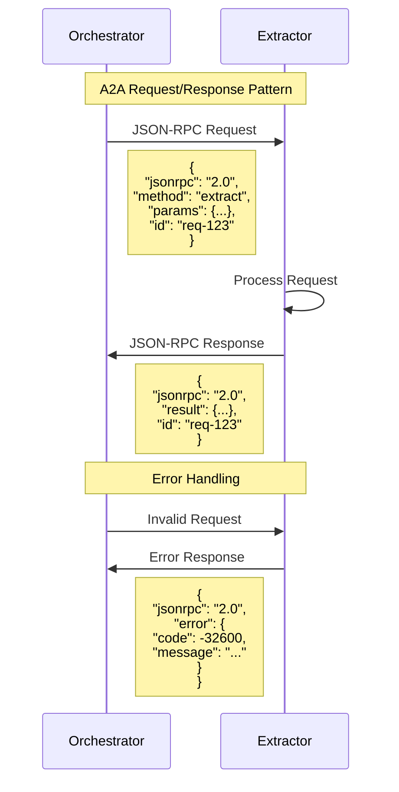

### Message Structure

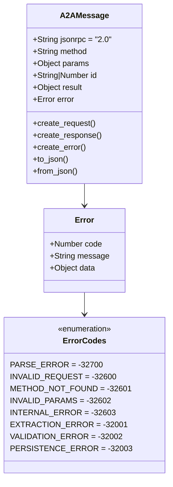

### Communication Patterns

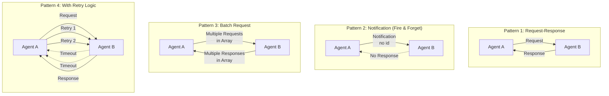

---

## Document Processing Flow

### Complete Workflow

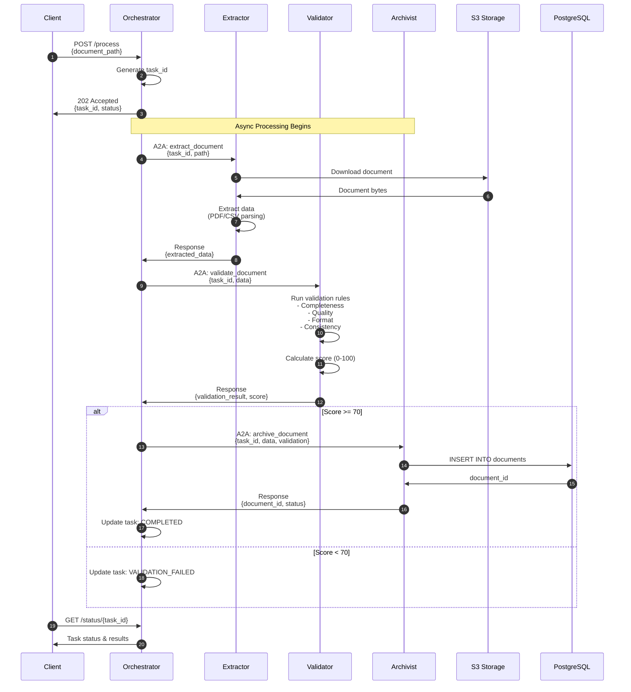

### State Machine

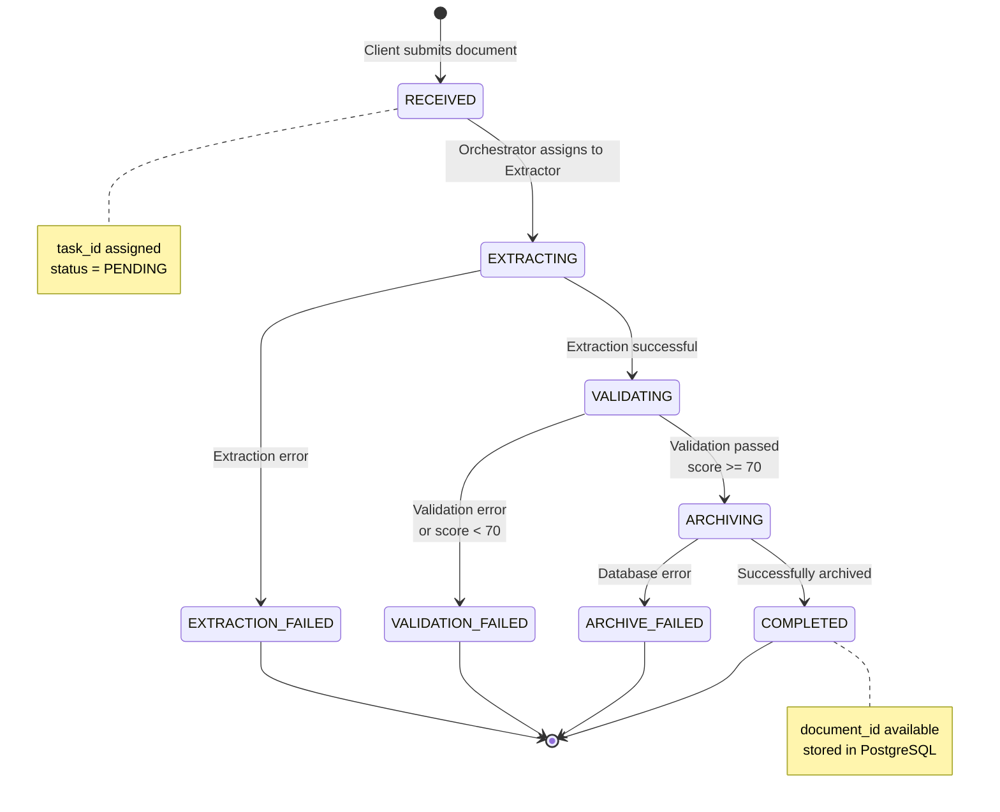

### Data Transformation Pipeline

```mermaid
graph LR
    subgraph "Input"
        DOC[PDF/CSV<br/>Document]
    end

    subgraph "Extraction Stage"
        E1[File Type<br/>Detection]
        E2[Content<br/>Parsing]
        E3[Structure<br/>Extraction]
    end

    subgraph "Validation Stage"
        V1[Completeness<br/>Check]
        V2[Quality<br/>Assessment]
        V3[Format<br/>Validation]
        V4[Score<br/>Calculation]
    end

    subgraph "Archival Stage"
        A1[Data<br/>Normalization]
        A2[Metadata<br/>Enrichment]
        A3[Database<br/>Insert]
    end

    subgraph "Output"
        RES[Structured<br/>Record]
    end

    DOC --> E1
    E1 --> E2
    E2 --> E3
    E3 --> V1
    V1 --> V2
    V2 --> V3
    V3 --> V4
    V4 --> A1
    A1 --> A2
    A2 --> A3
    A3 --> RES

    style E1 fill:#2196F3
    style E2 fill:#2196F3
    style E3 fill:#2196F3
    style V1 fill:#FF9800
    style V2 fill:#FF9800
    style V3 fill:#FF9800
    style V4 fill:#FF9800
    style A1 fill:#9C27B0
    style A2 fill:#9C27B0
    style A3 fill:#9C27B0
```

---

## AWS Infrastructure

### ECS Fargate Deployment

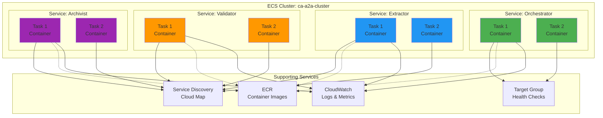

### Container Architecture

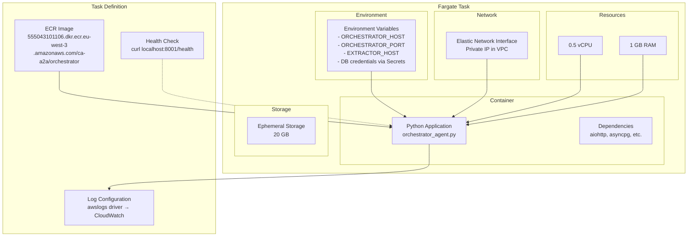

### Auto-Scaling Configuration

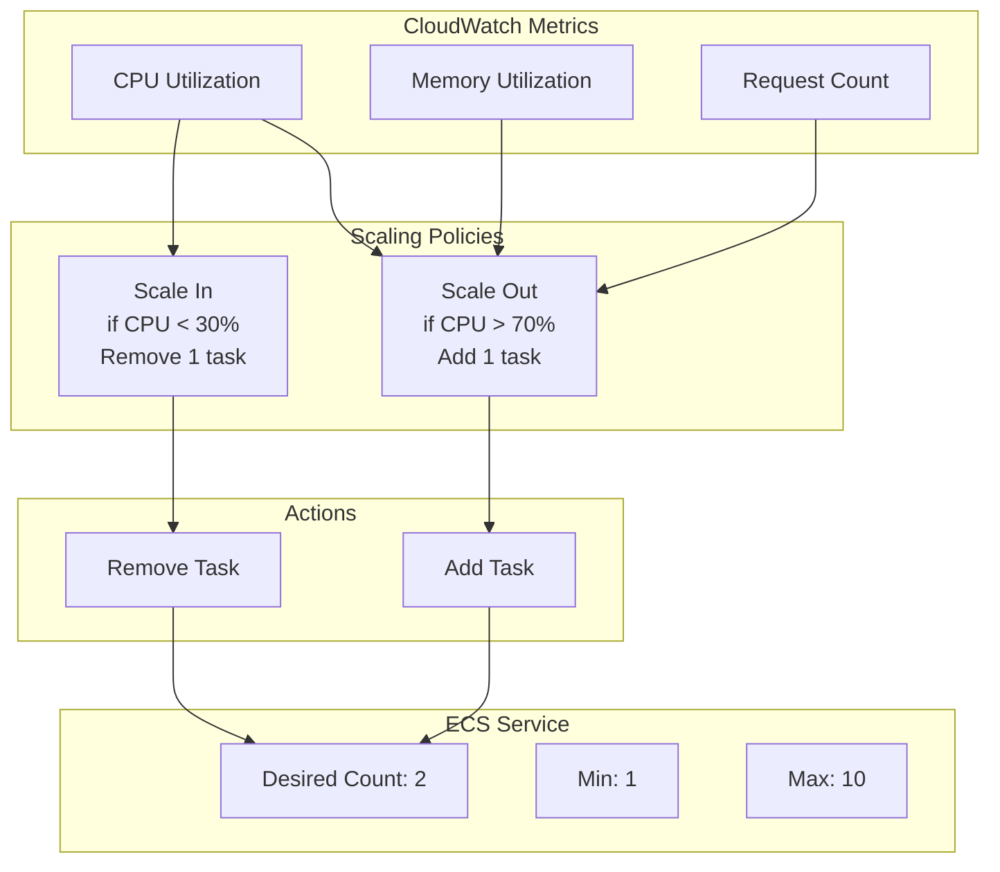

---

## Data Flow & State Management

### Data Models

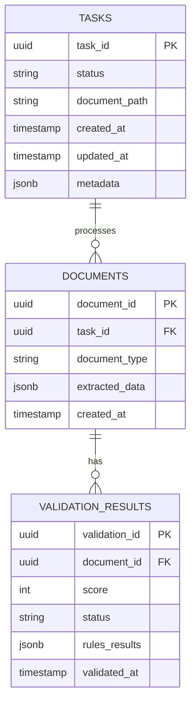

### Storage Strategy

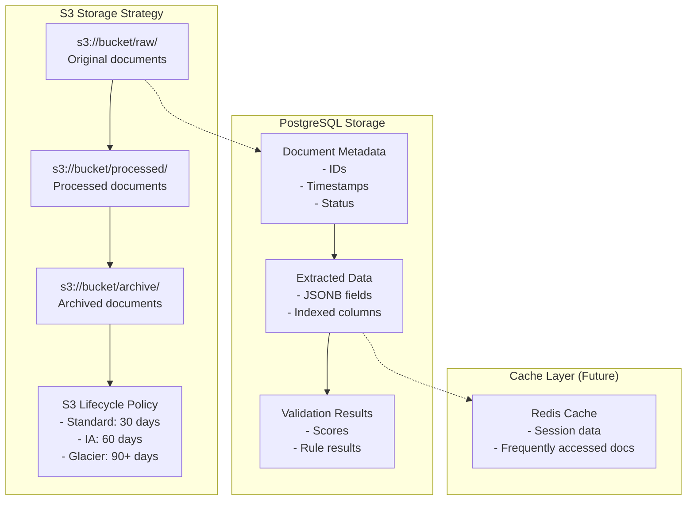

### Transaction Flow

```mermaid
sequenceDiagram
    participant O as Orchestrator
    participant E as Extractor
    participant V as Validator
    participant A as Archivist
    participant DB as Database

    Note over O,DB: Transaction Boundaries

    rect rgb(200, 220, 255)
        Note over O: Transaction 1: Task Creation
        O->>O: BEGIN
        O->>O: INSERT task (status=PENDING)
        O->>O: COMMIT
    end

    rect rgb(220, 255, 200)
        Note over O,E: Transaction 2: Extraction
        O->>O: UPDATE task (status=EXTRACTING)
        O->>E: Extract request
        E->>E: Process document
        E->>O: Response
        O->>O: UPDATE task (status=EXTRACTED)
    end

    rect rgb(255, 220, 200)
        Note over O,V: Transaction 3: Validation
        O->>O: UPDATE task (status=VALIDATING)
        O->>V: Validate request
        V->>V: Run rules
        V->>O: Response
        O->>O: UPDATE task (status=VALIDATED)
    end

    rect rgb(255, 200, 220)
        Note over O,A,DB: Transaction 4: Archival
        O->>A: Archive request
        A->>DB: BEGIN
        A->>DB: INSERT document
        A->>DB: INSERT validation
        A->>DB: COMMIT
        A->>O: Response
        O->>O: UPDATE task (status=COMPLETED)
    end
```

---

## Service Discovery

### AWS Cloud Map Integration

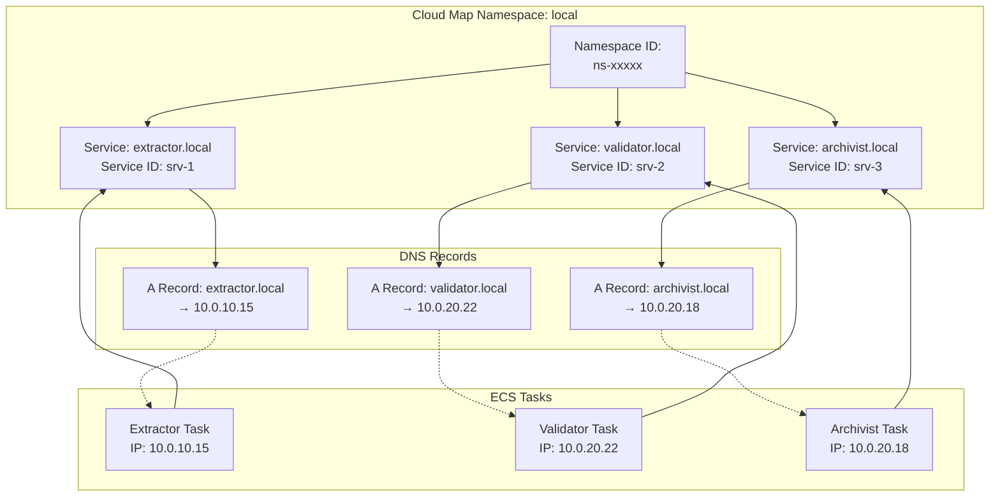

### Discovery Process

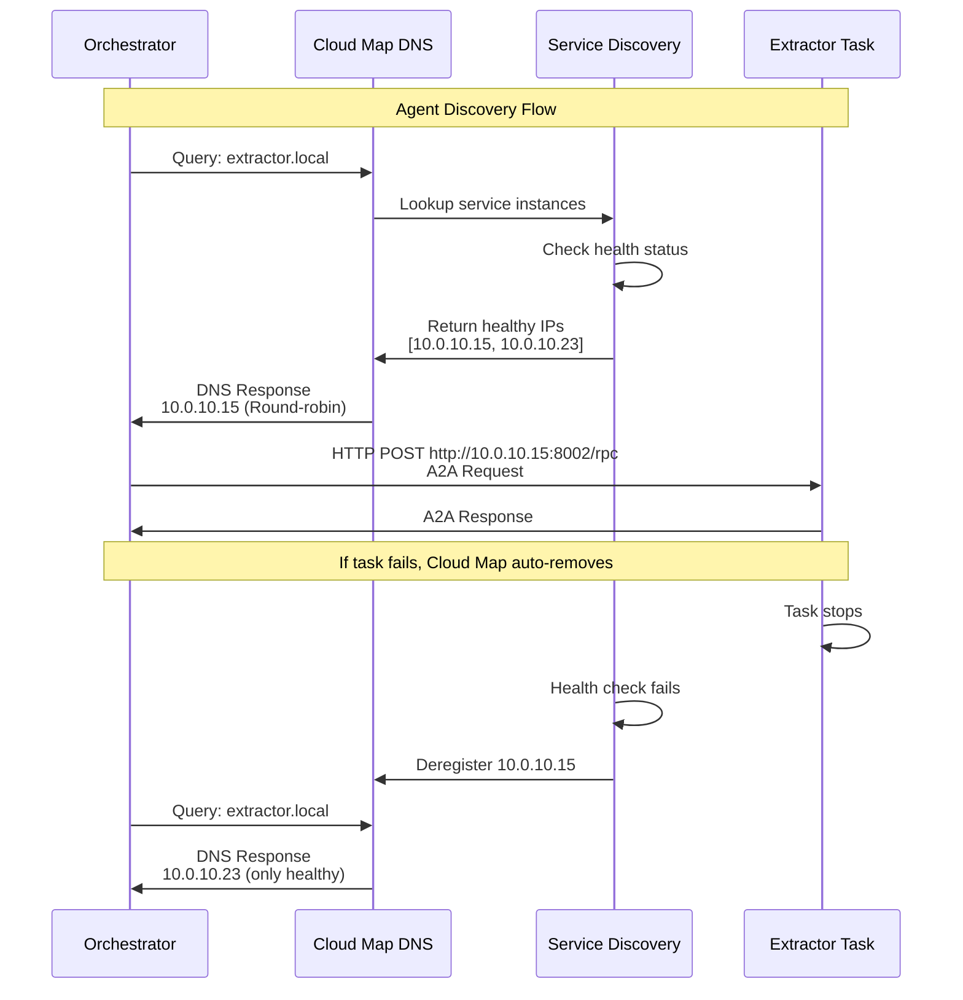

---

## Security & Resilience

### Security Layers

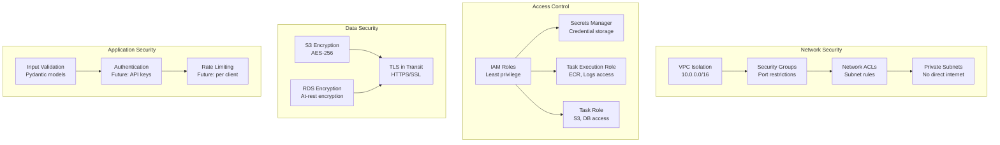

### Resilience Patterns

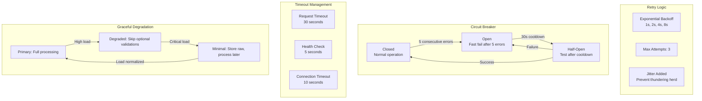

### Error Handling Flow

```mermaid
flowchart TD
    START[Request Received] --> TRY[Try Operation]

    TRY -->|Success| SUCCESS[Return Response]
    TRY -->|Error| CLASSIFY{Classify Error}

    CLASSIFY -->|Network Error| RETRY{Retry Count < 3?}
    CLASSIFY -->|Validation Error| LOG_RETURN[Log & Return Error]
    CLASSIFY -->|System Error| CIRCUIT{Circuit Open?}

    RETRY -->|Yes| BACKOFF[Exponential Backoff]
    RETRY -->|No| FAIL[Mark as Failed]

    BACKOFF --> TRY

    CIRCUIT -->|Yes| FAST_FAIL[Fast Fail]
    CIRCUIT -->|No| INCREMENT[Increment Error Count]

    INCREMENT --> CHECK{Count >= 5?}
    CHECK -->|Yes| OPEN_CIRCUIT[Open Circuit Breaker]
    CHECK -->|No| LOG_RETURN

    OPEN_CIRCUIT --> FAST_FAIL
    FAST_FAIL --> LOG_RETURN

    LOG_RETURN --> NOTIFY[Notify Monitoring]
    FAIL --> NOTIFY

    SUCCESS --> END[Complete]
    NOTIFY --> END
```

---

## Deployment Architecture

### Complete System Diagram

```mermaid
graph TB
    subgraph "Client Layer"
        WEB[Web Client]
        API[API Client]
        CLI[CLI Client]
    end

    subgraph "AWS Region: eu-west-3"
        subgraph "Public Zone"
            R53[Route 53<br/>DNS]
            ALB[Application<br/>Load Balancer]
        end

        subgraph "Private Zone - AZ A"
            ORCH1[Orchestrator<br/>Task 1]
            EXT1[Extractor<br/>Task 1]
        end

        subgraph "Private Zone - AZ B"
            ORCH2[Orchestrator<br/>Task 2]
            VAL1[Validator<br/>Task 1]
            ARC1[Archivist<br/>Task 1]
        end

        subgraph "Data Services"
            S3[S3 Bucket<br/>Documents]
            RDS[(RDS PostgreSQL<br/>Multi-AZ)]
            ECR[ECR<br/>Containers]
        end

        subgraph "Management & Monitoring"
            CM[Cloud Map<br/>Service Discovery]
            CW[CloudWatch<br/>Logs & Metrics]
            SM[Secrets Manager<br/>Credentials]
        end
    end

    WEB --> R53
    API --> R53
    CLI --> R53

    R53 --> ALB
    ALB --> ORCH1
    ALB --> ORCH2

    ORCH1 <-->|A2A| EXT1
    ORCH1 <-->|A2A| VAL1
    ORCH1 <-->|A2A| ARC1

    ORCH2 <-->|A2A| EXT1
    ORCH2 <-->|A2A| VAL1
    ORCH2 <-->|A2A| ARC1

    EXT1 <-->|MCP| S3
    ARC1 <-->|MCP| RDS

    ORCH1 -.->|Pull| ECR
    ORCH2 -.->|Pull| ECR
    EXT1 -.->|Pull| ECR
    VAL1 -.->|Pull| ECR
    ARC1 -.->|Pull| ECR

    CM -.->|DNS| EXT1
    CM -.->|DNS| VAL1
    CM -.->|DNS| ARC1

    ORCH1 -->|Logs| CW
    ORCH2 -->|Logs| CW
    EXT1 -->|Logs| CW
    VAL1 -->|Logs| CW
    ARC1 -->|Logs| CW

    ARC1 -.->|Read| SM

    style ORCH1 fill:#4CAF50
    style ORCH2 fill:#4CAF50
    style EXT1 fill:#2196F3
    style VAL1 fill:#FF9800
    style ARC1 fill:#9C27B0
```

### Resource Allocation

```mermaid
pie title "Monthly AWS Costs (€173)"
    "ECS Fargate (8 tasks)" : 60
    "RDS PostgreSQL" : 55
    "ALB" : 22
    "NAT Gateway" : 38
    "S3 + CloudWatch" : 8
```

### Scaling Characteristics

```mermaid
graph LR
    subgraph "Load: 10 docs/min"
        L1[2 Tasks per Service<br/>8 Total]
    end

    subgraph "Load: 50 docs/min"
        L2[4 Tasks per Service<br/>16 Total]
    end

    subgraph "Load: 200 docs/min"
        L3[10 Tasks per Service<br/>40 Total]
    end

    L1 -->|Auto-scale| L2
    L2 -->|Auto-scale| L3
    L3 -->|Scale down| L2
    L2 -->|Scale down| L1
```

---

## Summary

### Key Takeaways

1. **Distributed Architecture**
   - 4 specialized agents with clear responsibilities
   - Autonomous operation via A2A protocol
   - Scalable microservices design

2. **Cloud-Native Design**
   - Serverless containers (ECS Fargate)
   - Managed services (RDS, S3, ALB)
   - Infrastructure as Code ready

3. **Production Ready**
   - Multi-AZ deployment for HA
   - Comprehensive error handling
   - Full observability with CloudWatch
   - Secure by design (VPC, SG, encryption)

4. **Extensible**
   - Easy to add new agent types
   - Pluggable validation rules
   - Support for new document formats

### Technology Stack Summary

| Layer | Technology | Purpose |
|-------|------------|---------|
| **Runtime** | Python 3.9 + AsyncIO | High-performance async processing |
| **Framework** | aiohttp | HTTP server and client |
| **Protocol** | JSON-RPC 2.0 | Agent-to-agent communication |
| **Validation** | Pydantic v2 | Type-safe data models |
| **Storage** | PostgreSQL + S3 | Structured + unstructured data |
| **Containers** | Docker + ECS Fargate | Portable, scalable deployment |
| **Networking** | AWS VPC + ALB | Secure, load-balanced access |
| **Discovery** | AWS Cloud Map | Service mesh integration |
| **Monitoring** | CloudWatch | Centralized logging and metrics |

### Performance Metrics

- **Latency**: < 2 seconds per document (average)
- **Throughput**: 50-200 documents/minute (scalable)
- **Availability**: 99.9% (Multi-AZ)
- **Error Rate**: < 0.1% (with retries)

---

## References

- [A2A Protocol Specification](A2A_BEST_PRACTICES.md)
- [AWS Deployment Guide](AWS_DEPLOYMENT.md)
- [API Documentation](DOCUMENTATION.md)
- [Demo Guide](DEMO_GUIDE.md)

---

**Document Version:** 1.0
**Last Updated:** December 2025
**Region:** eu-west-3 (Paris)
