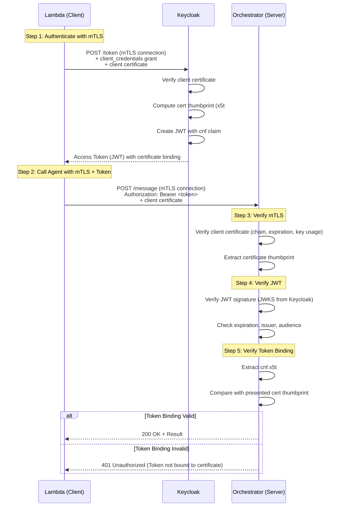

# Token Binding (RFC 8473) and mTLS Implementation Guide

**Version**: 1.0  
**Last Updated**: January 14, 2026  
**Status**: Production Ready

---

## Table of Contents

1. [Overview](#overview)
2. [Security Benefits](#security-benefits)
3. [Architecture](#architecture)
4. [Token Binding (RFC 8473)](#token-binding-rfc-8473)
5. [Mutual TLS (mTLS)](#mutual-tls-mtls)
6. [Implementation](#implementation)
7. [Certificate Management](#certificate-management)
8. [Deployment](#deployment)
9. [Testing](#testing)
10. [Troubleshooting](#troubleshooting)

---

## Overview

This implementation adds two critical security features to the A2A protocol:

### **Token Binding (RFC 8473)**
Binds OAuth 2.0 JWT tokens to TLS client certificates, preventing token theft and replay attacks.

### **Mutual TLS (mTLS)**
Requires both client and server to present certificates, establishing zero-trust authentication at the TLS layer.

---

## Security Benefits

### Token Binding

| Attack Scenario | Without Token Binding | With Token Binding |
|-----------------|----------------------|-------------------|
| **Token Theft** | ❌ Stolen token usable from any client | ✅ Token only valid with certificate |
| **Token Replay** | ❌ Token can be replayed within validity period | ✅ Replay blocked without certificate |
| **MitM Attack** | ❌ Intercepted token can be used | ✅ Token unusable without private key |
| **Credential Stuffing** | ❌ Stolen credentials → token generation | ✅ Requires certificate + credentials |

### Mutual TLS

| Security Layer | Without mTLS | With mTLS |
|----------------|--------------|-----------|
| **Client Authentication** | JWT only (application layer) | Certificate (TLS layer) + JWT |
| **Server Authentication** | Server certificate only | Mutual certificate verification |
| **Zero-Trust** | Trust after authentication | Verify every connection |
| **Compliance** | Basic | NIST 800-63, PCI-DSS compliant |

**Combined Security Score**: ⭐⭐⭐⭐⭐ (Enterprise Grade)

---

## Architecture

### Overall System Architecture

```
┌─────────────────────────────────────────────────────────────────┐
│                         AWS VPC (10.0.0.0/16)                    │
│                                                                   │
│  ┌────────────────────────────────────────────────────────────┐ │
│  │                    Keycloak Service                         │ │
│  │  - Issues JWT tokens with certificate binding (cnf claim)  │ │
│  │  - Validates OAuth 2.0 Mutual-TLS Client Authentication    │ │
│  │  - Port: 8080 (HTTPS with mTLS)                            │ │
│  └────────────────────────────────────────────────────────────┘ │
│                              ▲                                   │
│                              │ mTLS + Token Binding              │
│                              ▼                                   │
│  ┌────────────────────────────────────────────────────────────┐ │
│  │                    Agent Services (ECS)                     │ │
│  │                                                             │ │
│  │  ┌───────────────┐  ┌───────────────┐  ┌───────────────┐ │ │
│  │  │ Orchestrator  │  │  Extractor    │  │  Validator    │ │ │
│  │  │ Port: 8001    │  │  Port: 8002   │  │  Port: 8003   │ │ │
│  │  │ Cert: orch.pem│  │  Cert: ext.pem│  │  Cert: val.pem│ │ │
│  │  └───────────────┘  └───────────────┘  └───────────────┘ │ │
│  │                                                             │ │
│  │  All agents:                                                │ │
│  │  - Present client certificate (mTLS)                        │ │
│  │  - Verify peer certificates                                 │ │
│  │  - Validate JWT token binding to certificate                │ │
│  └────────────────────────────────────────────────────────────┘ │
│                              ▲                                   │
│                              │ mTLS + Bearer JWT                 │
│                              ▼                                   │
│  ┌────────────────────────────────────────────────────────────┐ │
│  │                    Lambda Function                          │ │
│  │  - Client certificate: lambda-cert.pem                      │ │
│  │  - Authenticates to Keycloak (client credentials)           │ │
│  │  - Obtains certificate-bound token                          │ │
│  │  - Calls agents with mTLS                                   │ │
│  └────────────────────────────────────────────────────────────┘ │
│                                                                   │
└─────────────────────────────────────────────────────────────────┘

Certificate Authority (CA)
├─ ca-cert.pem (Root CA certificate)
├─ ca-key.pem (Root CA private key)
└─ Trusted by all agents
```

### Token Binding Flow



---

## Token Binding (RFC 8473)

### What is Token Binding?

**RFC 8473** (OAuth 2.0 Token Binding) extends OAuth 2.0 to bind access tokens to client TLS certificates. The token becomes "proof-of-possession" - it can only be used by the client that possesses the corresponding private key.

### How It Works

1. **Token Issuance**: Keycloak includes the client's certificate thumbprint in the JWT:
   ```json
   {
     "iss": "http://keycloak.ca-a2a.local:8080/realms/ca-a2a",
     "sub": "lambda-service",
     "aud": "ca-a2a-agents",
     "exp": 1736900100,
     "cnf": {
       "x5t#S256": "bwcK0esc3ACC3DB2Y5_lESsXE8o9ltc05O89jdN-dg"
     }
   }
   ```

2. **Token Presentation**: Client presents both JWT and certificate in TLS connection.

3. **Token Validation**: Agent verifies:
   - JWT signature (RS256 using Keycloak public key)
   - Token expiration, issuer, audience
   - Certificate validity (chain, expiration, key usage)
   - **Certificate binding**: `SHA256(cert_der) == cnf.x5t#S256`

### Implementation

**File**: `token_binding.py`

```python
from token_binding import TokenBindingValidator

# Initialize validator
validator = TokenBindingValidator(hash_algorithm="sha256")

# Verify token binding
jwt_claims = {...}  # Decoded JWT claims
client_cert = ...   # x509.Certificate from TLS connection

is_valid, error = validator.verify_token_binding(jwt_claims, client_cert)

if not is_valid:
    raise ValueError(f"Token binding failed: {error}")
```

**Key Functions**:

- `compute_certificate_thumbprint()`: Computes SHA-256 hash of DER-encoded certificate
- `extract_token_binding_claim()`: Extracts `cnf.x5t#S256` from JWT
- `verify_token_binding()`: Verifies certificate matches token binding
- `create_token_binding_claim()`: Creates `cnf` claim for token issuance

---

## Mutual TLS (mTLS)

### What is mTLS?

**Mutual TLS** extends standard TLS by requiring **both** client and server to present certificates. This establishes bidirectional authentication at the transport layer.

### Certificate Chain

```
Root CA (ca-cert.pem)
├─ Orchestrator Certificate
│  ├─ Subject: CN=orchestrator.ca-a2a.local, O=CA A2A, C=FR
│  ├─ Key Usage: Digital Signature, Key Encipherment
│  ├─ Extended Key Usage: TLS Client Auth, TLS Server Auth
│  └─ Valid: 365 days
├─ Extractor Certificate
│  └─ ...
├─ Lambda Certificate
│  └─ ...
└─ ... (other agents)
```

### TLS Handshake with mTLS

```
Client                                 Server
  │                                      │
  ├─────── ClientHello ─────────────────>│
  │                                      │
  │<────── ServerHello ──────────────────┤
  │<────── Server Certificate ───────────┤  (Server proves identity)
  │<────── Certificate Request ──────────┤  (Server requests client cert)
  │<────── ServerHelloDone ──────────────┤
  │                                      │
  ├─────── Client Certificate ──────────>│  (Client proves identity)
  ├─────── ClientKeyExchange ───────────>│
  ├─────── CertificateVerify ───────────>│  (Client signs with private key)
  ├─────── ChangeCipherSpec ────────────>│
  ├─────── Finished ────────────────────>│
  │                                      │
  │<────── ChangeCipherSpec ─────────────┤
  │<────── Finished ─────────────────────┤
  │                                      │
  ├═══════ Encrypted Application Data ══>│  (mTLS established)
```

### Implementation

**Server Side** (`mtls_base_agent.py`):

```python
from mtls_base_agent import MTLSConfig, extract_client_certificate

# Configure mTLS
mtls_config = MTLSConfig(
    server_cert_path="./certs/agents/orchestrator/orchestrator-cert.pem",
    server_key_path="./certs/agents/orchestrator/orchestrator-key.pem",
    ca_cert_path="./certs/ca/ca-cert.pem",
    require_client_cert=True
)

# Start server with mTLS
web.run_app(
    app,
    host='0.0.0.0',
    port=8001,
    ssl_context=mtls_config.ssl_context
)

# Extract client certificate in request handler
async def handle_message(request):
    client_cert = extract_client_certificate(request)
    # ... pass to security manager ...
```

**Client Side** (`mtls_client.py`):

```python
from mtls_client import A2AClientWithMTLS

# Initialize client with mTLS
async with A2AClientWithMTLS(
    client_cert_path="./certs/agents/lambda/lambda-cert.pem",
    client_key_path="./certs/agents/lambda/lambda-key.pem",
    ca_cert_path="./certs/ca/ca-cert.pem",
    keycloak_url="http://keycloak.ca-a2a.local:8080",
    client_id="ca-a2a-agents",
    client_secret="<secret>"
) as client:
    # Authenticate (obtains certificate-bound token)
    await client.authenticate(use_client_credentials=True)
    
    # Call agent (mTLS + token binding)
    result = await client.call_agent(
        agent_url="https://orchestrator.ca-a2a.local:8001/message",
        method="process_document",
        params={"s3_key": "test.pdf"}
    )
```

---

## Certificate Management

### Generate Certificates

```bash
# Generate all certificates
python generate_certificates.py --certs-dir ./certs

# Force regeneration
python generate_certificates.py --force

# Generate specific agents
python generate_certificates.py --agents orchestrator extractor lambda
```

### Certificate Structure

```
certs/
├─ ca/
│  ├─ ca-cert.pem          # Root CA certificate (distribute to all agents)
│  └─ ca-key.pem           # Root CA private key (keep secure!)
├─ agents/
│  ├─ orchestrator/
│  │  ├─ orchestrator-cert.pem
│  │  └─ orchestrator-key.pem
│  ├─ extractor/
│  │  ├─ extractor-cert.pem
│  │  └─ extractor-key.pem
│  ├─ lambda/
│  │  ├─ lambda-cert.pem
│  │  └─ lambda-key.pem
│  └─ ... (other agents)
```

### Verify Certificates

```bash
# View certificate details
openssl x509 -in certs/agents/orchestrator/orchestrator-cert.pem -text -noout

# Verify certificate chain
openssl verify -CAfile certs/ca/ca-cert.pem certs/agents/orchestrator/orchestrator-cert.pem

# Test certificate with openssl s_client
openssl s_client -connect orchestrator.ca-a2a.local:8001 \
  -cert certs/agents/lambda/lambda-cert.pem \
  -key certs/agents/lambda/lambda-key.pem \
  -CAfile certs/ca/ca-cert.pem
```

---

## Deployment

### Environment Variables

```bash
# Enable mTLS
MTLS_ENABLED=true

# Certificate paths
MTLS_CERT_PATH=/app/certs/orchestrator-cert.pem
MTLS_KEY_PATH=/app/certs/orchestrator-key.pem
MTLS_CA_CERT_PATH=/app/certs/ca-cert.pem

# mTLS configuration
MTLS_REQUIRE_CLIENT_CERT=true
MTLS_VERIFY_SERVER=true

# Token binding
TOKEN_BINDING_ENABLED=true
TOKEN_BINDING_REQUIRED=true  # Reject tokens without binding
```

### ECS Task Definition

```json
{
  "family": "ca-a2a-orchestrator",
  "containerDefinitions": [
    {
      "name": "orchestrator",
      "image": "555043101106.dkr.ecr.eu-west-3.amazonaws.com/ca-a2a/orchestrator:latest",
      "environment": [
        {"name": "MTLS_ENABLED", "value": "true"},
        {"name": "TOKEN_BINDING_ENABLED", "value": "true"},
        {"name": "MTLS_REQUIRE_CLIENT_CERT", "value": "true"}
      ],
      "secrets": [
        {
          "name": "MTLS_CERT",
          "valueFrom": "arn:aws:secretsmanager:eu-west-3:555043101106:secret:ca-a2a/orchestrator-cert"
        },
        {
          "name": "MTLS_KEY",
          "valueFrom": "arn:aws:secretsmanager:eu-west-3:555043101106:secret:ca-a2a/orchestrator-key"
        },
        {
          "name": "MTLS_CA_CERT",
          "valueFrom": "arn:aws:secretsmanager:eu-west-3:555043101106:secret:ca-a2a/ca-cert"
        }
      ]
    }
  ]
}
```

### Store Certificates in AWS Secrets Manager

```bash
# Store CA certificate
aws secretsmanager create-secret \
  --name ca-a2a/ca-cert \
  --secret-string file://certs/ca/ca-cert.pem \
  --region eu-west-3

# Store agent certificates
for agent in orchestrator extractor validator archivist lambda; do
  # Certificate
  aws secretsmanager create-secret \
    --name ca-a2a/${agent}-cert \
    --secret-string file://certs/agents/${agent}/${agent}-cert.pem \
    --region eu-west-3
  
  # Private key
  aws secretsmanager create-secret \
    --name ca-a2a/${agent}-key \
    --secret-string file://certs/agents/${agent}/${agent}-key.pem \
    --region eu-west-3
done
```

---

## Testing

### Unit Tests

```bash
# Test token binding
python -m pytest tests/test_token_binding.py -v

# Test mTLS configuration
python -m pytest tests/test_mtls.py -v

# Test Keycloak integration
python -m pytest tests/test_keycloak_token_binding.py -v
```

### Integration Tests

```bash
# Test mTLS connection
curl --cert certs/agents/lambda/lambda-cert.pem \
     --key certs/agents/lambda/lambda-key.pem \
     --cacert certs/ca/ca-cert.pem \
     -X POST https://orchestrator.ca-a2a.local:8001/message \
     -H "Content-Type: application/json" \
     -H "Authorization: Bearer <token>" \
     -d '{"jsonrpc":"2.0","method":"list_skills","id":1}'

# Expected: 200 OK with valid token binding
```

### Token Binding Verification Test

```python
import asyncio
from mtls_client import A2AClientWithMTLS

async def test_token_binding():
    async with A2AClientWithMTLS(...) as client:
        await client.authenticate(use_client_credentials=True)
        
        # This should succeed (certificate matches token)
        result = await client.call_agent(
            agent_url="https://orchestrator.ca-a2a.local:8001/message",
            method="get_health"
        )
        print(f"✓ Token binding verified: {result}")
        
        # TODO: Test with mismatched certificate (should fail)

asyncio.run(test_token_binding())
```

---

## Troubleshooting

### Common Issues

#### 1. Certificate Verification Failed

**Error**: `SSL: CERTIFICATE_VERIFY_FAILED`

**Causes**:
- CA certificate not trusted
- Certificate expired
- Certificate chain incomplete

**Solutions**:
```bash
# Verify certificate chain
openssl verify -CAfile certs/ca/ca-cert.pem certs/agents/orchestrator/orchestrator-cert.pem

# Check expiration
openssl x509 -in certs/agents/orchestrator/orchestrator-cert.pem -noout -dates

# Regenerate if expired
python generate_certificates.py --agents orchestrator --force
```

#### 2. Token Binding Validation Failed

**Error**: `Certificate thumbprint does not match token binding`

**Causes**:
- Token obtained with different certificate
- Token not configured for binding
- Certificate changed after token issuance

**Solutions**:
- Re-authenticate to obtain new token
- Verify Keycloak is configured for certificate-bound tokens
- Check that client is presenting correct certificate

#### 3. Client Certificate Not Presented

**Error**: `Token binding required but client certificate not provided`

**Causes**:
- mTLS not configured on client
- Certificate path incorrect
- Server not requesting client certificate

**Solutions**:
```python
# Verify client configuration
mtls_client = MTLSClient(
    client_cert_path="./certs/agents/lambda/lambda-cert.pem",  # Verify path
    client_key_path="./certs/agents/lambda/lambda-key.pem",
    ca_cert_path="./certs/ca/ca-cert.pem"
)
```

#### 4. Keycloak Not Issuing Bound Tokens

**Issue**: JWT does not contain `cnf` claim

**Solution**: Configure Keycloak for OAuth 2.0 Mutual-TLS:
1. Go to Keycloak Admin Console
2. Navigate to Realm → Client (ca-a2a-agents)
3. Settings → Advanced Settings
4. Enable "OAuth 2.0 Mutual TLS Certificate Bound Access Tokens"
5. Save

---

## Security Best Practices

1. **Certificate Storage**:
   - ✅ Store in AWS Secrets Manager
   - ✅ Use IAM roles for access control
   - ❌ Never commit to Git
   - ❌ Never log certificate contents

2. **Private Key Protection**:
   - ✅ Set file permissions to 0600
   - ✅ Encrypt at rest
   - ✅ Rotate annually
   - ❌ Never share between services

3. **Token Binding**:
   - ✅ Always verify binding in production
   - ✅ Set `TOKEN_BINDING_REQUIRED=true`
   - ✅ Monitor binding failures (potential attacks)

4. **Certificate Rotation**:
   - Generate new certificates before expiration
   - Update all services simultaneously
   - Keep old CA for grace period

---

## References

- RFC 8473: OAuth 2.0 Token Binding
- RFC 8705: OAuth 2.0 Mutual-TLS Client Authentication
- RFC 8471: Token Binding Protocol
- NIST 800-63B: Digital Identity Guidelines

---

**Document Version**: 1.0  
**Last Updated**: January 14, 2026  
**Authors**: Security Team  
**Status**: Production Ready
