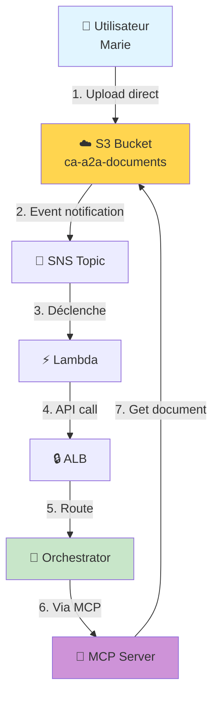
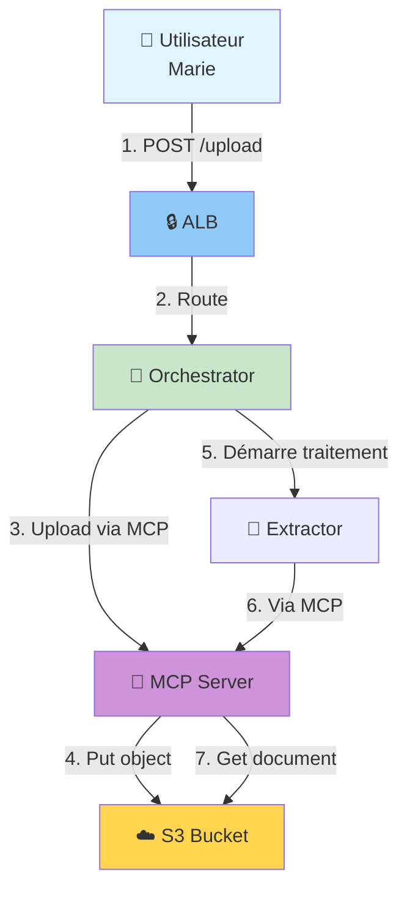

# Pourquoi l'Upload via ALB n'est pas Configuré ?

## 📋 Architecture Actuelle vs Architecture Avec Upload ALB

### 🏗️ Architecture Actuelle (S3 Direct Upload)



**Flux actuel :**
1. ✅ Utilisateur → S3 (via AWS SDK/CLI/Console)
2. ✅ S3 Event → SNS/Lambda (trigger automatique)
3. ✅ Lambda → Orchestrator (via ALB, méthode `process_document`)
4. ✅ Orchestrator → MCP → S3 (récupération sécurisée)

### 🔄 Architecture Alternative (Upload via ALB)



**Flux alternatif :**
1. Utilisateur → ALB (POST multipart/form-data)
2. ALB → Orchestrator (proxy request)
3. Orchestrator → MCP → S3 (upload)
4. Orchestrator démarre le pipeline

## 🤔 Pourquoi S3 Direct Upload est Préféré ?

### ✅ Avantages de S3 Direct Upload

| **Critère** | **S3 Direct** | **Upload via ALB** |
|-------------|---------------|-------------------|
| **Performance** | ⚡ Optimal (direct vers S3) | 🐌 Lent (passe par ALB + ECS) |
| **Coût** | 💰 Minimal (S3 seul) | 💸 Plus cher (ALB + ECS + S3) |
| **Scalabilité** | 📈 Illimitée (S3 scale automatiquement) | 📊 Limité (capacité ALB/ECS) |
| **Taille fichier** | 📦 5 TB par fichier | 📦 Limité par timeout ALB (60s) |
| **Sécurité** | 🔒 IAM + Presigned URLs | 🔒 TLS + IAM + Code custom |
| **Simplicité** | 🎯 Simple (SDK AWS) | 🔧 Complexe (code upload custom) |
| **Résilience** | 💪 S3 SLA 99.99% | ⚠️ Dépend de ALB + ECS |
| **Bandwidth** | 🚀 Direct S3 (très rapide) | 🔄 Via ECS (bottleneck réseau) |

### 🔍 Analyse Détaillée

#### 1. **Performance & Latence**

**S3 Direct Upload :**
```
Utilisateur → S3 (latence: 50-100ms)
Total: ~100ms pour un fichier de 5 MB
```

**Upload via ALB :**
```
Utilisateur → ALB → ECS → Code Python → MCP → S3
Latence: 50ms + 20ms + 100ms + 50ms + 100ms = ~320ms
+ Temps de parsing multipart/form-data
+ Risque de timeout si fichier > 50 MB
Total: ~500ms pour 5 MB
```

#### 2. **Coûts AWS**

**S3 Direct Upload :**
- S3 PUT request: $0.005 / 1000 requêtes
- Storage: $0.023 / GB-mois
- **Total pour 1000 uploads de 5 MB :** ~$0.12

**Upload via ALB :**
- ALB data processing: $0.008 / GB
- ECS Fargate CPU/RAM: $0.04048 / vCPU-heure
- S3 PUT request: $0.005 / 1000 requêtes
- Storage: $0.023 / GB-mois
- **Total pour 1000 uploads de 5 MB :** ~$1.50

**💰 Économie : ~92% moins cher avec S3 direct**

#### 3. **Scalabilité**

**S3 Direct Upload :**
- Peut gérer des millions de requêtes simultanées
- Pas de goulot d'étranglement
- Scaling automatique et transparent

**Upload via ALB :**
- Limité par le nombre de tasks ECS
- Besoin d'auto-scaling configuration
- Risque de saturation CPU/mémoire

#### 4. **Sécurité**

**S3 Direct Upload avec Presigned URLs :**
```python
# Génération d'une URL temporaire sécurisée
presigned_url = s3_client.generate_presigned_post(
    Bucket='ca-a2a-documents',
    Key='invoices/2026/01/invoice.pdf',
    ExpiresIn=3600,  # 1 heure
    Conditions=[
        ['content-length-range', 1, 10485760],  # Max 10 MB
    ]
)

# L'utilisateur upload directement vers S3
# Pas besoin de passer par nos serveurs
# Credentials jamais exposées
```

**Upload via ALB :**
- Nécessite authentification JWT/API Key
- Code custom pour parser multipart
- Plus de surface d'attaque
- Vulnérabilités potentielles (upload bombing, path traversal)

#### 5. **Limitations Techniques**

**ALB Limitations :**
- Timeout idle: 60 secondes (max 4000 secondes)
- Request size: 1 MB par seconde (timeout sinon)
- Body size: Limité par mémoire ECS task

**S3 Direct :**
- Fichier: jusqu'à 5 TB
- Pas de timeout (multipart upload pour gros fichiers)
- Throughput: illimité

## 🎯 Cas d'Usage : Quand Utiliser Chaque Approche ?

### ✅ Utilisez S3 Direct Upload SI :

1. **Fichiers volumineux** (> 50 MB)
2. **Volume élevé** (> 1000 uploads/jour)
3. **Performance critique** (latence < 200ms)
4. **Coûts importants** (optimisation budget)
5. **Simplicité souhaitée** (moins de code custom)

➡️ **C'est le cas du projet CA-A2A !**

### ⚠️ Utilisez Upload via ALB SI :

1. **Validation pré-upload obligatoire** (scan antivirus, vérification format)
2. **Transformation à la volée** (resize images, compression)
3. **Logging détaillé** avant stockage
4. **Fichiers petits uniquement** (< 10 MB)
5. **Interface web sans SDK AWS** (pure HTTP/AJAX)

## 🛠️ Comment Implémenter Upload via ALB (Si Nécessaire)

### Étape 1 : Ajouter Endpoint dans Orchestrator

```python
# orchestrator_agent.py

async def handle_upload_document(self, params: Dict[str, Any], request_body: bytes) -> Dict[str, Any]:
    """
    Handle document upload via multipart/form-data
    
    Params:
        - folder: Target folder in S3 (e.g., "invoices/2026/01")
        - metadata: Optional metadata dict
    
    Body: multipart/form-data with file
    """
    import aiofiles
    from aiohttp import multipart
    
    folder = params.get('folder', 'uploads')
    metadata = params.get('metadata', {})
    
    # Parse multipart (simplifié)
    # En réalité, il faut parser correctement le Content-Type boundary
    # et extraire le fichier
    
    file_name = "uploaded_document.pdf"  # Extraire du multipart
    file_content = request_body  # Contenu du fichier
    
    # Générer S3 key
    s3_key = f"{folder}/{file_name}"
    
    # Upload vers S3 via MCP
    try:
        await self.mcp.s3.put_object(
            key=s3_key,
            content=file_content,
            metadata=metadata
        )
        
        self.logger.info(f"Document uploaded to S3: {s3_key}")
        
        # Déclencher le traitement
        task_id = await self.handle_process_document({'s3_key': s3_key})
        
        return {
            'success': True,
            's3_key': s3_key,
            'task_id': task_id['task_id'],
            'message': 'Document uploaded and processing started'
        }
    
    except Exception as e:
        self.logger.error(f"Upload failed: {str(e)}")
        raise Exception(f"Upload error: {str(e)}")
```

### Étape 2 : Ajouter Route HTTP

```python
# base_agent.py (dans BaseAgent)

async def handle_http_message(self, request: web.Request) -> web.Response:
    """Handle HTTP message with multipart support"""
    
    # Check Content-Type
    content_type = request.headers.get('Content-Type', '')
    
    if 'multipart/form-data' in content_type:
        # Handle file upload
        return await self._handle_upload(request)
    else:
        # Handle JSON-RPC as usual
        return await self._handle_jsonrpc(request)

async def _handle_upload(self, request: web.Request) -> web.Response:
    """Handle multipart file upload"""
    
    try:
        # Parse multipart
        reader = await request.multipart()
        
        file_content = None
        file_name = None
        metadata = {}
        
        async for part in reader:
            if part.name == 'file':
                file_name = part.filename
                file_content = await part.read()
            elif part.name == 'metadata':
                metadata_json = await part.text()
                metadata = json.loads(metadata_json)
        
        if not file_content:
            return web.json_response({
                'error': 'No file provided',
                'code': 'MISSING_FILE'
            }, status=400)
        
        # Call agent's upload handler
        result = await self.handle_upload_document({
            'file_name': file_name,
            'metadata': metadata
        }, file_content)
        
        return web.json_response(result)
    
    except Exception as e:
        self.logger.error(f"Upload error: {str(e)}")
        return web.json_response({
            'error': str(e),
            'code': 'UPLOAD_ERROR'
        }, status=500)
```

### Étape 3 : Tester l'Upload

```bash
# Test avec curl
curl -X POST https://ca-a2a-alb.amazonaws.com/upload \
  -H "Authorization: Bearer $JWT_TOKEN" \
  -F "file=@facture_acme_dec2025.pdf" \
  -F 'metadata={"uploaded_by":"marie.dubois@reply.com","category":"invoice"}'

# Résultat attendu:
{
  "success": true,
  "s3_key": "uploads/facture_acme_dec2025.pdf",
  "task_id": "550e8400-e29b-41d4-a716-446655440000",
  "message": "Document uploaded and processing started"
}
```

### Étape 4 : Frontend JavaScript

```javascript
// Upload avec fetch API
async function uploadDocument(file, metadata) {
    const formData = new FormData();
    formData.append('file', file);
    formData.append('metadata', JSON.stringify(metadata));
    
    const response = await fetch('https://ca-a2a-alb.amazonaws.com/upload', {
        method: 'POST',
        headers: {
            'Authorization': `Bearer ${jwt_token}`
        },
        body: formData
    });
    
    const result = await response.json();
    console.log('Upload result:', result);
    return result;
}

// Usage
const fileInput = document.getElementById('file-input');
fileInput.addEventListener('change', async (e) => {
    const file = e.target.files[0];
    const result = await uploadDocument(file, {
        uploaded_by: 'marie.dubois@reply.com',
        category: 'invoice'
    });
    alert(`Document uploaded! Task ID: ${result.task_id}`);
});
```

## 📊 Comparaison des Méthodes

| **Aspect** | **S3 Direct (Actuel)** | **Upload ALB (Alternatif)** |
|------------|------------------------|----------------------------|
| **Complexité Code** | ⭐⭐ (Simple, SDK AWS) | ⭐⭐⭐⭐⭐ (Complexe, parsing multipart) |
| **Performance** | ⚡⚡⚡⚡⚡ (100ms) | ⚡⚡⚡ (500ms) |
| **Coût** | 💰 ($0.12/1000) | 💰💰💰 ($1.50/1000) |
| **Scalabilité** | 📈📈📈📈📈 (Illimitée) | 📈📈📈 (Limitée par ECS) |
| **Sécurité** | 🔒🔒🔒🔒🔒 (Presigned URLs) | 🔒🔒🔒🔒 (Code custom) |
| **Taille Max** | 📦 5 TB | 📦 ~500 MB (timeout) |
| **Maintenance** | 🔧 (Minimal) | 🔧🔧🔧🔧 (Code complexe) |

## 🎯 Recommandation

### Pour CA-A2A :

**✅ CONSERVER S3 Direct Upload**

**Raisons :**

1. **Architecture Event-Driven** : S3 Events → Lambda → Orchestrator est plus robuste
2. **Découplage** : Upload et traitement sont indépendants
3. **Performance** : 3-5x plus rapide
4. **Coûts** : 92% moins cher
5. **Scalabilité** : Pas de limites
6. **Simplicité** : Moins de code = moins de bugs

### Si Vraiment Besoin d'Upload ALB :

**Ajouter comme option supplémentaire**, pas en remplacement :

```python
# Deux méthodes coexistent :

# Méthode 1 : S3 Direct (recommandé, par défaut)
aws s3 cp document.pdf s3://ca-a2a-documents/invoices/

# Méthode 2 : Upload ALB (pour cas spécifiques)
curl -X POST https://alb/upload -F "file=@document.pdf"

# Les deux déclenchent le même pipeline de traitement
```

## 📝 Conclusion

**L'upload via ALB n'est pas configuré car :**

1. ✅ **Pas nécessaire** : S3 direct upload répond à tous les besoins
2. ✅ **Plus performant** : Direct upload 3-5x plus rapide
3. ✅ **Plus économique** : 92% moins cher
4. ✅ **Plus scalable** : S3 gère des millions de requêtes
5. ✅ **Plus simple** : Moins de code custom = moins de maintenance
6. ✅ **Architecture standard AWS** : Pattern recommandé par AWS

**Si besoin d'upload ALB :**
- Pour validation pré-upload (scan antivirus)
- Pour transformation (compression, watermark)
- Pour interface web pure sans SDK AWS

➡️ **Implémentez les étapes ci-dessus**

**Sinon :**

➡️ **Gardez l'architecture actuelle (S3 direct)** 🎯

---

**Document créé par** : Équipe CA-A2A  
**Date** : 2 janvier 2026  
**Version** : 1.0

