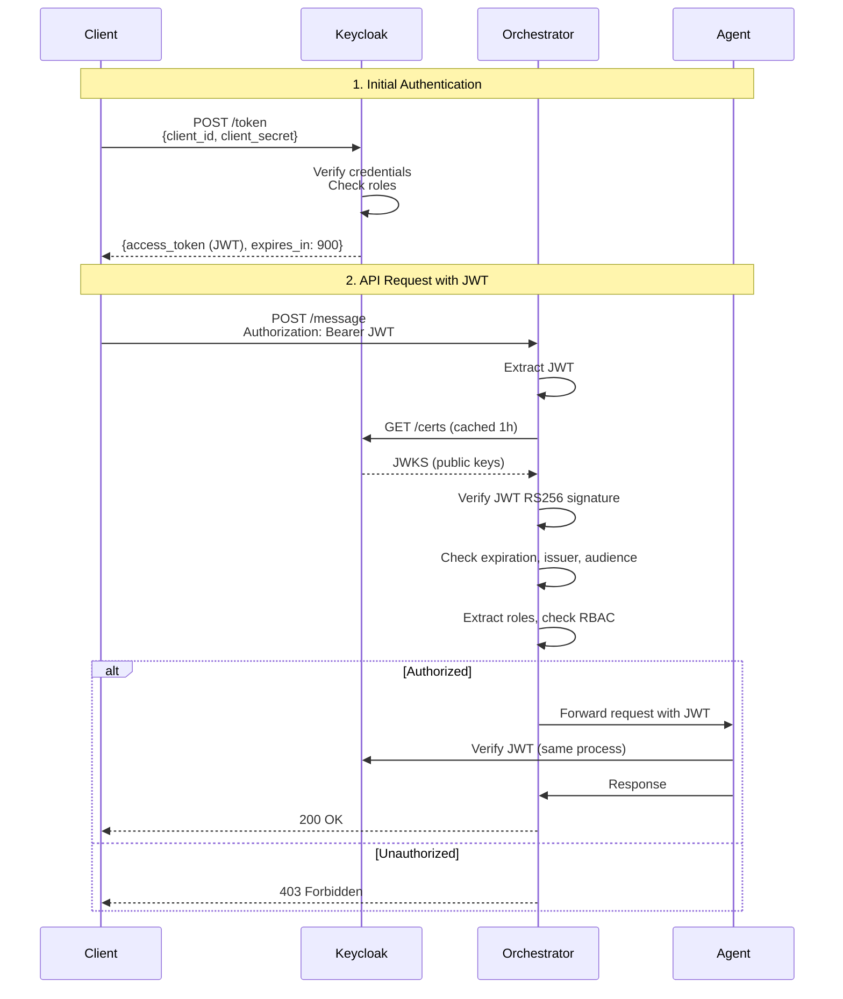
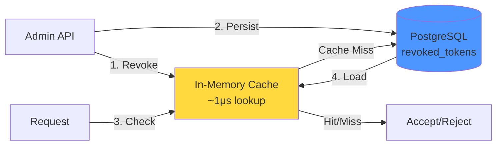

# CA-A2A Authentication & Authorization

**Version:** 6.0  
**Last Updated:** January 17, 2026  
**Related:** [Complete Security Architecture](../A2A_SECURITY_ARCHITECTURE.md)

---

## Overview

The CA-A2A system uses **Keycloak OAuth2/OIDC** for centralized authentication and **Role-Based Access Control (RBAC)** for authorization. All agents validate JWT tokens issued by Keycloak.

**Key Features:**
- ✅ Centralized identity management (Keycloak)
- ✅ Stateless JWT tokens (RS256)
- ✅ Token binding (RFC 8473) for theft prevention
- ✅ Token revocation capability
- ✅ Role-based permissions (RBAC)

---

## Authentication Flow



---

## JWT Token Structure

### Access Token Example (RS256 signed by Keycloak)

```json
{
  "header": {
    "alg": "RS256",
    "typ": "JWT",
    "kid": "keycloak-key-id-2026"
  },
  "payload": {
    "exp": 1737845500,
    "iat": 1737845200,
    "jti": "abc123-token-id",
    "iss": "http://keycloak.ca-a2a.local:8080/realms/ca-a2a",
    "aud": "ca-a2a-agents",
    "sub": "user-uuid-1234",
    "typ": "Bearer",
    "azp": "ca-a2a-agents",
    "realm_access": {
      "roles": ["admin", "orchestrator", "document-processor"]
    },
    "resource_access": {
      "ca-a2a-agents": {
        "roles": ["admin"]
      }
    },
    "preferred_username": "john.doe@example.com",
    "email": "john.doe@example.com",
    "cnf": {
      "x5t#S256": "bDlkZGM4YTEyZGM..." 
    }
  },
  "signature": "..."
}
```

### Token Claims Explained

| Claim | Description | Security Purpose |
|-------|-------------|------------------|
| `exp` | Expiration timestamp | Limit token lifetime (15 min) |
| `iat` | Issued at timestamp | Track token age |
| `jti` | JWT ID (unique nonce) | Replay protection, revocation |
| `iss` | Issuer (Keycloak URL) | Verify token source |
| `aud` | Audience (ca-a2a-agents) | Prevent token misuse |
| `sub` | Subject (user ID) | Identify user |
| `realm_access.roles` | Keycloak roles | RBAC authorization |
| `cnf.x5t#S256` | Certificate thumbprint | Token binding (theft prevention) |

---

## Role-Based Access Control (RBAC)

### Role Hierarchy

| Keycloak Role | A2A Principal | Allowed Methods | Use Case |
|---------------|---------------|-----------------|----------|
| `admin` | `admin` | `*` (all methods) | Full system access, debugging |
| `lambda` | `lambda` | `upload_document`, `process_document` | External triggers (S3 events) |
| `orchestrator` | `orchestrator` | `extract_document`, `validate_document`, `archive_document` | Agent-to-agent coordination |
| `document-processor` | `document-processor` | `process_document`, `list_pending_documents`, `check_status` | Document processing workflows |
| `viewer` | `viewer` | `list_documents`, `get_document`, `check_status` | Read-only access, monitoring |

### RBAC Implementation

**File:** `keycloak_auth.py`

```python
class KeycloakRBACMapper:
    def map_roles_to_principal(self, keycloak_roles: List[str]) -> Tuple[str, List[str]]:
        """
        Maps Keycloak roles to A2A principal and permissions.
        Priority: admin > lambda > orchestrator > document-processor > viewer
        """
        if "admin" in keycloak_roles:
            return "admin", ["*"]
        elif "lambda" in keycloak_roles:
            return "lambda", ["upload_document", "process_document"]
        elif "orchestrator" in keycloak_roles:
            return "orchestrator", ["extract_document", "validate_document", "archive_document"]
        elif "document-processor" in keycloak_roles:
            return "document-processor", ["process_document", "list_pending_documents", "check_status"]
        elif "viewer" in keycloak_roles:
            return "viewer", ["list_documents", "get_document", "check_status"]
        else:
            return "anonymous", []
```

### Permission Check

```python
def check_permission(principal: str, method: str) -> bool:
    """Check if principal has permission for method"""
    permissions = RBAC_POLICY.get(principal, [])
    
    # Admin has wildcard permission
    if "*" in permissions:
        return True
    
    # Check explicit method permission
    return method in permissions
```

---

## Token Binding (RFC 8473)

**Purpose:** Prevent token theft by cryptographically binding JWT to TLS client certificate

### How It Works

1. **Token Issuance:**
   - Client authenticates to Keycloak with mTLS (client certificate)
   - Keycloak computes SHA-256 thumbprint of client cert
   - Thumbprint added to JWT as `cnf.x5t#S256` claim

2. **Token Validation:**
   - Agent receives JWT + client certificate from TLS handshake
   - Agent computes thumbprint of presented certificate
   - Agent compares with `cnf.x5t#S256` claim using constant-time comparison
   - If mismatch → `403 Forbidden` (token stolen)

### Implementation

**File:** `token_binding.py`

```python
import hashlib
import base64
import secrets
from cryptography import x509

class TokenBindingValidator:
    def compute_certificate_thumbprint(self, cert_pem: str) -> str:
        """Compute SHA-256 thumbprint of X.509 certificate"""
        cert = x509.load_pem_x509_certificate(cert_pem.encode('utf-8'), default_backend())
        der_bytes = cert.public_bytes(x509.Encoding.DER)
        thumbprint_bytes = hashlib.sha256(der_bytes).digest()
        return base64.urlsafe_b64encode(thumbprint_bytes).decode('utf-8').rstrip('=')
    
    def verify_token_binding(self, jwt_claims: Dict[str, Any], client_cert_pem: str) -> Tuple[bool, str]:
        """Verify JWT's cnf.x5t#S256 matches client certificate"""
        cnf = jwt_claims.get("cnf")
        if not cnf:
            return False, "JWT missing 'cnf' claim"
        
        expected_thumbprint = cnf.get("x5t#S256")
        if not expected_thumbprint:
            return False, "JWT missing 'x5t#S256' claim"
        
        presented_thumbprint = self.compute_certificate_thumbprint(client_cert_pem)
        
        # Constant-time comparison (timing attack prevention)
        if not secrets.compare_digest(expected_thumbprint, presented_thumbprint):
            return False, "Certificate thumbprint mismatch"
        
        return True, None
```

---

## Token Revocation

### Why We Need Token Revocation

**Problem:** JWTs are stateless - once issued, they're valid until expiration.  
**Solution:** Maintain a revocation list for emergency invalidation (e.g., stolen laptop)

### Revocation Architecture



### Why Not Use Keycloak for Revocation?

**Short Answer:** JWTs are stateless by design. Keycloak session checking defeats the purpose.

| Approach | Latency | Scalability | Single Point of Failure |
|----------|---------|-------------|-------------------------|
| **Keycloak Session Check** | 50-100ms | Poor (Keycloak bottleneck) | Yes |
| **Our Hybrid Revocation** | 1μs (cached) | Excellent (distributed) | No |

**Our Solution:**
- ✅ In-memory cache: 1μs check (99.9% of requests)
- ✅ PostgreSQL persistence: Survives restarts
- ✅ Automatic cleanup: Expired tokens removed every 5 minutes
- ✅ Distributed: Each agent has its own cache

### Revocation Table Schema

```sql
CREATE TABLE revoked_tokens (
    jti VARCHAR(255) PRIMARY KEY,
    revoked_at TIMESTAMP DEFAULT CURRENT_TIMESTAMP,
    revoked_by VARCHAR(100) NOT NULL,
    reason TEXT,
    expires_at TIMESTAMP NOT NULL
);

CREATE INDEX idx_revoked_expires ON revoked_tokens(expires_at);
CREATE INDEX idx_revoked_by ON revoked_tokens(revoked_by);
```

### Admin API

```bash
# Revoke a token
POST /admin/revoke-token
{
  "jti": "abc123-token-id",
  "reason": "Security breach: Laptop stolen",
  "revoked_by": "admin@example.com"
}

# List revoked tokens
GET /admin/revoked-tokens?limit=50&offset=0

# Security stats
GET /admin/security-stats
{
  "revoked_tokens_count": 5,
  "active_principals": 12,
  "authentication_failures_24h": 3
}
```

---

## Security Best Practices

### 1. **Short Token Lifespan**
- Access token: **15 minutes** (900 seconds)
- Refresh token: **1 hour** (if used)
- Limits damage window if token stolen

### 2. **Token Rotation**
- Client should refresh token before expiration
- Use refresh tokens for long-lived sessions

### 3. **Secure Storage**
- Never log full tokens (only first 8 chars: `abc123...`)
- Store tokens in memory only (not localStorage in browsers)
- Use secure environment variables for client secrets

### 4. **Monitoring**
- Track authentication failures (CloudWatch)
- Alert on unusual token usage patterns
- Monitor revoked token usage attempts

---

## Configuration

### Environment Variables

```bash
# Keycloak Configuration
A2A_USE_KEYCLOAK=true
KEYCLOAK_URL=http://keycloak.ca-a2a.local:8080
KEYCLOAK_REALM=ca-a2a
KEYCLOAK_CLIENT_ID=ca-a2a-agents
KEYCLOAK_CLIENT_SECRET=<secret-from-secrets-manager>
KEYCLOAK_CACHE_TTL=3600  # JWKS cache (1 hour)

# Token Binding (Optional)
A2A_REQUIRE_TOKEN_BINDING=false
A2A_REQUIRE_MTLS_CERTIFICATE=false

# RBAC Policy
A2A_RBAC_POLICY_JSON={"allow": {"admin": ["*"]}, "deny": {}}

# Token Revocation
A2A_REVOCATION_CHECK_ENABLED=true
A2A_REVOCATION_CACHE_TTL=300  # 5 minutes
```

---

## Related Documentation

- [Security Layers (Defense-in-Depth)](SECURITY_LAYERS_DEFENSE_IN_DEPTH.md)
- [Protocol Security](PROTOCOL_SECURITY.md)
- [System Architecture](SYSTEM_ARCHITECTURE.md)

---

**End of Document**
