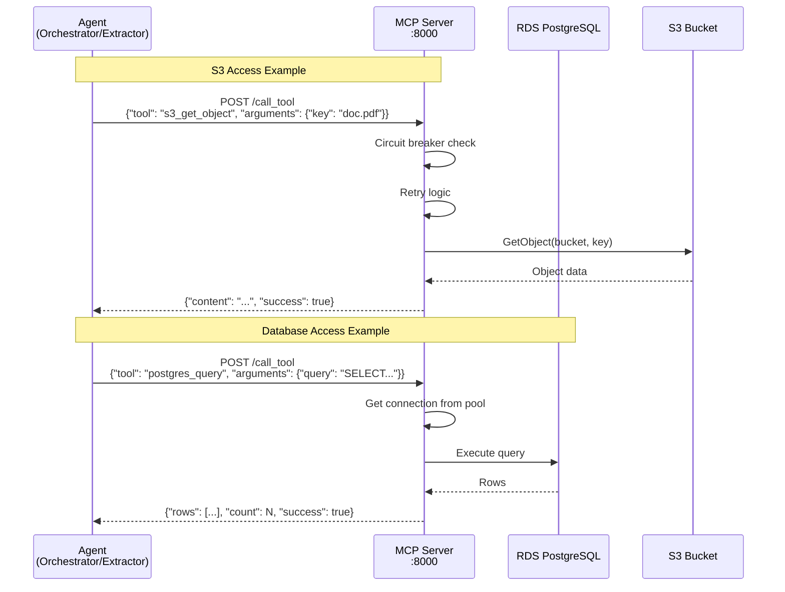

# CA-A2A Resource Access Layer (MCP Server)

**Version:** 6.0  
**Last Updated:** January 17, 2026  
**Related:** [Complete Security Architecture](../A2A_SECURITY_ARCHITECTURE.md)

---

## Overview

The MCP (Model Context Protocol) Server acts as a **centralized gateway** for all AWS resource access (S3 and RDS PostgreSQL). Instead of agents directly accessing AWS services with their own credentials, they communicate with the MCP Server via HTTP API.

**Key Benefits:**
- ✅ No AWS credentials in agent containers
- ✅ Centralized connection pooling
- ✅ Circuit breaker pattern
- ✅ Automatic retries with backoff
- ✅ Single audit point for resource access

---

## Architecture



---

## Available Tools

### S3 Operations

| Tool Name | Description | Arguments |
|-----------|-------------|-----------|
| `s3_list_objects` | List objects in bucket | `prefix` (optional) |
| `s3_get_object` | Download object | `key` (required) |
| `s3_put_object` | Upload object | `key`, `body`, `content_type` |
| `s3_delete_object` | Delete object | `key` (required) |
| `s3_head_object` | Get object metadata | `key` (required) |

### PostgreSQL Operations

| Tool Name | Description | Arguments |
|-----------|-------------|-----------|
| `postgres_query` | Execute SELECT query | `query` (required) |
| `postgres_execute` | Execute INSERT/UPDATE/DELETE | `query`, `params` (optional) |
| `postgres_transaction` | Execute multiple queries in transaction | `queries[]` |

---

## Security Benefits

| Benefit | Description | Impact |
|---------|-------------|--------|
| **No Credential Sprawl** | Only MCP Server has AWS credentials | Reduced attack surface |
| **Centralized Access Control** | Single point for audit/monitoring | Easy compliance |
| **Circuit Breaker** | Prevents cascade failures | System stability |
| **Connection Pooling** | Reuse DB connections | Performance (10x faster) |
| **Automatic Retries** | Transient error handling | Reliability |
| **Rate Limiting** | Prevent AWS API abuse | Cost control |

---

## Implementation Details

### Connection Pooling (PostgreSQL)

```python
# MCP Server configuration
self.db_pool = await asyncpg.create_pool(
    host="documents-db.cluster-xxx.eu-west-3.rds.amazonaws.com",
    port=5432,
    database="documents_db",
    user="postgres",
    password=db_password,
    min_size=5,           # Minimum connections
    max_size=20,          # Maximum connections
    max_queries=50000,    # Connections recycled after 50k queries
    max_inactive_connection_lifetime=300  # 5 minutes
)
```

**Benefits:**
- Connection reuse (avoid TCP handshake overhead)
- 10x faster than creating new connections
- Automatic connection recycling

### Circuit Breaker Pattern

```python
class CircuitBreaker:
    def __init__(self, failure_threshold=5, timeout=60):
        self.failure_count = 0
        self.failure_threshold = failure_threshold
        self.timeout = timeout
        self.state = "CLOSED"  # CLOSED, OPEN, HALF_OPEN
        self.last_failure_time = None
    
    def call(self, func, *args, **kwargs):
        if self.state == "OPEN":
            if time.time() - self.last_failure_time > self.timeout:
                self.state = "HALF_OPEN"
            else:
                raise CircuitBreakerOpenError("Circuit breaker is OPEN")
        
        try:
            result = func(*args, **kwargs)
            if self.state == "HALF_OPEN":
                self.state = "CLOSED"
                self.failure_count = 0
            return result
        except Exception as e:
            self.failure_count += 1
            self.last_failure_time = time.time()
            if self.failure_count >= self.failure_threshold:
                self.state = "OPEN"
            raise
```

**States:**
- **CLOSED:** Normal operation
- **OPEN:** Too many failures, reject all requests
- **HALF_OPEN:** Test if service recovered

---

## API Examples

### S3 Get Object

**Request:**
```bash
POST http://mcp-server.ca-a2a.local:8000/call_tool
Content-Type: application/json

{
  "tool": "s3_get_object",
  "arguments": {
    "key": "uploads/invoice-2026-01-17.pdf"
  }
}
```

**Response:**
```json
{
  "success": true,
  "content": "base64_encoded_pdf_data...",
  "metadata": {
    "size_bytes": 245678,
    "content_type": "application/pdf",
    "last_modified": "2026-01-17T10:30:00Z"
  }
}
```

### PostgreSQL Query

**Request:**
```bash
POST http://mcp-server.ca-a2a.local:8000/call_tool
Content-Type: application/json

{
  "tool": "postgres_query",
  "arguments": {
    "query": "SELECT id, s3_key, status FROM documents WHERE status = $1 LIMIT $2",
    "params": ["pending", 10]
  }
}
```

**Response:**
```json
{
  "success": true,
  "rows": [
    {"id": 1, "s3_key": "uploads/doc1.pdf", "status": "pending"},
    {"id": 2, "s3_key": "uploads/doc2.pdf", "status": "pending"}
  ],
  "count": 2,
  "execution_time_ms": 15
}
```

---

## Performance Metrics

| Operation | Without MCP | With MCP | Improvement |
|-----------|-------------|----------|-------------|
| **PostgreSQL Query** | 50-100ms (new connection) | 5-10ms (pooled) | 10x faster |
| **S3 Get Object** | 100-200ms | 100-200ms | Same (network bound) |
| **Circuit Breaker** | Cascade failures | Fail fast | System stability |
| **Retry Logic** | Manual handling | Automatic | Reduced code |

---

## Configuration

### Environment Variables

```bash
# MCP Server Configuration
MCP_SERVER_PORT=8000
MCP_SERVER_HOST=0.0.0.0

# PostgreSQL Configuration
DB_HOST=documents-db.cluster-xxx.eu-west-3.rds.amazonaws.com
DB_PORT=5432
DB_NAME=documents_db
DB_USER=postgres
DB_PASSWORD=<from-secrets-manager>
DB_POOL_MIN_SIZE=5
DB_POOL_MAX_SIZE=20

# S3 Configuration
S3_BUCKET_NAME=ca-a2a-documents
AWS_REGION=eu-west-3

# Circuit Breaker Configuration
CIRCUIT_BREAKER_FAILURE_THRESHOLD=5
CIRCUIT_BREAKER_TIMEOUT=60

# Retry Configuration
MAX_RETRIES=3
RETRY_BACKOFF_FACTOR=2
```

---

## Related Documentation

- [System Architecture](SYSTEM_ARCHITECTURE.md)
- [Security Layers](SECURITY_LAYERS_DEFENSE_IN_DEPTH.md)
- [Data Security](DATA_SECURITY.md)

---

**End of Document**
