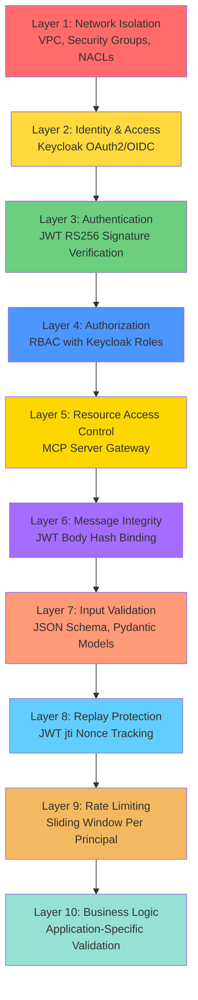

# CA-A2A Security Layers (Defense-in-Depth)

**Version:** 6.0  
**Last Updated:** January 17, 2026  
**Related:** [Complete Security Architecture](../A2A_SECURITY_ARCHITECTURE.md)

---

## Overview

The CA-A2A system implements a **10-layer defense-in-depth security architecture**. Each layer provides independent protection, ensuring that compromising one layer does not compromise the entire system.

**Security Principle:** Multiple independent security controls → No single point of failure

---

## 10 Security Layers



---

## Layer Details

### Layer 1: Network Isolation
**Technology:** AWS VPC, Security Groups, NACLs  
**Purpose:** Prevent unauthorized network access

**Controls:**
- Private subnets (no public IPs)
- Security Groups (port-level filtering)
- Network ACLs (subnet-level filtering)
- NAT Gateway (outbound-only internet)

**Threats Mitigated:**
- Network attacks
- Port scanning
- Direct server access
- DDoS attacks (AWS Shield)

**Bypass Difficulty:** ⭐⭐⭐⭐⭐ Very Hard

---

### Layer 2: Identity & Access
**Technology:** Keycloak OAuth2/OIDC  
**Purpose:** Centralized authentication

**Controls:**
- Keycloak as identity provider
- Client credentials flow (client_id + client_secret)
- Token issuance with user roles

**Threats Mitigated:**
- Unauthorized authentication attempts
- Credential sprawl
- Identity spoofing

**Bypass Difficulty:** ⭐⭐⭐⭐ Hard

---

### Layer 3: Authentication
**Technology:** JWT RS256 + Token Binding (RFC 8473)  
**Purpose:** Verify token authenticity

**Controls:**
- RS256 asymmetric signature verification
- Token expiration check (exp claim)
- Issuer validation (iss claim)
- Audience validation (aud claim)
- Token binding to TLS certificate

**Threats Mitigated:**
- Forged tokens
- Expired tokens
- Token theft (via token binding)
- Replay attacks (with Layer 8)

**Bypass Difficulty:** ⭐⭐⭐⭐ Hard

---

### Layer 4: Authorization
**Technology:** RBAC with Keycloak Roles  
**Purpose:** Enforce permissions

**Controls:**
- Role-to-permission mapping
- Method-level access control
- Keycloak role extraction from JWT

**Role Hierarchy:**
```
admin → * (all methods)
orchestrator → extract_document, validate_document, archive_document
lambda → upload_document, process_document
document-processor → process_document, list_pending_documents, check_status
viewer → list_documents, get_document, check_status (read-only)
```

**Threats Mitigated:**
- Privilege escalation
- Unauthorized method invocation
- Horizontal access violations

**Bypass Difficulty:** ⭐⭐⭐⭐ Hard

---

### Layer 5: Resource Access Control
**Technology:** MCP Server (Resource Gateway)  
**Purpose:** Centralized S3/RDS access

**Controls:**
- All AWS access goes through MCP Server
- Circuit breaker pattern
- Connection pooling
- No direct AWS credentials in agents

**Threats Mitigated:**
- Credential sprawl
- Direct AWS access
- Resource exhaustion
- AWS API abuse

**Bypass Difficulty:** ⭐⭐⭐⭐ Hard

---

### Layer 6: Message Integrity
**Technology:** JWT Body Hash Binding  
**Purpose:** Detect message tampering

**Controls:**
- SHA-256 hash of request body
- Hash stored in JWT `body_hash` claim
- Verification on agent side

**Threats Mitigated:**
- Man-in-the-middle tampering
- Request body modification
- Parameter manipulation

**Bypass Difficulty:** ⭐⭐⭐ Medium

---

### Layer 7: Input Validation
**Technology:** JSON Schema + Pydantic Models  
**Purpose:** Reject malformed input

**Controls:**
- JSON Schema validation for all methods
- Pydantic type checking
- Path traversal protection (`../` detection)
- Length limits (max 1024 chars for paths)
- No additional properties allowed

**Threats Mitigated:**
- SQL injection
- Path traversal
- XSS attacks
- Buffer overflow
- Type confusion

**Bypass Difficulty:** ⭐⭐⭐ Medium

---

### Layer 8: Replay Protection
**Technology:** JWT jti Nonce Tracking  
**Purpose:** Prevent request replay

**Controls:**
- Track JWT `jti` (unique token ID) in cache
- TTL-based expiration (120 seconds)
- Reject duplicate `jti`

**Threats Mitigated:**
- Replay attacks
- Request duplication
- Token reuse

**Bypass Difficulty:** ⭐⭐ Easy (if attacker replays within TTL window)

---

### Layer 9: Rate Limiting
**Technology:** Sliding Window Algorithm  
**Purpose:** Prevent abuse

**Controls:**
- 300 requests per minute per principal
- Sliding window (not fixed window)
- Per-agent-instance tracking

**Threats Mitigated:**
- Denial of Service (DoS)
- Brute force attacks
- Resource exhaustion
- API abuse

**Bypass Difficulty:** ⭐⭐ Easy (distributed attack from multiple principals)

---

### Layer 10: Business Logic
**Technology:** Application-Specific Validation  
**Purpose:** Enforce business rules

**Controls:**
- Custom validations (e.g., document exists in S3)
- Workflow state checks
- Business rule enforcement

**Threats Mitigated:**
- Application-specific attacks
- Invalid business logic exploitation

**Bypass Difficulty:** ⭐ Very Easy (application-dependent)

---

## Attack Scenario Analysis

### Scenario 1: Stolen JWT Token
| Layer | Result | Outcome |
|-------|--------|---------|
| L1-L3 | ✅ Pass | Attacker has valid network + auth |
| L4 | ❌ **FAIL** | Token binding: Certificate mismatch |
| **Result** | **Blocked at Layer 4** | Token unusable from different client |

### Scenario 2: Insider with Viewer Role Tries to Delete Document
| Layer | Result | Outcome |
|-------|--------|---------|
| L1-L4 | ✅ Pass | Insider has valid JWT |
| L5 | ❌ **FAIL** | RBAC: `viewer` cannot call `delete_document` |
| **Result** | **Blocked at Layer 5** | `403 Forbidden` |

### Scenario 3: MITM Modifies Request Body
| Layer | Result | Outcome |
|-------|--------|---------|
| L1 | ✅ Pass | TLS prevents interception |
| L6 | ❌ **FAIL** | Body hash mismatch |
| **Result** | **Blocked at Layers 1 & 6** | TLS + hash prevent tampering |

### Scenario 4: Replay Attack
| Layer | Result | Outcome |
|-------|--------|---------|
| L1-L7 | ✅ Pass | Request looks valid |
| L8 | ❌ **FAIL** | JWT `jti` already seen |
| **Result** | **Blocked at Layer 8** | `403 Replay Detected` |

---

## Layer Performance Impact

| Layer | Latency Added | CPU Impact | Memory Impact |
|-------|---------------|------------|---------------|
| L1: Network | 0ms (AWS managed) | None | None |
| L2: Identity | 0ms (cached JWKS) | Minimal | 1MB (JWKS cache) |
| L3: Authentication | 5-10ms (JWT verify) | Low | Minimal |
| L4: Authorization | <1ms (role check) | Minimal | Minimal |
| L5: Resource Gateway | 10-20ms (MCP call) | Medium | Connection pool |
| L6: Message Integrity | 1-2ms (SHA-256 hash) | Low | Minimal |
| L7: Input Validation | 2-5ms (JSON Schema) | Low | Minimal |
| L8: Replay Protection | <1ms (cache lookup) | Minimal | 10MB (jti cache) |
| L9: Rate Limiting | <1ms (counter check) | Minimal | 5MB (rate data) |
| L10: Business Logic | Varies | Varies | Varies |
| **Total Overhead** | **20-40ms** | **Low** | **~20MB** |

---

## Security Guarantees

✅ **Fail-Secure:** Any layer failure rejects the request  
✅ **Independent:** Each layer works even if others are bypassed  
✅ **Observable:** All layers log decisions to CloudWatch  
✅ **Testable:** Each layer can be tested independently  
✅ **Performance:** Total overhead < 50ms (< 20% of total request time)

---

## Related Documentation

- [System Architecture](SYSTEM_ARCHITECTURE.md)
- [Authentication & Authorization](AUTHENTICATION_AUTHORIZATION.md)
- [Protocol Security](PROTOCOL_SECURITY.md)

---

**End of Document**
