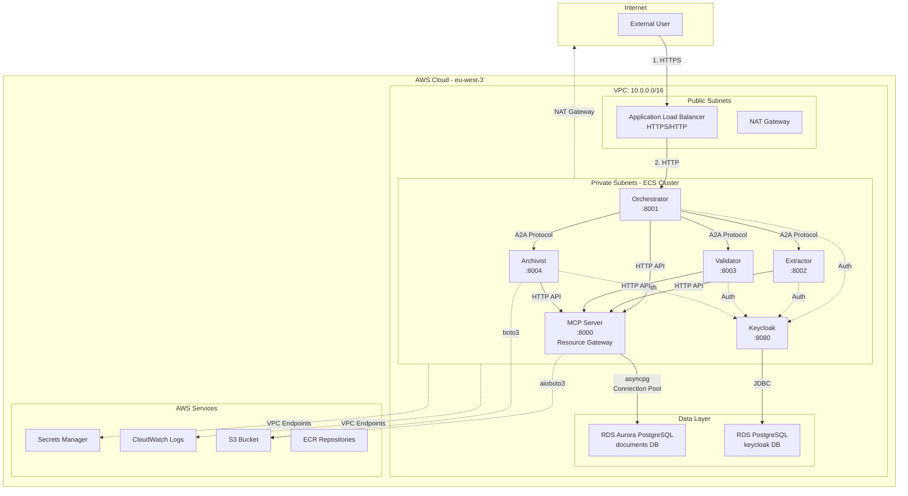

# CA-A2A System Architecture

**Version:** 6.0  
**Last Updated:** January 17, 2026  
**Related:** [Complete Security Architecture](../A2A_SECURITY_ARCHITECTURE.md)

---

## Overview

The CA-A2A (Crédit Agricole Agent-to-Agent) system is a distributed document processing platform deployed on AWS ECS Fargate in the eu-west-3 (Paris) region. The system uses a microservices architecture with centralized authentication (Keycloak) and resource access control (MCP Server).

---

## Architecture Diagram



---

## Component Overview

| Component | Type | Port | Purpose | Instances | CPU/Memory |
|-----------|------|------|---------|-----------|------------|
| **Orchestrator** | ECS Fargate | 8001 | Request coordination, workflow orchestration | 2 | 1 vCPU / 2GB |
| **Extractor** | ECS Fargate | 8002 | Document text extraction (OCR, parsing) | 2 | 2 vCPU / 4GB |
| **Validator** | ECS Fargate | 8003 | Content validation, quality checks | 2 | 1 vCPU / 2GB |
| **Archivist** | ECS Fargate | 8004 | Document archival, retrieval, S3 management | 2 | 1 vCPU / 2GB |
| **Keycloak** | ECS Fargate | 8080 | Identity Provider (OAuth2/OIDC) | 1 | 1 vCPU / 2GB |
| **MCP Server** | ECS Fargate | 8000 | Centralized resource gateway (S3/RDS) | 2 | 1 vCPU / 2GB |
| **ALB** | AWS Service | 80/443 | Load balancing, TLS termination | Multi-AZ | AWS Managed |
| **RDS Aurora** | Managed DB | 5432 | Document metadata, audit logs | Multi-AZ | db.t3.medium |
| **RDS Postgres** | Managed DB | 5432 | Keycloak data (users, roles, sessions) | Multi-AZ | db.t3.small |

---

## Key Architectural Patterns

### 1. **Microservices Architecture**
- Each agent is an independent service with a single responsibility
- Services communicate via JSON-RPC 2.0 over HTTPS
- Loosely coupled, can be scaled independently

### 2. **Centralized Authentication**
- Keycloak as the single source of truth for identity
- All agents validate JWTs using Keycloak's public keys (JWKS)
- No credential sprawl (agents don't store AWS credentials)

### 3. **Gateway Pattern (MCP Server)**
- Single point of access for S3 and RDS resources
- Connection pooling, circuit breaking, retry logic
- Prevents direct AWS credential distribution

### 4. **Service Discovery**
- AWS Cloud Map for internal DNS resolution
- Example: `orchestrator.ca-a2a.local:8001`
- No hardcoded IP addresses

### 5. **Private Network**
- All agents run in private subnets (no public IPs)
- Internet access via NAT Gateway (outbound only)
- AWS service access via VPC Endpoints (no internet routing)

---

## Communication Flows

### Flow 1: External Request Processing
```
User → ALB (HTTPS) → Orchestrator → Keycloak (JWT validation)
                                  → MCP Server (S3/RDS access)
                                  → Extractor (document processing)
                                  → Validator (quality check)
                                  → Archivist (storage)
                                  → Response to User
```

### Flow 2: Agent-to-Agent Communication
```
Orchestrator → Extractor (JSON-RPC request)
            → JWT in Authorization header
            → Extractor validates JWT with Keycloak JWKS
            → Extractor processes request
            → Response to Orchestrator
```

### Flow 3: Resource Access
```
Agent → MCP Server (HTTP API)
     → MCP checks circuit breaker
     → MCP uses connection pool
     → MCP accesses S3 or RDS
     → Response to Agent
```

---

## Network Configuration

### VPC Details
- **CIDR:** 10.0.0.0/16
- **Subnets:**
  - Public Subnet 1: 10.0.1.0/24 (eu-west-3a)
  - Public Subnet 2: 10.0.2.0/24 (eu-west-3b)
  - Private Subnet 1: 10.0.11.0/24 (eu-west-3a)
  - Private Subnet 2: 10.0.12.0/24 (eu-west-3b)

### Load Balancer
- **Type:** Application Load Balancer (Layer 7)
- **Scheme:** Internet-facing
- **Listeners:**
  - HTTP:80 → Redirect to HTTPS
  - HTTPS:443 → Orchestrator:8001
- **Health Checks:** `/health` endpoint (every 30s)

### High Availability
- Multi-AZ deployment (2 availability zones)
- Each agent has 2 instances (active-active)
- RDS Aurora with automatic failover
- ALB distributes traffic across instances

---

## Data Storage

| Resource | Type | Purpose | Encryption | Backup |
|----------|------|---------|------------|--------|
| **RDS Aurora PostgreSQL** | Relational DB | Document metadata, processing state | AES-256 (KMS) | Automated daily |
| **RDS PostgreSQL** | Relational DB | Keycloak users, roles, sessions | AES-256 (KMS) | Automated daily |
| **S3 Bucket** | Object Storage | Document files (PDFs, images) | SSE-S3 (AES-256) | Versioning enabled |
| **Secrets Manager** | Secrets Store | Database passwords, API keys | AES-256 (KMS) | Automatic rotation |

---

## Scaling Strategy

### Horizontal Scaling
- **Current:** 2 instances per agent (baseline)
- **Auto-scaling triggers:**
  - CPU > 70% for 3 minutes → scale up
  - CPU < 30% for 5 minutes → scale down
- **Limits:** Min 2, Max 10 instances per agent

### Vertical Scaling
- Extractor: Can scale to 4 vCPU / 8GB for large documents
- Other agents: Adequate with 1 vCPU / 2GB

---

## Technology Stack

| Layer | Technology | Version |
|-------|-----------|---------|
| **Infrastructure** | AWS ECS Fargate | Latest |
| **Container Runtime** | Docker | 24.x |
| **Application** | Python | 3.11+ |
| **Web Framework** | aiohttp | 3.9+ |
| **Database** | PostgreSQL | 15.x |
| **Identity Provider** | Keycloak | 23.0 |
| **Protocol** | JSON-RPC 2.0 | Standard |
| **Authentication** | OAuth2/OIDC | Standard |

---

## Deployment Model

### Blue-Green Deployment
1. New task definition created with updated image
2. New tasks launched in ECS cluster
3. Health checks pass on new tasks
4. ALB switches traffic to new tasks
5. Old tasks drained and terminated
6. Rollback available within 15 minutes

### Zero-Downtime Updates
- Rolling updates with 50% batch size
- Health check grace period: 60 seconds
- Automatic rollback on repeated health check failures

---

## Key Design Decisions

| Decision | Rationale | Trade-off |
|----------|-----------|-----------|
| **ECS Fargate (not EC2)** | No server management, auto-scaling, pay-per-use | Slightly higher cost than EC2 |
| **Private subnets only** | Maximum security, no public exposure | Requires NAT Gateway for internet |
| **MCP Server gateway** | Centralized resource access, no credential sprawl | Single point of failure (mitigated by 2 instances) |
| **Keycloak for auth** | Industry standard, feature-rich, self-hosted | Additional infrastructure to manage |
| **JSON-RPC 2.0** | Simple, standardized, secure | Less "RESTful" than HTTP APIs |
| **Aurora PostgreSQL** | High availability, automatic failover | Higher cost than standard RDS |

---

## Related Documentation

- [Security Layers (Defense-in-Depth)](SECURITY_LAYERS_DEFENSE_IN_DEPTH.md)
- [Authentication & Authorization](AUTHENTICATION_AUTHORIZATION.md)
- [Network Security](NETWORK_SECURITY.md)
- [Complete Security Architecture](../A2A_SECURITY_ARCHITECTURE.md)

---

**End of Document**
