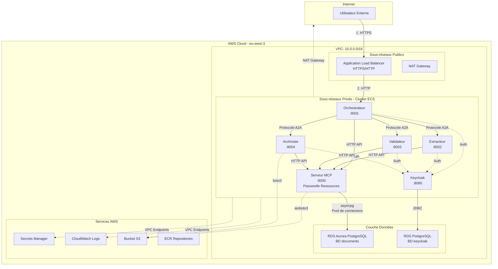

# Architecture Système CA-A2A

**Version :** 6.0  
**Dernière mise à jour :** 17 janvier 2026  
**Lié :** [Architecture de Sécurité Complète](../../A2A_SECURITY_ARCHITECTURE.md)

---

## Vue d'ensemble

Le système CA-A2A (Crédit Agricole Agent-to-Agent) est une plateforme distribuée de traitement de documents déployée sur AWS ECS Fargate dans la région eu-west-3 (Paris). Le système utilise une architecture microservices avec authentification centralisée (Keycloak) et contrôle d'accès aux ressources centralisé (Serveur MCP).

---

## Diagramme d'Architecture



---

## Vue d'ensemble des Composants

| Composant | Type | Port | Objectif | Instances | CPU/Mémoire |
|-----------|------|------|----------|-----------|-------------|
| **Orchestrateur** | ECS Fargate | 8001 | Coordination de requêtes, orchestration de workflow | 2 | 1 vCPU / 2GB |
| **Extracteur** | ECS Fargate | 8002 | Extraction de texte (OCR, parsing) | 2 | 2 vCPU / 4GB |
| **Validateur** | ECS Fargate | 8003 | Validation de contenu, contrôles qualité | 2 | 1 vCPU / 2GB |
| **Archiviste** | ECS Fargate | 8004 | Archivage, récupération, gestion S3 | 2 | 1 vCPU / 2GB |
| **Keycloak** | ECS Fargate | 8080 | Fournisseur d'identité (OAuth2/OIDC) | 1 | 1 vCPU / 2GB |
| **Serveur MCP** | ECS Fargate | 8000 | Passerelle ressources centralisée (S3/RDS) | 2 | 1 vCPU / 2GB |
| **ALB** | Service AWS | 80/443 | Répartition de charge, terminaison TLS | Multi-AZ | AWS géré |
| **RDS Aurora** | BD gérée | 5432 | Métadonnées documents, journaux audit | Multi-AZ | db.t3.medium |
| **RDS Postgres** | BD gérée | 5432 | Données Keycloak (utilisateurs, rôles) | Multi-AZ | db.t3.small |

---

## Modèles Architecturaux Clés

### 1. **Architecture Microservices**
- Chaque agent est un service indépendant avec une responsabilité unique
- Communication via JSON-RPC 2.0 sur HTTPS
- Couplage faible, scalabilité indépendante

### 2. **Authentification Centralisée**
- Keycloak comme source unique de vérité pour l'identité
- Tous les agents valident les JWT avec les clés publiques Keycloak (JWKS)
- Aucune prolifération des credentials

### 3. **Modèle Passerelle (Serveur MCP)**
- Point d'accès unique pour les ressources S3 et RDS
- Pooling de connexions, circuit breaker, logique de retry
- Évite la distribution directe des credentials AWS

### 4. **Découverte de Services**
- AWS Cloud Map pour la résolution DNS interne
- Exemple : `orchestrator.ca-a2a.local:8001`
- Aucune adresse IP en dur

### 5. **Réseau Privé**
- Tous les agents dans des sous-réseaux privés (pas d'IP publiques)
- Accès internet via NAT Gateway (sortant uniquement)
- Accès services AWS via VPC Endpoints (pas de routage internet)

---

## Flux de Communication

### Flux 1 : Traitement de Requête Externe
```
Utilisateur → ALB (HTTPS) → Orchestrateur → Keycloak (validation JWT)
                                          → Serveur MCP (accès S3/RDS)
                                          → Extracteur (traitement document)
                                          → Validateur (contrôle qualité)
                                          → Archiviste (stockage)
                                          → Réponse à l'utilisateur
```

### Flux 2 : Communication Agent-à-Agent
```
Orchestrateur → Extracteur (requête JSON-RPC)
             → JWT dans l'en-tête Authorization
             → Extracteur valide JWT avec JWKS Keycloak
             → Extracteur traite la requête
             → Réponse à l'Orchestrateur
```

---

## Configuration Réseau

### Détails VPC
- **CIDR :** 10.0.0.0/16
- **Sous-réseaux :**
  - Sous-réseau Public 1 : 10.0.1.0/24 (eu-west-3a)
  - Sous-réseau Public 2 : 10.0.2.0/24 (eu-west-3b)
  - Sous-réseau Privé 1 : 10.0.11.0/24 (eu-west-3a)
  - Sous-réseau Privé 2 : 10.0.12.0/24 (eu-west-3b)

### Haute Disponibilité
- Déploiement Multi-AZ (2 zones de disponibilité)
- 2 instances par agent (actif-actif)
- RDS Aurora avec basculement automatique
- ALB distribue le trafic entre les instances

---

## Stockage de Données

| Ressource | Type | Objectif | Chiffrement | Sauvegarde |
|-----------|------|----------|-------------|------------|
| **RDS Aurora PostgreSQL** | BD relationnelle | Métadonnées documents, état traitement | AES-256 (KMS) | Snapshots quotidiens (30 jours) |
| **RDS PostgreSQL** | BD relationnelle | Utilisateurs, rôles, sessions Keycloak | AES-256 (KMS) | Snapshots quotidiens (30 jours) |
| **Bucket S3** | Stockage objet | Fichiers documents (PDF, images) | SSE-S3 (AES-256) | Versioning activé |
| **Secrets Manager** | Coffre secrets | Mots de passe BD, clés API | AES-256 (KMS) | Rotation automatique |

---

## Pile Technologique

| Couche | Technologie | Version |
|--------|------------|---------|
| **Infrastructure** | AWS ECS Fargate | Latest |
| **Runtime Conteneur** | Docker | 24.x |
| **Application** | Python | 3.11+ |
| **Framework Web** | aiohttp | 3.9+ |
| **Base de Données** | PostgreSQL | 15.x |
| **Fournisseur Identité** | Keycloak | 23.0 |
| **Protocole** | JSON-RPC 2.0 | Standard |
| **Authentification** | OAuth2/OIDC | Standard |

---

## Décisions de Conception Clés

| Décision | Justification | Compromis |
|----------|---------------|-----------|
| **ECS Fargate (pas EC2)** | Pas de gestion serveur, auto-scaling, paiement à l'usage | Coût légèrement supérieur à EC2 |
| **Sous-réseaux privés uniquement** | Sécurité maximale, pas d'exposition publique | Nécessite NAT Gateway pour internet |
| **Passerelle Serveur MCP** | Accès ressources centralisé, pas de prolifération credentials | Point unique de défaillance (atténué par 2 instances) |
| **Keycloak pour auth** | Standard industriel, riche en fonctionnalités, auto-hébergé | Infrastructure supplémentaire à gérer |
| **JSON-RPC 2.0** | Simple, standardisé, sécurisé | Moins "RESTful" que APIs HTTP |

---

## Documentation Liée

- [Couches de Sécurité (Défense en Profondeur)](COUCHES_SECURITE_DEFENSE_EN_PROFONDEUR.md)
- [Authentification & Autorisation](AUTHENTIFICATION_AUTORISATION.md)
- [Sécurité Réseau](SECURITE_RESEAU.md)
- [Architecture de Sécurité Complète](../../A2A_SECURITY_ARCHITECTURE.md)

---

**Fin du Document**
