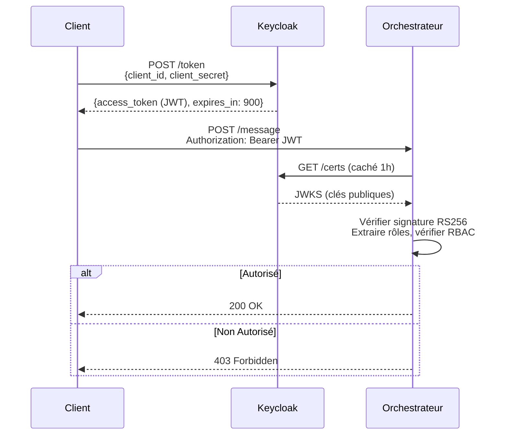

# Authentification & Autorisation CA-A2A

**Version :** 6.0  
**Dernière mise à jour :** 17 janvier 2026

---

## Vue d'ensemble

Le système CA-A2A utilise **Keycloak OAuth2/OIDC** pour l'authentification centralisée et **RBAC (Contrôle d'Accès Basé sur les Rôles)** pour l'autorisation.

**Fonctionnalités Clés :**
- ✅ Gestion d'identité centralisée (Keycloak)
- ✅ Tokens JWT sans état (RS256)
- ✅ Liaison de token (RFC 8473) pour prévention du vol
- ✅ Capacité de révocation de token
- ✅ Permissions basées sur les rôles (RBAC)

---

## Flux d'Authentification OAuth2/OIDC



---

## Structure Token JWT

```json
{
  "header": {
    "alg": "RS256",
    "typ": "JWT",
    "kid": "keycloak-key-id-2026"
  },
  "payload": {
    "exp": 1737845500,
    "iat": 1737845200,
    "jti": "abc123-token-id",
    "iss": "http://keycloak.ca-a2a.local:8080/realms/ca-a2a",
    "aud": "ca-a2a-agents",
    "realm_access": {
      "roles": ["admin", "orchestrator"]
    },
    "cnf": {
      "x5t#S256": "bDlkZGM4YTEy..."
    }
  }
}
```

---

## RBAC - Hiérarchie des Rôles

| Rôle Keycloak | Principal A2A | Méthodes Autorisées | Cas d'Usage |
|---------------|---------------|---------------------|-------------|
| `admin` | `admin` | `*` (toutes) | Accès système complet |
| `orchestrator` | `orchestrator` | `extract_document`, `validate_document`, `archive_document` | Coordination agent-à-agent |
| `lambda` | `lambda` | `upload_document`, `process_document` | Déclencheurs externes (événements S3) |
| `document-processor` | `document-processor` | `process_document`, `list_pending_documents`, `check_status` | Workflows de traitement |
| `viewer` | `viewer` | `list_documents`, `get_document`, `check_status` | Lecture seule |

---

## Liaison de Token (RFC 8473)

**Objectif :** Lier cryptographiquement le JWT au certificat client TLS pour empêcher le vol de token

### Fonctionnement

1. **Émission du Token :**
   - Client s'authentifie à Keycloak avec mTLS
   - Keycloak calcule l'empreinte SHA-256 du certificat client
   - Empreinte ajoutée au JWT comme claim `cnf.x5t#S256`

2. **Validation du Token :**
   - Agent reçoit JWT + certificat client de la poignée TLS
   - Agent calcule l'empreinte du certificat présenté
   - Agent compare avec claim `cnf.x5t#S256` (comparaison temps constant)
   - Si incompatibilité → `403 Forbidden` (token volé)

---

## Révocation de Token

### Pourquoi Notre Propre Révocation ?

**Problème :** Les JWT sont sans état - une fois émis, valides jusqu'à expiration.  
**Solution :** Liste de révocation pour invalidation d'urgence (ex : ordinateur portable volé)

### Architecture de Révocation

```
Admin API → Cache Mémoire (~1μs lookup) → PostgreSQL (persistant)
Requête → Vérifier Cache → Si manque : charger depuis BD
```

### Pourquoi Pas Keycloak pour la Révocation ?

| Approche | Latence | Scalabilité | Point Unique de Défaillance |
|----------|---------|-------------|------------------------------|
| **Vérification Session Keycloak** | 50-100ms | Médiocre (goulot Keycloak) | Oui |
| **Notre Révocation Hybride** | 1μs (caché) | Excellente (distribuée) | Non |

**Notre Solution :**
- ✅ Cache mémoire : vérification 1μs (99,9% des requêtes)
- ✅ Persistance PostgreSQL : Survit aux redémarrages
- ✅ Nettoyage automatique : Tokens expirés supprimés toutes les 5 minutes

---

## Bonnes Pratiques de Sécurité

### 1. **Durée de Vie Courte des Tokens**
- Token d'accès : **15 minutes** (900 secondes)
- Limite la fenêtre de dommage si token volé

### 2. **Surveillance**
- Suivre les échecs d'authentification (CloudWatch)
- Alerter sur les modèles d'utilisation inhabituels
- Surveiller les tentatives d'utilisation de tokens révoqués

---

## Configuration

```bash
# Configuration Keycloak
A2A_USE_KEYCLOAK=true
KEYCLOAK_URL=http://keycloak.ca-a2a.local:8080
KEYCLOAK_REALM=ca-a2a
KEYCLOAK_CLIENT_ID=ca-a2a-agents
KEYCLOAK_CLIENT_SECRET=<secret-from-secrets-manager>

# Liaison de Token (Optionnel)
A2A_REQUIRE_TOKEN_BINDING=false

# Politique RBAC
A2A_RBAC_POLICY_JSON={"allow": {"admin": ["*"]}, "deny": {}}

# Révocation de Token
A2A_REVOCATION_CHECK_ENABLED=true
```

---

**Lié :** [Couches de Sécurité](COUCHES_SECURITE_DEFENSE_EN_PROFONDEUR.md), [Sécurité Protocole](SECURITE_PROTOCOLE.md)
