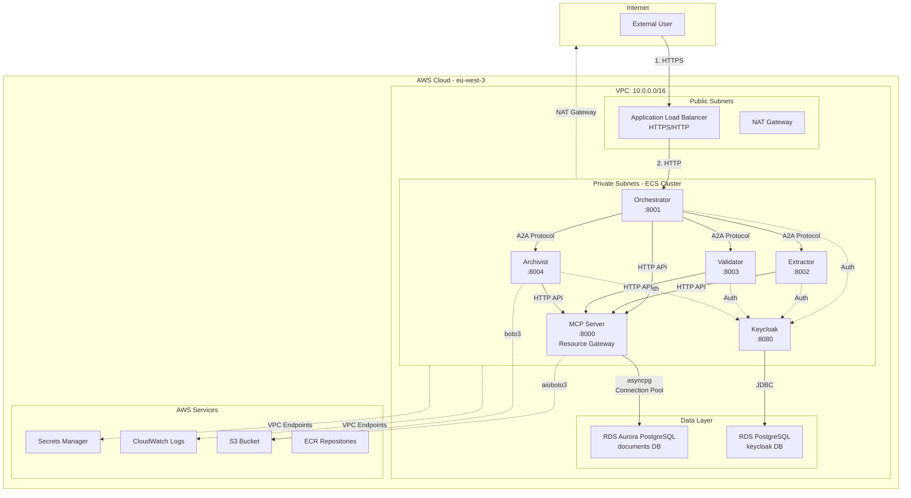

# 1. System Architecture

[← Back to Index](README.md)

---

### 1.1 Production Deployment

### 1.2 Component Overview

| Component | Type | Port | Purpose | Instances |
|-----------|------|------|---------|-----------|
| **Orchestrator** | ECS Fargate | 8001 | Request coordination, workflow | 2 |
| **Extractor** | ECS Fargate | 8002 | Document text extraction | 2 |
| **Validator** | ECS Fargate | 8003 | Content validation | 2 |
| **Archivist** | ECS Fargate | 8004 | Document archival, retrieval | 2 |
| **Keycloak** | ECS Fargate | 8080 | Identity Provider (OAuth2/OIDC) | 1 |
| **ALB** | AWS Service | 80/443 | Load balancing, TLS termination | Multi-AZ |
| **RDS Aurora** | Managed DB | 5432 | Document metadata, audit logs | Multi-AZ |
| **RDS Postgres** | Managed DB | 5432 | Keycloak data (users, roles) | Multi-AZ |

---

---

[Next: Security Layers (Defense-in-Depth) →](02-SECURITY_LAYERS.md)
