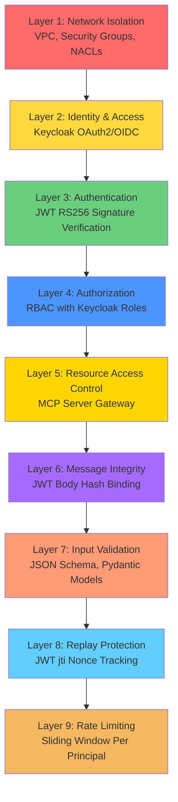
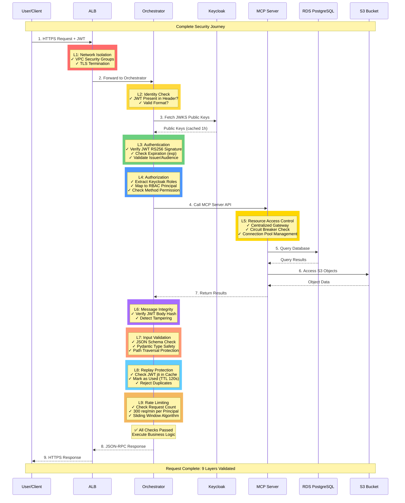

# 2. Security Layers (Defense-in-Depth)

[← Back to Index](README.md)

---

### 2.1 Defense-in-Depth Architecture

### 2.2 Layer Responsibilities

| Layer | Purpose | Technology | Threat Mitigated |
|-------|---------|------------|------------------|
| **L1: Network** | Isolation, segmentation | VPC, SG, NACL | Network attacks, DDoS |
| **L2: Identity** | Centralized authentication | Keycloak | Unauthorized access |
| **L3: Authentication** | Token verification | JWT RS256 | Impersonation, forged tokens |
| **L4: Authorization** | Permission enforcement | RBAC (Keycloak roles) | Privilege escalation |
| **L5: Resource Access** | **Centralized S3/RDS gateway** | **MCP Server** | **Direct AWS access, credential sprawl** |
| **L6: Integrity** | Message tampering detection | JWT body hash | MITM, message tampering |
| **L7: Validation** | Malformed input rejection | JSON Schema, Pydantic | Injection attacks, DoS |
| **L8: Replay** | Duplicate request detection | JWT jti + TTL cache | Replay attacks |
| **L9: Rate Limit** | Abuse prevention | Sliding window | Resource exhaustion, DoS |

### 2.3 Complete Request Security Flow

**Single Request Journey Through All 9 Layers:**

**Layer-by-Layer Security Checkpoints:**

| Layer | Checkpoint | Pass Criteria | Failure Response |
|-------|-----------|---------------|------------------|
| **L1** | Network Entry | Request from allowed IP/VPC | Connection refused |
| **L2** | Identity Presence | JWT in `Authorization: Bearer` header | 401 Unauthorized |
| **L3** | Authentication | Valid JWT signature, not expired | 401 Invalid Token |
| **L4** | Authorization | Principal has permission for method | 403 Forbidden |
| **L5** | Resource Access | MCP Server circuit breaker closed | 503 Service Unavailable |
| **L6** | Message Integrity | JWT body hash matches request | 403 Tampering Detected |
| **L7** | Input Validation | Schema valid, no injection attempts | 400 Invalid Params (-32602) |
| **L8** | Replay Protection | JWT jti not seen before | 403 Replay Detected |
| **L9** | Rate Limiting | Under 300 requests/minute | 429 Rate Limit Exceeded |
| **✅** | **Business Logic** | Application-specific validation | 200 OK or error |

**Security Guarantees:**

- 🛡️ **Defense-in-Depth**: Each layer provides independent protection
- 🔒 **Fail-Secure**: All checks must pass; any failure rejects request
- 📊 **Observable**: Each layer logs decisions to CloudWatch
- ⚡ **Performance**: Total security overhead ~53ms (21% of total request)
- 🔄 **No Single Point of Failure**: Compromising one layer doesn't bypass others

---

---

[← Previous: System Architecture](01-SYSTEM_ARCHITECTURE.md) | [Next: Authentication & Authorization →](03-AUTHENTICATION_AUTHORIZATION.md)
