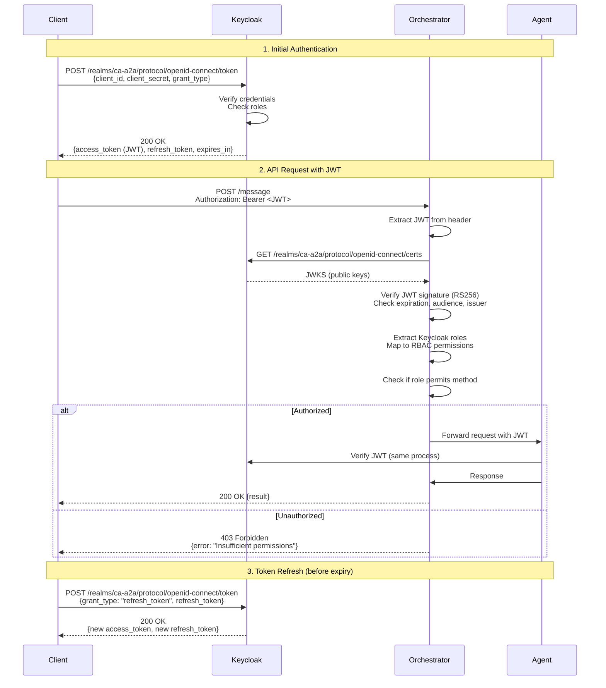
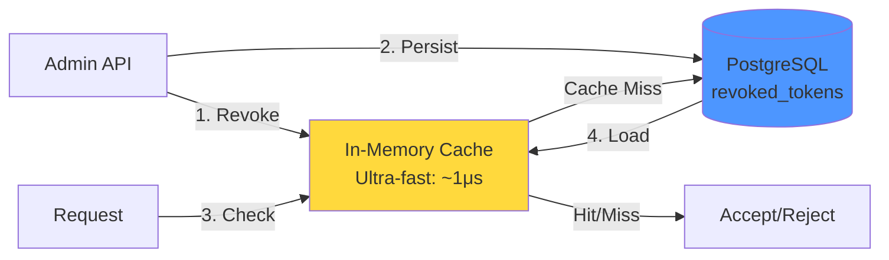

# 3. Authentication & Authorization

[← Back to Index](README.md)

---


### 3.1 Keycloak OAuth2/OIDC Flow



### 3.2 JWT Token Structure

**Access Token (RS256 signed by Keycloak):**
```json
{
  "header": {
    "alg": "RS256",
    "typ": "JWT",
    "kid": "keycloak-key-id"
  },
  "payload": {
    "exp": 1737845500,
    "iat": 1737845200,
    "jti": "abc123-token-id",
    "iss": "http://keycloak.ca-a2a.local:8080/realms/ca-a2a",
    "aud": "ca-a2a-agents",
    "sub": "user-uuid-1234",
    "typ": "Bearer",
    "azp": "ca-a2a-agents",
    "realm_access": {
      "roles": ["admin", "orchestrator", "document-processor"]
    },
    "resource_access": {
      "ca-a2a-agents": {
        "roles": ["admin"]
      }
    },
    "preferred_username": "john.doe@example.com",
    "email": "john.doe@example.com"
  },
  "signature": "..."
}
```

### 3.3 Role-Based Access Control (RBAC)

**Keycloak Realm Roles → A2A RBAC Mapping:**

| Keycloak Role | A2A Principal | Allowed Methods | Use Case |
|---------------|---------------|-----------------|----------|
| `admin` | `admin` | `*` (all methods) | Full system access |
| `lambda` | `lambda` | `upload_document`, `process_document` | External triggers (S3 events) |
| `orchestrator` | `orchestrator` | `extract_document`, `validate_document`, `archive_document` | Agent-to-agent coordination |
| `document-processor` | `document-processor` | `process_document`, `list_pending_documents`, `check_status` | Document processing workflows |
| `viewer` | `viewer` | `list_documents`, `get_document`, `check_status` | Read-only access |

**Implementation (`keycloak_auth.py`):**
```python
class KeycloakRBACMapper:
    def map_roles_to_principal(self, keycloak_roles: List[str]) -> Tuple[str, List[str]]:
        # Priority: admin > lambda > orchestrator > document-processor > viewer
        if "admin" in keycloak_roles:
            return "admin", ["*"]
        elif "lambda" in keycloak_roles:
            return "lambda", ["upload_document", "process_document"]
        elif "orchestrator" in keycloak_roles:
            return "orchestrator", ["extract_document", "validate_document", "archive_document"]
        elif "document-processor" in keycloak_roles:
            return "document-processor", ["process_document", "list_pending_documents", "check_status"]
        elif "viewer" in keycloak_roles:
            return "viewer", ["list_documents", "get_document", "check_status"]
        else:
            return "anonymous", []
```

### 3.4 Token Revocation

**Storage: Hybrid Architecture**



**Revocation Table Schema:**
```sql
CREATE TABLE revoked_tokens (
    jti VARCHAR(255) PRIMARY KEY,
    revoked_at TIMESTAMP DEFAULT CURRENT_TIMESTAMP,
    revoked_by VARCHAR(100) NOT NULL,
    reason TEXT,
    expires_at TIMESTAMP NOT NULL
);

CREATE INDEX idx_revoked_expires ON revoked_tokens(expires_at);
CREATE INDEX idx_revoked_by ON revoked_tokens(revoked_by);
```

**Admin API Endpoints:**
- `POST /admin/revoke-token` - Revoke JWT by jti
- `GET /admin/revoked-tokens` - List revoked tokens
- `GET /admin/security-stats` - Security metrics
- `DELETE /admin/cleanup-expired-tokens` - Manual cleanup

**Performance:**
- Revoke operation: ~10ms (DB write + cache store)
- Check (cached): ~1μs
- Check (cache miss): ~10ms (DB query + cache load)
- Auto-cleanup: Every 5 minutes

---


---

[← Previous: Security Layers (Defense-in-Depth)](02-SECURITY_LAYERS.md) | [Next: Resource Access Layer (MCP Server) →](04-RESOURCE_ACCESS_LAYER.md)
