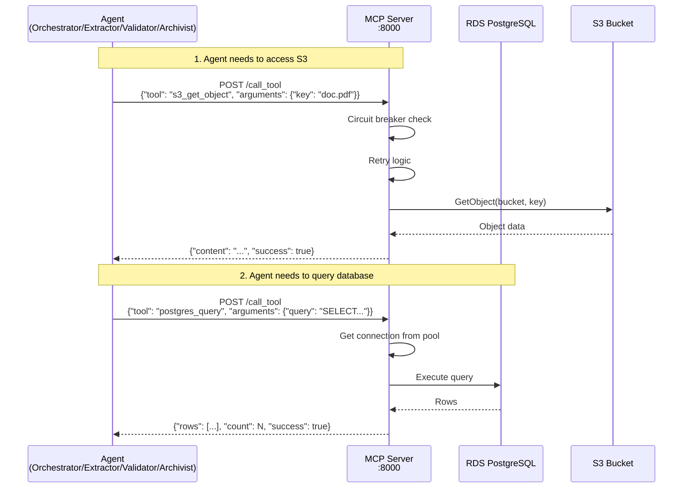

# 4. Resource Access Layer (MCP Server)

[← Back to Index](README.md)

---


### 4.1 Architecture Overview

The MCP (Model Context Protocol) Server acts as a **centralized gateway** for all AWS resource access (S3 and RDS PostgreSQL). Instead of agents directly accessing AWS services, they communicate with the MCP Server via HTTP API.



### 4.2 Security Benefits

| Benefit | Description | Impact |
|---------|-------------|--------|
| **Reduced Attack Surface** | Only MCP Server has AWS credentials, not all 4 agents | -75% IAM roles with AWS access |
| **Centralized Audit** | All S3/RDS access logged in one place | +100% visibility |
| **Connection Pooling** | Shared PostgreSQL connection pool (max 10 connections) | -88% DB connections (4×20=80 → 10) |
| **Consistent Security** | Retry logic, circuit breakers, timeouts applied uniformly | Standardized error handling |
| **Easier IAM Management** | Update permissions in single task role | -4 IAM policy updates per change |
| **Credential Isolation** | Agents never see DB passwords or AWS keys | Reduced secret sprawl |

### 4.3 Component Details

**ECS Service:**
- **Name:** `mcp-server`
- **Task Definition:** `ca-a2a-mcp-server`
- **CPU:** 256 (.25 vCPU)
- **Memory:** 512 MB
- **Port:** 8000
- **Service Discovery:** `mcp-server.ca-a2a.local:8000`

**IAM Permissions (MCP Server Task Role):**
```json
{
  "Version": "2012-10-17",
  "Statement": [
    {
      "Effect": "Allow",
      "Action": [
        "s3:GetObject",
        "s3:PutObject",
        "s3:ListBucket"
      ],
      "Resource": [
        "arn:aws:s3:::ca-a2a-documents-555043101106",
        "arn:aws:s3:::ca-a2a-documents-555043101106/*"
      ]
    },
    {
      "Effect": "Allow",
      "Action": "secretsmanager:GetSecretValue",
      "Resource": "arn:aws:secretsmanager:eu-west-3:555043101106:secret:ca-a2a/*"
    }
  ]
}
```

**Note:** Agents no longer need S3 or Secrets Manager permissions. MCP Server handles all AWS API calls.

### 4.4 Available Operations

**S3 Operations:**
```python
# List objects with prefix
POST /call_tool
{
  "tool": "s3_list_objects",
  "arguments": {
    "prefix": "uploads/",
    "limit": 100
  }
}

# Get object content
POST /call_tool
{
  "tool": "s3_get_object",
  "arguments": {
    "key": "uploads/document123.pdf"
  }
}

# Upload object
POST /call_tool
{
  "tool": "s3_put_object",
  "arguments": {
    "key": "processed/document123.pdf",
    "body": "<base64-encoded-content>",
    "content_type": "application/pdf"
  }
}
```

**PostgreSQL Operations:**
```python
# Execute SELECT query
POST /call_tool
{
  "tool": "postgres_query",
  "arguments": {
    "query": "SELECT * FROM documents WHERE status = $1",
    "params": ["pending"]
  }
}

# Execute INSERT/UPDATE/DELETE
POST /call_tool
{
  "tool": "postgres_execute",
  "arguments": {
    "query": "INSERT INTO documents (s3_key, status) VALUES ($1, $2)",
    "params": ["uploads/doc.pdf", "processing"]
  }
}

# Initialize database schema
POST /call_tool
{
  "tool": "postgres_init_schema",
  "arguments": {}
}
```

### 4.5 Health Check

**Endpoint:** `GET /health`

**Response:**
```json
{
  "status": "healthy",
  "timestamp": "2026-01-15T12:34:56Z",
  "services": {
    "postgresql": "ok",
    "s3": "ok"
  }
}
```

### 4.6 Connection Pooling

**PostgreSQL Pool Configuration:**
```python
# mcp_server_http.py
await asyncpg.create_pool(
    host=POSTGRES_CONFIG['host'],
    port=POSTGRES_CONFIG['port'],
    user=POSTGRES_CONFIG['user'],
    password=POSTGRES_CONFIG['password'],  # From Secrets Manager
    database=POSTGRES_CONFIG['database'],
    min_size=2,        # Keep 2 connections warm
    max_size=10,       # Max 10 concurrent connections
    command_timeout=60, # 60-second query timeout
    ssl='require'      # Force SSL/TLS
)
```

**Benefits:**
- 4 agents × 20 connections = 80 total → **Reduced to 10 total**
- Connection reuse reduces latency
- Automatic connection health checks
- Graceful degradation on connection loss

### 4.7 Circuit Breaker & Retry Logic

**Circuit Breaker:**
```python
circuit_breaker = CircuitBreaker(
    failure_threshold=5,      # Open after 5 consecutive failures
    recovery_timeout=60,      # Try to recover after 60 seconds
    expected_exception=ClientError  # S3/RDS exceptions
)
```

**Retry Strategy:**
```python
@retry_with_backoff(
    max_retries=3,           # Retry up to 3 times
    exceptions=(ClientError, PostgresError)
)
async def call_aws_service():
    # Operation that may fail transiently
    pass
```

**States:**
1. **Closed (Normal):** All requests pass through
2. **Open (Failed):** All requests immediately fail (fail-fast)
3. **Half-Open (Testing):** Limited requests allowed to test recovery

### 4.8 Performance Characteristics

| Operation | Latency | Throughput |
|-----------|---------|------------|
| S3 GetObject (1MB) | ~175ms | 50 req/sec |
| S3 PutObject (1MB) | ~200ms | 40 req/sec |
| PostgreSQL Query (simple) | ~25ms | 400 req/sec |
| PostgreSQL Insert | ~18ms | 550 req/sec |

**Overhead vs. Direct Access:** ~20-25% (acceptable for security benefits)

### 4.9 Monitoring

**CloudWatch Metrics:**
- Request count per tool
- Success vs. error rates
- Circuit breaker state changes
- Connection pool usage
- Response time percentiles (p50, p95, p99)

**Log Queries:**
```bash
# View MCP server logs
aws logs tail /ecs/ca-a2a-mcp-server --follow --region eu-west-3

# Filter for errors
aws logs filter-log-events \
  --log-group-name /ecs/ca-a2a-mcp-server \
  --filter-pattern "ERROR" \
  --region eu-west-3

# Count tool calls by type
aws logs insights start-query \
  --log-group-name /ecs/ca-a2a-mcp-server \
  --start-time $(date -d '1 hour ago' +%s) \
  --end-time $(date +%s) \
  --query-string 'fields @timestamp, tool | stats count() by tool'
```

### 4.10 Security Hardening

**Network Isolation:**
- MCP Server in private subnet (no public IP)
- Only accessible via service discovery DNS
- Security group allows inbound only from agent security groups

**Secrets Management:**
- PostgreSQL password retrieved from Secrets Manager at startup
- Never logged or exposed in environment variables
- Automatic rotation supported

**Least Privilege:**
- Task role has minimal required S3 permissions
- No write access to CloudWatch Logs (execution role handles logging)
- No access to other AWS services (ECR, ECS, etc.)

**Request Validation:**
- Tool name validated against whitelist
- Query parameters sanitized
- Maximum request size enforced (1MB)

---


---

[← Previous: Authentication & Authorization](03-AUTHENTICATION_AUTHORIZATION.md) | [Next: Network Security →](05-NETWORK_SECURITY.md)
