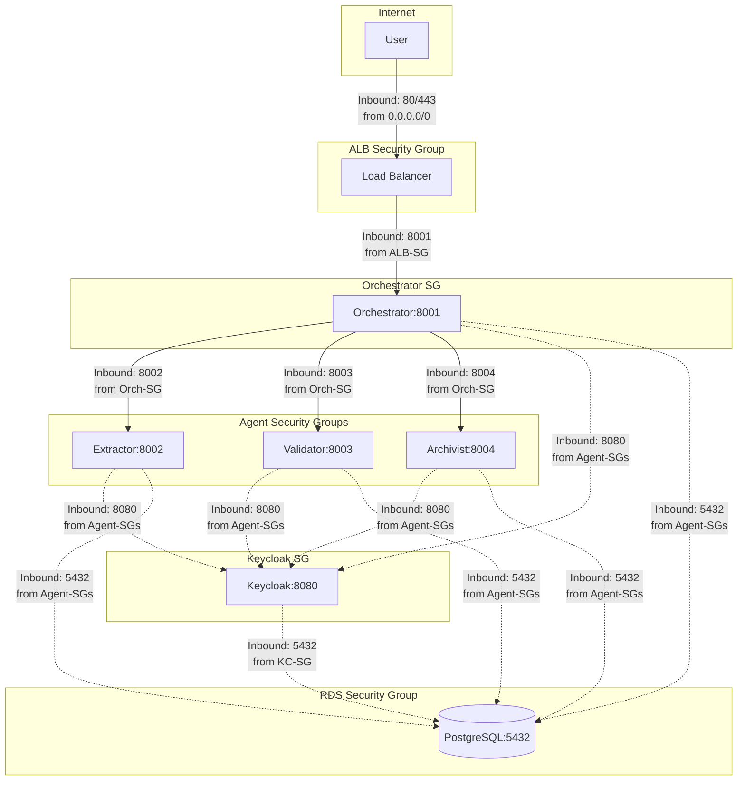

# 5. Network Security

[← Back to Index](README.md)

---


### 4.1 VPC Architecture

```
VPC: 10.0.0.0/16 (65,536 IPs)
├── Public Subnets (Internet-facing)
│   ├── 10.0.1.0/24 (AZ-a) - ALB, NAT Gateway
│   └── 10.0.2.0/24 (AZ-b) - ALB (Multi-AZ)
│
└── Private Subnets (Internal only)
    ├── 10.0.10.0/24 (AZ-a) - ECS Tasks
    └── 10.0.20.0/24 (AZ-b) - ECS Tasks, RDS
```

**Security Implications:**
- ✅ **Zero public IPs on agents**: All ECS tasks in private subnets
- ✅ **Outbound only via NAT**: Agents cannot receive inbound internet traffic
- ✅ **Multi-AZ redundancy**: Survives single AZ failure
- ✅ **Private DNS**: Service discovery via `agent.ca-a2a.local`

### 4.2 Security Groups (Virtual Firewalls)



**Rules Summary:**

| Security Group | Inbound Rules | Purpose |
|----------------|---------------|---------|
| **ALB-SG** | 80/tcp from 0.0.0.0/0<br/>443/tcp from 0.0.0.0/0 | Public HTTP/HTTPS access |
| **Orchestrator-SG** | 8001/tcp from ALB-SG | ALB → Orchestrator only |
| **Extractor-SG** | 8002/tcp from Orch-SG | Orchestrator → Extractor only |
| **Validator-SG** | 8003/tcp from Orch-SG | Orchestrator → Validator only |
| **Archivist-SG** | 8004/tcp from Orch-SG | Orchestrator → Archivist only |
| **Keycloak-SG** | 8080/tcp from Agent-SGs | All agents → Keycloak auth |
| **RDS-SG** | 5432/tcp from Agent-SGs + KC-SG | Database access |

**Default Deny:** All security groups have implicit deny-all rules. Only explicitly allowed traffic is permitted.

### 4.3 VPC Endpoints (AWS PrivateLink)

**Purpose:** Access AWS services without internet gateway

| Service | Endpoint Type | Purpose |
|---------|--------------|---------|
| **com.amazonaws.eu-west-3.ecr.api** | Interface | Pull container images |
| **com.amazonaws.eu-west-3.ecr.dkr** | Interface | Docker registry authentication |
| **com.amazonaws.eu-west-3.s3** | Gateway | S3 object storage |
| **com.amazonaws.eu-west-3.logs** | Interface | CloudWatch Logs |
| **com.amazonaws.eu-west-3.secretsmanager** | Interface | Secrets Manager |

**Benefits:**
- ✅ Traffic stays within AWS network (no public internet)
- ✅ Reduced NAT Gateway costs
- ✅ Enhanced security (no exposure to internet threats)

---


---

[← Previous: Resource Access Layer (MCP Server)](04-RESOURCE_ACCESS_LAYER.md) | [Next: Data Security →](06-DATA_SECURITY.md)
