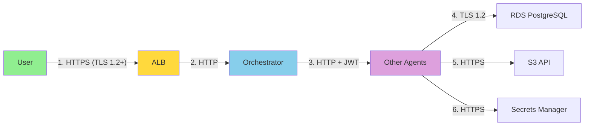

# 6. Data Security

[← Back to Index](README.md)

---


### 6.1 Encryption at Rest

| Resource | Encryption | Key Management |
|----------|-----------|----------------|
| **RDS Aurora PostgreSQL** | AES-256 | AWS KMS (default key) |
| **RDS PostgreSQL (Keycloak)** | AES-256 | AWS KMS (default key) |
| **S3 Bucket** | SSE-S3 (AES-256) | AWS-managed keys |
| **EBS Volumes (ECS)** | AES-256 | AWS KMS (default key) |
| **Secrets Manager** | AES-256 | AWS KMS (dedicated key) |
| **CloudWatch Logs** | AES-256 | AWS-managed keys |

### 6.2 Encryption in Transit



**Current State:**
- ✅ User → ALB: HTTPS (TLS 1.2+) - Can be enabled via ACM certificate
- ⚠️ ALB → Orchestrator: HTTP (within VPC) - Low risk due to VPC isolation
- ⚠️ Agent-to-Agent: HTTP (within VPC) - Protected by JWT signature
- ✅ Agents → RDS: TLS 1.2 (asyncpg with SSL)
- ✅ Agents → AWS Services: HTTPS (boto3 default)

**Recommendation:** Enable TLS between ALB and agents for defense-in-depth.

### 6.3 Secrets Management

**AWS Secrets Manager:**

| Secret Name | Purpose | Rotation |
|-------------|---------|----------|
| `ca-a2a/db-password` | RDS Aurora master password | Manual |
| `ca-a2a/keycloak-admin-password` | Keycloak admin console | Manual |
| `ca-a2a/keycloak-db-password` | Keycloak RDS password | Manual |
| `ca-a2a/keycloak-client-secret` | OAuth2 client secret | Manual |

**Retrieval Method:**
```python
import boto3

def get_secret(secret_name: str) -> str:
    client = boto3.client('secretsmanager', region_name='eu-west-3')
    response = client.get_secret_value(SecretId=secret_name)
    return response['SecretString']

# Used in ECS task definitions via valueFrom
{
  "name": "POSTGRES_PASSWORD",
  "valueFrom": "arn:aws:secretsmanager:eu-west-3:555043101106:secret:ca-a2a/db-password"
}
```

**No Hardcoded Secrets:** All sensitive values are retrieved at runtime from Secrets Manager.

---


---

[← Previous: Network Security](05-NETWORK_SECURITY.md) | [Next: Protocol Security (A2A) →](07-PROTOCOL_SECURITY.md)
